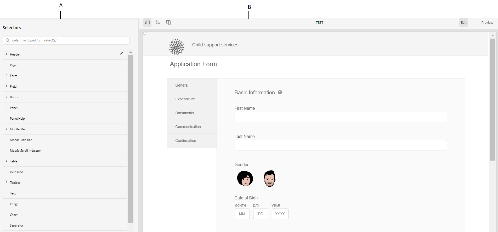

# Criação e uso de temas {#creating-and-using-themes}

>[!NOTE]
>
> A Adobe recomenda usar os [Componentes principais](https://experienceleague.adobe.com/docs/experience-manager-core-components/using/adaptive-forms/introduction.html?lang=pt-BR) de captura de dados moderna e extensível para [criar um novo Forms Adaptável](/help/forms/creating-adaptive-form-core-components.md) ou [adicionar o Forms Adaptável às páginas do AEM Sites](/help/forms/create-or-add-an-adaptive-form-to-aem-sites-page.md). Esses componentes representam um avanço significativo na criação do Forms adaptável, garantindo experiências de usuário impressionantes. Este artigo descreve a abordagem mais antiga para criar o Forms adaptável usando componentes de base.

| Versão | Link do artigo |
| -------- | ---------------------------- |
| AEM 6.5 | [Clique aqui](https://experienceleague.adobe.com/docs/experience-manager-65/forms/adaptive-forms-advanced-authoring/themes.html) |
| AEM as a Cloud Service | Este artigo |

Você pode criar e aplicar temas para estilizar um Formulário adaptável<!-- or an interactive communication-->. Um tema contém detalhes de estilo para os componentes e painéis. Os estilos incluem propriedades como cores de fundo, cores de estado, transparência, alinhamento e tamanho. Ao aplicar um tema, o estilo especificado é refletido nos componentes correspondentes. O tema é gerenciado independentemente sem uma referência a um Formulário adaptável<!-- or interactive communication -->.

Você pode baixar e instalar o pacote de conteúdo de referência [!DNL AEM Forms] do portal [Distribuição de Software](https://experience.adobe.com/#/downloads/content/software-distribution/en/aemcloud.html) para importar temas de referência e modelos para o seu ambiente.

## Criar, baixar ou fazer upload de um tema {#creating-downloading-or-uploading-a-theme}

Um tema é criado e salvo como uma entidade separada, completa com metapropriedades como o Adaptive Forms. Permite reutilizar um tema em várias Forms adaptáveis<!-- or  and interactive communications-->. Você também pode mover um tema para uma instância diferente e reutilizá-lo.

### Criação de um tema {#creating-a-theme}

Para criar um tema:

1. Clique em **[!UICONTROL Adobe Experience Manager]**, clique em **[!UICONTROL Forms]** e em **[!UICONTROL Temas]**.

1. Na página Temas, clique em **[!UICONTROL Criar]** > **[!UICONTROL Tema]**.
Um assistente para criar um tema é iniciado.

1. Especifique **[!UICONTROL Nome]** do tema.

1. Especifique um formulário para visualizar o tema no campo **[!UICONTROL Visualização Padrão deste Tema]**. Clique em **[!UICONTROL Usar Padrão]** para usar o formulário padrão para visualizar o tema.

1. Especifique um **[!UICONTROL Contêiner de Configuração]**. Você pode escolher um **[!UICONTROL Contêiner de Configuração]** que contenha os detalhes de configuração do Adobe Font para sua conta. Você também pode deixar a opção em branco por enquanto e especificar os detalhes mais tarde em [propriedades de tema](#metadata-of-a-theme).

1. Clique em **[!UICONTROL Criar]** e em **[!UICONTROL Editar]** para abrir o tema no Editor de Temas ou clique em **[!UICONTROL Concluído]** para retornar à página de temas.

### Diferença de temas no Experience Manager 6.5 Forms e versões anteriores {#difference-in-themes}

Temas criados em uma instância do Cloud Service:

* Ter a versão 2.

* São armazenados em `/content/dam/formsanddocuments-themes/<theme-name>/`

* Não forneça a opção de biblioteca do cliente. Não é possível especificar uma categoria e um caminho para a biblioteca do cliente.

* Não tem permissões de gravação e atualização no local /apps (o grupo Forms-usuário não tem permissão de gravação e atualização no local /apps).

* Antes de carregar um tema criado no [!DNL Experience Manager Forms] 6.5 ou versões anteriores em uma instância do Cloud Service, verifique se o local da biblioteca do cliente está definido como `etc/clientlibs/fd/themes`. Se a biblioteca do cliente não existir na pasta `etc`, atualize manualmente o local para `etc/clientlibs/fd/themes`.  Você pode fazer a alteração no [!DNL Experience Manager Forms] 6.5 ou em instâncias de versões anteriores. Depois de definir a localização da biblioteca do cliente, um administrador pode fazer upload de temas para a instância do Cloud Service ou usar a ferramenta Transferência de conteúdo para migrar os temas das instâncias da versão 6.5 ou anterior para a instância do Cloud Service.

  Altere também o nome da categoria. Se o nome não for alterado, pode ocorrer um erro `theme with same category name exists`. Quando você altera o nome da categoria, ele não afeta o Forms adaptável que usa o tema.

### Download de um tema {#downloading-a-theme}

Você pode exportar temas como um arquivo zip e usá-los em outros projetos ou instâncias do Experience Manager. Para baixar um tema:

1. Clique em **[!UICONTROL Adobe Experience Manager]**, clique em **[!UICONTROL Forms]** e em **[!UICONTROL Temas]**.

1. Na página Temas, **[!UICONTROL Selecione]** um tema e clique em **[!UICONTROL Baixar]**. Uma caixa de diálogo com os detalhes do tema é exibida.

1. Clique em **[!UICONTROL Baixar]**. O tema é baixado como um arquivo zip.

>[!NOTE]
>
>Se você baixar um tema que tenha um Formulário adaptável associado a ele e o Formulário adaptável associado for baseado em um modelo personalizado, baixe também o modelo personalizado. Ao fazer upload do tema baixado e do formulário adaptável, faça upload do modelo personalizado relacionado também.

### Carregamento de um tema {#uploading-a-theme}

Um usuário com privilégios de administrador pode carregar um tema criado no [!DNL Experience Manager Forms] 6.5 ou em versões anteriores.

Para fazer upload de um tema:

1. Clique em **[!UICONTROL Adobe Experience Manager]**, clique em **[!UICONTROL Forms]** e em **[!UICONTROL Temas]**.

1. Na página Temas, clique em **[!UICONTROL Criar]** > **[!UICONTROL Carregar arquivo]**.
1. No prompt Upload de arquivo, procure e selecione um pacote de tema no computador e clique em **[!UICONTROL Upload]**.
O tema carregado está disponível na página de temas.

## Metadados de um tema {#metadata-of-a-theme}

Lista de metapropriedades de um tema (encontrada na página de propriedades de um tema).

<table>
 <tbody>
  <tr>
   <th>
<strong>ID</strong>
 
 
 </th>
   <th><strong>Nome</strong></th>
   <th><strong>Pode ser editado</strong></th>
   <th><strong>Descrição da propriedade</strong></th>
  </tr>
  <tr>
   <td>1.</td>
   <td>Título</td>
   <td>Sim</td>
   <td>Nome de exibição do tema.</td>
  </tr>
  <tr>
   <td>2.</td>
   <td>Descrição</td>
   <td>Sim</td>
   <td>Descrição sobre o tema.</td>
  </tr>
  <tr>
   <td>3.</td>
   <td>Tipo</td>
   <td>Não</td>
   <td>
    <ul>
     <li>Tipo de ativo.</li>
     <li>O valor é sempre Theme.</li>
    </ul> </td>
  </tr>
  <tr>
   <td>4.</td>
   <td>Criado</td>
   <td>Não</td>
   <td>Data de criação do tema</td>
  </tr>
  <tr>
   <td>5.</td>
   <td>Nome do autor</td>
   <td>Sim</td>
   <td>Autor do tema. Calculado no momento da criação do tema.</td>
  </tr>
  <tr>
   <td>6.</td>
   <td>Data da última modificação</td>
   <td>Não</td>
   <td>Data da última modificação do tema.</td>
  </tr>
  <tr>
   <td>7.</td>
   <td>Status</td>
   <td>Não</td>
   <td>Status do tema (modificado/publicado).</td>
  </tr>
  <tr>
   <td>8.</td>
   <td>Data de início da publicação</td>
   <td>Sim</td>
   <td>Tempo para publicar automaticamente o tema.</td>
  </tr>
  <tr>
   <td>9.</td>
   <td>Data de término da publicação</td>
   <td>Sim</td>
   <td>Tempo para desfazer a publicação automática do tema.</td>
  </tr>
  <tr>
   <td>10.</td>
   <td>Tags</td>
   <td>Sim</td>
   <td>Um rótulo anexado ao tema para identificação usado para melhorar a pesquisa.</td>
  </tr>
  <!-- <tr>
   <td>11.</td>
   <td>References</td>
   <td>Links</td>
   <td>
    <ul>
     <li>Contains 'Referred by' section. Lists forms that use the theme.</li>
     <li>Since the theme does not refer to any other asset, there is no 'Refers' section.</li>
    </ul> </td>
  </tr>
   <tr>
   <td>12.</td>
   <td>Clientlib Location</td>
   <td>Yes</td>
   <td>
    <ul>
     <li>The user-defined repository path within '/etc' where the clientlibs corresponding to this theme are stored.</li>
     <li>Default value - '/etc/clientlibs/fd/themes' + relative path of theme asset.</li>
     <li>If the location does not exist, the folder hierarchy is auto-generated.</li>
     <li>When this value is changed, the clientlib node structure is moved to the new location entered.  <em><strong>Note:</strong> If you change default clientlib location, in the CRXDE repository assign <code>crx:replicate, rep:write, rep:glob:*, rep:itemNames:: js.txt, jcr:read </code>to <code>forms-users</code> and <code>crx:replicate</code>, <code>jcr:read </code>to <code>fd-service</code> in the new location. Also attach another ACL by adding <code>deny jcr:addChildNodes</code> for <code>forms-user</code></em></li>
    </ul> </td>
  </tr> 
  <tr>
   <td>13.</td>
   <td>Clientlib Category Name</td>
   <td>Yes</td>
   <td>
    <ul>
     <li>The user-defined clientlib category name for this theme.</li>
     <li>An error is displayed if the name is already in use by some other existing theme.</li>
     <li>Default value - computed using theme location.</li>
     <li>When this value is changed, the category name is updated on the corresponding clientlib node. Updating Clientlib Category Name in the jsp files is not required because clientlib category name is used by reference.</li>
    </ul> </td>
  </tr> -->
 </tbody>
</table>

## Sobre o Editor de temas {#about-the-theme-editor}

O Editor de temas é uma interface amigável para usuários empresariais e designers da Web/desenvolvedores que fornece as funcionalidades necessárias para especificar facilmente o estilo de vários elementos do Formulário adaptável <!-- and interactive communication -->. Quando você cria um tema, ele é armazenado como uma entidade separada, como formulários <!--  , interactive communications, letters, document fragments, and data dictionaries-->.

O Editor de temas permite personalizar estilos dos componentes estilizados em um tema. Você pode personalizar a aparência de um formulário <!-- or interactive communication --> em um dispositivo.

O Editor de temas é dividido em dois painéis:

* **Tela** - Aparece no lado direito. Ele mostra um exemplo de Formulário adaptável <!--  or interactive communication --> no qual todas as alterações de estilo são refletidas instantaneamente. Você também pode selecionar objetos diretamente da tela para pesquisar estilos associados a eles e editar esses estilos. Uma régua de resolução de dispositivo na parte superior controla a Tela de Pintura. Selecionar um ponto de interrupção de resolução na régua mostra a visualização do formulário de amostra <!--  or interactive communication --> para a respectiva resolução. A tela é discutida detalhadamente [abaixo](themes.md#using-canvas).

* A **Barra Lateral*** é exibida no lado esquerdo. Ele tem os seguintes itens:

   * **Seletor:** mostra o componente selecionado para estilo e suas propriedades que você pode estilizar. O seletor representa todos os componentes de um tipo. Se você selecionar um componente de caixa de texto em um tema para estilo, todas as caixas de texto no formulário <!-- or interactive communication --> herdarão o estilo. Os seletores permitem selecionar um componente genérico ou um componente específico para o estilo. Por exemplo, um componente de campo é um componente genérico e uma caixa de texto é um componente específico.

     **Componente genérico de estilo:**
Um campo pode ser um campo de caixa numérica, como idade, ou um campo de caixa de texto, como endereço.
Ao estilizar um campo, todos os campos, como idade, nome, endereço, são estilizados.

     **Componente específico do estilo**:
Um componente específico afeta objetos da categoria específica. Ao estilizar o componente caixa numérica no tema, somente o objeto caixa numérica em herdará o estilo.

     Por exemplo, um campo de caixa de texto como endereço, que é maior, e um campo de caixa numérica como idade, que é menor. Você pode selecionar um campo de caixa numérica, reduzir seu comprimento e aplicar ao formulário. A largura de todos os campos de caixa numérica é reduzida no formulário.

     Quando você personaliza todos os componentes do campo com uma cor de plano de fundo específica, todos os campos, como idade, nome e endereço, herdam a cor do plano de fundo. Quando você seleciona uma caixa numérica, como idade, e reduz sua largura, a largura de todas as caixas numéricas, como idade, número de pessoas em uma família é reduzida. A largura das caixas de texto não é alterada.

   * **Estado:** Permite personalizar estilos de um objeto em um estado específico. Por exemplo, você pode especificar a aparência de um objeto quando ele estiver em estado padrão, de foco, desativado, ao passar o mouse ou erro.
   * **Categorias de Propriedade:** as propriedades de estilo são divididas em várias categorias. Por exemplo, Dimension &amp; Posição, Texto, Plano de fundo, Borda e Efeitos. Em cada categoria, você fornece informações de estilo. Por exemplo, em Plano de fundo, você pode fornecer Cor do plano de fundo e Imagem e gradiente.

   * **Avançado:** permite que você adicione CSS personalizado a um objeto, o que substitui as propriedades que os controles visuais definem se há uma sobreposição.

   * **Exibir CSS**: permite exibir o CSS do componente selecionado.

  Além disso, na barra lateral, uma seta está presente na parte inferior. Ao clicar na seta, você terá mais duas opções: **Simular Êxito** e **Simular Erro.** Estas opções, juntamente com as opções descritas acima, são discutidas detalhadamente [abaixo](themes.md#using-rail).

 **A.** Barra lateral **B.** Tela

### Componentes de estilo {#styling-components}

Você pode usar um tema em várias Forms Adaptáveis<!-- and interactive communications -->, que importa a formatação de componente especificada no tema. É possível estilizar vários componentes, como títulos, descrição, painéis, campos, ícones e caixas de texto. Use widgets para configurar propriedades de componentes em um tema. O conhecimento prévio de CSS ou MENOS não é necessário, mas é desejado, embora a seção Substituições de CSS permita escrever o código CSS ou fornecer seletores personalizados. A seção Sobreposições CSS é exibida quando você seleciona um componente na barra lateral.

Opções na barra lateral que permitem selecionar e estilizar diferentes componentes.

Clicar no botão editar em um componente na barra lateral seleciona o componente na Tela e permite estilizar o componente usando as opções na barra lateral.

Determinados componentes, como caixa de texto, caixa numérica, botão de opção e caixa de seleção, são categorizados em componentes genéricos, como Campo. Por exemplo, você deseja personalizar o estilo de botões de opção. Para selecionar botões de opção para estilo, selecione **[!UICONTROL Campo]** > **[!UICONTROL Widget]** > **[!UICONTROL Botão de opção]**.

### Layouts do painel de estilo {#styling-panel-layouts-br}

Os temas no [!DNL AEM Forms] aceitam o estilo de elementos no layout de painéis em seus formulários<!-- and  interactive communications -->. O estilo de elementos em layouts prontos para uso e layouts personalizados é compatível.

Os painéis prontos para uso incluem:

* Guias na esquerda
* Guias na parte superior
* Acordeão
* Responsivo
* Assistente
* Layout para dispositivo móvel

   * Títulos do painel no cabeçalho
   * Sem títulos de painel no cabeçalho

Os seletores variam para cada layout.
O estilo de layouts personalizados do Editor de temas envolve:

* Definir os componentes para um layout que pode ser estilizado e os seletores de CSS para identificar esses componentes de forma exclusiva.
* Definição das propriedades CSS que podem ser aplicadas a esses componentes.
* Defina o estilo desses componentes interativamente na interface do usuário.

### Estilos diferentes para tamanhos de tela diferentes {#different-styles-for-different-screen-sizes-br}

Os layouts de desktop e dispositivos móveis podem ter estilos ligeiramente ou totalmente diferentes. Para dispositivos móveis, o tablet e o telefone compartilham layouts semelhantes, exceto para tamanhos de componentes.

Use os pontos de interrupção do Editor de temas para definir um estilo alternativo para tamanhos de tela diferentes. É possível selecionar um dispositivo base ou uma resolução na qual você começa a criar o tema, e as variações de estilo de outras resoluções são geradas automaticamente. É possível modificar explicitamente o estilo de todas as resoluções.

>[!NOTE]
>
>O tema é criado primeiro usando um formulário<!-- or interactive communication--> e, em seguida, aplicado em formulários diferentes<!-- or interactive communications-->. Os pontos de interrupção usados na criação do tema podem ser diferentes da forma <!-- or interactive communication --> na qual o tema é aplicado. As consultas de mídia CSS são baseadas no formulário <!-- or interactive communication --> usado na criação do tema, e não no formulário <!-- or interactive communication --> no qual o tema é aplicado.

### O contexto das propriedades de estilo é alterado na barra lateral ao selecionar objetos {#styling-properties-context-changes-in-sidebar-on-selecting-objects}

Quando você seleciona um componente na Tela de desenho, suas propriedades de estilo são listadas na barra lateral. Selecione o tipo de objeto e seu estado e forneça seu estilo.

### Estilos usados recentemente no Editor de temas {#recently-used-styles-in-theme-editor}

O editor de temas armazena em cache até dez estilos aplicados a um componente. É possível usar os estilos em cache com outro componente de um tema. Os estilos usados recentemente estão disponíveis logo abaixo do componente selecionado na barra lateral como uma caixa de listagem. Inicialmente, a lista de estilos usados recentemente está vazia.

À medida que você estiliza um componente, os estilos são armazenados em cache e listados na caixa de lista. Neste exemplo, o rótulo da caixa de texto é estilizado para alterar o tamanho e a cor da fonte. Você pode seguir etapas semelhantes para escolher uma imagem ou alterar as cores para estilizar um componente. Observe como o estilo é armazenado em cache e listado na caixa de listagem quando o estilo do rótulo do campo é alterado.

Neste exemplo, o estilo do rótulo do campo é alterado e, quando a Descrição do painel responsivo é selecionada para estilo, uma entrada de lista é adicionada à biblioteca de ativos. A entrada na biblioteca de ativos pode ser usada para alterar o estilo de Descrição do painel responsivo.

Quando um estilo é adicionado na biblioteca de ativos, ele fica disponível para outros temas e no [modo de estilo](inline-style-adaptive-forms.md) da interface do construtor de formulários. Da mesma forma, quando você usa o modo de estilo da interface do construtor de formulários <!-- or interactive communication editor --> para estilizar um componente, o estilo é armazenado em cache e está disponível em temas.

O botão de mais na biblioteca de ativos permite salvar permanentemente o estilo com um nome que você fornece. O botão de adição salva o estilo mesmo se você não clicar no botão Salvar na barra lateral para aplicar o estilo a um componente. O botão de adição para salvar um estilo para uso posterior não está disponível no modo de estilo.

Quando você fornece um nome personalizado para um estilo, ele está vinculado a um tema e não está mais disponível para outros temas. Para excluir um estilo salvo:

1. Na barra de ferramentas da TELA, clique em **[!UICONTROL Opções de Tema]**  > **[!UICONTROL Gerenciar Estilos]**.
1. Na caixa de diálogo Gerenciar estilos, selecione um estilo salvo e clique em **[!UICONTROL Excluir]**.

   

### Visualização em tempo real, salvar e descartar alterações {#live-preview-save-and-discard-changes}

As modificações feitas no estilo são refletidas instantaneamente no formulário <!-- or interactive communication --> carregado na Tela de Pintura. A pré-visualização ao vivo permite que você defina e veja interativamente o impacto do estilo. Quando você altera o estilo de um componente, o botão **[!UICONTROL Concluído]** é habilitado na barra lateral. Para manter as alterações, use o botão **[!UICONTROL Concluído]**.

>[!NOTE]
>
>Quando um caractere inválido é inserido em um campo, a cor do limite do campo muda para vermelho e uma mensagem de erro é exibida no canto superior esquerdo da tela. Por exemplo, se você inserir letras em uma caixa de texto que aceita caracteres numéricos como entradas, a cor do limite da caixa de entrada será alterada para vermelho. Não é possível salvar esse tema sem resolver o erro exibido na parte inferior central da tela.

### Tema com outro formulário adaptável {#theme-with-another-adaptive-form}

Quando você cria um tema, ele é criado com um formulário enviado com o Editor de temas. Você fornece o estilo dos componentes neste formulário. Em vez do formulário enviado com o Editor de temas, você pode selecionar um formulário <!-- or interactive communication --> de sua escolha para fornecer estilo e visualizar seus resultados.

Para substituir o formulário atual ou <!-- interactive communication --> na Tela do Editor de Tema:

1. No painel EDITOR DE TEMAS, clique em **[!UICONTROL Opções de Tema]**  > **[!UICONTROL Configurar]**.

1. Na guia Geral, navegue e selecione um formulário <!-- or interactive communication --> para o campo **[!UICONTROL Formulário adaptável]**.

### Refazer/Desfazer {#redo-undo}

Você pode desfazer ou refazer as alterações indesejadas que ocorrem acidentalmente. Use os botões Refazer/Desfazer na Tela.

Os botões Refazer/Desfazer aparecem ao estilizar um componente no Editor de temas.

## Usar o Editor de temas {#using-the-theme-editor}

O Editor de temas permite editar um tema criado ou carregado. Navegue até **[!UICONTROL Forms e Documentos]** > **[!UICONTROL Temas]**, selecione um tema e abra-o. O tema é aberto no Editor de temas.

Como discutido acima, o Editor de temas tem dois painéis: Barra lateral e Tela.

Personalizar o estilo de estado de sucesso do componente Widget de caixa de texto no Editor de temas. O componente é selecionado na Tela de desenho e seu estado é selecionado na barra lateral. As opções de estilo disponíveis na barra lateral são usadas para personalizar a aparência de um componente.

### Utilização da Tela {#using-canvas}

O tema é criado usando o formulário pronto para uso ou um formulário <!-- or interactive communication --> de sua escolha. A Tela mostra a visualização do formulário ou <!-- interactive communication --> usado para criar o tema com personalizações especificadas no tema. A régua acima do formulário é usada para determinar o layout de acordo com o tamanho da exibição do seu dispositivo.

Na barra de ferramentas da Tela de Pintura, você verá:

* **[!UICONTROL Alternar painel lateral]** : permite mostrar ou ocultar a barra lateral.
* **[!UICONTROL Opções de tema]** : fornece três opções

   * Configurar: fornece opções para selecionar o formulário de visualização <!-- or interactive communication , base clientlib, --> e a configuração do Adobe Fonts.
   * Visualizar CSS de tema: gera o CSS para o tema selecionado.
   * Gerenciar estilos: fornece opções para gerenciar estilos de texto e imagem
   * Ajuda: executa um tour guiado por imagem do Editor de temas.

* **[!UICONTROL Emulador]** : emula a aparência do seu tema para diferentes tamanhos de exibição. Um tamanho de exibição é tratado como um ponto de interrupção no emulador. Você pode selecionar um ponto de interrupção e especificar um estilo para ele. Por exemplo, Desktop e Tablet são dois pontos de interrupção. Você pode especificar estilos diferentes para cada ponto de interrupção.

Quando você seleciona um componente na Tela, vê a barra de ferramentas do componente na parte superior dele. A barra de ferramentas do componente permite selecionar componentes ou alternar para componentes genéricos. Por exemplo, você seleciona uma caixa de texto numérica em um painel. Você vê as seguintes opções na barra de ferramentas do componente:

* **[!UICONTROL Widget de caixa numérica]**: permite selecionar o componente para personalizar sua aparência na barra lateral.
* **[!UICONTROL Widget de campo]**: permite selecionar o componente genérico para o estilo. Neste exemplo, todos os componentes de entrada de texto (caixa de texto/caixa numérica/depurador numérico/entrada de data) são selecionados para estilo.

* : permite selecionar o componente principal para estilo. Se você selecionar caixa numérica e selecionar este ícone, o componente de campo será selecionado. Se você selecionar componente de campo e selecionar este ícone, painel será selecionado. Se você continuar tocando nesse ícone para seleção, acabará selecionando o layout para estilo.

>[!NOTE]
>
>As opções disponíveis na barra de ferramentas do componente variam de acordo com o componente selecionado.

### Usando a barra lateral {#using-rail}

A barra lateral no editor de temas fornece opções para personalizar estilos para componentes em um tema e usar seletores. Os seletores permitem selecionar um grupo de componentes ou componentes individuais, e você pode pesquisar por seletores na barra lateral. Você pode gravar seletores para componentes personalizados.

Quando você seleciona um componente na Tela ou nos seletores na barra lateral, a barra lateral mostra todas as opções que permitem personalizar estilos para ela.
Abaixo estão as opções que você vê na barra lateral ao selecionar um componente:

* Estado
* Folha de propriedades
* Simular Erro/Sucesso

#### Estado {#state}

Um estado é um indicador da interação do usuário com um componente. Por exemplo, quando um usuário insere dados incorretos em uma caixa de texto, o estado da caixa de texto muda para um estado de erro. O editor de temas permite especificar o estilo de um estado específico.

As opções para personalizar estilos de estado variam para diferentes componentes.

#### Folha de propriedades {#property-sheet}

<table>
 <tbody>
  <tr>
   <td><strong>Propriedade</strong></td>
   <td><strong>Utilização</strong></td>
  </tr>
  <tr>
   <td>
Dimensões e Posição
 </td>
   <td>
Permite estilizar o alinhamento, o tamanho, o posicionamento e a colocação dos componentes no tema. 
 
Suas opções são: configuração de exibição, preenchimento, margem, largura, altura e índice Z.
 
Você também pode usar o modo Layout para definir a largura dos componentes usando uma interface fácil de arrastar e soltar. Para obter mais informações, consulte <a href="resize-using-layout-mode.md">Usar o modo de layout para redimensionar componentes</a>.
 </td>
  </tr>
  <tr>
   <td>
Texto
 </td>
   <td>
Permite personalizar os estilos de texto no componente do tema.
 
Por exemplo, você deseja alterar a aparência do texto inserido na caixa de texto.
 
Suas opções são família de fontes, peso, cor, tamanho, altura da linha, alinhamento de texto, espaçamento entre letras, recuo de texto, sublinhado, itálico, transformação de texto, alinhamento vertical, linha de base e direção. 
 </td>
  </tr>
  <tr>
   <td>
Fundo 
 </td>
   <td>
Permite preencher o plano de fundo do componente com uma imagem ou cor. 
 </td>
  </tr>
  <tr>
   <td>
Borda
 </td>
   <td>
Permite escolher a aparência da borda do componente. Por exemplo, você deseja que a caixa de texto tenha uma borda espessa vermelha profunda com uma linha pontilhada. 
 
Suas opções são largura, estilo, raio e cor da borda.
 </td>
  </tr>
  <tr>
   <td>
Efeitos
 </td>
   <td>
Permite adicionar efeitos especiais aos componentes, como opacidade, modo de mesclagem e sombras. 
 </td>
  </tr>
  <tr>
   <td>
Avançado
 </td>
   <td>
Permite adicionar:

    <ul>
     <li>Propriedades dos pseudoelementos <code>::before</code> e <code>::after</code> para adicionar conteúdo após ou antes do conteúdo padrão no seletor e estilizá-lo.  Consulte <a href="https://www.w3schools.com/css/css_pseudo_elements.asp" target="_blank">Pseudo-elementos CSS</a>.</li>
     <li>Código CSS personalizado em linha para um componente.</li>
    </ul> 
Quando você adiciona um código CSS personalizado, ele substitui a personalização adicionada usando as opções na barra lateral. 
 </td>
  </tr>
 </tbody>
</table>

#### Simular Erro/Sucesso {#simulate-error-success}

As opções Simular erro e sucesso estão disponíveis na parte inferior da barra lateral. Você pode vê-los usando uma seta para mostrar/ocultar visível na parte inferior da barra lateral. Usando o Editor de temas, você pode estilizar vários estados de um componente.

Por exemplo, você adiciona um campo numérico ao formulário e especifica seu estilo no editor de temas. Quando um usuário digita um valor alfanumérico no campo, você deseja alterar a cor do plano de fundo da caixa de texto. Você seleciona o campo numérico no tema e usa a opção de estado na barra lateral. Você seleciona o estado de erro na barra lateral e altera a cor do plano de fundo para vermelho. Para visualizar o comportamento, você pode usar a opção Simular erro disponível na barra lateral. As opções Simular Erro e Êxito estão descritas detalhadamente abaixo:

* **Simular êxito**:
Permite ver a aparência de um componente se você especificar seu estilo para o estado de sucesso. Por exemplo, em um formulário, os clientes definem uma senha. Os usuários podem definir a senha de acordo com as diretrizes fornecidas. Quando um usuário digita uma senha seguindo todas as diretrizes fornecidas, a caixa de texto fica verde. Quando a caixa de texto fica verde, ela está em estado de sucesso. Você pode especificar o estilo de um componente no estado de sucesso e simular sua aparência usando a opção Simular sucesso.

* **Simular Erro**:
Permite ver a aparência de um componente se você especificar seu estilo para o estado de erro. Por exemplo, em um formulário, os clientes definem uma senha. Os usuários podem definir a senha de acordo com as diretrizes fornecidas. Quando um usuário digita uma senha que não segue todas as diretrizes fornecidas, a caixa de texto fica vermelha. Quando a caixa de texto fica vermelha, ela está em estado de erro. Você pode especificar o estilo de um componente em estado de erro e simular sua aparência usando a opção Simular erro.

### Estilo de um componente {#styling-a-component}

Por exemplo, no formulário, você tem dois tipos de caixas de texto: uma que aceita apenas valores numéricos e outra que aceita valores alfanuméricos. É possível personalizar o estilo da caixa de texto que aceita apenas valores numéricos (uma caixa numérica).

Para personalizar o estilo de um componente específico (uma caixa numérica neste exemplo), execute as seguintes etapas:

1. No Editor de temas, selecione a caixa numérica na Tela de desenho.
1. Ao selecionar a caixa numérica, é possível ver a barra de ferramentas do componente com três opções:

   * **[!UICONTROL Widget de caixa numérica]**
   * **[!UICONTROL Widget de campo]**

1. Selecione **[!UICONTROL Widget de caixa numérica]**.
1. O título da barra lateral muda para Widget de caixa numérica e mostra opções para personalizar sua aparência.
Use a opção **[!UICONTROL Dimension e Posição]** na barra lateral para personalizar o tamanho do componente. Verifique se o Estado é **[!UICONTROL Padrão]**.

Em vez de selecionar **[!UICONTROL Widget de caixa numérica]**, selecione **[!UICONTROL Widget de campo]** na barra de ferramentas do componente e execute as etapas acima. Quando você seleciona dimensões para a opção **[!UICONTROL Widget de campo]**, todas as caixas de texto, exceto a caixa numérica, têm o mesmo tamanho.

### Campos de estilo para um determinado estado {#styling-fields-given-state}

Com a barra de ferramentas do componente, você também pode especificar o estilo dos componentes para seus diferentes estados. Por exemplo, se um componente estiver desativado, ele estará em um estado desativado. Os estados mais usados de um componente que podem ser estilizados no editor de tema são: Padrão, Foco, Desativado, Erro, Sucesso e Foco. Você pode selecionar um componente na Tela e usar a opção Estado na barra lateral para personalizar sua aparência.

Para personalizar o estilo de um componente em um estado específico, execute as seguintes etapas:

1. Selecione um componente na Tela de desenho e selecione a opção apropriada na barra de ferramentas do componente.
A barra lateral mostra opções para personalizar o estilo do componente.
1. Selecione um estado na barra lateral. Por exemplo, Estado de erro.
1. Use opções como **[!UICONTROL Borda, Plano de fundo]** na barra lateral para personalizar a aparência do componente.
1. Use a opção **[!UICONTROL Simular Erro]** na parte inferior da barra lateral para ver a aparência do estilo na edição.

Quando você personaliza o estilo de um componente depois de especificar seu estado, a personalização é exibida somente para o componente no estado especificado. Por exemplo, se você personalizar o estilo do componente quando o estado do mouse for selecionado. A personalização aparece para o componente quando você move o ponteiro sobre o componente na forma renderizada <!-- or interactive communication --> à qual você aplica o tema.

Para simular o comportamento de estados diferentes de erro e sucesso, use o modo de Visualização. Para usar o modo de Visualização, clique em **[!UICONTROL Visualizar]** na barra de ferramentas da página.

### Layouts de estilo para exibições menores {#styling-layouts-for-smaller-displays}

Use a régua na tela de desenho para selecionar pontos de interrupção para dispositivos com exibições menores. Clique na  do emulador na Tela de Pintura para exibir a régua e os pontos de interrupção. Os pontos de interrupção permitem que você visualize um formulário <!-- or interactive communication --> para tamanhos de exibição pertencentes a diferentes dispositivos, como telefones e tablets. Vários tamanhos de exibição são suportados no Editor de temas.

Para estilizar componentes para diferentes pontos de interrupção:

1. Na Tela de Pintura, selecione um ponto de interrupção acima da régua.
Um ponto de interrupção representa um dispositivo móvel e seu tamanho de exibição.
1. Use a barra lateral para personalizar o estilo dos componentes do formulário <!-- or interactive communication --> no tema para o tamanho de exibição selecionado.
1. Certifique-se de que a personalização foi salva.

Você pode estilizar componentes de <!-- or interactive communication --> para vários dispositivos. Os componentes do formulário <!-- and interactive communication --> para desktops e dispositivos móveis podem ter estilos totalmente diferentes.

### Uso do Web Fonts em um tema {#using-web-fonts-in-a-theme}

Agora você pode usar as fontes disponíveis em um serviço Web em um Formulário Adaptável <!-- or interactive communication -->. O [Adobe Fonts](https://fonts.adobe.com/), o serviço de fontes da Web da Adobe, está disponível como uma configuração pronta para uso. Para usar o Adobe Fonts, crie um kit, adicione fontes a ele e obtenha a ID do Kit da [Adobe Fonts](https://fonts.adobe.com/).

Para configurar o Adobe Fonts no Experience Manager, execute as seguintes etapas:

1. Na instância do autor, clique em  **[!UICONTROL Adobe Experience Manager]** > **[!UICONTROL Ferramentas]**  > **[!UICONTROL Implantação]** > **[!UICONTROL Serviços na Nuvem]**.
1. Na página **[!UICONTROL Cloud Services]**, navegue até a opção **[!UICONTROL Adobe Fonts]** e abra-a. Abra a pasta de configuração e clique em **[!UICONTROL Criar]**.
1. Na caixa de diálogo **[!UICONTROL Criar Configuração]**, especifique um título para a configuração e clique em **[!UICONTROL Criar]**.

   Você é redirecionado para a página de configuração.

1. Na caixa de diálogo Editar Componente exibida, forneça sua ID do Kit e clique em **[!UICONTROL OK]**.

Para configurar um tema para usar a configuração do Adobe Fonts, execute as seguintes etapas:

1. Na instância do autor, abra um tema no editor de temas.
1. No editor de temas, navegue até **[!UICONTROL Opções de Tema]**  > **[!UICONTROL Configurar]**.
1. No campo **[!UICONTROL Configuração do Adobe Fonts]**, selecione um kit e clique em **[!UICONTROL Salvar]**.

   Agora, você pode ver que as fontes são adicionadas na propriedade font-family do tema.

<!-- 

### Listing and selecting fonts in theme editor {#listing-and-selecting-fonts-in-theme-editor}

You can use the theme configuration service to add more fonts to the theme editor. Perform the following steps to add fonts:

1. Log in to Experience Manager Web Console with administrative privileges. URL for the Experience Manager Web Console is `https://'[server]:[port]'/system/console/configMgr`.
1. Open **[!UICONTROL Adaptive Form Theme Configuration Service]**.

   

1. Click +, specify the name of the font, and click **Save**. The font is added and available in theme editor. 
-->

#### Seleção de fontes no editor de temas {#selecting-fonts-in-theme-editor}

Você pode usar o botão + para adicionar uma fonte. Quando você adiciona uma fonte, ela é listada na barra lateral.

Além da opção de configuração de tema, você também pode adicionar sua fonte a partir do próprio editor de tema. Digite a fonte que deseja usar no campo Família da fonte, na barra lateral, e pressione a tecla Return no teclado.

Quando você seleciona uma fonte, ela é adicionada na lista de famílias de fontes. Você pode usar a opção Máscara no editor de temas para desativar ou ativar as fontes listadas.

É possível ver a alteração da fonte do componente.

O campo Família de fontes é compatível com várias fontes. Quando você digita uma fonte, o navegador a procura e a aplica ao componente selecionado. Se o navegador não conseguir encontrar uma fonte, ele procurará uma fonte próxima a ela na família. Você pode começar digitando a fonte específica que está procurando. Se não encontrar a fonte que deseja usar, você pode digitar uma fonte genérica na família e usá-la.

#### Estilos de máscara aplicados no editor de temas {#mask-styles-applied-in-theme-editor}

É possível mascarar estilos aplicados em um tema. Na barra lateral do editor de temas, você pode usar o ícone para desabilitar um estilo aplicado. Por exemplo, se você alterar as dimensões de um componente em um formulário <!-- or interactive communication -->, poderá usar o botão de máscara à esquerda de uma propriedade para desabilitá-lo. Quando você salva um tema, as opções de mascaramento selecionadas são mantidas.

O exemplo abaixo mostra estilos mascarados e não mascarados em um tema.

## Aplicação de um tema a um formulário {#applying-a-theme-to-a-form-or-interactive-communication-br}

Para aplicar um tema a um Formulário adaptável:

1. Abra o formulário no modo de edição. Para abrir um formulário no modo de edição, selecione um formulário e clique em **[!UICONTROL Abrir]**.
1. No modo de edição, selecione um componente e clique em  > **[!UICONTROL Contêiner de formulário adaptável]** e clique em .

   Você pode editar as propriedades do formulário na barra lateral.

1. Na barra lateral, clique em **[!UICONTROL Estilo]**.
1. Selecione seu tema no menu suspenso **[!UICONTROL Tema do Formulário Adaptável]** e clique em **[!UICONTROL Concluído]** .

Você também pode definir um tema para um Formulário adaptável ao criá-lo.

<!-- To apply a theme to an interactive communication:

1. Open your interactive communication in edit mode. To open a interactive communication in edit mode, select a form and click **Open**.
1. In the edit mode, select a component, then click  &gt;**Document Container**, and then click .

   You can edit properties of your form in the sidebar.

1. In the sidebar, under **Basic**, select your theme from the **Theme** drop-down and click **Done**  -->

### Alterar tema de um formulário em tempo de execução {#change-theme-of-a-form-at-runtime}

Um tema estiliza diferentes componentes de um formulário. Você pode usar a propriedade `themeOverride` para alterar dinamicamente o tema de um formulário. Uma URL típica de um formulário é:

`https://<server>:<port>/content/forms/af/test.html`

Você pode usar o parâmetro themeOverride para aplicar um tema no tempo de execução.

`https://<server>:<port>/content/forms/af/test.html?themeOverride=/content/dam/formsanddocuments-themes/simpleEnrollmentTheme`

A opção `themeOverride` permite fornecer um caminho para um tema. Ele altera o tema do formulário e atualiza o formulário com estilos atualizados.

## Obter aparência específica usando temas {#specific-af-appearance}

Com o [!DNL AEM Forms], juntamente com o tema de tela pronto para uso padrão, há muitos outros temas. Se você quiser criar seu formulário <!-- or interactive communication --> usando outros temas, juntamente com mais alterações, copie o tema da pasta Biblioteca de Temas. Cole os temas copiados fora da pasta Biblioteca de Temas e edite o tema copiado de acordo com as alterações desejadas.

Para copiar um tema, execute as seguintes etapas:

1. Na instância de criação, navegue até **[!UICONTROL Adobe Experience Manager]** > **[!UICONTROL Forms]** > **[!UICONTROL Temas]**.
1. Abra a pasta Biblioteca de temas.
1. Na pasta Biblioteca de Temas, passe o mouse sobre o tema predefinido correspondente e selecione **[!UICONTROL Copiar]**.
1. Cole o tema copiado fora da pasta Biblioteca de Temas.
1. Personalizar o tema copiado.

Depois de personalizar o tema, aplique-o ao formulário <!-- or interactive communication -->.

>[!NOTE]
>
>Não modifique os temas disponíveis na pasta Biblioteca de Temas. Esta pasta contém temas do sistema. Qualquer alteração feita nesses temas será substituída na instalação de uma versão mais recente ou hot fix do [!DNL AEM Forms].

## Impacto em outros casos de uso do Formulário adaptável {#impact-on-other-adaptive-form-use-cases}

* **Publicar/desfazer a publicação de um formulário:** Ao publicar um formulário, o tema aplicado a ele também será publicado (se ainda não tiver sido publicado)
* **Importar/Exportar um formulário:** Ao importar ou exportar um formulário, seu tema associado também é automaticamente importado ou exportado.
* **Referências de um formulário:** A seção Referências em referências de formulário contém uma entrada extra para o tema.
* **Hora da Última Modificação de um formulário:** Atualizado quando o tema associado é alterado.
<!-- * **A/B Testing:** You can apply a different theme to two versions of the form in A/B testing. The information of the two themes is individually stored on the two guide containers. -->

## Sequência de geração de CSS {#css-generation-sequence}

Quando você seleciona Exibir CSS, o Editor de temas coleta todas as informações de estilo e cria um CSS. Ele coleta informações na seguinte ordem:

<!-- 1. Styling defined in the theme's base client library. -->
1. Estilo definido pelo usuário, especificado usando as propriedades na barra lateral.
1. Estilo CSS fornecido com a opção Substituição de CSS.

Por exemplo, a cor de fundo de uma caixa de texto é azul<!-- in the base client library-->. Você a altera para rosa usando as propriedades na barra lateral. Ao gerar o CSS, você vê a cor de fundo da caixa de texto como rosa. Depois de alterar a cor do plano de fundo usando as propriedades, outro autor usa a opção de substituição de CSS para alterar a caixa de texto de cor do plano de fundo como branco. Ao gerar o CSS, você vê a cor do plano de fundo como branca no CSS gerado.

## Depuração de estilos {#debugging-styles}

Quando você especifica estilos para componentes no Editor de temas, um CSS é gerado. Ao estilizar um componente genérico, vários componentes incluídos nele também são estilizados. Por exemplo, ao estilizar um campo, a caixa de texto e o rótulo nele também são estilizados. Quando você estiliza a caixa de texto dentro do campo, ele obtém seu próprio CSS. Se você quiser depurar o CSS gerado para o campo e o componente, o Editor de temas fornece opções que permitem exibir CSS.

Você pode ver o CSS gerado usando as seguintes opções:

* Opção **Exibir CSS** na barra lateral: ao selecionar um componente no Tema, você pode ver a opção EXIBIR CSS na barra lateral. Ele mostra o CSS gerado, incluindo o CSS para os pseudoelementos `::before` e `::after`.
* Opção **Exibir tema CSS** na barra de ferramentas da tela: na barra de ferramentas da tela de desenho, clique em  > **[!UICONTROL Exibir tema CSS]**. Você pode ver todo o tema CSS gerado pelas propriedades definidas no Editor de temas.

## Resolução de problemas, recomendações e práticas recomendadas {#troubleshooting-recommendations-and-best-practices}

* **Evitando ativos de outro Tema**

  Ao editar um tema, você pode procurar e adicionar ativos (como imagens) de outros temas. Por exemplo, você está editando o fundo de uma página. Por exemplo, ao selecionar **[!UICONTROL Página]** > **[!UICONTROL Plano de fundo]** > **[!UICONTROL Adicionar]** > **[!UICONTROL Imagem]**, você verá uma caixa de diálogo que permite navegar e adicionar imagens em outro tema.

* Você pode enfrentar problemas com seu tema atual se um ativo for adicionado de outro tema e o outro tema for movido ou excluído. É recomendável evitar a navegação e adicionar ativos de outros temas.

<!-- * **Using base clientlib, theme editor, and inline styling**

    * **Base clientlib**:

      Base client library contains styling information. To use styling information in client-side libraries in themes.

        1. Navigate to **[!UICONTROL Experience Manager]** &gt; **[!UICONTROL Forms]** &gt; **[!UICONTROL Themes]**.
        1. In the Themes page, select a theme and click **[!UICONTROL Properties]**.
        1. In the Properties page that opens, click **[!UICONTROL Advanced]**.
        1. In the Advanced tab, in the Clientlib Location field, browse, and select the client-library you want to use.
        1. Click **[!UICONTROL Save]**.

      The styling you specify in client library is imported in the theme that uses it. For example, you specify styling for text box, numeric box, and switch in the client library. When you import your client library in the theme, styling for text box, numeric box, and switch is imported. You can then style other components using theme editor. -->
    Você também pode criar um tema, criar cópias dele e modificar o estilo fornecido nos temas copiados para casos de uso semelhantes.
    Consulte [Obtendo aparência específica usando Temas](#specific-af-appearance)
    
    * **Editor de Temas:**
    
    O Editor de Temas permite que você crie temas para estilizar o formulário &lt;!— ou comunicação interativa —>. Você pode especificar o estilo dos componentes em um tema, que permitem consistência na aparência entre vários formulários desenvolvidos. É recomendável especificar informações de estilo em um tema e, em seguida, aplicar o tema a um formulário.
    
    * **Estilo em linha:**
    
    Você pode estilizar componentes usando o modo Estilo no formulário &lt;!— ou comunicação interativa —> editor multicanal quando você trabalha com um formulário. O uso do modo de estilo para alterar o estilo do componente de formulário substitui o estilo especificado no tema. Se quiser alterar o estilo de determinados componentes de um formulário específico, consulte [Estilo incorporado de componentes](inline-style-adaptive-forms.md).

<!-- * **Using client-side libraries**

  If you want to create client libraries to import styling information, see [Using Client-Side Libraries](https://experienceleague.adobe.com/docs/experience-manager-cloud-service/implementing/developing/clientlibs.html). After you create a client library, you can import it in your theme using the steps mentioned above. -->

* **Alterando a largura do layout do painel de contêiner**

  Não é recomendável alterar a largura do layout do painel de contêiner. Quando você especifica a largura de um painel de contêiner, ele se torna estático e não se adapta a exibições diferentes.

* **Quando usar o construtor de formulários ou o editor de temas para trabalhar com cabeçalho e rodapé**

  Use o editor de temas se desejar estilizar o cabeçalho e o rodapé usando opções de estilo, como estilo da fonte, plano de fundo e transparência.
Se você quiser fornecer informações como uma imagem de logotipo, o nome da empresa no cabeçalho e informações de direitos autorais no rodapé, use as opções do construtor de formulários.

## Consulte também {#see-also}

{{see-also}}
