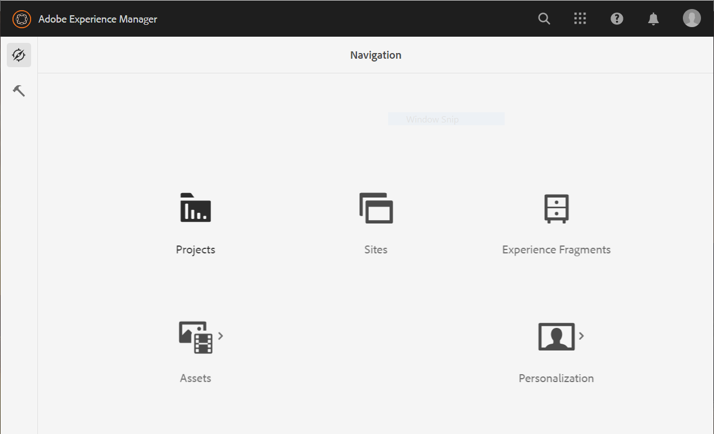

# Configuração {#installation-and-configuration}

Você pode encontrar alguns dos seguintes problemas ao configurar um ambiente Cloud Service:

## A opção Forms não está disponível

A variável **[!UICONTROL Forms]** opção não está disponível no **[!UICONTROL Navegação]** página.

Para ativar o **[!UICONTROL Forms]** opção:

1. Faça logon na [Cloud Manager](https://experience.adobe.com/)
1. Localize seu programa e clique no link  ícone. Ela abre a página Editar programa do seu programa.
1. Abra o **[!UICONTROL Soluções e complementos]** guia.
1. Selecione o **[!UICONTROL Forms]** e Clique em **[!UICONTROL Salvar]**.

   
1. [Criar](https://experienceleague.adobe.com/docs/experience-manager-cloud-manager/using/how-to-use/configuring-pipeline.html?lang=en#how-to-use) e [executar](https://experienceleague.adobe.com/docs/experience-manager-cloud-manager/using/how-to-use/deploying-code.html?lang=pt-BR) produção e os gasodutos de não produção.

Depois que o pipeline for criado e implantado, a variável **[!UICONTROL Forms]** opção no **[!UICONTROL Navegação]** página.

<!--  
## Environment creation fails {#environment-creation-fails}

Users are unable to create an [!DNL AEM Forms] as a Cloud Service environment. The environment creation fails after running for some time.

A missing profile can lead to environment creation failure. Check that the profile exists in Admin Console. If the profile does not exist, perform the following steps to create the profile:

1. Log in to [Admin Console](https://adminconsole.adobe.com/). Use Adobe ID of administrator provisioned to use Automated Forms Conversion Service to login. Do not any other ID or Federated ID to login.
1. Click the **[!UICONTROL Automated Forms Conversion Service]** option.
1. Click **[!UICONTROL New Profile]** in the Products tab.
1. Specify Name, Display Name, and Description for the profile. Click **[!UICONTROL Done]**. A profile is created.

If the profile exists and issues still persist, contact Adobe Support. -->

## Falha na criação do pipeline {#build-pipeline-fails}

Os usuários não podem executar a criação de pipeline. O pipeline falha após ser executado por algum tempo.

Para resolver o problema, abra o Cloud Manager e selecione a **[!UICONTROL Atualizar]** para o seu ambiente e execute o pipeline.
