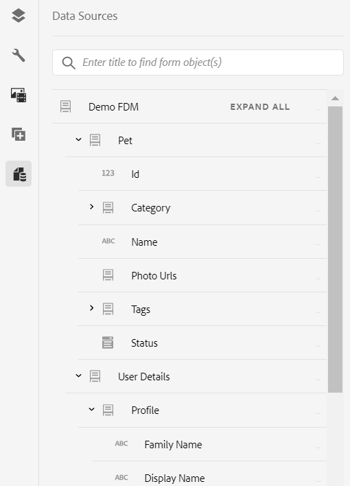

# Usar o modelo de dados de formulário (FDM) {#use-form-data-model}

| Versão | Link do artigo |
| -------- | ---------------------------- |
| AEM 6.5 | [Clique aqui](https://experienceleague.adobe.com/docs/experience-manager-65/forms/form-data-model/using-form-data-model.html) |
| AEM as a Cloud Service | Este artigo |

A integração de dados do [!DNL Experience Manager Forms] permite que você use fontes de dados de back-end diferentes para criar um Modelo de Dados de Formulário (FDM) que você pode usar como esquema em vários fluxos de trabalho do <!--and interactive communications--> Adaptive Forms. Ela requer a configuração de fontes de dados e a criação do Modelo de dados de formulário (FDM) com base nos objetos e serviços do modelo de dados disponíveis nas fontes de dados. Para obter mais informações, consulte o seguinte:

* [Integração de dados do [!DNL Experience Manager Forms]](data-integration.md)
* [Configurar fontes de dados](configure-data-sources.md)
* [Criar modelo de dados de formulário (FDM)](create-form-data-models.md)
* [Trabalhar com o modelo de dados de formulário (FDM)](work-with-form-data-model.md)

Um Modelo de dados de formulário (FDM) é uma extensão do esquema JSON que você pode usar para:

* [Criar Forms adaptável e fragmentos](#create-af)
  <!--* [Create interactive communications and building blocks like text, list, and condition fragments](#create-ic)-->
* [Visualizar com dados de amostra](#preview-ic)
* [Uso do serviço de modelo de dados de formulário](#prefill)
* [Gravar dados do Formulário adaptável enviados de volta nas fontes de dados](#write-af)
* [Chamar serviços usando regras do Formulário adaptável](#invoke-services)

## Criar Forms adaptável e fragmentos {#create-af}

Você pode criar [Forms adaptável](creating-adaptive-form.md) e Fragmentos de formulário adaptável <!-- [Adaptive Form Fragments](adaptive-form-fragments.md) --> com base em um modelo de dados de formulário (FDM). Faça o seguinte para usar um Modelo de dados de formulário (FDM) ao criar um Formulário adaptável ou Fragmento de formulário adaptável:

1. Na guia Modelo de formulário na tela Adicionar propriedades, selecione **[!UICONTROL Modelo de dados de formulário]** na lista suspensa **[!UICONTROL Selecionar de]**.

   

2. Selecione para expandir **[!UICONTROL Selecionar modelo de dados de formulário]**. Todos os modelos de dados de formulário (FDM) disponíveis estão listados.

   Selecione um do modelo de dados.

   

3. (**Fragmentos de formulário adaptáveis somente**) É possível criar um Fragmento de formulário adaptável com base em apenas um objeto de modelo de dados em um modelo de dados de formulário (FDM). Expanda **[!UICONTROL o menu suspenso Definições do Modelo de Dados de Formulário]**. Ela lista todos os objetos do modelo de dados no modelo de dados de formulário (FDM) especificado. Selecione um objeto de modelo de dados na lista.

   

   Depois que o formulário adaptável ou o fragmento de formulário adaptável baseado em um modelo de dados de formulário (FDM) for criado, os objetos de modelo de dados de formulário aparecerão na guia **[!UICONTROL Fontes de dados]** do navegador de conteúdo no Criador de formulários adaptáveis.

   >[!NOTE]
   >
   >Para um Fragmento de formulário adaptável, somente o objeto de modelo de dados selecionado no momento da criação e seus objetos de modelo de dados associados aparecem na guia Fontes de dados.

   

   Você pode arrastar e soltar objetos de modelo de dados no Formulário adaptável ou fragmento para adicionar campos de formulário. Os campos de formulário adicionados retêm as propriedades de metadados e a vinculação com as propriedades do objeto de modelo de dados. O vínculo garante que os valores de campo sejam atualizados nas fontes de dados correspondentes no envio do formulário e preenchidos previamente quando o formulário for renderizado.

<!-- ## Create interactive communications {#create-ic}

You can create an interactive communication based on a Form Data Model that you can use to prefill interactive communication with data from configured data sources. In addition, the building blocks of an interactive communication, such as text, list, and condition document fragments can be based on a form data model.

You can choose a Form Data Model when creating an interactive communication or a document fragment. The following image shows the General tab of the Create Interactive Communication dialog.

General tab of Create Interactive Communication dialog

For more information, see:

[Create an interactive communication](create-interactive-communication.md)

[Text in Interactive Communications](texts-interactive-communications.md)

[Conditions in Interactive Communications](conditions-interactive-communications.md)

[List fragments](lists.md) -->

## Visualizar com dados de amostra {#preview-ic}

O editor do Modelo de dados de formulário permite gerar e editar dados de amostra para objetos de modelo de dados no modelo de dados de formulário (FDM). Você pode usar esses dados para visualizar e testar o <!--interactive communications and--> Adaptive Forms. Você deve gerar os dados de amostra antes de visualizar como descrito em [Trabalhar com o modelo de dados de formulário](work-with-form-data-model.md#sample).

<!--To preview an interactive communication with sample Form Data Model data:

1. On [!DNL  Experience Manager] author instance, navigate to **[!UICONTROL Forms > Forms & Documents]**.
1. Select an interactive communication and select **[!UICONTROL Preview]** in the toolbar to select **[!UICONTROL Web Channel]**, **[!UICONTROL Print Channel]**, or **[!UICONTROL Both Channels]** to preview the interactive communication.
1. In the Preview [*channel*] dialog, ensure that **[!UICONTROL Test Data of Form Data Model]** is selected and select **[!UICONTROL Preview]**.

The interactive communication opens with prefilled sample data.

-->

Para visualizar um formulário adaptável com dados de amostra, abra o formulário adaptável no modo de autor e selecione **[!UICONTROL Visualizar]**.

## Preencher previamente usando o serviço de modelo de dados de formulário {#prefill}

O [!DNL Experience Manager Forms] fornece o Serviço de Preenchimento de Modelo de Dados de Formulário pronto para uso que você pode habilitar para o Adaptive Forms <!--and interactive communications--> com base no modelo de dados de formulário (FDM). O serviço de preenchimento prévio consulta as fontes de dados para objetos de modelo de dados no Formulário Adaptável <!--and interactive communication--> e, consequentemente, preenche os dados enquanto renderiza o formulário ou a comunicação.

Para habilitar o Serviço de Preenchimento de Modelo de Dados de Formulário para um Formulário Adaptável, abra as propriedades do Contêiner de Formulário Adaptável e selecione **[!UICONTROL Serviço de Preenchimento de Modelo de Dados de Formulário]** no menu suspenso **[!UICONTROL Serviço de Preenchimento Prévio]** na opção Básico. Em seguida, salve as propriedades.

<!--To configure Form Data Model prefill service in an interactive communication, you can select Form Data Model Prefill Service in the Prefill Service drop-down while creating it or later by modifying the properties.

Edit Properties dialog for an interactive communication-->

## Gravar dados do Formulário adaptável enviado nas fontes de dados {#write-af}

Quando um usuário envia um formulário com base em um modelo de dados de formulário (FDM), é possível configurar o formulário para gravar dados enviados de um objeto de modelo de dados em suas fontes de dados. Para obter esse caso de uso, [!DNL Experience Manager Forms] forneça a [Ação de envio do modelo de dados de formulário](configuring-submit-actions.md), disponível e pronta para uso somente para o Adaptive Forms com base em um modelo de dados de formulário (FDM). Ele grava dados enviados para um objeto de modelo de dados em sua fonte de dados.

Para configurar a Ação de envio do modelo de dados de formulário:

1. Abra o navegador Conteúdo e selecione o componente **[!UICONTROL Contêiner do Guia]** do seu Formulário adaptável.
1. Clique no ícone de propriedades do Guia Contêiner . A caixa de diálogo Contêiner de formulário adaptável é aberta.
1. Clique na guia **[!UICONTROL Envio]**.
1. Na lista suspensa **[!UICONTROL Enviar Ação]**, selecione **[!UICONTROL Enviar usando o Modelo de Dados de Formulário]**.

   

1. Especifique o **[!UICONTROL Modelo de dados para enviar]**.
1. Clique em **[!UICONTROL Concluído]**

No envio do formulário, os dados do objeto de modelo de dados configurado são gravados na respectiva fonte de dados. Além disso, você pode enviar um anexo de formulário usando um Modelo de dados de formulário (FDM) e um Documento de registro (DoR) para a fonte de dados. Para obter informações sobre o modelo de dados de formulário (FDM), consulte [[!DNL AEM Forms] Integração de Dados](data-integration.md).

<!---->

>[!NOTE]
>
> O AEM as a Cloud Service oferece várias ações de envio prontas para uso para manipular envios de formulários. Você pode saber mais sobre essas opções no artigo [Ação de envio do formulário adaptável](/help/forms/configure-submit-actions-core-components.md).

Você também pode enviar anexos de formulário para uma fonte de dados usando a propriedade de objeto de modelo de dados binários. Faça o seguinte para enviar anexos para uma origem de dados JDBC:

1. Adicione um objeto de modelo de dados que inclua uma propriedade binária ao modelo de dados de formulário (FDM).
1. No Formulário adaptável, arraste e solte o componente **[!UICONTROL Anexo de Arquivo]** do navegador Componentes no Formulário adaptável.
1. Selecione para selecionar o componente adicionado e selecione  para abrir o navegador Propriedades do componente.
1. No campo Referência de Ligação, selecione  e navegue para selecionar a propriedade binária adicionada no modelo de dados de formulário (FDM). Configure outras propriedades, conforme apropriado.

   Selecione o  para salvar as propriedades. O campo de anexo agora está vinculado à propriedade binary do modelo de dados de formulário (FDM).

1. Na seção Envio das propriedades do Contêiner de formulário adaptável, habilite **[!UICONTROL Enviar anexos do formulário]**. Ele envia o anexo no campo de propriedade binária para a fonte de dados no envio do formulário.

## Chamar serviços no Adaptive Forms usando regras {#invoke-services}

Em um Formulário adaptável baseado em um modelo de dados de formulário (FDM), você pode [criar regras](rule-editor.md) para chamar serviços configurados no modelo de dados de formulário (FDM). A operação **[!UICONTROL Invocar Serviços]** em uma regra lista todos os serviços disponíveis no Modelo de Dados de Formulário (FDM) e permite selecionar campos de entrada e saída para o serviço. Você também pode usar o tipo de regra **[!UICONTROL Definir Valor]** para invocar um serviço de Modelo de Dados de Formulário e definir o valor de um campo para a saída retornada pelo serviço.

Por exemplo, a regra a seguir chama um serviço get que usa a ID do Funcionário como entrada e os valores retornados são preenchidos nos campos ID do Dependente, Sobrenome, Nome e Gênero correspondentes no formulário.

Além disso, você pode usar a API `guidelib.dataIntegrationUtils.executeOperation` para escrever uma JavaScript no editor de códigos do editor de regras. <!-- For API details, see [API to invoke Form Data Model service](invoke-form-data-model-services.md).-->

### Chamar um modelo de dados de formulário (FDM) usando funções personalizadas {#invoke-form-data-model-using-custom-functions}

Você pode [invocar um modelo de dados de formulário do editor de regras usando funções personalizadas](/help/forms/rule-editor.md#custom-functions-in-rule-editor-custom-functions). Para chamar o modelo de dados de formulário (FDM), adicione um modelo de dados de formulário ao arquivo de inclui na lista de permissões. Para adicionar um modelo de dados de formulário a uma lista de permissões:

1. Vá para o console da Web do Experience Manager em `https://server:host/system/console/configMgr`.
1. Localize **[!UICONTROL Lista de Permissões de Nível de Formulário Adaptável do Modelo de Dados de Formulário para Invocação de Serviço - Fábrica de Configuração]**.
1. Clique no ícone  para adicionar a configuração.
1. Adicione o **[!UICONTROL Padrão de caminho de conteúdo]** para especificar o local do Forms Adaptável.  Por padrão, o valor é `/content/forms/af/(.*)`, que inclui todo o Forms adaptável. Você também pode especificar o caminho para um Formulário adaptável específico.
1. Adicione **[!UICONTROL Padrão de caminho do Modelo de Dados de Formulário]** para especificar o local do modelo de dados de formulário (FDM). Por padrão, o valor é `/content/dams/formsanddocuments-fdm/(.*)`, que inclui todo o Modelo de dados de formulário (FDM). Você também pode especificar o caminho para um Modelo de dados de formulário (FDM) específico.
1. Salve as configurações.

A configuração adicionada é salva na **[!UICONTROL Lista de Permissões de Nível de Formulário Adaptável do Modelo de Dados de Formulário para Invocação de Serviço - Fábrica de Configuração]**.

>[!VIDEO](https://video.tv.adobe.com/v/3423977/adaptive-forms-custom-function-rule-editor)

>[!NOTE]
>
> Para chamar um modelo de dados de formulário (FDM) no editor de regras usando funções personalizadas por meio de um projeto de arquétipo do AEM:
>
>1. [Criar um arquivo de configuração](https://github.com/adobe/aem-core-forms-components/blob/master/it/config/src/main/content/jcr_root/apps/system/config/com.adobe.aemds.guide.factory.impl.AdaptiveFormFDMConfigurationFactoryImpl~core-components-it.cfg.json).
>1. Definir as propriedades getContentPathPattern e getFormDataModelPathPattern.
>1. Implante o projeto.

## Artigos relacionados

{{af-submit-action}}

