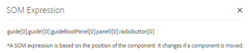

# Uso de expressões SOM no Adaptive Forms{#using-som-expressions-in-adaptive-forms}

O Forms adaptável é modelado como uma página do AEM, que é representada como estrutura de conteúdo JCR no repositório do AEM. O elemento principal da estrutura de conteúdo é o nó guideContainer. Abaixo de guideContainer, há rootPanel que pode conter painéis e campos aninhados.

Você pode usar um modelo de objeto de script (SOM) para fazer referência a valores, propriedades e métodos em um modelo de objeto de documento (DOM) específico. Um DOM organiza os objetos de memória e as propriedades em uma hierarquia de árvore. Uma expressão SOM faz referência a campos/desenha elementos e painéis.

A imagem a seguir representa uma estrutura de nó para a qual um Formulário adaptável é traduzido quando você adiciona componentes a um formulário. Por exemplo, você pode adicionar um painel ao painel raiz e um botão de opção no painel que é transformado em DOM no tempo de execução. A Expressão SOM do campo de botão de opção no Formulário Adaptável está especificada como `guide[0].guide1[0].guideRootPanel[0].panel1[0].radiobutton[0]`.

Árvore DOM

Uma expressão SOM para qualquer elemento em um Formulário adaptável tem o prefixo `guide[0].guide1[0]`. A posição de um componente na hierarquia de estrutura de nó é usada para derivar sua expressão SOM.

Árvore DOM com dois botões de opção

A expressão SOM muda quando você altera a posição dos botões de opção no Formulário adaptável. No modo de criação, é possível exibir a expressão SOM de um campo ou elemento em [!DNL AEM Forms] usando a opção Exibir Expressão SOM. A opção é exibida no painel e quando você clica com o botão direito do mouse no campo ou elemento.

Extração de expressões SOM em um formulário adaptável

Nos painéis, você pode acessar o recurso na barra de ferramentas do painel. O recurso facilita a criação de scripts por autores do Formulário adaptável.

Extração de expressões SOM usando a barra de ferramentas do painel

Algumas APIs listadas no [GuideBridge](https://helpx.adobe.com/br/aem-forms/6/javascript-api/GuideBridge.html) usam a expressão SOM de um elemento. Por exemplo, para focalizar um campo específico em um Formulário adaptável, passe a expressão SOM correspondente para a API `getFocus` em `guideBridge`.
