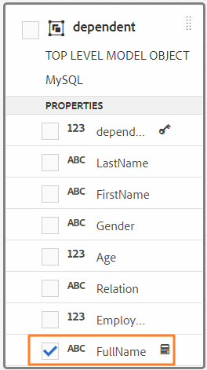

# Trabalhar com o modelo de dados de formulário {#work-with-form-data-model}


O editor de Modelo de dados de formulário oferece uma interface de usuário intuitiva e ferramentas para editar e configurar um modelo de dados de formulário. Usando o editor, é possível adicionar e configurar objetos, propriedades e serviços do modelo de dados de fontes de dados associadas no modelo de dados de formulário. Além disso, permite criar objetos e propriedades do modelo de dados sem fontes de dados e vinculá-los aos respectivos objetos e propriedades do modelo de dados posteriormente. Também é possível gerar e editar dados de amostra para propriedades de objetos do modelo de dados que você pode usar para preencher previamente o Adaptive Forms <!--and interactive communications--> ao visualizar. É possível testar os objetos e os serviços do modelo de dados configurados em um Modelo de dados de formulário para garantir sua integração correta com as fontes de dados.

Se você nunca usou a integração de dados do Forms e não configurou uma fonte de dados ou criou um modelo de dados de formulário, consulte os seguintes tópicos:

* [[!DNL Experience Manager Forms] Integração de dados](data-integration.md)
* [Configurar fontes de dados](configure-data-sources.md)
* [Criar modelo de dados de formulário](create-form-data-models.md)

Leia para obter detalhes sobre várias tarefas e configurações que você pode executar usando o editor de Modelo de dados de formulário.

>[!NOTE]
>
>Você deve ser um membro de ambos **fdm-author** e **usuário de formulários** para criar e trabalhar com o modelo de dados de formulário. Entre em contato com seu [!DNL Experience Manager] administrador para se tornar membro dos grupos.

## Adicionar objetos e serviços do modelo de dados {#add-data-model-objects-and-services}

Se você criou um Modelo de dados de formulário com fontes de dados, é possível usar o editor de Modelo de dados de formulário para adicionar objetos e serviços de modelo de dados, configurar suas propriedades, criar associações entre objetos de modelo de dados e testar o Modelo de dados de formulário e os serviços.

É possível adicionar objetos e serviços de modelo de dados de fontes de dados disponíveis no modelo de dados de formulário. Enquanto os objetos de modelo de dados adicionados aparecem na guia Modelo , os serviços adicionados aparecem na guia Serviços .

Para adicionar objetos e serviços do modelo de dados:

1. Faça logon no [!DNL Experience Manager] instância do autor, navegue até **[!UICONTROL Forms > Integrações de dados]** e abra o Modelo de dados de formulário no qual deseja adicionar objetos de modelo de dados.
1. No painel Fontes de dados , expanda as fontes de dados para exibir os objetos e serviços disponíveis do modelo de dados.
1. Selecione objetos e serviços do modelo de dados que deseja adicionar ao Modelo de dados de formulário e toque em **[!UICONTROL Adicionar Selecionado]**.

   

   Objetos e serviços do modelo de dados selecionado

   O **[!UICONTROL Modelo]** exibe uma representação gráfica de todos os objetos de modelo de dados e suas propriedades adicionadas ao modelo de dados de formulário. Cada objeto de modelo de dados é representado por uma caixa no modelo de dados de formulário.

   

   **[!UICONTROL Modelo]** guia exibe objetos de modelo de dados adicionados

   >[!NOTE]
   >
   >É possível manter e arrastar as caixas de objetos do modelo de dados ao redor para organizá-las na área de conteúdo. Todos os objetos de modelo de dados adicionados ao Modelo de dados de formulário são esmaecidos no painel Fontes de dados.

   O **[!UICONTROL Serviços]** lista os serviços adicionados.

   

   **[!UICONTROL Serviços]** guia exibe os serviços do modelo de dados

   >[!NOTE]
   >
   >Além de objetos e serviços de modelo de dados, o documento de metadados do serviço OData inclui propriedades de navegação que definem a associação entre dois objetos de modelo de dados. Para obter mais informações, consulte [Trabalhar com propriedades de navegação de serviços OData](#work-with-navigation-properties-of-odata-services).

1. Toque **[!UICONTROL Salvar]** para salvar o objeto de modelo de formulário.

   >[!NOTE]
   >
   >Você pode chamar os serviços configurados na guia Serviços de um Modelo de dados de formulário usando as regras do Formulário adaptativo. Os serviços configurados estão disponíveis na ação Invocar serviços do editor de regras Para obter mais informações sobre como usar esses serviços nas regras de Formulário adaptável, consulte Invocar serviços e Definir valor das regras em [editor de regras](rule-editor.md).

## Criar objetos de modelo de dados e propriedades filho {#create-data-model-objects-and-child-properties}

### Criar objetos do modelo de dados {#create-data-model-objects}

Embora seja possível adicionar objetos de modelo de dados a partir de fontes de dados configuradas, também é possível criar objetos ou entidades de modelo de dados sem fontes de dados. Isso é útil principalmente se você não tiver configurado fontes de dados no modelo de dados de formulário.

Para criar um objeto de modelo de dados sem fontes de dados:

1. Faça logon no [!DNL Experience Manager] instância do autor, navegue até **[!UICONTROL Forms > Integrações de dados]** e abra o Modelo de dados de formulário no qual deseja criar um objeto ou entidade de modelo de dados.
1. Toque **[!UICONTROL Criar entidade]**.
1. No [!UICONTROL Criar modelo de dados] , especifique um nome para o objeto de modelo de dados e toque em **[!UICONTROL Adicionar]**. Um objeto de modelo de dados é adicionado ao modelo de dados de formulário. O objeto de modelo de dados recém-adicionado não está vinculado a uma fonte de dados e não tem nenhuma propriedade, como mostrado na imagem a seguir.

   

Em seguida, é possível adicionar propriedades filho em objetos de modelo de dados não vinculados.

### Adicionar propriedades secundárias {#child-properties}

O editor de Modelo de dados de formulário permite criar propriedades filho em um objeto de modelo de dados. A propriedade quando criada não está vinculada a nenhuma propriedade em uma fonte de dados. Posteriormente, é possível vincular a propriedade filho a outra propriedade no objeto de modelo de dados que a contém.

Para criar uma propriedade filho:

1. Em um modelo de dados de formulário, selecione um objeto de modelo de dados e toque em **[!UICONTROL Criar Propriedade Filho]**.
1. No **[!UICONTROL Criar Propriedade Filho]** , especifique um nome e tipo de dados para a propriedade no **[!UICONTROL Nome]** e **[!UICONTROL Tipo]** , respectivamente. Como opção, você pode especificar um título e uma descrição para a propriedade.
1. Habilite Calculado se a propriedade for uma propriedade calculada. O valor de uma propriedade calculada é avaliado com base em uma regra ou expressão. Para obter mais informações, consulte [Editar propriedades](#properties).
1. Se o objeto de modelo de dados estiver vinculado a uma fonte de dados, a propriedade filho adicionada será vinculada automaticamente à propriedade do objeto de modelo de dados pai com o mesmo nome e tipo de dados.

   Para vincular manualmente uma propriedade filho a uma propriedade de objeto de modelo de dados, toque no ícone Procurar ao lado do **[!UICONTROL Referência de associação]** campo. O **[!UICONTROL Selecionar objeto]** lista todas as propriedades do objeto de modelo de dados pai. Selecione uma propriedade com a qual vincular e toque no ícone de marca de verificação. Você só pode selecionar uma propriedade do mesmo tipo de dados que a propriedade filho.

1. Toque **[!UICONTROL Concluído]** para salvar a propriedade filho e tocar em **[!UICONTROL Salvar]** para salvar o modelo de dados de formulário. A propriedade filho agora é adicionada ao objeto de modelo de dados.

Depois de criar objetos e propriedades do modelo de dados, você pode continuar a criar o Adaptive Forms <!--and interactive communications--> com base no modelo de dados de formulário. Posteriormente, quando houver fontes de dados disponíveis e configuradas, é possível vincular o Modelo de dados de formulário às fontes de dados. O vínculo é atualizado automaticamente no Adaptive Forms associado <!--and interactive communications-->. Para obter mais informações sobre como criar o Adaptive Forms <!--and interactive communications--> usando o modelo de dados de formulário, consulte [Usar modelo de dados de formulário](using-form-data-model.md).

### Vincular objetos e propriedades do modelo de dados {#bind-data-model-objects-and-properties}

Quando as fontes de dados que você deseja integrar ao Modelo de dados de formulário estiverem disponíveis, é possível adicioná-las ao Modelo de dados de formulário conforme descrito em [Atualizar fontes de dados](create-form-data-models.md#update). Em seguida, faça o seguinte para vincular os objetos e as propriedades do modelo de dados não vinculados:

1. No modelo de dados de formulário, selecione a fonte de dados não vinculada que deseja vincular a uma fonte de dados.
1. Toque **[!UICONTROL Editar propriedades]**.
1. No **[!UICONTROL Editar propriedades]** toque no ícone de navegação ao lado do painel **[!UICONTROL Vínculo]** campo. Ele abre o **[!UICONTROL Selecionar objeto]** que lista as fontes de dados adicionadas no modelo de dados de formulário.

   

1. Expanda a árvore de fontes de dados e selecione um objeto de modelo de dados com o qual vincular e toque no ícone de marca de verificação.
1. Toque **[!UICONTROL Concluído]** para salvar as propriedades e, em seguida, toque em **[!UICONTROL Salvar]** para salvar o modelo de dados de formulário. O objeto de modelo de dados agora está vinculado a uma fonte de dados. Observe que o objeto de modelo de dados não está mais marcado como Não vinculado.

   

## Configurar serviços {#configure-services}

Para ler e gravar dados de um objeto de modelo de dados, faça o seguinte para configurar os serviços de leitura e gravação:

1. Marque a caixa de seleção na parte superior de um objeto de modelo de dados para selecioná-lo e tocar em **[!UICONTROL Editar propriedades]**.

   

   Editar propriedades para configurar serviços de leitura e gravação para um objeto de modelo de dados

   O [!UICONTROL Editar propriedades] será aberta.

   

   Caixa de diálogo Editar propriedades

   >[!NOTE]
   >
   >Além de objetos e serviços de modelo de dados, o documento de metadados do serviço OData inclui propriedades de navegação que definem a associação entre dois objetos de modelo de dados. Quando você adiciona uma fonte de dados do serviço OData a um Modelo de dados de formulário, há um serviço disponível no Modelo de dados de formulário para todas as propriedades de navegação em um objeto de modelo de dados. Você pode usar esse serviço para ler as propriedades de navegação do objeto de modelo de dados correspondente.
   >
   >
   >Para obter mais informações sobre como usar o serviço, consulte [Trabalhar com propriedades de navegação de serviços OData](#work-with-navigation-properties-of-odata-services).

1. Alternar **[!UICONTROL Objeto de nível superior]** para especificar se o objeto de modelo de dados é um objeto de modelo de nível superior.

   Os objetos do modelo de dados configurados em um Modelo de dados de formulário estão disponíveis para uso na guia Objetos do modelo de dados no navegador Conteúdo de um formulário adaptável com base no modelo de dados de formulário. Ao adicionar associação entre dois objetos de modelo de dados, o objeto de modelo de dados ao qual você está associado é aninhado sob o objeto de modelo de dados do qual você está associando na **[!UICONTROL Objetos do modelo de dados]** guia . Se o modelo de dados aninhado for um objeto de nível superior, ele também aparecerá separadamente no **[!UICONTROL Objetos do modelo de dados]** guia . Portanto, você vê duas entradas, uma dentro e outra fora da hierarquia aninhada, que pode confundir os autores do formulário. Para fazer com que o objeto de modelo de dados associado apareça somente na hierarquia aninhada, desative a propriedade Objeto de nível superior.

1. Selecione Serviços de leitura e gravação para os objetos de modelo de dados selecionados. Os argumentos para os serviços são exibidos.

   

   Serviços de leitura e gravação configurados para fonte de dados do funcionário

1. Toque  para o argumento do serviço de leitura para [vincular o argumento a um Atributo de perfil do usuário, Atributo de solicitação ou valor literal](#bindargument) e especifique o valor do vínculo.
1. Toque **[!UICONTROL Concluído]** para salvar o argumento , **[!UICONTROL Concluído]** para salvar as propriedades e **[!UICONTROL Salvar]** para salvar o modelo de dados de formulário.

### Argumentos do serviço de leitura de associação {#bindargument}

Vincule o argumento do serviço de leitura a um Atributo de perfil de usuário, Atributo de solicitação ou valor literal com base em um valor de vínculo. O valor é passado para o serviço como um argumento para buscar detalhes associados ao valor especificado na fonte de dados.

#### Valor literal {#literal-value}

Selecionar **[!UICONTROL Literal]** do **[!UICONTROL Vínculo a]** e insira um valor no **[!UICONTROL Valor de vínculo]** campo. Os detalhes associados ao valor são recuperados da fonte de dados. Use essa opção para recuperar detalhes associados a um valor estático.

Neste exemplo, os detalhes associados a **4367655678**, como o valor da variável `mobilenum` são recuperadas da fonte de dados. Os detalhes associados se você passar o valor para um argumento de número de celular podem incluir propriedades como nome do cliente, endereço do cliente e cidade.


#### Atributo do perfil do usuário {#user-profile-attribute}

Selecionar **[!UICONTROL Atributo de perfil do usuário]** do **[!UICONTROL Vínculo a]** e insira o nome do atributo na **[!UICONTROL Valor de vínculo]** campo. Os detalhes do usuário conectado ao [!DNL Experience Manager] As instâncias são recuperadas da fonte de dados com base no nome do atributo.

O nome do atributo especificado na variável **[!UICONTROL Valor de vínculo]** deve incluir o caminho de vínculo completo até o nome do atributo para o usuário. Abra o seguinte URL para acessar os detalhes do usuário no CRXDE:

`https://[server-name]:[port]/crx/de/index.jsp#/home/users/`


Neste exemplo, especifique `profile.empid` no **[!UICONTROL Valor de vínculo]** para o campo `grios` usuário.


O `id` O argumento assume o valor da variável `empid` do perfil de usuário e o transmita como um argumento para o serviço de leitura. Ele lê e retorna valores de propriedades associadas do objeto de modelo de dados de funcionário para a variável `empid` associado ao usuário conectado.

#### Solicitar atributo {#request-attribute}

Use o atributo de solicitação para recuperar as propriedades associadas da fonte de dados.

1. Selecionar **[!UICONTROL Atributo da solicitação]** do **[!UICONTROL Vínculo a]** e insira o nome do atributo na **[!UICONTROL Valor de vínculo]** campo.

1. Crie um [sobreposição](https://experienceleague.adobe.com/docs/experience-manager-cloud-service/implementing/developing/full-stack/overlays.html?lang=en#developing) para o head.jsp. Para criar a sobreposição, abra o CRX DE e copie a variável `https://<server-name>:<port number>/crx/de/index.jsp#/libs/fd/af/components/page2/afStaticTemplatePage/head.jsp` para `https://<server-name>:<port number>/crx/de/index.jsp#/apps/fd/af/components/page2/afStaticTemplatePage/head.jsp`

   >[!NOTE]
   >
   > * Se você usar um modelo estático, sobreponha o head.jsp em:
      >   `/libs/fd/af/components/page2/afStaticTemplatePage/head.jsp`
   > * Se você usar um modelo editável, sobreponha o aftemplatedpage.jsp em:
      >   `/libs/fd/af/components/page2/aftemplatedpage/aftemplatedpage.jsp`


1. Definir [!DNL paramMap] para o atributo de solicitação. Por exemplo, inclua o seguinte código no arquivo .jsp na pasta de aplicativos:

   ```javascript
   <%Map paraMap = new HashMap();
    paraMap.put("<request_attribute>",request.getParameter("<request_attribute>"));
    request.setAttribute("paramMap",paraMap);
   ```

   Por exemplo, use o código abaixo para recuperar o valor de petid da fonte de dados:


   ```javascript
   <%Map paraMap = new HashMap();
   paraMap.put("petId",request.getParameter("petId"));
   request.setAttribute("paramMap",paraMap);%>
   ```

Os detalhes são recuperados da fonte de dados com base no nome do atributo especificado na solicitação.

Por exemplo, especificar atributo como `petid=100` na solicitação recupera propriedades associadas ao valor do atributo da fonte de dados.

## Adicionar associações {#add-associations}

Normalmente, há associações criadas entre objetos de modelo de dados em uma fonte de dados. A associação pode ser um para um ou um para muitos. Por exemplo, pode haver vários dependentes associados a um funcionário. É conhecida como associação de um para muitos e representada por `1:n` na linha que conecta objetos de modelo de dados associados. No entanto, se uma associação retornar um nome de funcionário exclusivo para uma determinada ID de funcionário, ela será chamada de associação de um para um.

Ao adicionar objetos de modelo de dados associados em uma fonte de dados a um modelo de dados de formulário, suas associações são retidas e exibidas como conectadas por linhas de seta. É possível adicionar associações entre objetos de modelo de dados em diferentes fontes de dados em um modelo de dados de formulário.

>[!NOTE]
>
>Associações predefinidas em uma fonte de dados JDBC não são retidas no modelo de dados de formulário. Você deve criá-los manualmente.

Para adicionar uma associação:

1. Marque a caixa de seleção na parte superior de um objeto de modelo de dados para selecioná-lo e tocar em **[!UICONTROL Adicionar Associação]**. A caixa de diálogo Adicionar associação é aberta.

   

   >[!NOTE]
   >
   >Além de objetos e serviços de modelo de dados, o documento de metadados do serviço OData inclui propriedades de navegação que definem a associação entre dois objetos de modelo de dados. É possível usar essas propriedades de navegação ao adicionar associações no Modelo de dados de formulário. Para obter mais informações, consulte [Trabalhar com propriedades de navegação de serviços OData](#work-with-navigation-properties-of-odata-services).

   O [!UICONTROL Adicionar Associação] será aberta.

   

   Caixa de diálogo Adicionar associação

1. No painel Adicionar Associação:

   * Especifique um título para a associação.
   * Selecione o tipo de associação — **[!UICONTROL Um para um]** ou **[!UICONTROL Um para muitos]**.
   * Selecione o objeto de modelo de dados ao qual associar.
   * Selecione o serviço de leitura para ler dados a partir do objeto de modelo selecionado. O argumento read service é exibido. Edite para alterar o argumento, se necessário, e vincule-o à propriedade do objeto de modelo de dados a ser associado.

   No exemplo a seguir, o argumento padrão para o serviço de leitura do objeto de modelo de dados Dependentes é `dependentid`.

   

   O argumento padrão para o serviço de leitura de Dependentes é dependente

   No entanto, o argumento deve ser uma propriedade comum entre o objeto de modelo de dados associado, que neste exemplo é `Employeeid`. Por conseguinte, o `Employeeid` O argumento deve ser vinculado ao `id` propriedade do objeto de modelo de dados Funcionário para buscar os detalhes dos dependentes associados no objeto de modelo de dados Dependentes.

   

   Argumento e vínculo atualizados

   Toque **[!UICONTROL Concluído]** para salvar o argumento .

1. Toque **[!UICONTROL Concluído]** para salvar a associação e **[!UICONTROL Salvar]** para salvar o modelo de dados de formulário.
1. Repita as etapas para criar mais associações, conforme necessário.

>[!NOTE]
>
>A associação adicionada aparece na caixa de objeto de modelo de dados com o título especificado e uma linha que conecta os objetos de modelo de dados associados.
>
>É possível editar uma associação marcando a caixa de seleção e tocando em **[!UICONTROL Editar Associação]**.


## Editar propriedades {#properties}

É possível editar propriedades de objetos do modelo de dados, suas propriedades e serviços adicionados ao modelo de dados de formulário.

Para editar propriedades:

1. Marque a caixa de seleção ao lado de um objeto de modelo de dados, uma propriedade ou um serviço no modelo de dados de formulário.
1. Toque **[!UICONTROL Editar propriedades]**. O **[!UICONTROL Editar propriedades]** será aberto um painel para o objeto, propriedade ou serviço do modelo selecionado.

   * **[!UICONTROL Objeto do modelo de dados]**: Especifique os serviços de leitura e gravação e edite os argumentos.
   * **[!UICONTROL Propriedade]**: Especifique o tipo, o subtipo e o formato da propriedade. Você também pode especificar se a propriedade selecionada é a chave primária para o objeto de modelo de dados.
   * **[!UICONTROL Serviço]**: Especifique o objeto do modelo de entrada, o tipo de saída e os argumentos para o serviço. Para um serviço Get, você pode especificar se é esperado que ele retorne uma matriz.

      
   Caixa de diálogo Editar propriedades para um serviço get

1. Toque **[!UICONTROL Concluído]** para salvar as propriedades e **[!UICONTROL Salvar]** para salvar o modelo de dados de formulário.

### Criar propriedades calculadas {#computed}

Uma propriedade calculada é aquela cujo valor é calculado com base em uma regra ou expressão. Usando uma regra, é possível definir o valor de uma propriedade calculada como uma sequência literal, um número, o resultado de uma expressão matemática ou o valor de outra propriedade no modelo de dados de formulário.

Por exemplo, você pode criar uma propriedade calculada **FullName** cujo valor é resultado da concatenação do **FirstName** e **LastName** propriedades. Para fazer isso:

1. Criar uma nova propriedade com o nome `FullName` cujo tipo de dados é String.
1. Habilitar **[!UICONTROL Calculado]** e tocar **[!UICONTROL Concluído]** para criar a propriedade.

   

   A propriedade computada FullName é criada. Observe o ícone ao lado da propriedade para descrever uma propriedade calculada.

   

1. Selecione a propriedade FullName e toque em **[!UICONTROL Editar regra]**. Uma janela do editor de regras é aberta.
1. Na janela do editor de regras, toque em **[!UICONTROL Criar]**. A **[!UICONTROL Definir valor]** janela de regras é aberta.

   No menu suspenso Selecionar opção , selecione **[!UICONTROL Expressão matemática]**. Outras opções disponíveis são **[!UICONTROL Objeto de Modelo de Dados de Formulário]** e **[!UICONTROL String]**.

1. Na expressão matemática, selecione **[!UICONTROL FirstName]** e **[!UICONTROL LastName]** no primeiro e no segundo objetos, respectivamente. Selecionar **[!UICONTROL plus]** como operador.

   Toque **[!UICONTROL Concluído]** em seguida, toque em **[!UICONTROL Fechar]** para fechar a janela do editor de regras. A regra é semelhante ao seguinte.

   

1. No modelo de dados de formulário, toque em **[!UICONTROL Salvar]**. A propriedade calculada é configurada.

## Trabalhar com propriedades de navegação de serviços OData {#work-with-navigation-properties-of-odata-services}

Nos serviços OData, as propriedades de navegação são usadas para definir associações entre dois objetos de modelo de dados. Essas propriedades são definidas em um tipo de entidade ou em um tipo complexo. Por exemplo, na extração a seguir do arquivo de metadados da amostra [TripPin](https://www.odata.org/blog/trippin-new-odata-v4-sample-service/) Os serviços de amostra OData contêm três propriedades de navegação: Amigos, Melhores Amigos e Percursos.

Para obter mais informações sobre propriedades de navegação, consulte [Documentação de OData](https://docs.oasis-open.org/odata/odata/v4.0/errata03/os/complete/part3-csdl/odata-v4.0-errata03-os-part3-csdl-complete.html#_Toc453752536).

```xml
<edmx:Edmx xmlns:edmx="https://docs.oasis-open.org/odata/ns/edmx" Version="4.0">
<script/>
<edmx:DataServices>
<Schema xmlns="https://docs.oasis-open.org/odata/ns/edm" Namespace="Microsoft.OData.Service.Sample.TrippinInMemory.Models">
<EntityType Name="Person">
<Key>
<PropertyRef Name="UserName"/>
</Key>
<Property Name="UserName" Type="Edm.String" Nullable="false"/>
<Property Name="FirstName" Type="Edm.String" Nullable="false"/>
<Property Name="LastName" Type="Edm.String"/>
<Property Name="MiddleName" Type="Edm.String"/>
<Property Name="Gender" Type="Microsoft.OData.Service.Sample.TrippinInMemory.Models.PersonGender" Nullable="false"/>
<Property Name="Age" Type="Edm.Int64"/>
<Property Name="Emails" Type="Collection(Edm.String)"/>
<Property Name="AddressInfo" Type="Collection(Microsoft.OData.Service.Sample.TrippinInMemory.Models.Location)"/>
<Property Name="HomeAddress" Type="Microsoft.OData.Service.Sample.TrippinInMemory.Models.Location"/>
<Property Name="FavoriteFeature" Type="Microsoft.OData.Service.Sample.TrippinInMemory.Models.Feature" Nullable="false"/>
<Property Name="Features" Type="Collection(Microsoft.OData.Service.Sample.TrippinInMemory.Models.Feature)" Nullable="false"/>
<NavigationProperty Name="Friends" Type="Collection(Microsoft.OData.Service.Sample.TrippinInMemory.Models.Person)"/>
<NavigationProperty Name="BestFriend" Type="Microsoft.OData.Service.Sample.TrippinInMemory.Models.Person"/>
<NavigationProperty Name="Trips" Type="Collection(Microsoft.OData.Service.Sample.TrippinInMemory.Models.Trip)"/>
</EntityType>
```

Ao configurar um serviço OData em um Modelo de dados de formulário, todas as propriedades de navegação em um contêiner de entidade são disponibilizadas por meio de um serviço no Modelo de dados de formulário. Neste exemplo do serviço TripPin OData, as três propriedades de navegação no `Person` contêiner de entidade pode ser lido usando um `GET LINK` no Modelo de dados de formulário.

O seguinte destaca o `GET LINK of Person /People` no Modelo de dados de formulário, que é um serviço combinado para as três propriedades de navegação no `Person` entidade do serviço OData do TripPin.


Depois de adicionar o `GET LINK` para a guia Serviços no Modelo de dados de formulário, é possível editar as propriedades para escolher o objeto de modelo de saída e a propriedade de navegação a ser usada no serviço. Por exemplo, o seguinte `GET LINK of Person /People` No exemplo a seguir, o serviço usa Trip como o objeto de modelo de saída e a propriedade de navegação como Trips.


>[!NOTE]
>
>Os valores disponíveis na variável **[!UICONTROL Valor padrão]** do **NavigationPropertyName** O argumento depende do estado da **[!UICONTROL Retornar matriz?]** botão de alternância. Quando ativado, mostra as propriedades de navegação do tipo Collection .

Neste exemplo, você também pode escolher o objeto de modelo de saída como Pessoa e argumento de propriedade de navegação como Amigos ou Melhor Amigo (dependendo se **[!UICONTROL Retornar matriz?]** está ativado ou desativado).


Da mesma forma, é possível escolher uma `GET LINK` e configure suas propriedades de navegação ao adicionar associações no Modelo de dados de formulário. No entanto, para poder selecionar uma propriedade de navegação, verifique se a variável **[!UICONTROL Vínculo com campo]** está definida como **[!UICONTROL Literal]**.


## Gerar e editar dados de amostra {#sample}

O editor de Modelo de dados de formulário permite gerar dados de amostra para todas as propriedades de objetos do modelo de dados, incluindo propriedades calculadas, em um modelo de dados de formulário. É um conjunto de valores aleatórios que está em conformidade com o tipo de dados configurado para cada propriedade. Também é possível editar e salvar dados, que são retidos mesmo se os dados de amostra forem gerados novamente.

Faça o seguinte para gerar e editar dados de amostra:

1. Abra um Modelo de dados de formulário e toque em **[!UICONTROL Editar dados de amostra]**. Ele gera e exibe os dados de amostra na janela Editar dados de amostra .

   

1. Em **[!UICONTROL Editar dados de amostra]** janela, edite os dados, conforme necessário, e toque em **[!UICONTROL Salvar]**.

<!--Next, you can use the sample data to prefill and test interactive communications based on the form data model. For more information, see [Use form data model](using-form-data-model.md).-->

## Testar objetos e serviços do modelo de dados {#test-data-model-objects-and-services}

Seu Modelo de dados de formulário está configurado, mas antes de colocá-lo em uso, convém testar se os objetos e serviços do modelo de dados configurado estão funcionando conforme o esperado. Para testar objetos e serviços do modelo de dados:

1. Selecione um objeto de modelo de dados ou um serviço no Modelo de dados de formulário e toque em **[!UICONTROL Objeto de Modelo de Teste]** ou **[!UICONTROL Serviço de teste]**, respectivamente.

   A janela Modelo de dados de formulário de teste é aberta.

   

1. No [!UICONTROL Modelo de dados do formulário de teste] selecione o objeto ou serviço do modelo de dados a ser testado no painel Entrada.

1. Especifique um valor de argumento no código de teste e toque em **[!UICONTROL Teste]**. Um teste bem-sucedido retorna a saída no painel Saída.

   

Da mesma forma, é possível testar outros objetos e serviços do modelo de dados no modelo de dados de formulário.

## Validação automatizada de dados de entrada {#automated-validation-of-input-data}

O Modelo de dados de formulário valida os dados recebidos como entrada enquanto invoca a API DermisBridge (com base nos critérios de validação disponíveis no modelo de dados de formulário). A validação se baseia no `ValidationOptions` sinalizador definido no objeto de consulta que é usado para chamar a API.

O sinalizador pode ser definido como qualquer um dos seguintes valores:

* **COMPLETO**: O FDM executa a validação com base em todas as restrições
* **OFF**: Nenhuma validação
* **BÁSICO**: O FDM executa a validação com base em restrições &quot;obrigatórias&quot; e &quot;anuláveis&quot;

Se nenhum valor for definido para a variável `ValidationOptions`bandeira, **BÁSICO** a validação é executada nos dados de entrada.

Este é um exemplo de definição do sinalizador de validação como **COMPLETO**:

```java
operationOptions.setValidationOptions(ValidationOptions.FULL);
```

>[!NOTE]
>
>O valor fornecido para um atributo nos dados de entrada deve corresponder ao tipo de dados definido para o atributo no documento de metadados.\
>Se o valor não corresponder ao tipo de dados definido para o atributo , a API DermisBridge exibirá uma exceção independentemente do valor da variável `ValidationOptions` sinalizador. Se o nível de log estiver definido como Debug, um erro será registrado no **error.log** arquivo.

O Modelo de dados de formulário valida os dados de entrada com base em uma lista de restrições do tipo de dados. A lista de restrições para dados de entrada pode variar com base na fonte de dados.

A tabela a seguir lista as restrições para dados de entrada com base na fonte de dados:

<table>
 <tbody> 
  <tr> 
   <td>Restrições</td> 
   <td>Descrição</td> 
   <td>Fonte de dados de entrada</td> 
  </tr> 
  <tr> 
   <td>required</td> 
   <td>Se true, o parâmetro deverá ser incluído nos dados de entrada.</td> 
   <td>Swagger, WSDL e banco de dados</td> 
  </tr> 
  <tr> 
   <td>nulo</td> 
   <td>Se true, o valor do parâmetro poderá ser definido como Null nos dados de entrada.</td> 
   <td>WSDL, Odata e banco de dados</td> 
  </tr> 
  <tr> 
   <td>máximo</td> 
   <td>Especifica o limite superior para valores numéricos. O valor máximo especificado como o limite superior também pode ser atribuído ao parâmetro nos dados de entrada.</td> 
   <td>Swagger e WSDL</td> 
  </tr> 
  <tr> 
   <td>mínima</td> 
   <td>Especifica o limite inferior para valores numéricos. O valor mínimo especificado como o limite inferior também pode ser atribuído ao parâmetro nos dados de entrada.</td> 
   <td>Swagger e WSDL</td> 
  </tr> 
  <tr> 
   <td>uniqueMaximum</td> 
   <td>Especifica o limite superior para valores numéricos. O valor máximo especificado como o limite superior não deve ser atribuído ao parâmetro nos dados de entrada.</td> 
   <td>Swagger e WSDL</td> 
  </tr> 
  <tr> 
   <td>excludedMinimum</td> 
   <td>Especifica o limite inferior para valores numéricos. O valor mínimo especificado como o limite inferior não deve ser atribuído ao parâmetro nos dados de entrada.</td> 
   <td>Swagger e WSDL</td> 
  </tr> 
  <tr> 
   <td>minLength</td> 
   <td>Especifica o limite inferior para o número de caracteres incluídos em uma string. O valor mínimo especificado como o limite inferior também pode ser atribuído ao parâmetro nos dados de entrada.</td> 
   <td>Swagger e WSDL</td> 
  </tr> 
  <tr> 
   <td>maxLength</td> 
   <td>Especifica o limite superior para o número de caracteres incluídos em uma string. O valor máximo especificado como o limite superior também pode ser atribuído ao parâmetro nos dados de entrada.</td> 
   <td>Swagger, WSDL, Odata e banco de dados</td> 
  </tr> 
  <tr> 
   <td>pattern</td> 
   <td>Especifica uma sequência fixa de caracteres. A cadeia de caracteres de entrada é validada com êxito somente se os caracteres estiverem em conformidade com o padrão especificado.</td> 
   <td>Swagger</td> 
  </tr> 
  <tr> 
   <td>minItems</td> 
   <td>Especifica o número mínimo de itens em uma matriz. O valor mínimo especificado como o limite inferior também pode ser atribuído ao parâmetro nos dados de entrada.</td> 
   <td>Swagger e WSDL</td> 
  </tr> 
  <tr> 
   <td>maxItems</td> 
   <td>Especifica o número máximo de itens em uma matriz. O valor máximo especificado como o limite superior também pode ser atribuído ao parâmetro nos dados de entrada.</td> 
   <td>Swagger e WSDL</td> 
  </tr> 
  <tr> 
   <td>uniqueItems</td> 
   <td>Se verdadeiro, todos os elementos da matriz devem ser exclusivos nos dados de entrada.</td> 
   <td>Swagger</td> 
  </tr> 
  <tr> 
   <td>enum (string)<br /> <br /> </td> 
   <td>Restringe o valor de um parâmetro nos dados de entrada a um conjunto fixo de valores de string. Deve ser uma matriz com pelo menos um elemento, onde cada elemento é único.</td> 
   <td>Swagger, WSDL e Odata</td> 
  </tr> 
  <tr> 
   <td>enum (número)<br /> <br /> </td> 
   <td>Restringe o valor de um parâmetro nos dados de entrada a um conjunto fixo de valores numéricos. Deve ser uma matriz com pelo menos um elemento, onde cada elemento é único.</td> 
   <td>WSDL</td> 
  </tr> 
 </tbody> 
</table>

Neste exemplo, os dados de entrada são validados com base nas restrições máximas, mínimas e obrigatórias definidas no arquivo Swagger. Os dados de entrada atendem aos critérios de validação somente se a ID do pedido estiver presente e seu valor estiver entre 1 e 10.

```json
   parameters: [
   {
   name: "orderId",
   in: "path",
   description: "ID of pet that needs to be fetched",
   required: true,
   type: "integer",
   maximum: 10,
   minimum: 1,
   format: "int64"
   }
   ]
```

Uma exceção é exibida se os dados de entrada não atenderem aos critérios de validação. Se o nível de log estiver definido como **Depurar**, um erro é registrado no **error.log** arquivo. Por exemplo,

```verilog
21.01.2019 17:26:37.411 *ERROR* com.adobe.aem.dermis.core.validation.JsonSchemaValidator {"errorCode":"AEM-FDM-001-044","errorMessage":"Input validations failed during operation execution.","violations":{"/orderId":["numeric instance is greater than the required maximum (maximum: 10, found: 16)"]}}
```

## Próximas etapas {#next-steps}

Você tem um Modelo de dados de formulário funcional que agora está pronto para uso no Adaptive Forms <!--and interactive communications--> fluxos de trabalho. Para obter mais informações, consulte [Usar modelo de dados de formulário](using-form-data-model.md).
