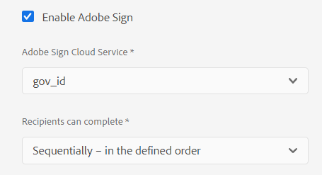

# Usar [!DNL Adobe Sign] em um Formulário adaptável {#using-adobe-sign-in-an-adaptive-form}

[!DNL Adobe Sign] habilita fluxos de trabalho de assinatura eletrônica para o Adaptive Forms. As assinaturas eletrônicas melhoram os fluxos de trabalho para processar documentos para áreas jurídicas, de vendas, de folha de pagamento, de gerenciamento de recursos humanos e muito mais.

Em um [!DNL Adobe Sign] e Adaptive Forms, um usuário preenche um Formulário adaptável para solicitar um serviço que requer assinaturas de uma ou mais pessoas. Por exemplo, um pedido de hipoteca e cartão de crédito requer assinaturas legais de todos os mutuários e corequerentes. Para habilitar workflows de assinatura eletrônica para cenários semelhantes, você pode integrar [!DNL Adobe Sign] com um Formulário adaptável. Alguns outros exemplos são, você pode usar [!DNL Adobe Sign] para:

* Feche negócios de qualquer dispositivo com processos totalmente automatizados de propostas, cotações e contratos.
* Conclua os processos de Recursos humanos com mais rapidez e ofereça aos seus funcionários as experiências digitais.
* Reduza os tempos de ciclo do contrato e integre seus fornecedores mais rapidamente.
* Crie fluxos de trabalho digitais que automatizam processos comuns.

[!DNL Adobe Sign] integração com [!DNL AEM Forms] suporta:

* Workflows de assinatura de um ou vários usuários
* Workflows de assinatura sequencial e simultânea
* Assinatura de formulários como usuário anônimo ou conectado
* Processos dinâmicos de assinatura (integração com [!DNL AEM Forms] Workflow)
* Autenticação por meio de uma base de conhecimento, telefone, perfis sociais e ID do governo
* Atribua funções a cada destinatário do contrato. A Adobe Sign para níveis de serviço corporativo e de negócios tem a opção de expandir a [funções para destinatários do contrato](#addsignerstoanadaptiveform).

<!-- * In-form and out-of-form signing experiences -->

## Pré-requisitos {#prerequisites}

Antes de usar [!DNL Adobe Sign] em um Formulário adaptável:

* Assegure que [!DNL AEM Forms] O as a Cloud Service está configurado para usar o Adobe Sign. Para obter detalhes, consulte [Integrar o Adobe Sign com o [!DNL AEM Forms]](adobe-sign-integration-adaptive-forms.md).
* Mantenha a lista de recipients pronta. Você precisa de pelo menos um endereço de email para cada recipient.

## Configurar [!DNL Adobe Sign] para um Formulário adaptável {#configure-adobe-sign-for-an-adaptive-form}

Para configurar [!DNL Adobe Sign] para um Formulário adaptável:

1. [Ativar [!DNL Adobe Sign] para um Formulário adaptável](#enableadobsignforanadaptiveform)
1. [Adicionar [!DNL Adobe Sign] campos para um Formulário adaptável](#addadobesignfieldstoanadaptiveform)
1. [Selecionar [!DNL Adobe Sign] Cloud Service para um formulário adaptável](#select-adobe-sign-cloud-service-and-signing-order)

1. [Adicionar [!DNL Adobe Sign] recipient para um Formulário adaptável](#addsignerstoanadaptiveform)
1. [Selecione a ação enviar para um formulário adaptável](#selectsubmitactionforanadaptiveform)


### Ativar [!DNL Adobe Sign] para um Formulário adaptável  {#enableadobesign}

Você pode ativar [!DNL Adobe Sign] para um Formulário adaptável existente ou criar um [!DNL Adobe Sign] Formulário adaptável ativado. Escolha uma das seguintes opções:

* [Criar um [!DNL Adobe Sign] Formulário adaptável ativado](#create-an-adaptive-form-for-adobe-sign)
* [Ativar [!DNL Adobe Sign] por um formulário adaptável existente](#editafsign).

#### Criar um formulário adaptável do Adobe Sign {#create-an-adaptive-form-for-adobe-sign}

Para criar um Formulário adaptável habilitado para assinatura:

1. Navegue até **[!UICONTROL Adobe Experience Manager]** > **[!UICONTROL Forms]** > **[!UICONTROL Forms e documentos]**.
1. Toque **[!UICONTROL Criar]** e selecione **[!UICONTROL Formulário adaptável]**. Uma lista de modelos é exibida. Selecione um modelo e toque em **[!UICONTROL Próxima]**.
1. No **[!UICONTROL Básico]** guia:

   1. Especifique a **[!UICONTROL Nome]** e **[!UICONTROL Título]** para o Formulário adaptável.

   1. Selecione o [contêiner de configuração](adobe-sign-integration-adaptive-forms.md#configure-adobe-sign-with-aem-forms) criado enquanto [integração [!DNL Adobe Sign] com [!DNL AEM Forms]](adobe-sign-integration-adaptive-forms.md).
   O contêiner de configuração contém o [!DNL Adobe Sign] Cloud Services configurado para o seu ambiente. Esses serviços estão disponíveis para seleção no editor de Formulário adaptável.

1. No **[!UICONTROL Modelo de formulário]** selecione uma das seguintes opções:

   * Se você tiver um modelo de formulário personalizado e exigir um Documento de registro com base no modelo de formulário, selecione a **[!UICONTROL Associar o modelo de formulário como o documento de modelo de registro]** e selecione um modelo de Documento de registro. Quando você usa a opção, os documentos enviados para assinatura exibem apenas os campos que são baseados no modelo de formulário associado. Ele não exibe todos os campos do Formulário adaptável.

   * Se você não tiver um modelo de formulário personalizado, selecione o **[!UICONTROL Gerar documento de registro]** opção. Quando você usa a opção, o documento enviado para assinatura exibe todos os campos do Formulário adaptável.

1. Toque **[!UICONTROL Criar.]** Um Formulário adaptável habilitado para assinatura é criado. Você pode adicionar seu [!DNL Adobe Sign] ao formulário e envie-o para assinatura.

#### Ativar [!DNL Adobe Sign] para um Formulário adaptável {#editafsign}

Para usar [!DNL Adobe Sign] em um Formulário adaptável existente:

1. Navegue até **[!UICONTROL Adobe Experience Manager]** > **[!UICONTROL Forms]** > **[!UICONTROL Forms e documentos]**.
1. Selecione o Formulário adaptável e toque em **[!UICONTROL Propriedades]**.
1. No **[!UICONTROL Básico]** , selecione a [contêiner de configuração](adobe-sign-integration-adaptive-forms.md#configure-adobe-sign-with-aem-forms) criado durante a integração [!DNL Adobe Sign] com [!DNL AEM Forms].
1. No **[!UICONTROL Modo de formulário]** selecione uma das seguintes opções:

   * Se você tiver um modelo de formulário personalizado e exigir um Documento de registro com base no modelo de formulário, selecione a **[!UICONTROL Associar o modelo de formulário como o documento de modelo de registro]** e selecione um modelo de Documento de registro. Quando você usa a opção, os documentos enviados para assinatura exibem apenas os campos que são baseados no modelo de formulário associado. Ele não exibe todos os campos do Formulário adaptável.

   * Se você não tiver um modelo de formulário personalizado, selecione o **[!UICONTROL Gerar documento de registro]** opção. Quando você usa a opção, o documento enviado para assinatura exibe todos os campos do Formulário adaptável.

1. Toque **[!UICONTROL Salvar e fechar]**. O formulário adaptável está ativado para [!DNL Adobe Sign]. Agora, você pode adicionar seu [!DNL Adobe Sign] ao formulário e envie-o para assinatura.

### Adicionar [!DNL Adobe Sign] campos para um Formulário adaptável {#addadobesignfieldstoanadaptiveform}

[!DNL Adobe Sign] O tem vários campos que podem ser colocados em um Formulário adaptável. Esses campos aceitam vários tipos de dados, como assinaturas, iniciais, empresa ou título e ajudam a coletar informações adicionais durante a assinatura, juntamente com as assinaturas. Você pode usar o [!DNL Adobe Sign] Bloquear componente para posicionar [!DNL Adobe Sign] em vários locais em um Formulário adaptável.

Para adicionar campos a um Formulário adaptável e personalizar várias opções relacionadas a esses campos:

1. Arrastar e soltar **[!UICONTROL Bloco do Adobe Sign]** componente do navegador de componentes para o Formulário adaptável. A variável [!DNL Adobe Sign] O componente de Bloqueio tem todos os componentes compatíveis [!DNL Adobe Sign] campos. Por padrão, ele adiciona um **[!UICONTROL Assinatura]** para o Formulário adaptável.

   

   Por padrão, a variável [!DNL Adobe Sign] O bloco não está visível no formulário adaptável publicado. É visível apenas nos documentos de assinatura. É possível alterar a visibilidade de [!DNL Adobe Sign] Bloquear nas propriedades de [!DNL Adobe Sign] Componente de bloco.

   >[!NOTE]
   >
   >  * Usar [!DNL Adobe Sign] o bloco não é obrigatório [!DNL Adobe Sign] em um Formulário adaptável. Se você não usar [!DNL Adobe Sign] bloquear e adicionar campos para os recipients, o campo de assinatura padrão será exibido na parte inferior dos documentos de assinatura.
   >  * Uso [!DNL Adobe Sign] bloquear somente para os Forms adaptáveis que geram automaticamente o Documento de registro. Se estiver usando um XDP personalizado para gerar um Documento de registro ou um modelo de formulário baseado no Formulário adaptável, [!DNL Adobe Sign] bloco não é suportado.


1. Selecione o **[!UICONTROL Bloco do Adobe Sign]** e toque no botão **[!UICONTROL Editar]**  ícone. Ele exibe opções para adicionar campos e a aparência do formato de um campo.

   

   **A.** Selecionar e adicionar [!DNL Adobe Sign] campos. **B.** Expanda a [!DNL Adobe Sign] bloquear para exibição em tela cheia

1. Toque no **[!UICONTROL Adobe Sign]** Campo  ícone. Ele exibe opções para selecionar e adicionar [!DNL Adobe Sign] campos.

   Expanda a **[!UICONTROL Tipo]** para selecionar um [!DNL Adobe Sign] e toque no botão Concluído  ícone para adicionar o campo selecionado a [!DNL Adobe Sign] bloco. A variável **[!UICONTROL Tipo]** O campo suspenso inclui Assinatura, Informações do destinatário e Tipos de campo de dados. [!DNL Adobe Sign] integração com AEM [!DNL Forms] campos de suporte listados no [!UICONTROL Tipo] somente na caixa suspensa. Para obter informações detalhadas sobre [!DNL Adobe Sign] campos, consulte [Documentação do Adobe Sign](https://helpx.adobe.com/sign/help/field-types.html).

   

   É obrigatório fornecer um nome exclusivo para um campo. Você também pode selecionar a opção obrigatório para marcar um campo. Além do **[!UICONTROL Nome]** e **[!UICONTROL Obrigatório]** opção, alguns [!DNL Adobe Sign] tem mais opções. Por exemplo, máscara e várias linhas. Além disso, especifique um nome exclusivo para cada [!DNL Adobe Sign] se os campos residem no mesmo campo ou em campos diferentes [!DNL Adobe Sign] blocos.

   Se você selecionar **[!UICONTROL Assinatura digital]** na lista suspensa, é possível aplicar assinaturas digitais ao Formulário adaptável:

   * Online usando assinaturas em nuvem para assinar com um [ID digital](https://helpx.adobe.com/sign/kb/digital-certificate-providers.html) hospedado por um provedor de serviços de confiança.
   * Localmente, baixando o documento com Adobe Acrobat ou Reader usando um cartão inteligente, token USB ou ID digital baseada em arquivo.

### Ativar [!DNL Adobe Sign] para um Formulário adaptável {#enableadobsignforanadaptiveform}

Pronto para uso, [!DNL Adobe Sign] não está ativado para um Formulário adaptável. Para habilitá-lo:

1. No Navegador de conteúdo, toque em **[!UICONTROL Contêiner de formulário]** e toque no **[!UICONTROL Configurar]**  ícone. Ela abre as propriedades do navegador e exibe as propriedades do contêiner do Formulário adaptável.
1. No navegador de propriedades, expanda a variável **[!UICONTROL Assinatura eletrônica]** e selecione a opção **[!UICONTROL Ativar o Adobe Sign]** opção. Ele permite [!DNL Adobe Sign] para um Formulário adaptável.

### Selecionar [!DNL Adobe Sign] Cloud Service e ordem de assinatura {#select-adobe-sign-cloud-service-and-signing-order}

É possível configurar vários [!DNL Adobe Sign] serviços para uma instância de AEM [!DNL Forms]. É aconselhável ter um conjunto separado de serviços para cada função (Recursos Humanos, Finanças e muito mais). Isso facilita o rastreamento e os relatórios de documentos assinados. Por exemplo, um banco tem vários departamentos. Você pode ter uma configuração separada para cada departamento para um melhor rastreamento dos documentos.

Um documento também pode ter vários recipients. Por exemplo, uma solicitação de cartão de crédito pode ter vários candidatos. Um banco requer assinaturas de todos os candidatos antes de iniciar o processamento da solicitação. Para cenários com vários destinatários, você pode optar por assinar o documento em ordem sequencial ou simultânea.

Para selecionar um Cloud Service e a ordem da assinatura:



1. No Navegador de conteúdo, toque em **[!UICONTROL Contêiner de formulário]** e toque no **[!UICONTROL Configurar]**  ícone. Ela abre as propriedades do navegador e exibe as propriedades do contêiner do Formulário adaptável.
1. No navegador de propriedades, expanda a variável **[!UICONTROL Assinatura eletrônica]** e selecione a opção **[!UICONTROL Ativar o Adobe Sign]** opção. Ele permite [!DNL Adobe Sign] para um Formulário adaptável.
1. Selecione um Cloud Service na lista já configurada de [!DNL Adobe Sign] Cloud Services.

   Se a variável **[!UICONTROL Adobe Sign Cloud Service]** estiver vazia, siga as instruções [Configurar [!DNL Adobe Sign] com [!DNL AEM Forms]](adobe-sign-integration-adaptive-forms.md) artigo para configurar o serviço.

   A lista suspensa lista os Cloud Services que existem na variável `global` pasta em Ferramentas > **[!UICONTROL Cloud Services]** > **[!UICONTROL Adobe Sign]**. Além disso, a lista suspensa também lista os Cloud Services que existem na pasta selecionada no **[!UICONTROL Contêiner de configuração]** ao criar um Formulário adaptável.

1. Selecione a ordem de assinatura na **[!UICONTROL Os recipients podem preencher]** caixa de diálogo. Os recipients podem assinar um Formulário adaptável **[!UICONTROL Sequencialmente]** - um após o outro destinatário, ou **[!UICONTROL Simultaneamente]** - em qualquer ordem.

   Em ordem sequencial, um recipient recebe o contrato do Adobe Sign de cada vez. Depois que o recipient concluir a ação atribuída, o contrato será enviado para o próximo recipient e assim por diante.

   Em ordem simultânea, todos os recipients recebem o contrato do Adobe Sign e podem agir em paralelo.

1. Use o Campo ID do contrato para associar um vínculo à ID do contrato (agreementId). Ele adiciona a ID do contrato à seção afBoundData de envio de dados para formulários baseados em esquema. A ID do contrato também é adicionada à seção afSubmissionInfo nos dados enviados para todos os formulários habilitados para Adobe Sign. Você pode usar a ID do contrato para rastrear o status do contrato usando o código personalizado (requer implementação personalizada).

1. [Adicionar recipients a um formulário adaptável](working-with-adobe-sign.md#addsignerstoanadaptiveform) e toque no botão Concluído  ícone para salvar as alterações.

### Adicionar recipients a um formulário adaptável {#addsignerstoanadaptiveform}

Você pode ter um ou vários destinatários para um contrato do Adobe Sign. Ao adicionar um recipient, você também pode configurar os detalhes de autenticação do recipient e selecionar se o preenchimento do formulário e o recipient são a mesma pessoa. Execute as seguintes etapas para adicionar e fornecer vários detalhes sobre um recipient:

1. No Navegador de conteúdo, toque em **[!UICONTROL Contêiner de formulário]** e toque no **[!UICONTROL Configurar]**  ícone. Ela abre o navegador de propriedades com as propriedades do contêiner do Formulário adaptável.
1. No navegador de propriedades, expanda a variável **[!UICONTROL Assinatura eletrônica]** e selecione a opção **[!UICONTROL Ativar o Adobe Sign]** opção. Ele permite [!DNL Adobe Sign] para um Formulário adaptável.
1. Toque **[!UICONTROL Adicionar destinatário]**. Ele adiciona um recipient ao Formulário adaptável. É possível adicionar vários destinatários a um Formulário adaptável. Todos os recipients recebem um contrato do Adobe Sign para o envio do formulário adaptável.
   

1. Clique em **[!UICONTROL Editar]**  para especificar as seguintes informações sobre o recipient:

   * **[!UICONTROL Título]:** Especifique um título para identificar exclusivamente um recipient.

   * **[!UICONTROL O recipient e quem preenche o formulário são a mesma pessoa?]:** Selecionar **[!UICONTROL Sim]**, se o preenchimento do formulário e o primeiro recipient forem a mesma pessoa. <!-- If the option is set to **No,** then do not use the signature step component in the Adaptive Form. If the form contains a Signature Step component, then the field is automatically set to Yes. -->

   * **[!UICONTROL Função do destinatário]:** Selecione a função de um recipient. A Adobe Sign para níveis de serviço corporativo e de negócios tem a opção de expandir a [funções para destinatários do contrato](https://helpx.adobe.com/sign/using/set-up-signer-approver-roles.html), além de apenas **Signatário**, para melhor atender aos requisitos de fluxo de trabalho.

   * **[!UICONTROL Endereço de email do destinatário]:** Especificar o endereço de email do destinatário. O recipient recebe o contrato do Adobe Sign no endereço de email especificado. Você pode optar por usar um endereço de email fornecido em um campo de formulário, no perfil de usuário Experience Manager do usuário conectado ou inserir manualmente um endereço de email. É uma etapa obrigatória.

      >[!NOTE]
      >
      >Certifique-se de que o endereço de email do primeiro ou do único recipient (se houver um único recipient) não seja idêntico a [!DNL Adobe Sign] conta usada para configurar o AEM Cloud Services.

   * **[!UICONTROL Método de autenticação do recipient]:** Especifique o método para autenticar um recipient antes de abrir o contrato do Adobe Sign. Você pode escolher entre telefone, base de conhecimento, autenticação com base na identidade social e [ID do governo](https://helpx.adobe.com/sign/using/adobesign-authentication-government-id.html) para [!DNL Adobe Acrobat Sign].

      <!-- 
      For [!DNL Adobe Acrobat Sign for Government] you can choose between phone and knowledge-based authentication.
      -->
   >[!NOTE]
   >
   >    * Por padrão, a autenticação com base na identidade social fornece uma opção para autenticar usando o Facebook, o Google e o LinkedIn. Você pode entrar em contato [!DNL Adobe Sign] suporte para habilitar outros provedores de autenticação social.


   * **[!DNL Adobe Sign]campos a serem preenchidos ou assinados:** Selecionar [!DNL Adobe Sign] para o recipient. Um Formulário adaptável pode ter vários [!DNL Adobe Sign] campos. Você pode optar por ativar campos específicos para um recipient. O campo exibe todas as [!DNL Adobe Sign] Blocos. Ao selecionar um bloco, todos os campos do bloco são selecionados. Você pode usar o ícone X para desmarcar um campo.

   

   A imagem acima tem dois exemplos [!DNL Adobe Sign] Blocos: Personal-Information e Office-details

   Toque no  ícone. O recipient é adicionado.

### Selecione a ação enviar para um formulário adaptável {#selectsubmitactionforanadaptiveform}

Depois de você, adicione [!DNL Adobe Sign] para um Formulário adaptável, ativar [!DNL Adobe Sign] em contêiner de formulário, selecione [!DNL Adobe Sign] Cloud Service e adicionar recipients do contrato Adobe Sign, selecione uma Ação enviar apropriada para o Formulário adaptável. Para obter informações detalhadas sobre as Ações de envio do Adaptive Forms, consulte [Configurar a ação enviar](configuring-submit-actions.md).

A assinatura e o envio de um formulário são independentes uns dos outros. O envio do Formulário adaptável ocorre assim que um contrato do Adobe Sign é criado depois que um usuário envia um formulário. [!DNL AEM Forms] A as a Cloud Service não espera que os recipients assinem ou concluam outras ações para enviar um Formulário adaptável. Um formulário é enviado assim que um usuário clica no botão Enviar ou uma etapa Resumo exibe o resumo do formulário.

Além disso, um [!DNL Adobe Sign] O Formulário adaptável habilitado incorpora a ID do contrato do Adobe Sign para enviar dados. Você pode usar a ID do contrato para rastrear o status do contrato usando o código personalizado (requer implementação personalizada).

A ID do Contrato do Adobe Sign (agreementId) está incluída nos dados de envio do Formulário adaptável. Por padrão, a ID do Contrato está presente no `afSubmissionInfo` nó de dados enviados.

```xml
   <?xml version="1.0" encoding="UTF-8"?>
   <afData>
      <afUnboundData>
         <data>
            <textbox1613455050902>ff</textbox1613455050902>
         </data>
      </afUnboundData>
      <afBoundData>
         <data xmlns:xfa="http://www.xfa.org/schema/xfa-data/1.0/" />
      </afBoundData>
      <afSubmissionInfo>
         <lastFocusItem>guide[0].guide1[0].guideRootPanel[0].textbox1613455050902[0]</lastFocusItem>
         <stateOverrides />
         <signers>
            <signer0>
               <email />
            </signer0>
         </signers>
         <afPath>/content/dam/formsanddocuments/testsign</afPath>
         <afSubmissionTime>20210311031009</afSubmissionTime>
         <agreementId>xxxxxxxxxxxxxxxxxxxxxxxxxxxxxxxxxxxxxxxxxxxxx</agreementId>
      </afSubmissionInfo>
   </afData>
```

Como opção, também é possível associar um vínculo à ID do Contrato (agreementId). Ele adiciona a ID do contrato à seção afBoundData dos dados enviados. Por exemplo, nos dados enviados a seguir, a ID do Contrato está vinculada a `<userName>` nó:

```xml
      <?xml version="1.0" encoding="UTF-8"?>
      <afData>
         <afUnboundData>
            <data />
         </afUnboundData>
         <afBoundData>
            <config xmlns:xfa="http://www.xfa.org/schema/xfa-data/1.0/" xmlns:xsi="http://www.w3.org/2001/XMLSchema-instance">
               <userName>3AAABLblqZhC2MWu7GFauKh45j_t2ih8mAtmbdIcNSl1HgQubhMJfDaDfylyN7NQiYRam_44ISKm45enIOafHqWZrdaxShf9r</userName>
               <dateOfBirth>0001-01-01</dateOfBirth>
            </config>
         </afBoundData>
         <afSubmissionInfo>
            <lastFocusItem>guide[0].guide1[0].guideRootPanel[0].projectDetails[0]</lastFocusItem>
            <stateOverrides />
            <signers>
               <signer0>
                  <email />
               </signer0>
            </signers>
            <afPath>/content/dam/formsanddocuments/testathon2021-1/gaurav/xsd-based</afPath>
            <afSubmissionTime>20210311095211</afSubmissionTime>
            <agreementId>xxxxxxxxxxxxxxxxxxxxxxxxxxxxxxxxxxxxxxxxxxxx</agreementId>
         </afSubmissionInfo>
      </afData>
```

<!-- Remove when forms portal goes live
>[!NOTE]
>
>Data of the Adaptive Form is stored temporarily on Forms Portal. It is recommended to use [custom storage for Forms Portal](/help/forms/using/configuring-draft-submission-storage.md). It ensures that the PII (personally identifiable information) data is not stored on AEM servers. 
-->

Sua experiência de assinatura de formulário está pronta. Você pode visualizar o formulário para verificar a experiência de assinatura. No formulário publicado, [!DNL Adobe Sign] Os campos de bloco são exibidos quando um recipient recebe o formulário para assinar por meio de um email. Quando a variável **[!UICONTROL Quando o recipient e a pessoa que preenche o formulário são a mesma pessoa?]** estiver marcada como sim e a condição for atendida, o usuário será redirecionado para o contrato do Adobe Sign após os envios e poderá Assinar o documento imediatamente, em vez de aguardar que o contrato seja exibido no email.

## Configurar assinaturas em nuvem para um formulário adaptável {#configure-cloud-signatures-for-an-adaptive-form}

As assinaturas digitais ou remotas baseadas em nuvem são uma nova geração de assinaturas digitais que funcionam no desktop, nos dispositivos móveis e na Web — e atendem aos mais altos níveis de conformidade e garantia para a autenticação de destinatários. Você pode assinar um Formulário adaptável com assinaturas digitais baseadas em nuvem.

Depois [edição de propriedades do Formulário adaptável para o Adobe Sign](working-with-adobe-sign.md#enableadobesign), execute as seguintes etapas para adicionar o campo de assinatura em nuvem a um Formulário adaptável:

1. Arrastar e soltar **[!UICONTROL Bloco do Adobe Sign]** componente do navegador de componentes para o Formulário adaptável. A variável [!UICONTROL Bloco do Adobe Sign] tem todos os componentes compatíveis [!DNL Adobe Sign] campos. Por padrão, ele adiciona um **[!UICONTROL Assinatura]** para o Formulário adaptável.

   

1. Selecione o **[!UICONTROL Bloco do Adobe Sign]** e toque no botão **[!UICONTROL Editar]**  ícone. Ele exibe opções para adicionar campos e a aparência do formato de um campo.

   

   **A.** Selecionar e adicionar [!DNL Adobe Sign] campos. **B.** Expanda a [!DNL Adobe Sign] bloquear para exibição em tela cheia

1. Toque no **[!UICONTROL Campo do Adobe Sign]**  ícone. Ele exibe opções para selecionar e adicionar [!DNL Adobe Sign] campos.

   Expanda a **[!UICONTROL Tipo]** selecione o campo suspenso **[!UICONTROL Assinatura digital]** e toque na guia **[!UICONTROL Concluído]** ícone para adicionar o campo selecionado a [!DNL Adobe Sign] bloco.

   

   É obrigatório fornecer um nome exclusivo para um campo.

   Aplicar assinaturas digitais ao Formulário adaptável usando:

   * Assinaturas na nuvem: assine com um [ID digital](https://helpx.adobe.com/sign/kb/digital-certificate-providers.html) hospedado por um provedor de serviços de confiança.
   * Adobe Acrobat ou Reader: baixe e abra o documento com o Adobe Acrobat ou Reader para assinar usando um cartão inteligente, token USB ou ID digital baseada em arquivo.

      <!-- 
      >[!NOTE]
      >
      > * [!DNL Adobe Acrobat Sign for Government] can use Digitial Signature but can not use Cloud Signatures in the current version.
      -->
   Depois de adicionar o campo de assinatura em nuvem ao Formulário adaptável, execute as seguintes etapas para concluir o processo de configuração:

   * [Ativar o Adobe Sign para um formulário adaptável](#enableadobsignforanadaptiveform)
   * [Selecione Adobe Sign Cloud Service para um formulário adaptável](#selectadobesigncloudserviceforanadaptiveform)
   * [Adicionar recipients a um formulário adaptável](#addsignerstoanadaptiveform)
   * [Selecione a ação enviar para um formulário adaptável](#selectsubmitactionforanadaptiveform)


### Configurar a página de agradecimento ou o componente da etapa de resumo {#configure-the-thank-you-page-or-summary-step-component}

A variável **[!UICONTROL Etapa de resumo]** O componente envia automaticamente o formulário, preenche as informações dentro da página Resumo personalizado e exibe o resumo do formulário enviado. O componente Etapa de resumo ocupa toda a largura disponível para o formulário. É recomendável não ter nenhum outro componente na seção que contém o componente Etapa de resumo.

## Perguntas frequentes {#frequently-asked-questions}

**P:** É possível incorporar um Formulário adaptável em outro Formulário adaptável. O formulário adaptável incorporado pode ser [!DNL Adobe Sign] habilitado?
**Ans:** Não, o Experience Manager Forms não é compatível com o uso de um Formulário adaptável que incorpora um [!DNL Adobe Sign] Formulário adaptável ativado para assinatura

**P:** Quando eu criar um formulário adaptável usando o modelo avançado e abri-lo para edição, uma mensagem de erro &quot;A assinatura eletrônica ou os destinatários não estão configurados corretamente&quot;. é exibida. Como resolver a mensagem de erro?
**Ans:** O formulário adaptável criado usando o modelo avançado está configurado para usar [!DNL Adobe Sign]. Para resolver o erro, crie e selecione um [!DNL Adobe Sign] configuração da nuvem e configurar um [!DNL Adobe Sign] para o Formulário adaptável.

**P:** Posso usar [!DNL Adobe Sign] tags de texto em um componente de texto estático de um Formulário adaptável?
**Ans:** Sim, você pode usar tags de texto em um componente de texto para adicionar [!DNL Adobe Sign] para um Documento de registro (somente a opção Documento de registro gerado automaticamente) ativado Formulário adaptável. Para saber mais sobre o procedimento e as regras para criar uma tag de texto, consulte [Documentação do Adobe Sign](https://helpx.adobe.com/sign/using/text-tag.html). Observe também que o Adaptive Forms tem um suporte limitado para tags de texto. Você pode usar as tags de texto para criar apenas os campos que [Bloco do Adobe Sign](working-with-adobe-sign.md#configure-cloud-signatures-for-an-adaptive-form) suporta.

## Solução de problemas {#troubleshoot}

### [!DNL Adobe Sign] falhas do contrato {#adobe-sign-agreement-failures}

**Problema**
Quando [!DNL Adobe Sign] for configurado para um Formulário adaptável, o serviço não criará um [!DNL Adobe Sign] acordo para o formulário adaptável subjacente.

**Resolução**

* Verifique a [configuração do Adobe Sign Cloud Service](adobe-sign-integration-adaptive-forms.md) usado no Formulário adaptável.
* Verifique se o aplicativo da API está ativado [!DNL Adobe Sign] servidor usado para configurar [!DNL Adobe Sign] O Cloud Service tem as permissões necessárias.
* Se você estiver usando vários [!DNL Adobe Sign] Cloud Services, aponte o **[!UICONTROL URL do OAuth]** de todos os serviços para a mesma **[!UICONTROL Fragmento do Adobe Sign]**.

* Use endereços de email separados para configurar [!DNL Adobe Sign] conta e para o primeiro ou único destinatário. O endereço de email do primeiro recipient ou do único recipient (se houver um único recipient) não pode ser idêntico a [!DNL Adobe Sign] conta usada para configurar o AEM Cloud Services.

## Artigos relacionados {#related-articles}

* [Integrar [!DNL Adobe Sign] com [!DNL AEM Forms]](adobe-sign-integration-adaptive-forms.md)
* [Práticas recomendadas para usar o [!DNL Adobe Sign] com Forms adaptável](https://medium.com/adobetech/using-adobe-sign-to-e-sign-an-adaptive-form-heres-the-best-way-to-do-it-dc3e15f9b684)
