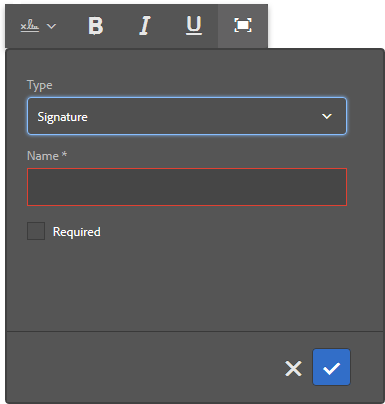

# Usar [!DNL Adobe Sign] em um formulário adaptável {#using-adobe-sign-in-an-adaptive-form}

>[!NOTE]
>
> A Adobe recomenda usar os [Componentes principais](https://experienceleague.adobe.com/docs/experience-manager-core-components/using/adaptive-forms/introduction.html?lang=pt-BR) de captura de dados moderna e extensível para [criar um novo Forms Adaptável](/help/forms/creating-adaptive-form-core-components.md) ou [adicionar o Forms Adaptável às páginas do AEM Sites](/help/forms/create-or-add-an-adaptive-form-to-aem-sites-page.md). Esses componentes representam um avanço significativo na criação do Forms adaptável, garantindo experiências de usuário impressionantes. Este artigo descreve a abordagem mais antiga para criar o Forms adaptável usando componentes de base.


| Versão | Link do artigo |
| -------- | ---------------------------- |
| AEM 6.5 | [Clique aqui](https://experienceleague.adobe.com/docs/experience-manager-65/forms/adaptive-forms-advanced-authoring/working-with-adobe-sign.html?lang=pt-BR) |
| AEM as a Cloud Service | Este artigo |


[!DNL Adobe Sign] habilita fluxos de trabalho de assinatura eletrônica para o Adaptive Forms. As assinaturas eletrônicas melhoram os fluxos de trabalho para processar documentos para áreas jurídicas, de vendas, de folha de pagamento, de gerenciamento de recursos humanos e muito mais.

Em um cenário típico do [!DNL Adobe Sign] e do Adaptive Forms, um usuário preenche um Formulário adaptável para solicitar um serviço que requer assinaturas de um ou mais participantes. Por exemplo, um pedido de hipoteca e cartão de crédito requer assinaturas legais de todos os mutuários e corequerentes. Para habilitar fluxos de trabalho de assinatura eletrônica para cenários semelhantes, você pode integrar o [!DNL Adobe Sign] a um Formulário adaptável. Alguns outros exemplos são, você pode usar [!DNL Adobe Sign] para:

* Feche negócios de qualquer dispositivo com processos totalmente automatizados de propostas, cotações e contratos.
* Conclua os processos de Recursos humanos com mais rapidez e ofereça aos seus funcionários as experiências digitais.
* Reduza os tempos de ciclo do contrato e integre seus fornecedores mais rapidamente.
* Crie fluxos de trabalho digitais que automatizam processos comuns.

A integração do [!DNL Adobe Sign] com o [!DNL AEM Forms] oferece suporte para:

* Workflows de assinatura de um ou vários usuários
* Workflows de assinatura sequencial e simultânea
* Assinatura de formulários como usuário anônimo ou conectado
* Processos de assinatura dinâmicos (integração com o Fluxo de Trabalho [!DNL AEM Forms])
* Autenticação por meio de uma base de conhecimento, telefone, perfis sociais e ID do governo
* Atribua funções a cada destinatário do contrato. O Adobe Sign para níveis de serviço corporativo e comercial tem a opção de expandir as [funções para destinatários do contrato](#addsignerstoanadaptiveform).

<!-- * In-form and out-of-form signing experiences -->

## Pré-requisitos {#prerequisites}

Antes de usar [!DNL Adobe Sign] em um Formulário adaptável:

* Verifique se o as a Cloud Service [!DNL AEM Forms] está configurado para usar o Adobe Sign. Para obter detalhes, consulte [Integrar o Adobe Sign com [!DNL AEM Forms]](adobe-sign-integration-adaptive-forms.md).
* Mantenha a lista de recipients pronta. Você precisa de pelo menos um endereço de email para cada recipient.

## Configurar [!DNL Adobe Sign] para um Formulário adaptável {#configure-adobe-sign-for-an-adaptive-form}

Para configurar o [!DNL Adobe Sign] para um Formulário adaptável:

1. [Habilitar [!DNL Adobe Sign] para um Formulário adaptável](#enableadobsignforanadaptiveform)
1. [Adicionar  [!DNL Adobe Sign] campos a um Formulário adaptável](#addadobesignfieldstoanadaptiveform)
1. [Selecionar [!DNL Adobe Sign] Cloud Service para um Formulário adaptável](#select-adobe-sign-cloud-service-and-signing-order)

1. [Adicionar  [!DNL Adobe Sign] recipient a um Formulário adaptável](#addsignerstoanadaptiveform)
1. [Selecione a ação enviar para um formulário adaptável](#selectsubmitactionforanadaptiveform)


### Habilitar [!DNL Adobe Sign] para um Formulário adaptável  {#enableadobesign}

Você pode habilitar [!DNL Adobe Sign] para um Formulário adaptável existente ou criar um Formulário adaptável habilitado para [!DNL Adobe Sign]. Escolha uma das seguintes opções:

* [Criar um Formulário adaptável  [!DNL Adobe Sign] habilitado](#create-an-adaptive-form-for-adobe-sign)
* [Habilitar [!DNL Adobe Sign] para um Formulário Adaptável existente](#editafsign).

#### Criar um formulário adaptável para o Adobe Sign {#create-an-adaptive-form-for-adobe-sign}

Para criar um Formulário adaptável habilitado para assinatura:

1. Navegue até **[!UICONTROL Adobe Experience Manager]** > **[!UICONTROL Forms]** > **[!UICONTROL Forms e Documentos]**.
1. Selecione **[!UICONTROL Criar]** e selecione **[!UICONTROL Formulário adaptável]**. Uma lista de modelos é exibida. Selecione um modelo e selecione **[!UICONTROL Próximo]**.
1. Na guia **[!UICONTROL Básico]**:

   1. Especifique o **[!UICONTROL Nome]** e o **[!UICONTROL Título]** para o Formulário adaptável.

   1. Selecione o [contêiner de configuração](adobe-sign-integration-adaptive-forms.md#configure-adobe-sign-with-aem-forms) criado durante a [integração [!DNL Adobe Sign] com [!DNL AEM Forms]](adobe-sign-integration-adaptive-forms.md).

   O contêiner de configuração contém os Serviços de Nuvem do [!DNL Adobe Sign] configurados para o seu ambiente. Esses serviços estão disponíveis para seleção no Criador de formulários adaptáveis.

1. Na guia **[!UICONTROL Modelo de Formulário]**, selecione uma das seguintes opções:

   * Se você tiver um modelo de formulário personalizado e precisar de um Documento de registro com base no modelo de formulário, selecione a opção **[!UICONTROL Associar modelo de formulário como Documento de modelo de Registro]** e selecione um Documento de modelo de Registro. Quando você usa a opção, os documentos enviados para assinatura exibem apenas os campos que são baseados no modelo de formulário associado. Ele não exibe todos os campos do Formulário adaptável.

   * Se você não tiver um modelo de formulário personalizado, selecione a opção **[!UICONTROL Gerar documento de registro]**. Quando você usa a opção, o documento enviado para assinatura exibe todos os campos do Formulário adaptável.

1. Selecione **[!UICONTROL Criar]**. Um Formulário adaptável habilitado para assinatura é criado. Você pode adicionar os campos do [!DNL Adobe Sign] ao formulário e enviá-lo para assinatura.

#### Habilitar [!DNL Adobe Sign] para um Formulário adaptável {#editafsign}

Para usar [!DNL Adobe Sign] em um Formulário adaptável existente:

1. Navegue até **[!UICONTROL Adobe Experience Manager]** > **[!UICONTROL Forms]** > **[!UICONTROL Forms e Documentos]**.
1. Selecione o Formulário adaptável e selecione **[!UICONTROL Propriedades]**.
1. Na guia **[!UICONTROL Básico]**, selecione o [contêiner de configuração](adobe-sign-integration-adaptive-forms.md#configure-adobe-sign-with-aem-forms) criado ao integrar [!DNL Adobe Sign] a [!DNL AEM Forms].
1. Na guia **[!UICONTROL Modo de Formulário]**, selecione uma das seguintes opções:

   * Se você tiver um modelo de formulário personalizado e precisar de um Documento de registro com base no modelo de formulário, selecione a opção **[!UICONTROL Associar modelo de formulário como Documento de modelo de Registro]** e selecione um Documento de modelo de Registro. Quando você usa a opção, os documentos enviados para assinatura exibem apenas os campos que são baseados no modelo de formulário associado. Ele não exibe todos os campos do Formulário adaptável.

   * Se você não tiver um modelo de formulário personalizado, selecione a opção **[!UICONTROL Gerar documento de registro]**. Quando você usa a opção, o documento enviado para assinatura exibe todos os campos do Formulário adaptável.

1. Selecione **[!UICONTROL Salvar e fechar]**. O Formulário adaptável está habilitado para [!DNL Adobe Sign]. Agora, você pode adicionar os campos do [!DNL Adobe Sign] ao formulário e enviá-lo para assinatura.

### Adicionar campos [!DNL Adobe Sign] a um Formulário adaptável {#addadobesignfieldstoanadaptiveform}

[!DNL Adobe Sign] tem vários campos que podem ser colocados em um Formulário adaptável. Esses campos aceitam vários tipos de dados, como assinaturas, iniciais, empresa ou título e ajudam a coletar informações adicionais durante a assinatura, juntamente com as assinaturas. Você pode usar o componente de Bloqueio [!DNL Adobe Sign] para colocar campos [!DNL Adobe Sign] em vários locais em um Formulário adaptável.

Para adicionar campos a um Formulário adaptável e personalizar várias opções relacionadas a esses campos:

1. Arraste e solte o componente **[!UICONTROL Bloco do Adobe Sign]** do navegador de componentes para o Formulário adaptável. O componente de Bloqueio [!DNL Adobe Sign] tem todos os campos [!DNL Adobe Sign] com suporte. Por padrão, adiciona um campo **[!UICONTROL Assinatura]** ao Formulário adaptável.

   

   Por padrão, o Bloco [!DNL Adobe Sign] não está visível no Formulário adaptável publicado. É visível apenas nos documentos de assinatura. Você pode alterar a visibilidade do Bloco [!DNL Adobe Sign] das propriedades do componente de Bloco [!DNL Adobe Sign].

   >[!NOTE]
   >
   > * O uso do bloco [!DNL Adobe Sign] não é obrigatório para usar [!DNL Adobe Sign] em um Formulário adaptável. Se você não usar o bloco [!DNL Adobe Sign] e adicionar campos para os destinatários, o campo de assinatura padrão será exibido na parte inferior dos documentos de assinatura.
   > * Use o bloco [!DNL Adobe Sign] somente para o Forms adaptável que gera automaticamente o Documento de registro. Se você estiver usando um XDP personalizado para gerar um Documento de registro ou um modelo de formulário baseado no Formulário adaptável, o bloco [!DNL Adobe Sign] não será suportado.


1. Selecione o componente **[!UICONTROL Bloco do Adobe Sign]** e selecione o ícone **[!UICONTROL Editar]** . Ele exibe opções para adicionar campos e a aparência do formato de um campo.

   

   **A.** Selecione e adicione [!DNL Adobe Sign] campos. **B.** Expanda o bloco [!DNL Adobe Sign] para exibição em tela inteira

1. Selecione o ícone **[!UICONTROL Adobe Sign]** Campo . Ele exibe opções para selecionar e adicionar [!DNL Adobe Sign] campos.

   Expanda o campo suspenso **[!UICONTROL Tipo]** para selecionar um campo [!DNL Adobe Sign] e selecione o ícone Concluído  para adicionar o campo selecionado ao bloco [!DNL Adobe Sign]. O campo suspenso **[!UICONTROL Tipo]** inclui os tipos de campo Assinatura, Informações do destinatário e Dados. A integração [!DNL Adobe Sign] com o AEM [!DNL Forms] oferece suporte aos campos listados somente na caixa suspensa [!UICONTROL Tipo]. Para obter informações detalhadas sobre [!DNL Adobe Sign] campos, consulte [documentação do Adobe Sign](https://helpx.adobe.com/br/sign/help/field-types.html).

   

   É obrigatório fornecer um nome exclusivo para um campo. Você também pode selecionar a opção obrigatório para marcar um campo. Além das opções **[!UICONTROL Nome]** e **[!UICONTROL Obrigatório]**, alguns campos [!DNL Adobe Sign] têm mais opções. Por exemplo, máscara e várias linhas. Além disso, especifique um nome exclusivo para cada campo [!DNL Adobe Sign], independentemente de os campos residirem em blocos [!DNL Adobe Sign] iguais ou diferentes.

   Se você selecionar **[!UICONTROL Assinatura digital]** na lista suspensa, poderá aplicar assinaturas digitais ao Formulário adaptável:

   * Online usando assinaturas em nuvem para assinar com uma [ID digital](https://helpx.adobe.com/br/sign/kb/digital-certificate-providers.html) hospedada por um provedor de serviços de confiança.
   * Localmente, baixando o documento com o Adobe Acrobat ou o Reader usando um cartão inteligente, token USB ou ID digital baseada em arquivo.

### Habilitar [!DNL Adobe Sign] para um Formulário adaptável {#enableadobsignforanadaptiveform}

Pronto para uso, o [!DNL Adobe Sign] não está habilitado para um Formulário adaptável. Para habilitá-lo:

1. No Navegador de conteúdo, selecione **[!UICONTROL Contêiner de formulário]** e selecione o ícone **[!UICONTROL Configurar]** . Ela abre as propriedades do navegador e exibe as propriedades do contêiner do Formulário adaptável.
1. No navegador de propriedades, expanda a opção **[!UICONTROL Assinatura eletrônica]** e selecione a opção **[!UICONTROL Habilitar Adobe Sign]**. Habilita [!DNL Adobe Sign] para um Formulário adaptável.

### Selecionar o Cloud Service [!DNL Adobe Sign] e a ordem de assinatura {#select-adobe-sign-cloud-service-and-signing-order}

Você pode configurar vários serviços do [!DNL Adobe Sign] para uma instância do AEM [!DNL Forms]. É aconselhável ter um conjunto separado de serviços para cada função (Recursos Humanos, Finanças e muito mais). Isso facilita o rastreamento e os relatórios de documentos assinados. Por exemplo, um banco tem vários departamentos. Você pode ter uma configuração separada para cada departamento para um melhor rastreamento dos documentos.

Um documento também pode ter vários recipients. Por exemplo, uma solicitação de cartão de crédito pode ter vários candidatos. Um banco requer assinaturas de todos os candidatos antes de iniciar o processamento da solicitação. Para cenários com vários destinatários, você pode optar por assinar o documento em ordem sequencial ou simultânea.

Para selecionar uma Cloud Service e a ordem da assinatura:


1. No Navegador de conteúdo, selecione **[!UICONTROL Contêiner de formulário]** e selecione o ícone **[!UICONTROL Configurar]** . Ela abre as propriedades do navegador e exibe as propriedades do contêiner do Formulário adaptável.
1. No navegador de propriedades, expanda a opção **[!UICONTROL Assinatura eletrônica]** e selecione a opção **[!UICONTROL Habilitar Adobe Sign]**. Habilita [!DNL Adobe Sign] para um Formulário adaptável.
1. Selecione um Cloud Service na lista já configurada do [!DNL Adobe Sign] Cloud Services.

   Se a lista **[!UICONTROL Adobe Sign Cloud Service]** estiver vazia, siga o artigo [Configurar [!DNL Adobe Sign] com [!DNL AEM Forms]](adobe-sign-integration-adaptive-forms.md) para configurar o serviço.

   O menu suspenso lista os Serviços em Nuvem existentes na pasta `global` em Ferramentas > **[!UICONTROL Serviços em Nuvem]** > **[!UICONTROL Adobe Sign]**. Além disso, a lista suspensa também lista os Serviços em nuvem que existem na pasta selecionada no campo **[!UICONTROL Contêiner de configuração]** ao criar um formulário adaptável.

1. Selecione a opção para configurar a ação de envio usando **[!UICONTROL Enviar o formulário]**. Você pode selecionar uma das duas opções a seguir:
   * **Enviar o formulário (e enviar o contrato para assinatura)**: essa opção envia o formulário imediatamente e, em seguida, envia o formulário para assinatura aos destinatários.
   * **Enviar o formulário (depois que cada destinatário conclui a cerimônia de assinatura)**: essa opção envia o Adaptive Forms somente após todos os signatários concluírem o processo de assinatura. Você pode configurar o intervalo para verificar o status de assinatura de todos os signatários. Para obter detalhes, consulte [Configurar [!DNL Adobe Acrobat Sign] scheduler](/help/forms/adobe-sign-integration-adaptive-forms.md#configure-dnl-adobe-acrobat-sign-scheduler-to-sync-the-signing-status).

1. Selecione a ordem de assinatura na caixa de diálogo **[!UICONTROL Os destinatários podem concluir]**. Os destinatários podem assinar um Formulário Adaptável **[!UICONTROL Sequencialmente]** - um após outro destinatário ou **[!UICONTROL Simultaneamente]** - em qualquer ordem.

   Em ordem sequencial, um destinatário recebe o contrato do Adobe Sign de cada vez. Depois que o recipient concluir a ação atribuída, o contrato será enviado para o próximo recipient e assim por diante.

   Em ordem simultânea, todos os recipients recebem o contrato do Adobe Sign e podem agir em paralelo entre si.

1. Use o Campo ID do contrato para associar um vínculo à ID do contrato (agreementId). Ele adiciona a ID do contrato à seção afBoundData de envio de dados para formulários baseados em esquema. A ID do contrato também é adicionada à seção afSubmissionInfo nos dados enviados para todos os formulários habilitados para o Adobe Sign. Você pode usar a ID do contrato para rastrear o status do contrato usando o código personalizado (requer implementação personalizada).

   >[!NOTE]
   >
   > Se um Formulário adaptável for criado usando um Modelo de dados de formulário (FDM), o campo ID do contrato ficará visível na caixa de diálogo.

1. [Adicione destinatários a um Formulário adaptável](working-with-adobe-sign.md#addsignerstoanadaptiveform) e selecione o ícone Concluído  para salvar as alterações.

### Adicionar recipients a um formulário adaptável {#addsignerstoanadaptiveform}

Você pode ter um ou vários destinatários para um contrato do Adobe Sign. Ao adicionar um recipient, você também pode configurar os detalhes de autenticação do recipient e selecionar se o preenchimento do formulário e o recipient são a mesma pessoa. Execute as seguintes etapas para adicionar e fornecer vários detalhes sobre um recipient:

1. No Navegador de conteúdo, selecione **[!UICONTROL Contêiner de formulário]** e selecione o ícone **[!UICONTROL Configurar]** . Ela abre o navegador de propriedades com as propriedades do contêiner do Formulário adaptável.
1. No navegador de propriedades, expanda a opção **[!UICONTROL Assinatura eletrônica]** e selecione a opção **[!UICONTROL Habilitar Adobe Sign]**. Habilita [!DNL Adobe Sign] para um Formulário adaptável.
1. Selecione **[!UICONTROL Adicionar destinatário]**. Ele adiciona um recipient ao Formulário adaptável. É possível adicionar vários destinatários a um Formulário adaptável. Todos os recipients recebem um contrato do Adobe Sign no envio do formulário adaptável.
   

1. Clique no ícone **[!UICONTROL Editar]**  para especificar as seguintes informações sobre o destinatário:

   * **[!UICONTROL Título]:** especifique um título para identificar exclusivamente um destinatário.

   * **[!UICONTROL O destinatário e a pessoa que preenche o formulário são a mesma pessoa?]:** Selecione **[!UICONTROL Sim]** se o preenchimento de formulário e o primeiro destinatário forem a mesma pessoa. <!-- If the option is set to **No,** then do not use the signature step component in the Adaptive Form. If the form contains a Signature Step component, then the field is automatically set to Yes. -->

   * **[!UICONTROL Função de destinatário]:** Selecione a função de um destinatário. O Adobe Sign para níveis de serviço corporativo e comercial tem a opção de expandir as [funções para destinatários do contrato](https://helpx.adobe.com/br/sign/using/set-up-signer-approver-roles.html), além apenas do **Signatário**, para melhor corresponder aos requisitos de fluxo de trabalho.

   * **[!UICONTROL Endereço de email do destinatário]:** Especifique o endereço de email do destinatário. O destinatário recebe o contrato do Adobe Sign no endereço de email especificado. Você pode optar por usar um endereço de email fornecido em um campo de formulário, no perfil de usuário do Experience Manager do usuário conectado ou inserir manualmente um endereço de email. É uma etapa obrigatória.

     >[!NOTE]
     >
     >Certifique-se de que o endereço de email do primeiro destinatário ou do único destinatário (se houver um único destinatário) não seja idêntico à conta do [!DNL Adobe Sign] usada para configurar os Serviços em Nuvem da AEM.

   * **[!UICONTROL Método de autenticação de destinatário]:** Especifique o método para autenticar um destinatário antes de abrir o contrato do Adobe Sign. Você pode escolher entre telefone, base de conhecimento, autenticação com base em identidade social e [ID do governo](https://helpx.adobe.com/br/sign/using/adobesign-authentication-government-id.html) para [!DNL Adobe Acrobat Sign]. Para [!DNL Adobe Acrobat Sign for Government] você pode escolher entre autenticação baseada em telefone e conhecimento.

   >[!NOTE]
   >
   > * Por padrão, a autenticação com base na identidade social fornece uma opção para autenticar usando o Facebook, Google e LinkedIn. Você pode contatar o suporte do [!DNL Adobe Sign] para habilitar outros provedores de autenticação social.
   >

   * **[!DNL Adobe Sign]campos para preencher ou assinar:** Selecione [!DNL Adobe Sign] campos para o destinatário. Um Formulário adaptável pode ter vários campos [!DNL Adobe Sign]. Você pode optar por ativar campos específicos para um recipient. O campo exibe todos os [!DNL Adobe Sign] Blocos disponíveis. Ao selecionar um bloco, todos os campos do bloco são selecionados. Você pode usar o ícone X para desmarcar um campo.

   

   A imagem acima tem dois exemplos de [!DNL Adobe Sign] Blocos: Personal-Information e Office-details

   Selecione o ícone . O recipient é adicionado.

### Selecione a ação enviar para um formulário adaptável {#selectsubmitactionforanadaptiveform}

Depois de adicionar [!DNL Adobe Sign] campos a um Formulário adaptável, habilitar [!DNL Adobe Sign] no contêiner de formulário, selecionar [!DNL Adobe Sign] Cloud Service e adicionar destinatários do contrato do Adobe Sign, selecione uma Ação de envio apropriada para o Formulário adaptável. Para obter informações detalhadas sobre as Ações de Envio Adaptáveis do Forms, consulte [Configurando a Ação de Envio](configuring-submit-actions.md).

A assinatura e o envio de um formulário são independentes uns dos outros. O envio do Formulário adaptável ocorre assim que um contrato do Adobe Sign é criado depois que um usuário envia um formulário. [!DNL AEM Forms] A as a Cloud Service não espera que os destinatários assinem ou concluam outras ações para enviar um Formulário adaptável. Um formulário é enviado assim que um usuário clica no botão Enviar ou uma etapa Resumo exibe o resumo do formulário.

Além disso, um Formulário adaptável habilitado para [!DNL Adobe Sign] incorpora a ID do contrato do Adobe Sign para enviar dados. Você pode usar a ID do contrato para rastrear o status do contrato usando o código personalizado (requer implementação personalizada).

A ID do contrato do Adobe Sign (agreementId) está incluída nos dados de envio do Formulário adaptável. Por padrão, a ID do Contrato está presente no nó `afSubmissionInfo` dos dados enviados.

```xml
   <?xml version="1.0" encoding="UTF-8"?>
   <afData>
      <afUnboundData>
         <data>
            <textbox1613455050902>ff</textbox1613455050902>
         </data>
      </afUnboundData>
      <afBoundData>
         <data xmlns:xfa="http://www.xfa.org/schema/xfa-data/1.0/" />
      </afBoundData>
      <afSubmissionInfo>
         <lastFocusItem>guide[0].guide1[0].guideRootPanel[0].textbox1613455050902[0]</lastFocusItem>
         <stateOverrides />
         <signers>
            <signer0>
               <email />
            </signer0>
         </signers>
         <afPath>/content/dam/formsanddocuments/testsign</afPath>
         <afSubmissionTime>20210311031009</afSubmissionTime>
         <agreementId>xxxxxxxxxxxxxxxxxxxxxxxxxxxxxxxxxxxxxxxxxxxxx</agreementId>
      </afSubmissionInfo>
   </afData>
```

Como opção, também é possível associar um vínculo à ID do Contrato (agreementId). Ele adiciona a ID do contrato à seção afBoundData dos dados enviados. Por exemplo, nos dados enviados a seguir, a ID do Contrato está associada ao nó `<userName>`:

```xml
      <?xml version="1.0" encoding="UTF-8"?>
      <afData>
         <afUnboundData>
            <data />
         </afUnboundData>
         <afBoundData>
            <config xmlns:xfa="http://www.xfa.org/schema/xfa-data/1.0/" xmlns:xsi="http://www.w3.org/2001/XMLSchema-instance">
               <userName>3AAABLblqZhC2MWu7GFauKh45j_t2ih8mAtmbdIcNSl1HgQubhMJfDaDfylyN7NQiYRam_44ISKm45enIOafHqWZrdaxShf9r</userName>
               <dateOfBirth>0001-01-01</dateOfBirth>
            </config>
         </afBoundData>
         <afSubmissionInfo>
            <lastFocusItem>guide[0].guide1[0].guideRootPanel[0].projectDetails[0]</lastFocusItem>
            <stateOverrides />
            <signers>
               <signer0>
                  <email />
               </signer0>
            </signers>
            <afPath>/content/dam/formsanddocuments/testathon2021-1/gaurav/xsd-based</afPath>
            <afSubmissionTime>20210311095211</afSubmissionTime>
            <agreementId>xxxxxxxxxxxxxxxxxxxxxxxxxxxxxxxxxxxxxxxxxxxx</agreementId>
         </afSubmissionInfo>
      </afData>
```

<!-- Remove when forms portal goes live
>[!NOTE]
>
>Data of the Adaptive Form is stored temporarily on Forms Portal. Adobe recommends using [custom storage for Forms Portal](/help/forms/using/configuring-draft-submission-storage.md). It ensures that the PII (personally identifiable information) data is not stored on AEM servers. 
-->

Sua experiência de assinatura de formulário está pronta. Você pode visualizar o formulário para verificar a experiência de assinatura. No formulário publicado, os campos de Bloqueio [!DNL Adobe Sign] são exibidos quando um destinatário recebe o formulário para assinatura por email. Quando o **[!UICONTROL Quando o recipient e a pessoa que preenche o formulário são a mesma pessoa?A opção]** está marcada como sim e a condição foi atendida, o usuário é redirecionado para o contrato do Adobe Sign após os envios e o usuário pode Assinar o documento imediatamente, em vez de esperar que o contrato apareça no email.

## Configurar assinaturas em nuvem para um formulário adaptável {#configure-cloud-signatures-for-an-adaptive-form}

As assinaturas digitais ou remotas baseadas em nuvem são uma nova geração de assinaturas digitais que funcionam no desktop, nos dispositivos móveis e na Web — e atendem aos mais altos níveis de conformidade e garantia para a autenticação de destinatários. Você pode assinar um Formulário adaptável com assinaturas digitais baseadas em nuvem.

Depois de [editar as propriedades do Formulário adaptável para o Adobe Sign](working-with-adobe-sign.md#enableadobesign), execute as seguintes etapas para adicionar o campo de assinatura em nuvem a um Formulário adaptável:

1. Arraste e solte o componente **[!UICONTROL Bloco do Adobe Sign]** do navegador de componentes para o Formulário adaptável. O componente [!UICONTROL Bloco do Adobe Sign] tem todos os campos [!DNL Adobe Sign] compatíveis. Por padrão, adiciona um campo **[!UICONTROL Assinatura]** ao Formulário adaptável.

   

1. Selecione o componente **[!UICONTROL Bloco do Adobe Sign]** e selecione o ícone **[!UICONTROL Editar]** . Ele exibe opções para adicionar campos e a aparência do formato de um campo.

   

   **A.** Selecione e adicione [!DNL Adobe Sign] campos. **B.** Expanda o bloco [!DNL Adobe Sign] para exibição em tela inteira

1. Selecione o ícone do **[!UICONTROL Campo do Adobe Sign]** . Ele exibe opções para selecionar e adicionar [!DNL Adobe Sign] campos.

   Expanda o campo suspenso **[!UICONTROL Tipo]** para selecionar **[!UICONTROL Assinatura Digital]** e selecione o ícone **[!UICONTROL Concluído]** para adicionar o campo selecionado ao bloco [!DNL Adobe Sign].

   

   É obrigatório fornecer um nome exclusivo para um campo.

   Aplicar assinaturas digitais ao Formulário adaptável usando:

   * Assinaturas na nuvem: assine com uma [ID digital](https://helpx.adobe.com/br/sign/kb/digital-certificate-providers.html) hospedada por um provedor de serviços de confiança.
   * Adobe Acrobat ou Reader: baixe e abra o documento com o Adobe Acrobat ou Reader para assinar usando um cartão inteligente, token USB ou ID digital baseada em arquivo.

     >[!NOTE]
     >
     > A Assinatura Digital também se aplica a [!DNL Adobe Acrobat Sign for Government], mas você não pode aplicá-la usando Assinaturas em Nuvem.

   Depois de adicionar o campo de assinatura em nuvem ao Formulário adaptável, execute as seguintes etapas para concluir o processo de configuração:

   * [Ativar o Adobe Sign para um formulário adaptável](#enableadobsignforanadaptiveform)
   * [Selecione Adobe Sign Cloud Service para um formulário adaptável](#selectadobesigncloudserviceforanadaptiveform)
   * [Adicionar recipients a um formulário adaptável](#addsignerstoanadaptiveform)
   * [Selecione a ação enviar para um formulário adaptável](#selectsubmitactionforanadaptiveform)

### Configurar a página de agradecimento ou o componente da etapa de resumo {#configure-the-thank-you-page-or-summary-step-component}

O componente **[!UICONTROL Etapa de resumo]** envia automaticamente o formulário, preenche as informações dentro da página de resumo personalizada e exibe o resumo do formulário enviado. O componente Etapa de resumo ocupa toda a largura disponível para o formulário. É recomendável não ter nenhum outro componente na seção que contém o componente Etapa de resumo.

## Perguntas frequentes {#frequently-asked-questions}

**P:** Você pode incorporar um Formulário adaptável em outro Formulário adaptável. O Formulário adaptável inserido pode ser habilitado para [!DNL Adobe Sign]?
**Ans:** Não, a Experience Manager Forms não oferece suporte ao uso de um Formulário Adaptável que incorpora um Formulário Adaptável habilitado para [!DNL Adobe Sign] para assinatura

**P:** Quando eu criar um Formulário adaptável usando o modelo avançado e abri-lo para edição, uma mensagem de erro &quot;A Assinatura eletrônica ou os destinatários não estão configurados corretamente.&quot; é exibida. Como resolver a mensagem de erro?
**Ans:** O formulário adaptável criado com o modelo avançado está configurado para usar [!DNL Adobe Sign]. Para resolver o erro, crie e selecione uma configuração de nuvem [!DNL Adobe Sign] e configure um destinatário [!DNL Adobe Sign] para o Formulário adaptável.

**P:** Posso usar [!DNL Adobe Sign] marcas de texto em um componente de texto estático de um Formulário adaptável?
**Ans:** Sim, você pode usar marcas de texto em um componente de texto para adicionar campos [!DNL Adobe Sign] a um Documento de Registro (somente a opção Documento de Registro gerado automaticamente) habilitado no Formulário adaptável. Para saber mais sobre o procedimento e as regras para criar uma tag de texto, consulte [Documentação do Adobe Sign](https://helpx.adobe.com/br/sign/using/text-tag.html). Observe também que o Adaptive Forms tem um suporte limitado para tags de texto. Você pode usar as marcas de texto para criar apenas os campos aceitos pelo [Bloco do Adobe Sign](working-with-adobe-sign.md#configure-cloud-signatures-for-an-adaptive-form).

## Solução de problemas {#troubleshoot}

### [!DNL Adobe Sign] falhas de contrato {#adobe-sign-agreement-failures}

**Problema**
Quando o serviço [!DNL Adobe Sign] é configurado para um Formulário adaptável, o serviço não cria um contrato [!DNL Adobe Sign] para o Formulário adaptável subjacente.

**Resolução**

* Verifique a [configuração do Adobe Sign Cloud Service](adobe-sign-integration-adaptive-forms.md) usada no Formulário adaptável.
* Verifique se o aplicativo de API no servidor [!DNL Adobe Sign] usado para configurar o Cloud Service [!DNL Adobe Sign] tem as permissões necessárias.
* Se você estiver usando vários [!DNL Adobe Sign] Cloud Services, aponte a **[!UICONTROL URL oAuth]** de todos os serviços para o mesmo **[!UICONTROL Fragmento do Adobe Sign]**.

* Use endereços de email separados para configurar a conta do [!DNL Adobe Sign] e para o primeiro ou único destinatário. O endereço de email do primeiro destinatário ou do único destinatário (se houver um único destinatário) não pode ser idêntico à conta do [!DNL Adobe Sign] usada para configurar os Serviços em Nuvem da AEM.

>[!MORELIKETHIS]
>
>* [Integrar [!DNL Adobe Sign] a [!DNL AEM Forms]](adobe-sign-integration-adaptive-forms.md)
>* [Práticas recomendadas para usar [!DNL Adobe Sign] com o Forms Adaptável](https://medium.com/adobetech/using-adobe-sign-to-e-sign-an-adaptive-form-heres-the-best-way-to-do-it-dc3e15f9b684)


## Consulte também {#see-also}

{{see-also}}
