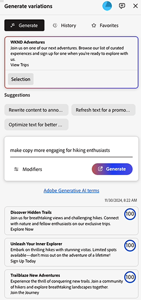

# Gerar variações - Integrado nos editores do AEM {#generate-variations-integrated-in-aem-editors}

Se estiver procurando uma maneira de otimizar seus canais digitais e acelerar a criação de conteúdo, você pode usar a opção Gerar variações integrada aos editores do AEM.

Gerar variações usa a Inteligência artificial (AI) gerativa para criar variações de conteúdo com base em sua entrada. Depois de criar variações, você pode usar o conteúdo no seu site e também medir seu sucesso usando a funcionalidade [Experimentação](https://www.aem.live/docs/experimentation) do [Edge Delivery Services](/help/edge/overview.md).

Isso ajuda a acelerar a velocidade do conteúdo, criando rapidamente o conteúdo da marca em minutos. Isso, por sua vez, ajuda a melhorar a conversão com novas variantes de cópia.

Você pode [acessar Gerar Variações](#access-generate-variations) dos seguintes editores ([depois de configurados](#access-generate-variations)):

* [no Sidekick do AEM Edge Delivery Services; para criação baseada em documentos](#access-aem-sidekick)
* [no Editor universal](#access-aem-universal-editor)
* [no Editor de fragmentos de conteúdo](#access-aem-content-fragment-editor)

>[!IMPORTANT]
>
>Essa página usa a criação baseada em documentos como base para exemplos, mas os princípios se aplicam a outros editores.

>[!NOTE]
>
>Em todos os casos, para usar a opção Gerar variações, você deve garantir que os [pré-requisitos de acesso](#access-prerequisites) sejam atendidos.

>[!NOTE]
>
>É recomendável usar esta versão, pois embora a versão independente do [Gerar Variações ainda possa ser acessada diretamente](/help/generative-ai/generate-variations.md), ela será descontinuada no futuro.

É possível:

* [Selecione o conteúdo com o qual deseja trabalhar](#select-the-content) - a partir de blocos existentes do seu conteúdo
   * O bloco selecionado orienta o que é mostrado e as ações disponíveis
* [Descreva as alterações desejadas](#describe-the-changes-you-want)
* [Gerar variações de seu conteúdo](#generate-copy) e, em seguida, [executar outras ações, se desejar](#take-further-action-on-a-variation)
* [Selecionar e usar uma variação](#use-a-generated-variation)
* Examine seu [histórico](#history)
* Exibir seus [favoritos](#favorites)

## Aviso legal e de uso {#legal-usage-note}

<!--
Generative AI and Generate Variations for AEM are powerful tools – but **you** are responsible for use of the output.

Your inputs to the service should be tied to a context. This context can be your branding materials, website content, data, schemas for such data, templates, or other trusted documents.

You must evaluate the accuracy of any output as appropriate to your use case.

Before using Generate Variations you are recommended to read the [Adobe Experience Cloud Generative AI User Guidelines](https://www.adobe.com/legal/licenses-terms/adobe-dx-gen-ai-user-guidelines.html).
-->

[O uso de Variações de Geração](#generative-action-usage) está ligado ao consumo de ações geradoras.

>[!NOTE]
>
>Consulte a [Folha de Dados de Segurança para obter detalhes relacionados à Geração de Variação no AEM](https://www.adobe.com/content/dam/cc/en/trust-center/ungated/whitepapers/experience-cloud/aem-sites-generate-variations-security-fact-sheet.pdf).

## Visão geral {#overview}

Ao abrir a opção Gerar variações integrada em um editor, você verá a extensão como um painel flutuante que tem três guias.


* O editor:
   * Isso mostra o fluxo de conteúdo no editor.
   * Aqui você pode selecionar um bloco de conteúdo para usar em **Gerar variações**.
* **Gerar variações**:
   * É um painel flutuante com três guias, que podem ser realocadas conforme você desejar
   * [Gerar](#get-started-with-generate-variations):
      * Mostra o [conteúdo selecionado](#select-the-content).
      * Fornece **Sugestões** de exemplo para alterações.
      * Permite [descrever as alterações desejadas](#describe-the-changes-you-want).
      * Permite [Gerar](#generate-copy) novas variações.
      * Mostra as variações geradas. <!--, together with their [brand score](#the-brand-score).-->
      * [Executar mais ações em uma variação](#take-further-action-on-a-variation).
      * [Usar uma variação gerada](#use-a-generated-variation).
   * [Histórico](#history):
      * Mostra sua história recente de gerações.
   * [Favoritos](#favorites):
      * Mostra os resultados das gerações anteriores que você sinalizou como Favoritos.
   * **Termos de IA gerativa da Adobe**: links para [Diretrizes de usuário da IA gerativa da Adobe Experience Cloud](https://www.adobe.com/legal/licenses-terms/adobe-dx-gen-ai-user-guidelines.html).

## Introdução à geração de variações {#get-started-with-generate-variations}

A interface o orienta pelo processo de geração de conteúdo. Depois de abrir a interface, a primeira etapa é selecionar o bloco de conteúdo que deseja usar.

### Selecionar o conteúdo {#select-the-content}

No fluxo de conteúdo principal do editor, selecione o conteúdo para o qual deseja gerar variações. Esta **Seleção** será exibida na guia **Gerar**.

### Descreva as alterações desejadas {#describe-the-changes-you-want}

Para gerar variações do conteúdo, você precisa descrever as alterações desejadas. Você pode selecionar uma das **Sugestões** fornecidas ou fornecer sua própria descrição.

Você também pode especificar **Modificadores** para fornecer mais contexto:

* **Referenciar uma página da Web**
Forneça um URL para obter mais contexto.
* **Carregar resumo de conteúdo**
Atualize um arquivo `.docx` que contenha detalhes do resumo de conteúdo (10 MB ou menos).

### Gerar cópia {#generate-copy}

Depois de descrever as alterações desejadas, selecione **Gerar** para ver as respostas da IA gerativa.



<!--
### The Brand Score {#the-brand-score}

The brand score shows you how on-brand the generated variation is.
-->

### Tomar mais medidas em uma variação {#take-further-action-on-a-variation}

Ao selecionar uma única variação, você pode usar as seguintes ações:

* **Editar**
   * Você pode editar o texto da variação gerada.

      * Suas atualizações podem ser visualizadas na página da Web.

   * Salve as alterações para uso posterior.
* **Favorito**
   * Sinalizar esta variação para referência futura.
   * Depois de sinalizado, ele será exibido na guia [Favoritos](#favorites).
* **Razão da IA**
   * Para maior transparência, fornece uma breve descrição do motivo pelo qual a IA gerativa gerou essa variação específica.

### Usar uma variação gerada {#use-a-generated-variation}

Para usar o conteúdo gerado com a IA gerativa, primeiro selecione e **Exporte para CSV**.

Após a exportação, é possível usar o conteúdo em outro lugar; por exemplo, ao criar conteúdo para o seu site. Você também pode executar um [experimento](https://www.aem.live/docs/experimentation).

>[!NOTE]
>
>Quando Gerar variações é acessado do [Editor universal do AEM](#access-aem-universal-editor) ou do [Editor de fragmento de conteúdo do AEM](#access-aem-content-fragment-editor), o conteúdo gerado selecionado é salvo automaticamente no AEM.

## Histórico {#history}

Esta guia mostra sua atividade passada como após selecionar **Gerar**. uma entrada de **Histórico** foi adicionada.

Se, posteriormente, você selecionar o mesmo conteúdo no fluxo principal e abrir a guia **Histórico**, verá todas as variações geradas para esse bloco.

## Favoritos {#favorites}

Depois de revisar o conteúdo, você pode salvar as variações selecionadas como favoritos.

Depois de salvos, eles serão exibidos em **Favoritos**. Os favoritos são mantidos (até você **Desmarcá-los** ou limpar o cache do navegador).

* Você pode **Editar**, **Desfavoritar** ou mostrar a **Razão da IA** para uma entrada.
* Após selecionar uma variação, você também pode **Exportar para CSV**.

## Uso de ação gerativa {#generative-action-usage}

O gerenciamento de uso depende da ação tomada:

* Gerar variações

  Uma geração de uma variante de cópia é igual a uma ação gerativa. Como cliente do, você tem um determinado número de ações gerativas que acompanham a licença da AEM. Depois que o direito base for consumido, você poderá adquirir ações adicionais.

  >[!NOTE]
  >
  >Consulte [Adobe Experience Manager: Cloud Service | Descrição do produto](https://helpx.adobe.com/legal/product-descriptions/aem-cloud-service.html) para obter mais detalhes sobre direitos básicos e entrar em contato com a equipe de conta se desejar adquirir ações mais geradoras.

## Acessar Gerar Variações {#access-generate-variations}

Depois de atender aos pré-requisitos, você pode acessar Gerar variações do AEM as a Cloud Service ou da Sidekick da Edge Delivery Services.

### Pré-requisitos de acesso {#access-prerequisites}

Para usar a opção Gerar variações, você deve garantir que os pré-requisitos sejam atendidos:

* [Acesso ao Experience Manager as a Cloud Service com Edge Delivery Services](#access-to-aemaacs-with-edge-delivery-services)

#### Acesso ao Experience Manager as a Cloud Service com Edge Delivery Services{#access-to-aemaacs-with-edge-delivery-services}

Os usuários que precisam de acesso para Gerar variações devem ter direito a um ambiente do Experience Manager as a Cloud Service com o Edge Delivery Services.

>[!NOTE]
>
>Se o seu contrato do AEM Sites as a Cloud Service não incluir o Edge Delivery Services, será necessário assinar um novo contrato para obter acesso.
>
>Entre em contato com a Equipe de conta para discutir como migrar para o AEM Sites as a Cloud Service com o Edge Delivery Services.

Para conceder acesso a usuários específicos, atribua a conta de usuário deles ao respectivo perfil de produto. Consulte [Atribuição de perfis de produto do AEM para obter mais detalhes](/help/journey-onboarding/assign-profiles-cloud-manager.md).

### Acesso pelo AEM Sidekick para criação baseada em documentos {#access-aem-sidekick}

O acesso pelo AEM Sidekick é usado para [criação baseada em documentos](https://www.aem.live/docs/aem-authoring).

Algumas configurações são necessárias antes de você poder acessar Gerar variações no Sidekick (do Edge Delivery Services).

>[!NOTE]
>
>Consulte o documento [Instalando o AEM Sidekick](https://www.aem.live/docs/sidekick-extension) para saber como instalar e configurar o Sidekick.

Para usar a opção Gerar variações no Sidekick (do Edge Delivery Services), inclua as seguintes configurações em seus projetos do Edge Delivery Services.

1. Habilitar nosso aplicativo em:

   * `tools/sidekick/config.json`

   Ele deve ser mesclado com sua configuração existente e, em seguida, implantado.

   Por exemplo:

   ```prompt
   {
     "plugins": [
       {
         "id": "aem-genai-variations",
         "titleI18n": {
           "en": "Generate with AI"
         },
         "environments": [
           "preview"
         ],
         "includePaths": [
           "**.docx**"
         ],
         "event": "aem-genai-variations-sidekick"
       }
     ]
   }
   ```

1. Criar:

   * `/tools/sidekick/aem-genai-variations.js`

   Você deve criar esse arquivo com o seguinte conteúdo:

   ```prompt
   (function () {
     let isAEMGenAIVariationsAppLoaded = false;
     function loadAEMGenAIVariationsApp() {
       const script = document.createElement('script');
       script.src = 'https://experience.adobe.com/solutions/aem-sites-genai-aem-genai-variations-mfe/static-assets/resources/sidekick/client.js?source=plugin';
       script.onload = function () {
         isAEMGenAIVariationsAppLoaded = true;
       };
       script.onerror = function () {
         console.error('Error loading AEMGenAIVariationsApp.');
       };
       document.head.appendChild(script);
     }
   
     function handlePluginButtonClick() {
       if (!isAEMGenAIVariationsAppLoaded) {
         loadAEMGenAIVariationsApp();
       }
     }
   
     // The code snippet for the Sidekick V1 extension, https://chromewebstore.google.com/detail/aem-sidekick/ccfggkjabjahcjoljmgmklhpaccedipo?hl=en
     const sidekick = document.querySelector('helix-sidekick');
     if (sidekick) {
       // sidekick already loaded
       sidekick.addEventListener('custom:aem-genai-variations-sidekick', handlePluginButtonClick);
     } else {
       // wait for sidekick to be loaded
       document.addEventListener('sidekick-ready', () => {
         document.querySelector('helix-sidekick')
           .addEventListener('custom:aem-genai-variations-sidekick', handlePluginButtonClick);
       }, { once: true });
     }
   
     // The code snippet for the Sidekick V2 extension, https://chromewebstore.google.com/detail/aem-sidekick/igkmdomcgoebiipaifhmpfjhbjccggml?hl=en
     const sidekickV2 = document.querySelector('aem-sidekick');
     if (sidekickV2) {
       // sidekick already loaded
       sidekickV2.addEventListener('custom:aem-genai-variations-sidekick', handlePluginButtonClick);
     } else {
       // wait for sidekick to be loaded
       document.addEventListener('sidekick-ready', () => {
         document.querySelector('aem-sidekick')
           .addEventListener('custom:aem-genai-variations-sidekick', handlePluginButtonClick);
       }, { once: true });
     }
   }());
   ```

1. Atualizar:

   * `/scripts/scripts.js`

   Isso deve ser atualizado para incluir a seguinte instrução na função `loadLazy()`:

   ```prompt
     import('../tools/sidekick/aem-genai-variations.js');
   ```

   Isso garante que `/tools/sidekick/aem-genai-variations.js` seja carregado como parte do processo de carregamento lento.

   

1. Talvez seja necessário garantir que os usuários tenham [Acesso ao Experience Manager as a Cloud Service com Edge Delivery Services](#access-to-aemaacs-with-edge-delivery-services).

1. Em seguida, você pode acessar o recurso, selecionando **Gerar com IA** na barra de ferramentas do Sidekick:

   

### Acesso pelo Editor universal do AEM {#access-aem-universal-editor}

O acesso do [AEM Universal Editor](/help/sites-cloud/authoring/universal-editor/authoring.md) foi implementado como uma extensão.

* Para obter detalhes sobre como acessar Gerar Variações do Universal Editor, consulte o documento [Criação de Conteúdo com o Universal Editor.](/help/sites-cloud/authoring/universal-editor/authoring.md#generate-variations)
* Para obter detalhes sobre como habilitar a extensão, consulte o documento [Extension Manager no AEM Experience Manager.](https://developer.adobe.com/uix/docs/extension-manager/)

### Acessar o pelo editor de fragmento de conteúdo do AEM {#access-aem-content-fragment-editor}

O acesso pelo [Editor de Fragmento de Conteúdo do AEM](/help/sites-cloud/administering/content-fragments/authoring.md#generate-variations-ai) é implementado como uma extensão. Consulte o [Extension Manager no AEM Experience Manager](https://developer.adobe.com/uix/docs/extension-manager/) para obter mais detalhes.

## Informações adicionais {#further-information}

Para obter mais informações, você também pode ler:

* [Gerar variações GenAI no GitHub](https://github.com/adobe/aem-genai-assistant#setting-up-aem-genai-assistant)
* [Experimentação do Edge Delivery Services](https://www.aem.live/docs/experimentation)
* [IA de geração em produtos da Experience Cloud](https://experienceleague.adobe.com/en/docs/core-services/interface/features/generative-ai)

   * [IA de geração em produtos da Experience Cloud - Adobe Experience Manager](https://experienceleague.adobe.com/en/docs/core-services/interface/features/generative-ai#aem)

* [Gerar página de aterrissagem de variações no Experience Cloud](https://experience.adobe.com/solutions/aem-sites-genai-aem-genai-variations-mfe/static-assets/resources/ga.html)

* [IA gerativa no AEM as a Cloud Service](/help/ai-in-aem/overview.md#generative-ai-in-aem)

## Histórico da versão {#release-history}

Para obter detalhes sobre as versões atual e anterior, consulte as [Notas de versão para gerar variações](/help/generative-ai/release-notes-generate-variations.md)
