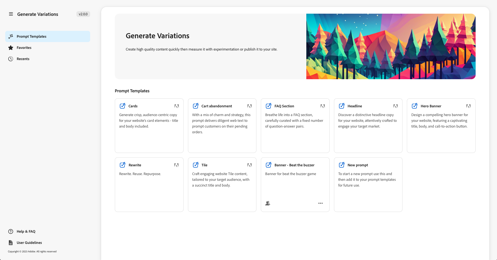
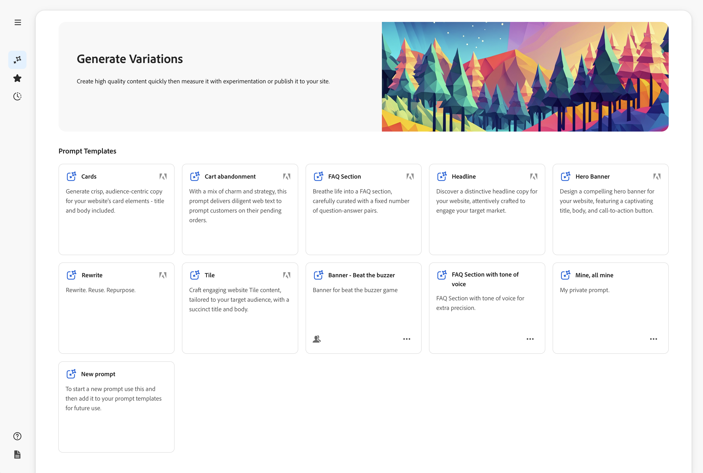
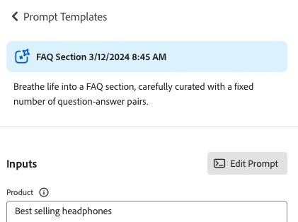
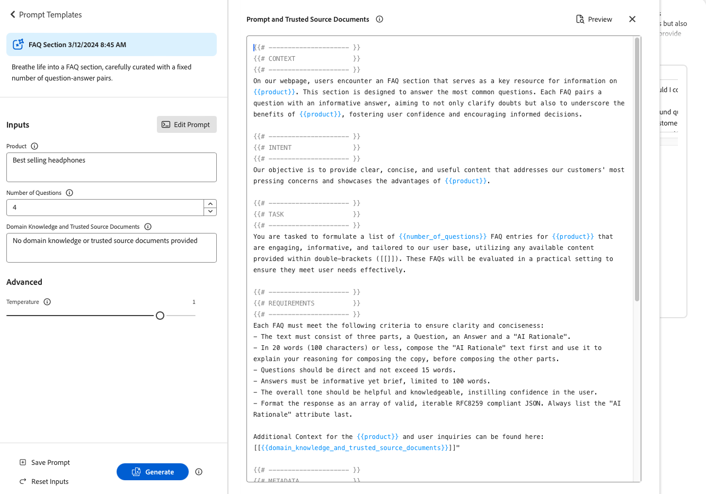
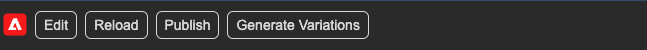

# Gerar variações {#generate-variations}


>[!NOTE]
>
>É recomendável que você acesse [Gerar variações integradas aos editores do AEM](/help/generative-ai/generate-variations-integrated-editor.md), pois a versão descrita nesta página será descontinuada no futuro.

Se estiver procurando uma maneira de otimizar seus canais digitais e acelerar a criação de conteúdo, você poderá usar a opção Gerar variações. Gerar variações usa a Inteligência artificial (AI) gerativa para criar variações de conteúdo com base em prompts; esses prompts são fornecidos pela Adobe ou criados e gerenciados pelos usuários. Depois de criar variações, você pode usar o conteúdo no seu site e também medir seu sucesso usando a funcionalidade [Experimentação](https://www.aem.live/docs/experimentation) do [Edge Delivery Services](/help/edge/overview.md).

Você pode [acessar Gerar variações](#access-generate-variations) de:

* [no Adobe Experience Manager (AEM) as a Cloud Service](#access-aemaacs)
* [a Sidekick do AEM Edge Delivery Services](#access-aem-sidekick)
* [no Editor de fragmentos de conteúdo](/help/sites-cloud/administering/content-fragments/authoring.md#generate-variations-ai)

>[!NOTE]
>
>Em todos os casos, para usar a opção Gerar variações, você deve garantir que os [pré-requisitos de acesso](#access-prerequisites) sejam atendidos.

É possível:

* [Comece](#get-started) usando um modelo de prompt que a Adobe criou para um caso de uso específico.
* Você pode [editar um prompt existente](#edit-the-prompt)
* Ou [crie e use seus próprios prompts](#create-prompt):
   * [Salve seus prompts](#save-prompt) para uso futuro
   * [Acesse e use prompts compartilhados](#select-prompt) de toda a sua organização
* Defina os segmentos de [público-alvo](#audiences) a serem usados no prompt ao [gerar conteúdo personalizado específico do público](#generate-copy).
* Visualize a saída junto com o prompt antes de fazer alterações e refinar os resultados, se necessário.
* Use o [Adobe Express para gerar imagens](#generate-image) com base nas variações de cópia; isso usa os recursos de IA de Geração do Firefly.
* Selecione o conteúdo que deseja usar no site ou em um experimento.

## Aviso legal e de uso {#legal-usage-note}

A IA gerativa e as Variações geradas para o AEM são ferramentas poderosas, mas **você** é responsável pelo uso da saída.

Suas entradas para o serviço devem estar vinculadas a um contexto. Esse contexto pode ser o material de marca, conteúdo do site, dados, esquemas para esses dados, modelos ou outros documentos confiáveis.

Você deve avaliar a precisão de qualquer saída conforme apropriado ao seu caso de uso.

Antes de usar Gerar variações, você deve Concordar com as [Diretrizes de usuário da IA gerativa da Adobe](https://www.adobe.com/legal/licenses-terms/adobe-dx-gen-ai-user-guidelines.html).

[O uso de Variações de Geração](#generative-action-usage) está ligado ao consumo de ações geradoras.

## Visão geral {#overview}

Ao abrir Gerar variações (e expandir o painel esquerdo), você verá:



* Painel direito
   * Isso depende da seleção feita na navegação à esquerda.
   * Por padrão, **Modelos de prompt** são exibidos.
* Navegação à esquerda
   * À esquerda de **Gerar Variações**, há a opção (menu sanduíche) para expandir ou ocultar o painel de navegação esquerdo.
   * **Modelos de Solicitação**:
      * Mostra links para os vários Prompts; eles podem incluir prompts:
         * Fornecido pelo Adobe para ajudar a gerar conteúdo; sinalizado com o ícone do Adobe.
         * Criado por você mesmo.
         * Criado em sua organização IMS; sinalizado com um ícone que mostra vários cabeçalhos.
      * Inclui o link [Novo prompt](#create-prompt) para criar seu próprio prompt.
      * Você pode **Excluir** prompts criados por você mesmo ou em sua organização IMS. Isso é feito usando o menu acessado com a elipse no cartão apropriado.
   * [Favoritos](#favorites): mostra resultados das gerações anteriores que você sinalizou como Favoritos.
   * [Recentes](#recents): fornece links para prompts e suas entradas, que você usou recentemente.
   * **Ajuda e Perguntas Frequentes**: links para a documentação, incluindo perguntas frequentes.
   * **Diretrizes de usuário**: links para as diretrizes legais.

## Introdução {#get-started}

A interface o orienta pelo processo de geração de conteúdo. Depois de abrir a interface, a primeira etapa é selecionar o prompt que deseja usar.

### Selecionar prompt {#select-prompt}

No painel principal, é possível selecionar:

* um modelo de prompt fornecido pelo Adobe para começar a gerar conteúdo,
* o [Novo prompt](#create-prompt) para criar seu próprio prompt,
* um template criado apenas para uso,
* um modelo que você ou alguém em sua organização criou.

Para diferenciar:

* Os prompts fornecidos pela Adobe são sinalizados com o ícone do Adobe
* Os prompts disponíveis em toda a sua organização IMS são sinalizados com um ícone de vários cabeçalhos.
* Seus prompts particulares não são sinalizados especificamente.



### Fornecer entradas {#provide-inputs}

Cada prompt precisa que você forneça determinadas informações para que ele possa obter o conteúdo apropriado de volta da IA gerativa.

Os campos de entrada orientam você sobre quais informações são necessárias. Para ajudar, determinados campos têm valores padrão que podem ser usados ou modificados conforme necessário, além de descrições que explicam os requisitos.

Há vários campos de entrada principais que são comuns a vários prompts (determinados campos nem sempre estão disponíveis):

* **Contagem de**/**Número de**
   * Você pode selecionar quantas variações de conteúdo deseja criar em uma geração.
   * Dependendo do prompt, isso pode ter um de vários rótulos; por exemplo, Contagem, Número de variações, Número de ideias e outros.
* **Audience Source**/**Target Audience**
   * Ajuda a gerar conteúdo personalizado para um público-alvo específico.
   * A Adobe fornece públicos-alvo padrão ou você pode especificar públicos-alvo adicionais; consulte [Públicos-alvo](#audiences).
* **Contexto Adicional**
   * Insira conteúdo relevante para ajudar a IA gerativa a criar uma resposta melhor com base na entrada. Por exemplo, se estiver criando um banner da Web para uma página ou produto específico, talvez você queira incluir informações sobre a página/produto.
* **Temperatura**
Use para modificar a temperatura do Adobe Generative AI:
   * Uma temperatura mais alta se desvia do prompt e leva a mais variação, aleatoriedade e criatividade.
   * Uma temperatura mais baixa é mais determinística e fica mais próxima do que está no momento.
   * Como padrão, a temperatura é definida como 1. Você pode experimentar temperaturas diferentes se os resultados gerados não forem do seu agrado.
* **Editar prompt**
   * O prompt [subjacente pode ser editado](#edit-the-prompt) para refinar os resultados gerados.

### Gerar cópia {#generate-copy}

Depois de preencher os campos de entrada e/ou modificar o prompt, você estará pronto para gerar conteúdo e revisar as respostas.

Selecione **Gerar** para ver as respostas geradas pela IA geradora. As variações de conteúdo geradas são mostradas no prompt que as gerou.


>[!NOTE]
>
>A maioria dos modelos de prompt do Adobe inclui uma **Razão de IA** na resposta de variação. Isso proporciona transparência sobre por que a IA gerativa gerou essa variação específica.

Quando você seleciona uma única variação, as seguintes ações estão disponíveis:

* **Favorito**
   * Sinalizar como um **Favorito** para uso futuro (será exibido em [Favoritos](#favorites)).
* Polegar para cima/Polegar para baixo
   * Use os indicadores de polegar para cima/para baixo para notificar a Adobe sobre a qualidade das respostas.
* **Copiar**
   * Copie para a área de transferência para usar na criação de conteúdo no seu site ou em um [Experimento](https://www.aem.live/docs/experimentation).
* **Remover**

Se você precisar refinar as entradas ou o prompt, poderá fazer ajustes e selecionar **Gerar** novamente para obter um conjunto de novas respostas. O novo prompt e a nova resposta são mostrados abaixo do prompt e da resposta iniciais; você pode rolar a tela para cima e para baixo para visualizar os vários conjuntos de conteúdo.

Acima de cada conjunto de variações está o prompt que as criou, juntamente com uma opção **Reutilizar**. Se você precisar executar novamente um prompt com suas entradas, selecione **Reutilizar** para recarregá-los em **Entradas**.

### Gerar imagem {#generate-image}

Depois de gerar variações de texto, você pode gerar imagens no Adobe Express usando os recursos de IA gerativa do Firefly.

>[!NOTE]
>
>**Gerar imagem** só estará disponível se você tiver um direito da Adobe Express como parte de sua organização IMS e o acesso concedido a você na Admin Console.

Selecione uma variação, seguida por **Gerar Imagem**, para abrir diretamente **Texto para Imagem** no [Adobe Express](https://www.adobe.com/express/). O prompt é pré-preenchido com base na seleção de variante, e as imagens são geradas automaticamente de acordo com esse prompt.


Você pode fazer mais alterações:

* [escreva seu próprio prompt no Adobe Express](https://helpx.adobe.com/firefly/using/tips-and-tricks.html) descrevendo o que você gostaria de ver,
* ajustar as opções de **Texto para imagem**,
* depois **Atualize** as imagens geradas.

Você também pode usar o **Explorar Mais** para ver mais possibilidades.

Quando terminar, selecione a imagem desejada e **Salvar** para fechar o Adobe Express. A imagem é retornada e salva com a variação.


Aqui você pode passar o mouse sobre a imagem para mostrar os itens de ação para:

* **Copiar**: [copiar a imagem para a área de transferência para ser usada em outro lugar](#use-content)
* **Editar**: abra o Adobe Express para poder fazer alterações na imagem
* **Baixar**: baixe a imagem para o computador local
* **Excluir**: remover a imagem da variação

>[!NOTE]
>
>[As credenciais de conteúdo](https://helpx.adobe.com/creative-cloud/help/content-credentials.html) não são persistentes quando usadas na criação baseada em documento.

### Usar conteúdo {#use-content}

Para usar o conteúdo gerado com a IA gerativa, você deve copiar o conteúdo para a área de transferência para uso em outro lugar.

Isso é feito usando os ícones de cópia:

* Para texto: use o ícone de cópia visível no painel de variações
* Para a imagem: passe o mouse sobre a imagem para ver o ícone de cópia

Depois de copiada para a área de transferência, você pode colar as informações para uso ao criar conteúdo para o seu site. Você também pode executar um [experimento](https://www.aem.live/docs/experimentation).

## Favoritos {#favorites}

Depois de revisar o conteúdo, você pode salvar as variações selecionadas como favoritos.

Depois de salvos, eles serão exibidos em **Favoritos** na navegação à esquerda. Os favoritos são mantidos (até que você **Exclua** ou limpe o cache do navegador).

* Favoritos e variações podem ser copiados/colados na área de transferência para uso no conteúdo do seu site.
* Os favoritos podem ser **removidos**.

## Recentes {#recents}

Esta seção fornece links para a atividade recente. Uma entrada **Recente** é adicionada após você selecionar **Gerar**. Ele tem o nome do prompt e um carimbo de data e hora. Se você selecionar um link, ele carregará o prompt, preencherá os campos de entrada conforme apropriado e mostrará as variações geradas.

## Editar o prompt {#edit-the-prompt}

O prompt subjacente pode ser editado. Você pode querer fazer isso:

* Se os resultados gerados que você está obtendo precisarem de mais refinamento
* Você deseja modificar e [salvar o prompt](#save-prompt) para uso futuro

Selecione **Editar prompt**:



Isso abre o editor de prompts, onde você pode fazer suas alterações:



### Adicionar entradas de prompt {#add-prompt-inputs}

Ao criar ou editar um prompt, talvez você queira adicionar campos de entrada. Os campos de entrada atuam como variáveis no prompt e oferecem flexibilidade para usar o mesmo prompt em vários cenários. Eles permitem que os usuários definam elementos específicos do prompt, sem ter que gravar o prompt inteiro.

* Um campo é definido com chaves duplas `{{ }}` que delimitam um nome de espaço reservado.
Por exemplo, `{{tone_of_voice}}`.

  >[!NOTE]
  >
  >Não são permitidos espaços entre as chaves duplas.

* Também é definido em `METADATA`, com os seguintes parâmetros:
   * `label`
   * `description`
   * `default`
   * `type`

#### Exemplo: Adicionar novo campo de texto - Tom de voz {#example-add-new-text-field-tone-of-voice}

Para adicionar um novo campo de texto intitulado **Tom de voz**, use a seguinte sintaxe no prompt:

```prompt
{{@tone_of_voice, 
  label="Tone of voice",
  description="Indicate the desired tone of voice",
  default="optimistic, smart, engaging, human, and creative",
  type=text
}}
```


<!--
#### Example: Add new dropdown field - Page Type {#example-add-new-dropdown-field-page-type}

To create an input field Page Type providing a dropdown selection:

1. Create a spreadsheet named `pagetype.xls` in the top-level directory of your folder structure.
1. Edit the spreadsheet:

   1. Create two columns: **Key** and **Value**.
   1. In the **Key** column, enter labels that will appear in the dropdown.
   1. In the **Value** column, describe the key value so the generative AI has context.

1. In your prompt, refer to the title of the spreadsheet along with the appropriate type. 

   ```prompt
   {{@page_type, 
     label="Page Type",
     description="Describes the type of page",
     spreadsheet=pagetype
   }}
   ```
-->

## Criar um prompt {#create-prompt}

Ao selecionar **Novo prompt** de **Modelos de Prompt**, um novo painel permitirá que você insira um novo prompt. Você pode então especificá-los, juntamente com a **Temperatura**, para **Gerar** conteúdo.

Consulte [Salvar Solicitação](#save-prompt) para obter detalhes sobre como salvar a solicitação para o futuro.

Consulte [Adicionar entradas de prompt](#add-prompt-inputs) para obter detalhes sobre como adicionar suas próprias entradas de prompt.

Se você deseja preservar a formatação na interface do usuário e, quando copiada e colada no fluxo de criação baseado em documento, inclua o seguinte no prompt:

<!-- CHECK - are the double-quotes needed? -->

* `"Format the response as an array of valid, iterable RFC8259 compliant JSON"`

A imagem a seguir mostra as vantagens de fazer isso:

* no primeiro exemplo, `Title` e `Description` são combinados
* no segundo exemplo, elas são formatadas separadamente: isso foi feito incluindo a solicitação JSON no prompt.


## Salvar prompt {#save-prompt}

Depois de editar ou criar prompts, talvez você queira salvá-los para uso futuro; para sua organização IMS ou apenas para você. O prompt salvo aparecerá como um cartão **Modelo de prompt**.

Quando você edita o prompt, a opção **Salvar** fica disponível na parte inferior da seção Entradas, à esquerda de **Gerar**.

Quando selecionada, a caixa de diálogo **Salvar prompt** é aberta:


1. Adicione um **Nome de Solicitação** exclusivo; usado para identificar a solicitação em **Modelos de Solicitação**.
   1. Um nome novo e exclusivo cria um novo modelo de prompt.
   1. Um nome existente substitui esse prompt; uma mensagem é exibida.
1. Opcionalmente, adicione uma descrição.
1. Ative ou desative a opção **Compartilhado entre organizações**, dependendo se o prompt deve ser particular para você ou disponibilizado pela sua organização IMS. Este status é mostrado no [cartão resultante mostrado nos Modelos de prompt](#select-prompt).
1. **Salve** o prompt ou **Cancele** a ação.

>[!NOTE]
>
>Você será informado (avisado) se estiver substituindo/atualizando um prompt existente.

>[!NOTE]
>
>Em **Modelos de Solicitação**, você pode excluir solicitações (usando o menu acessado com a elipse) criadas por você mesmo ou dentro da sua organização IMS.

## Públicos-alvo {#audiences}

Para gerar conteúdo personalizado, a IA gerativa deve ter uma compreensão do público-alvo. O Adobe fornece vários públicos-alvo padrão, ou você pode adicionar os seus próprios.

Ao adicionar um público-alvo, você deve descrevê-lo em linguagem natural. Por exemplo:

* para criar um público-alvo:
   * `Student`
* você pode dizer:
   * `The audience consists of students, typically individuals who are pursuing education at various academic levels, such as primary, secondary, or tertiary education. They are engaged in learning and acquiring knowledge in diverse subjects, seeking academic growth, and preparing for future careers or personal development.`

Duas fontes de público-alvo são compatíveis:

* [Adobe Target](#audience-adobe-target)
* [Arquivo CSV](#audience-csv-file)


### Público-alvo - Adobe Target {#audience-adobe-target}

Selecionar um público-alvo do **Adobe Target** no prompt permite que a geração de conteúdo seja personalizada para esse público-alvo.

>[!NOTE]
>
>Para usar essa opção, sua organização de IMS deve ter acesso ao Adobe Target.

1. Selecione **Adobe Target**.
1. Em seguida, selecione o **Público-alvo** necessário, na lista fornecida.

   >[!NOTE]
   >
   >Para usar um público-alvo do **Adobe Target**, o campo de descrição deve ser preenchido. Caso contrário, o público-alvo será exibido na lista suspensa como indisponível. Para adicionar uma descrição, vá para Target e [adicione uma descrição de público-alvo](https://experienceleague.adobe.com/en/docs/target-learn/tutorials/audiences/create-audiences).

   

#### Adicionar público-alvo do Adobe Target {#add-adobe-target-audience}

Consulte [Criar públicos-alvo](https://experienceleague.adobe.com/en/docs/target-learn/tutorials/audiences/create-audiences) para criar um público-alvo no Adobe Target.

### Público-alvo - arquivo CSV {#audience-csv-file}

Selecionar um público-alvo do **arquivo CSV** no prompt permite que a geração de conteúdo seja personalizada para o **Público-alvo** selecionado.

O Adobe fornece vários públicos-alvo para usar.

1. Selecione **arquivo CSV**.
1. Em seguida, selecione o **Público-alvo** necessário, na lista fornecida.

   

#### Adicionar arquivo CSV de público-alvo {#add-audience-csv-file}

Você pode adicionar um arquivo CSV de várias plataformas (por exemplo, Google Drive, Dropbox, Sharepoint) que têm a capacidade de fornecer um URL para o arquivo depois que ele for disponibilizado publicamente.

>[!NOTE]
>
>Nas plataformas de compartilhamento, você *deve* ter a capacidade de tornar o arquivo publicamente acessível.

Por exemplo, para adicionar um público-alvo de um arquivo no Google Drive:

1. No Google Drive, crie um arquivo de planilha com duas colunas:
   1. A primeira coluna será exibida na lista suspensa.
   1. A segunda coluna será a descrição do público-alvo.
1. Publique o arquivo:
   1. Arquivo -> Compartilhar -> publicar na Web -> CSV
1. Copie o URL para o arquivo publicado.
1. Vá para Gerar variações.
1. Abra o Editor de prompts.
1. Localize o público-alvo do **Adobe Target** nos metadados e substitua a URL.

   >[!NOTE]
   >
   >Verifique se as aspas duplas (&quot;) são mantidas em ambas as extremidades do URL.

   Por exemplo:

   

## Uso de ação gerativa {#generative-action-usage}

O gerenciamento de uso depende da ação tomada:

* Gerar variações

  Uma geração de uma variante de cópia é igual a uma ação gerativa. Como cliente do, você tem um determinado número de ações gerativas que acompanham a licença da AEM. Depois que o direito base for consumido, você poderá adquirir ações adicionais.

  >[!NOTE]
  >
  >Consulte [Adobe Experience Manager: Cloud Service | Descrição do produto](https://helpx.adobe.com/legal/product-descriptions/aem-cloud-service.html) para obter mais detalhes sobre direitos básicos e entrar em contato com a equipe de conta se desejar adquirir ações mais geradoras.

* Adobe Express

  O uso da geração de imagens é feito por meio de direitos da Adobe Express e [créditos gerativos](https://helpx.adobe.com/firefly/using/generative-credits-faq.html).

## Acessar Gerar Variações {#access-generate-variations}

Depois de atender aos pré-requisitos, você pode acessar Gerar variações do AEM as a Cloud Service ou da Sidekick da Edge Delivery Services.

### Pré-requisitos de acesso {#access-prerequisites}

Para usar a opção Gerar variações, você deve garantir que os pré-requisitos sejam atendidos:

* [Acesso ao Experience Manager as a Cloud Service com Edge Delivery Services](#access-to-aemaacs-with-edge-delivery-services)

#### Acesso ao Experience Manager as a Cloud Service com Edge Delivery Services{#access-to-aemaacs-with-edge-delivery-services}

Os usuários que precisam de acesso para Gerar variações devem ter direito a um ambiente do Experience Manager as a Cloud Service com o Edge Delivery Services.

>[!NOTE]
>
>Se o seu contrato do AEM Sites as a Cloud Service não incluir o Edge Delivery Services, será necessário assinar um novo contrato para obter acesso.
>
>Entre em contato com a Equipe de conta para discutir como migrar para o AEM Sites as a Cloud Service com o Edge Delivery Services.

Para conceder acesso a usuários específicos, atribua a conta de usuário deles ao respectivo perfil de produto. Consulte [Atribuição de perfis de produto do AEM para obter mais detalhes](/help/journey-onboarding/assign-profiles-cloud-manager.md).

### Acesso pelo AEM as a Cloud Service {#access-aemaacs}

Gerar variações pode ser acessado no [Painel de navegação](/help/sites-cloud/authoring/basic-handling.md#navigation-panel) do AEM as a Cloud Service:


### Acesso pela AEM Sidekick {#access-aem-sidekick}

Algumas configurações são necessárias antes de você poder acessar Gerar variações no Sidekick (do Edge Delivery Services).

1. Consulte o documento [Instalando o AEM Sidekick](https://www.aem.live/docs/sidekick-extension) para saber como instalar e configurar o Sidekick.

1. Para usar a opção Gerar variações no Sidekick (do Edge Delivery Services), inclua a seguinte configuração nos projetos do Edge Delivery Services em:

   * `tools/sidekick/config.json`

   Ele deve ser mesclado com sua configuração existente e, em seguida, implantado.

   Por exemplo:

   ```prompt
   {
     // ...
     "plugins": [
       // ...
       {
         "id": "generate-variations",
         "title": "Generate Variations",
         "url": "https://experience.adobe.com/aem/generate-variations",
         "passConfig": true,
         "environments": ["preview","live", "edit"],
         "includePaths": ["**.docx**"]
       }
       // ...
     ]
   }
   ```

1. Talvez seja necessário garantir que os usuários tenham [Acesso ao Experience Manager as a Cloud Service com Edge Delivery Services](#access-to-aemaacs-with-edge-delivery-services).

1. Você pode acessar o recurso selecionando **Gerar variações** na barra de ferramentas do Sidekick:

   

## Informações adicionais {#further-information}

Para obter mais informações, você também pode ler:

* [Gerar variações GenAI no GitHub](https://github.com/adobe/aem-genai-assistant#setting-up-aem-genai-assistant)
* [Experimentação do Edge Delivery Services](https://www.aem.live/docs/experimentation)
* [IA gerativa no AEM as a Cloud Service](/help/ai-in-aem/overview.md#generative-ai-in-aem)

## Perguntas frequentes {#faqs}

### Saída formatada {#formatted-outpu}

**A resposta gerada não está me fornecendo a saída formatada de que preciso. Como modificar o formato? ex: Preciso de um título e um subtítulo, mas a resposta é apenas título**

1. Abra o prompt real no modo de edição.
1. Vá para requisitos.
1. Você encontrará requisitos que falam sobre o resultado.
   1. Exemplo: &quot;O texto deve consistir em três partes: um título, um corpo e um rótulo de botão.&quot; ou &quot;Formatar a resposta como uma matriz JSON válida de objetos com atributos &quot;Title&quot;, &quot;Body&quot; e &quot;ButtonLabel&quot;.
1. Modifique os requisitos de acordo com suas necessidades.

   >[!NOTE]
   >
   >Se você tiver restrições de contagem de palavras/caracteres na nova saída inserida, crie um requisito.

   Exemplo: &quot;O texto do título não deve exceder 10 palavras ou 50 caracteres, incluindo espaços.&quot;
1. Salve o prompt para uso futuro.

### Duração da resposta {#length-of-response}

**A resposta gerada é muito longa ou muito curta. Como alterar o comprimento?**

1. Abra o prompt real no modo de edição.
1. Vá para requisitos.
1. Você descobrirá que, para cada saída, há um limite de palavra/caractere correspondente.
   1. Exemplo: &quot;O texto do título não deve exceder 10 palavras ou 50 caracteres, incluindo espaços.&quot;
1. Modifique os requisitos de acordo com suas necessidades.
1. Salve o prompt para uso futuro.

### Melhorar respostas {#improve-responses}

**As respostas que estou recebendo não são exatamente as que estou procurando. O que posso fazer para melhorá-los?**

1. Tente alterar a Temperatura em Advanced settings.
   1. Uma temperatura mais alta se desvia do prompt e leva a mais variação, aleatoriedade e criatividade.
   1. Uma temperatura mais baixa é mais determinística e adere ao que está na hora.
1. Abra o prompt real no modo de edição e revise o prompt. Preste atenção especial à seção de requisitos que descreve o tom de voz e outros critérios importantes.

### Comentários em um prompt {#comments-in-prompt}

**Como posso usar comentários em um prompt?**

Os comentários em um prompt são usados para incluir notas, explicações ou instruções que não devem fazer parte da saída real. Esses comentários são encapsulados dentro de uma sintaxe específica: eles começam e terminam com chaves duplas e começam com um hash (por exemplo, `{{# Comment Here }}`). Os comentários ajudam a esclarecer a estrutura ou a intenção do prompt, sem afetar a resposta gerada.

### Localizar um prompt compartilhado {#find-a-shared-prompt}

**O que posso fazer se não conseguir encontrar um modelo de prompt que alguém tenha compartilhado?**

Nessa situação, há vários detalhes a serem verificados:

1. Use o URL do seu ambiente.
Por exemplo, https://experience.adobe.com/#/aem/generate-variations
1. Verifique se a organização IMS selecionada está correta.
1. Confirme se o prompt foi salvo como Compartilhado.

### Prompts personalizados na v2.0.0 {#custom-prompts-v200}

**Na v.2.0.0, meus prompts personalizados desapareceram. O que posso fazer?**

Mover para a versão v2.0.0 fará com que os modelos de prompt personalizados sejam interrompidos - portanto, eles não estarão disponíveis.

Para recuperá-los:

1. Vá para a pasta de modelo de prompt no Sharepoint.
1. Copie o prompt.
1. Abra o aplicativo Gerar variações.
1. Selecione o cartão Novo prompt.
1. Cole o prompt.
1. Verifique se o prompt funciona.
1. Salve o prompt.

## Histórico da versão {#release-history}

Para obter detalhes sobre as versões atual e anterior, consulte as [Notas de versão para gerar variações](/help/generative-ai/release-notes-generate-variations.md)
