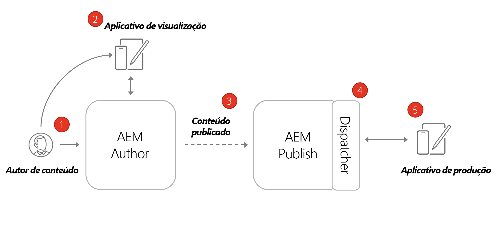
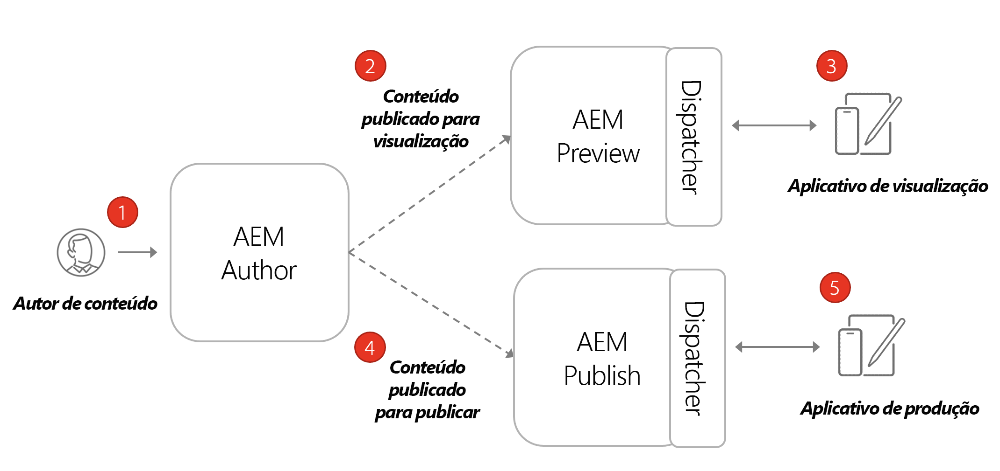

# Arquitetura do AEM Headless

Um ambiente do AEM típico é composto de um serviço do autor, um serviço de publicação e um serviço de visualização opcional.

* **O serviço do Autor** é onde os usuários internos criam, gerenciam e visualizam conteúdo.

* **O serviço de Publicação** é considerado o ambiente “ativo” e é, normalmente, com o que os usuários finais interagem. O conteúdo, após ser editado e aprovado no serviço do Autor, é distribuído ao serviço de Publicação. O padrão de implantação mais comum com aplicativos headless do AEM é ter uma versão de produção do aplicativo conectada a um serviço de publicação do AEM.

* **O serviço de Visualização** é funcionalmente igual ao **serviço de Publicação**. No entanto, ele é disponibilizado apenas para usuários internos. Isso torna o sistema ideal para os aprovadores revisarem alterações futuras no conteúdo antes destas serem disponibilizadas aos usuários finais.

* **O Dispatcher** é um servidor Web estático aumentado com o módulo dispatcher do AEM. Ele fornece recursos de armazenamento em cache e mais uma camada de segurança. O **Dispatcher** fica na frente dos serviços **Publicar** e **Visualizar**.

Dentro de um programa do AEM as a Cloud Service, é possível ter vários ambientes: Desenvolvimento, Preparo e Produção. Cada ambiente teria seu próprio e exclusivo serviço de **Autor**, **Publicação** e **Visualização**. Consulte [Gerenciamento de ambientes](/help/implementing/cloud-manager/manage-environments.md) para saber mais.

## Modelo de publicação do autor

O padrão de implantação mais comum com aplicativos headless do AEM é ter uma versão de produção do aplicativo conectada a um serviço de publicação do AEM.

O diagrama acima descreve esse padrão de implantação comum.

1. Um **Autor de conteúdo** usa o serviço do Autor do AEM para criar, editar e gerenciar conteúdo.
1. O **Autor de conteúdo** e outros usuários internos podem visualizar o conteúdo diretamente no serviço do Autor. É possível configurar uma versão de Visualização do aplicativo que se conecta ao serviço de Autor.
1. Depois que o conteúdo é aprovado, pode ser publicado no serviço de Publicação do AEM.
1. O **Dispatcher** é uma camada na frente do serviço de **Publicação** que pode armazenar em cache determinadas solicitações e fornece uma camada de segurança.
1. Os usuários finais interagem com a versão de Produção do aplicativo. O aplicativo de Produção se conecta ao serviço de Publicação por meio do Dispatcher e usa as APIs GraphQL para solicitar e consumir conteúdo.

## Implantação da publicação da visualização do autor

Outra opção para implantações headless é incorporar um serviço de **Visualização do AEM**. Com essa abordagem, o conteúdo pode ser publicado primeiro no serviço de **Visualização** e uma versão de visualização do aplicativo headless pode se conectar a ele. A vantagem dessa abordagem é que o serviço de **Visualização** pode ser configurado com os mesmos requisitos e permissões de autenticação do serviço de **Publicação**, facilitando a simulação da experiência de produção.

1. Um **Autor de conteúdo** usa o serviço do Autor do AEM para criar, editar e gerenciar conteúdo.
1. O conteúdo é publicado pela primeira vez no serviço de Visualização do AEM.
1. É possível configurar uma versão de Visualização do aplicativo que se conecta ao serviço de Visualização.
1. Depois que o conteúdo é revisado e aprovado, pode ser publicado no serviço de Publicação do AEM.
1. Os usuários finais interagem com a versão de Produção do aplicativo. O aplicativo de Produção se conecta ao serviço de Publicação por meio do Dispatcher e usa as APIs GraphQL para solicitar e consumir conteúdo.
