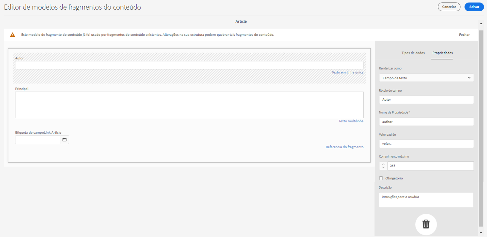

# API GraphQL do AEM para uso com Fragmentos de conteúdo {#graphql-api-for-use-with-content-fragments}

Saiba como usar os Fragmentos de conteúdo no Adobe Experience Manager (AEM) as a Cloud Service com a API GraphQL do AEM, para entrega de conteúdo headless.

A API GraphQL do AEM as a Cloud Service utilizada com Fragmentos de conteúdo é baseada na API GraphQL padrão de código aberto.

Usar a API GraphQL no AEM permite a entrega eficiente dos Fragmentos de conteúdo aos clientes JavaScript em implementações CMS headless:

* Evitando solicitações de API iterativas como com REST,
* Garantindo que a entrega se limite aos requisitos específicos,
* Permitindo a entrega em massa exatamente daquilo que é necessário para a renderização, como resposta a uma única consulta de API.

>[!NOTE]
>
>O GraphQL é usado atualmente em dois cenários (separados) no Adobe Experience Manager (AEM) as a Cloud Service:
>
>* [O AEM Commerce consome dados de uma plataforma do Commerce por meio do GraphQL](/help/commerce-cloud/integrating/magento.md).
>* Fragmentos de conteúdo do AEM trabalham em conjunto com a API GraphQL do AEM (uma implementação personalizada, com base no GraphQL padrão), para fornecer conteúdo estruturado para uso em seus aplicativos.


## A API GraphQL {#graphql-api}

O GraphQL é:

* &quot;*...um idioma de consulta para APIs e um tempo de execução para realizar essas consultas com seus dados existentes. O GraphQL fornece uma descrição completa e compreensível dos dados em sua API, concede aos clientes nada além do poder de solicitar exatamente o que precisam, facilita a evolução das APIs ao longo do tempo e habilita ferramentas avançadas de desenvolvedor.*&quot;.

   Consulte [GraphQL.org](https://graphql.org)

* &quot;*...uma especificação aberta para uma camada de API flexível. Coloque o GraphQL sobre seus back-end existentes para criar produtos mais rápido do que nunca...*&quot;.

   Consulte [Explorar GraphQL](https://www.graphql.com).

* *&quot;...uma linguagem de consulta de dados e especificação desenvolvidas internamente pelo Facebook em 2012, antes de serem disponibilizadas publicamente em 2015. Ele oferece uma alternativa às arquiteturas baseadas em REST, com o objetivo de aumentar a produtividade do desenvolvedor e minimizar as quantidades de dados transferidos. O GraphQL é usado na produção por centenas de organizações de todos os tamanhos...&quot;*

   Consulte [Fundação GraphQL](https://foundation.graphql.org/).

<!--
"*Explore GraphQL is maintained by the Apollo team. Our goal is to give developers and technical leaders around the world all of the tools they need to understand and adopt GraphQL.*". 
-->

Para obter mais informações sobre a API GraphQL, consulte as seguintes seções (entre muitos outros recursos):

* Em [graphql.org](https://graphql.org):

   * [Introdução ao GraphQL](https://graphql.org/learn)

   * [A especificação GraphQL](https://spec.graphql.org/)

* Em [graphql.com](https://graphql.com):

   * [Guias](https://www.graphql.com/guides/)

   * [Tutoriais](https://www.graphql.com/tutorials/)

   * [Estudos de caso](https://www.graphql.com/case-studies/)

A implementação do GraphQL para AEM é baseada na Biblioteca GraphQL Java padrão. Consulte:

* [graphQL.org - Java](https://graphql.org/code/#java)

* [Java GraphQL no GitHub](https://github.com/graphql-java)

### Terminologia de GraphQL {#graphql-terminology}

O GraphQL usa o seguinte:

* **[Consultas](https://graphql.org/learn/queries/)**

* **[Esquemas e Tipos](https://graphql.org/learn/schema/)**:

   * Os esquemas são gerados pelo AEM com base nos modelos de fragmento de conteúdo.
   * Usando seus esquemas, o GraphQL apresenta os tipos e as operações permitidas no GraphQL para implementação no AEM.

* **[Campos](https://graphql.org/learn/queries/#fields)**

* **[Endpoint de GraphQL](graphql-endpoint.md)**
   * O caminho no AEM que responde a consultas de GraphQL e fornece acesso aos esquemas de GraphQL.

   * Consulte [Habilitação do endpoint de GraphQL](graphql-endpoint.md) para obter mais detalhes.

Consulte a [Introdução ao GraphQL (GraphQL.org)](https://graphql.org/learn/) para obter detalhes abrangentes, incluindo as [Práticas recomendadas](https://graphql.org/learn/best-practices/).

### Tipos de consulta de GraphQL {#graphql-query-types}

Com o GraphQL, é possível executar consultas para retornar:

* Uma **entrada única**

* Uma **[lista de entradas](https://graphql.org/learn/schema/#lists-and-non-null)**

O AEM fornece recursos para converter consultas (de ambos os tipos) em [consultas persistentes, que podem ser armazenadas em cache](/help/headless/graphql-api/persisted-queries.md) pelo Dispatcher e CDN.

### Práticas recomendadas de consulta GraphQL (Dispatcher e CDN) {#graphql-query-best-practices}

As [consultas persistentes](/help/headless/graphql-api/persisted-queries.md) são o método recomendado a ser usado em instâncias de publicação, como:

* são armazenadas em cache
* são gerenciadas de forma central pelo AEM as a Cloud Service

>[!NOTE]
>
>Geralmente, uma instância de autor não contém o Dispatcher/CDN, portanto, não há vantagem em usar consultas persistentes nesse caso, a menos que seja para testá-las.

As consultas GraphQL que utilizam solicitações POST não são recomendadas, pois não são armazenadas em cache. Portanto, em uma instância padrão, o Dispatcher é configurado para bloquear essas consultas.

Embora o GraphQL também seja compatível com solicitações GET, elas podem atingir limites (por exemplo, o comprimento do URL) que poderiam ser evitados usando consultas persistentes.

>[!NOTE]
>
>Para permitir consultas diretas e/ou POST no Dispatcher, você pode solicitar que o administrador do sistema:
>
>* Crie uma [variável de ambiente do Cloud Manager](/help/implementing/cloud-manager/environment-variables.md) chamada `ENABLE_GRAPHQL_ENDPOINT`
>* com o valor `true`


>[!NOTE]
>
>A capacidade de realizar consultas diretas pode se tornar obsoleta em algum momento no futuro.

### IDE GraphiQL {#graphiql-ide}

É possível testar e depurar consultas de GraphQL usando o [IDE GraphiQL](/help/headless/graphql-api/graphiql-ide.md).

## Casos de uso para ambientes de Autor e Publicação {#use-cases-author-publish-environments}

Os casos de uso podem depender do tipo de ambiente do AEM as a Cloud Service:

* Ambiente de publicação; usado para:
   * Consultar dados para o aplicativo JS (caso de uso padrão)

* Ambiente de autor; usado para:
   * Consultar dados para “fins de gerenciamento de conteúdo”:
      * Atualmente, o GraphQL no AEM as a Cloud Service é uma API somente de leitura.
      * A API REST pode ser usada para operações de CR(u)D.

## Permissões {#permission}

As permissões são as necessárias para acessar o Assets.

As consultas GraphQL são executadas com a permissão do usuário do AEM da solicitação subjacente. Se o usuário não tiver acesso de leitura a alguns fragmentos (armazenados como ativos), eles não farão parte do conjunto de resultados.

Além disso, o usuário precisa ter acesso a um ponto de acesso GraphQL para poder executar consultas GraphQL.

## Geração de esquemas {#schema-generation}

O GraphQL é uma API altamente tipificada, o que significa que os dados devem ser estruturados e organizados claramente por tipo.

A especificação GraphQL fornece uma série de diretrizes sobre como criar uma API robusta para interrogar dados em uma determinada instância. Para fazer isso, um cliente precisa buscar o [Esquema](#schema-generation), que contém todos os tipos necessários para uma consulta.

Para fragmentos de conteúdo, os esquemas de GraphQL (estrutura e tipos) são baseados em [modelos de fragmento de conteúdo](/help/sites-cloud/administering/content-fragments/content-fragments-models.md) **habilitados** e seus tipos de dados.

>[!CAUTION]
>
>Todos os esquemas de GraphQL (derivados dos modelos de fragmento de conteúdo que foram **Habilitados**) são legíveis por meio do endpoint do GraphQL.
>
>Isso significa que você precisa garantir que não haja dados confidenciais disponíveis, pois eles poderiam ser vazados dessa maneira; por exemplo, isso inclui informações que podem estar presentes como nomes de campo na definição do modelo.

Por exemplo, se um usuário criar um modelo de fragmento de conteúdo chamado `Article`, o AEM gerará um `ArticleModel` do tipo GraphQL. Os campos desse tipo correspondem aos campos e tipos de dados definidos no modelo. Além disso, ele cria alguns pontos de entrada para as consultas que operam nesse tipo, como `articleByPath` ou `articleList`.

1. Um modelo de fragmento de conteúdo:

   

1. O esquema de GraphQL correspondente (saída da documentação automática do GraphiQL):
   

   Isso mostra que o tipo gerado `ArticleModel` contém vários [campos](#fields).

   * Três deles foram controlados pelo usuário: `author`, `main` e `referencearticle`.

   * Os outros campos foram adicionados automaticamente pelo AEM e representam métodos úteis para fornecer informações sobre um determinado fragmento de conteúdo; neste exemplo, (os [campos auxiliares](#helper-fields)) `_path`, `_metadata`, `_variations`.

1. Depois que um usuário cria um fragmento de conteúdo com base no modelo de Artigo, ele pode ser interrogado por meio do GraphQL. Para obter exemplos, consulte [Exemplos de consulta](/help/headless/graphql-api/sample-queries.md#graphql-sample-queries) (baseado em uma [amostra da estrutura do fragmento de conteúdo para uso com GraphQL](/help/headless/graphql-api/sample-queries.md#content-fragment-structure-graphql)).

No GraphQL para AEM, o esquema é flexível. Isso significa que ele é gerado automaticamente toda vez que um modelo de fragmento de conteúdo é criado, atualizado ou excluído. Os caches do esquema de dados também são atualizados quando você atualiza um modelo de fragmento de conteúdo.

<!-- move the following to a separate "in depth" page -->

Os caches do esquema de dados também são atualizados quando você atualiza um modelo de fragmento de conteúdo.

O serviço GraphQL do Sites acompanha (em segundo plano) quaisquer modificações feitas em um modelo de fragmento de conteúdo. Quando as atualizações são detectadas, somente essa parte do esquema é gerada novamente. Essa otimização economiza tempo e oferece estabilidade.

Por exemplo, se você:

1. Instalar um pacote contendo `Content-Fragment-Model-1` e `Content-Fragment-Model-2`:

   1. Os tipos de GraphQL para `Model-1` e `Model-2` serão gerados.

1. Em seguida, o `Content-Fragment-Model-2` é modificado:

   1. Somente o tipo de GraphQL para `Model-2` será atualizado.

   1. Já o `Model-1` permanecerá o mesmo.

>[!NOTE]
>
>É importante observar isso caso queira fazer atualizações em massa nos modelos de fragmento de conteúdo por meio da API REST ou de outra maneira.

O esquema é distribuído por meio do mesmo endpoint das consultas de GraphQL, com o cliente lidando com o fato de que o esquema é chamado com a extensão `GQLschema`. Por exemplo, executar uma simples solicitação `GET` em `/content/cq:graphql/global/endpoint.GQLschema` resultará na saída do esquema com o tipo do conteúdo: `text/x-graphql-schema;charset=iso-8859-1`.

<!-- move through to here to a separate "in depth" page -->

### Geração de esquema - Modelos não publicados {#schema-generation-unpublished-models}

Quando os fragmentos de conteúdo são aninhados, pode acontecer que um modelo de fragmento de conteúdo principal seja publicado, mas um modelo referenciado não.

>[!NOTE]
>
>A interface do AEM impede que isso aconteça, mas se a publicação for feita de maneira programática ou com pacotes de conteúdo, isso poderá ocorrer.

Quando isso acontece, o AEM gera um esquema *incompleto* do modelo de fragmento de conteúdo principal. Isso significa que a referência do fragmento, que depende do modelo não publicado, é removida do esquema.

## Campos {#fields}

Dentro do esquema há campos individuais de duas categorias básicas:

* Campos gerados.

   Uma seleção de [Tipos de dados](#Data-types) é usada para criar campos com base em como você configura o modelo de fragmento de conteúdo. Os nomes de campo são retirados do campo **Nome da propriedade** da guia **Tipo de dados**.

   * Também é necessário considerar a configuração **Renderizar como**, já que os usuários podem configurar determinados tipos de dados. Por exemplo, um campo de texto de linha única pode ser configurado para conter vários textos de linha única escolhendo `multifield` na lista suspensa.

* O GraphQL do AEM também gera vários [campos auxiliares](#helper-fields).

### Tipos de dados {#data-types}

O GraphQL do AEM oferece suporte a uma lista de tipos. Todos os tipos de dados do modelo de fragmento de conteúdo compatíveis e os tipos de GraphQL correspondentes são representados:

| Modelo de fragmento de conteúdo - Tipo de dados | Tipo de GraphQL | Descrição |
|--- |--- |--- |
| Texto em linha única | Sequência de caracteres, [Sequência de caracteres] | Usado para sequências de caracteres simples, como nomes de autor, nomes de localização etc. |
| Texto multilinha | Sequência de caracteres, [Sequência de caracteres] | Usado para saída de texto, como o corpo de um artigo |
| Número | Flutuante, [Flutuante] | Usado para exibir números de ponto flutuantes e números regulares |
| Booleano | Booleano | Usado para exibir caixas de seleção → declarações simples de verdadeiro/falso |
| Data e hora | Calendário | Usado para exibir data e hora em um formato ISO 8601. Dependendo do tipo selecionado, há três opções disponíveis para uso no GraphQL do AEM: `onlyDate`, `onlyTime` e `dateTime` |
| Enumeração | String | Usado para exibir uma opção de uma lista de opções definidas na criação do modelo |
| Tags | [String] | Usado para exibir uma lista de strings que representam tags usadas no AEM |
| Referência de conteúdo | String, [String] | Usado para exibir o caminho para outro ativo no AEM |
| Referência de fragmento | *Um tipo de modelo* | Usado para fazer referência a outro fragmento de conteúdo de um determinado tipo de modelo, definido quando o modelo foi criado |

### Campos auxiliares {#helper-fields}

Além dos tipos de dados para campos gerados pelo usuário, o GraphQL para AEM também gera vários campos *auxiliares* para ajudar a identificar um Fragmento de conteúdo ou fornecer informações adicionais sobre um Fragmento de conteúdo.

Esses [campos auxiliares](#helper-fields) estão marcados com um `_` precedente, para distinguir entre o que foi definido pelo usuário e o que foi gerado automaticamente.

#### Caminho  {#path}

O campo de caminho é usado como um identificador no GraphQL do AEM. Ele representa o caminho do ativo Fragmento de conteúdo dentro do repositório do AEM. Escolhemos esse como o identificador de um fragmento de conteúdo, pois ele:

* é exclusivo dentro do AEM,
* pode ser buscado facilmente.

O código a seguir exibirá os caminhos de todos os fragmentos de conteúdo que foram criados com base no modelo de fragmento de conteúdo `Author`, conforme fornecido pelo tutorial do WKND.

```graphql
{
  authorList {
    items {
      _path
    }
  }
}
```

Para recuperar um único fragmento de conteúdo de um tipo específico, também é necessário determinar seu caminho primeiro. Por exemplo:

```graphql
{
  authorByPath(_path: "/content/dam/wknd-shared/en/contributors/sofia-sj-berg") {
    item {
      _path
      firstName
      lastName
    }
  }
}
```

Consulte [Exemplo de consulta - um único fragmento específico de cidade](/help/headless/graphql-api/sample-queries.md#sample-single-specific-city-fragment).

#### Metadados {#metadata}

Por meio do GraphQL, o AEM também expõe os metadados de um Fragmento de conteúdo. Os metadados são as informações que descrevem um fragmento de conteúdo, como o título e a descrição de um fragmento de conteúdo, o caminho da miniatura, sua data de criação, dentre outras informações.

Como os metadados são gerados por meio do Editor de esquemas e, como tal, não têm uma estrutura específica, o GraphQL tipo `TypedMetaData` foi implementado para expor os metadados de um Fragmento de conteúdo. `TypedMetaData` expõe as informações agrupadas pelos seguintes tipos escalares:

| Texto |
|--- |
| `stringMetadata:[StringMetadata]!` |
| `stringArrayMetadata:[StringArrayMetadata]!` |
| `intMetadata:[IntMetadata]!` |
| `intArrayMetadata:[IntArrayMetadata]!` |
| `floatMetadata:[FloatMetadata]!` |
| `floatArrayMetadata:[FloatArrayMetadata]!` |
| `booleanMetadata:[BooleanMetadata]!` |
| `booleanArrayMetadata:[booleanArrayMetadata]!` |
| `calendarMetadata:[CalendarMetadata]!` |
| `calendarArrayMetadata:[CalendarArrayMetadata]!` |

Cada tipo escalar representa um único par de nome-valor ou uma matriz de pares de nome-valor, em que o valor desse par é do tipo em que foi agrupado.

Por exemplo, se você quiser recuperar o título de um Fragmento de conteúdo, sabemos que essa é uma propriedade de String; portanto, consultaríamos todos os metadados de String:

Para consultar metadados:

```graphql
{
  authorByPath(_path: "/content/dam/wknd-shared/en/contributors/sofia-sj-berg") {
    item {
      _metadata {
        stringMetadata {
          name
          value
        }
      }
    }
  }
}
```

É possível exibir todos os tipos de metadados GraphQL, se você exibir o esquema GraphQL gerado. Todos os tipos de modelo têm o mesmo `TypedMetaData`.

>[!NOTE]
>
>**Diferença entre metadados normais e de matriz**
>Lembre-se que `StringMetadata` e `StringArrayMetadata` se referem ao que é armazenado no repositório, não a como você os recupera.
>
>Por exemplo, ao chamar o campo `stringMetadata`, você receberia uma matriz de todos os metadados que foram armazenados no repositório como um `String`; e ao chamar `stringArrayMetadata`, você receberia uma matriz de todos os metadados que foram armazenados no repositório como `String[]`.

Consulte [Exemplo de consulta para metadados - listar os metadados para prêmios denominados GB](/help/headless/graphql-api/sample-queries.md#sample-metadata-awards-gb).

#### Variações {#variations}

O campo `_variations` foi implementado para simplificar a consulta das variações que um Fragmento de conteúdo possui. Por exemplo:

```graphql
{
  authorByPath(_path: "/content/dam/wknd-shared/en/contributors/ian-provo") {
    item {
      _variations
    }
  }
}
```

>[!NOTE]
>
>Observe que o campo `_variations` não contém uma variável `master`, pois tecnicamente os dados originais (identificados como *Principal* na interface) não são considerados uma variável explícita.

Consulte [Exemplo de consulta - todas as cidades com uma variável nomeada](/help/headless/graphql-api/sample-queries.md#sample-cities-named-variation).

>[!NOTE]
>
>Se a variável especificada não existir para um fragmento de conteúdo, os dados originais (também conhecidos como variável principal) serão retornados como padrão (substituto).

<!--
## Security Considerations {#security-considerations}
-->

## Variáveis GraphQL {#graphql-variables}

O GraphQL permite que as variáveis sejam colocadas na consulta. Para obter mais informações, é possível visualizar a [documentação do GraphQL sobre variáveis](https://graphql.org/learn/queries/#variables).

Por exemplo, para obter todos os fragmentos de conteúdo do tipo `Author` em uma variável específica (caso esteja disponível), é possível especificar o argumento `variation` no GraphiQL.


**Consulta**:

```graphql
query($variation: String!) {
  authorList(variation: $variation) {
    items {
      _variation
      lastName
      firstName
    }
  }
}
```

**Variáveis de consulta**:

```json
{
  "variation": "another"
}
```

Essa consulta retornará a lista completa de autores. Autores sem a variável `another` usarão os dados originais (neste caso, `_variation` relatará `master`).

Se você quiser restringir a lista aos autores que fornecem a variável especificada (e ignorar autores que retornariam aos dados originais), será necessário aplicar um [filtro](#filtering):

```graphql
query($variation: String!) {
  authorList(variation: $variation, filter: {
    _variation: {
      _expressions: {
        value: $variation
      }
    }
  }) {
    items {
      _variation
      lastName
      firstName
    }
  }
}
```

## Diretivas GraphQL {#graphql-directives}

No GraphQL, há uma possibilidade de alterar a consulta com base em variáveis, chamadas de Diretivas GraphQL.

Por exemplo, é possível incluir o campo `adventurePrice` em uma consulta para todos os `AdventureModels`, com base em uma variável `includePrice`.


**Consulta**:

```graphql
query GetAdventureByType($includePrice: Boolean!) {
  adventureList {
    items {
      title
      price @include(if: $includePrice)
    }
  }
}
```

**Variáveis de consulta**:

```json
{
    "includePrice": true
}
```

## Filtragem {#filtering}

Também é possível usar a filtragem em consultas de GraphQL para retornar dados específicos.

A filtragem usa uma sintaxe baseada em operadores lógicos e expressões.

A menor parte é uma expressão única que pode ser aplicada ao conteúdo de um determinado campo. Ela compara o conteúdo do campo com um determinado valor constante.

Por exemplo, a expressão

```graphql
{
  value: "some text"
  _op: EQUALS
}
```

comparará o conteúdo do campo com o valor `some text` e será bem-sucedida se o conteúdo for igual ao valor. Caso contrário, a expressão falhará.

Os operadores a seguir podem ser usados para comparar campos com um determinado valor:

| Operador | Tipo(s) | A expressão será bem-sucedida se... |
|--- |--- |--- |
| `EQUALS` | `String`, `ID`, `Boolean` | ...o valor for exatamente o mesmo que o conteúdo do campo |
| `EQUALS_NOT` | `String`, `ID` | ...o valor *não* for igual ao conteúdo do campo |
| `CONTAINS` | `String` | ...o conteúdo do campo contiver o valor (`{ value: "mas", _op: CONTAINS }` corresponderá a `Christmas`, `Xmas`, `master`, ...) |
| `CONTAINS_NOT` | `String` | ...o conteúdo do campo *não* contiver o valor |
| `STARTS_WITH` | `ID` | ...a ID começar com um determinado valor (`{ value: "/content/dam/", _op: STARTS_WITH` corresponderá a `/content/dam/path/to/fragment`, mas não a `/namespace/content/dam/something` |
| `EQUAL` | `Int`, `Float` | ...o valor for exatamente o mesmo que o conteúdo do campo |
| `UNEQUAL` | `Int`, `Float` | ...o valor *não* for igual ao conteúdo do campo |
| `GREATER` | `Int`, `Float` | ...o conteúdo do campo for maior que o valor |
| `GREATER_EQUAL` | `Int`, `Float` | ...o conteúdo do campo for maior ou igual ao valor |
| `LOWER` | `Int`, `Float` | ...o conteúdo do campo for menor que o valor |
| `LOWER_EQUAL` | `Int`, `Float` | ...o conteúdo do campo for menor ou igual ao valor |
| `AT` | `Calendar`, `Date`, `Time` | ...o conteúdo do campo for exatamente o mesmo que o valor (incluindo a configuração de fuso horário) |
| `NOT_AT` | `Calendar`, `Date`, `Time` | ...o conteúdo do campo *não* for igual ao valor |
| `BEFORE` | `Calendar`, `Date`, `Time` | ...o ponto no tempo indicado pelo valor for anterior ao ponto no tempo indicado pelo conteúdo do campo |
| `AT_OR_BEFORE` | `Calendar`, `Date`, `Time` | ...o ponto no tempo indicado pelo valor for anterior ou igual ao ponto no tempo indicado pelo conteúdo do campo |
| `AFTER` | `Calendar`, `Date`, `Time` | ...o ponto no tempo indicado pelo valor for posterior ao ponto no tempo indicado pelo conteúdo do campo |
| `AT_OR_AFTER` | `Calendar`, `Date`, `Time` | ...o ponto no tempo indicado pelo valor for posterior ou igual ao ponto no tempo indicado pelo conteúdo do campo |

Alguns tipos também permitem especificar opções adicionais que modificam a maneira como uma expressão é avaliada:

| Opção | Tipo(s) | Descrição |
|--- |--- |--- |
| `_ignoreCase` | `String` | Ignora o caso de uma string; por exemplo, um valor de `time` corresponderá a `TIME`, `time`, `tImE`, ... |
| `_sensitiveness` | `Float` | Permite uma certa margem para que valores `float` sejam considerados iguais (para contornar limitações técnicas devido à representação interna de valores `float`; deve ser evitada, pois essa opção pode ter um impacto negativo no desempenho |

As expressões podem ser combinadas a um conjunto com a ajuda de um operador lógico (`_logOp`):

* `OR` - o conjunto de expressões será bem-sucedido se pelo menos uma expressão for bem-sucedida
* `AND` - o conjunto de expressões será bem-sucedido se todas as expressões forem bem-sucedidas (padrão)

Cada campo pode ser filtrado por seu próprio conjunto de expressões. Os conjuntos de expressões de todos os campos mencionados no argumento do filtro serão combinados pelo seu próprio operador lógico em algum momento.

Uma definição de filtro (transmitida como o argumento `filter` para uma consulta) contém:

* Uma subdefinição para cada campo (o campo pode ser acessado por meio de seu nome; por exemplo, há um campo `lastName` no filtro para o campo `lastName` no tipo de dados (campo))
* Cada subdefinição contém a matriz `_expressions`, fornecendo o conjunto de expressões e o campo `_logOp` que define o operador lógico com o qual as expressões devem ser combinadas
* Cada expressão é definida pelo valor (campo `value`) e o operador (campo `_operator`) com o qual o conteúdo de um campo deve ser comparado

Observe que você pode omitir o `_logOp` se quiser combinar itens com `AND` e o `_operator` se quiser verificar a igualdade, pois esses são os valores padrão.

O exemplo a seguir demonstra uma consulta completa que filtra todas as pessoas que têm um `lastName` igual a `Provo` ou que contêm `sjö`, independentemente do caso:

```graphql
{
  authorList(filter: {
    lastname: {
      _logOp: OR
      _expressions: [
        {
          value: "sjö",
          _operator: CONTAINS,
          _ignoreCase: true
        },
        {
          value: "Provo"
        }
      ]
    }
  }) {
    items {
      lastName
      firstName
    }
  }
}
```

Embora também seja possível filtrar em campos aninhados, isso não é recomendado, pois pode causar problemas de desempenho.

Para obter mais exemplos, consulte:

* detalhes da [GraphQL para extensões do AEM](#graphql-extensions)

* [Exemplos de consulta usando esta amostra de conteúdo e estrutura](/help/headless/graphql-api/sample-queries.md#graphql-sample-queries-sample-content-fragment-structure)

   * E a [amostra de conteúdo e estrutura](/help/headless/graphql-api/sample-queries.md#content-fragment-structure-graphql) preparada para uso em consultas de exemplo

* [Exemplos de consulta com base no projeto WKND](/help/headless/graphql-api/sample-queries.md#sample-queries-using-wknd-project)

## Classificação {#sorting}

>[!NOTE]
>
>Para obter o melhor desempenho, considere [Atualizar os fragmentos de conteúdo para paginação e classificação na filtragem do GraphQL](/help/headless/graphql-api/graphql-optimized-filtering-content-update.md).

Esse recurso permite classificar os resultados da consulta de acordo com um campo especificado.

Os critérios de classificação são:

* uma lista de valores separada por vírgulas que representa o caminho do campo
   * o primeiro campo na lista definirá a ordem de classificação principal, o segundo campo será usado se dois valores do critério de classificação principal forem iguais, o terceiro se os dois primeiros critérios forem iguais etc.
   * notação pontilhada, ou seja: campo1.subcampo.subcampo etc…
* com uma direção de ordem opcional
   * ASC (crescente) ou DESC (decrescente); como padrão, ASC é aplicado
   * a direção pode ser especificada por campo; isso significa que é possível classificar um campo em ordem crescente e outro em ordem decrescente (name, firstName DESC)

Por exemplo:

```graphql
query {
  authorList(sort: "lastName, firstName") {
    items {
      firstName
      lastName
    }
  }
}
```

E também:

```graphql
{
  authorList(sort: "lastName DESC, firstName DESC") {
    items {
        lastName
        firstName
    }
  }
}
```

Também é possível classificar um campo dentro de um fragmento aninhado, usando o formato de `nestedFragmentname.fieldname`.

>[!NOTE]
>
>Isso pode ter um impacto negativo no desempenho.

Por exemplo:

```graphql
query {
  articleList(sort: "authorFragment.lastName")  {
    items {
      title
      authorFragment {
        firstName
        lastName
        birthDay
      }
      slug
    }
  }
}
```

## Paginação {#paging}

>[!NOTE]
>
>Para obter o melhor desempenho, considere [Atualizar os fragmentos de conteúdo para paginação e classificação na filtragem do GraphQL](/help/headless/graphql-api/graphql-optimized-filtering-content-update.md).

Esse recurso permite executar a paginação em tipos de consulta que retornam uma lista. Dois métodos são fornecidos:

* `offset` e `limit` em uma consulta `List`
* `first` e `after` em uma consulta `Paginated`

### Consulta de lista - offset e limit {#list-offset-limit}

Em uma consulta de `...List` você pode usar `offset` e `limit` para retornar um subconjunto específico de resultados:

* `offset`: especifica o primeiro conjunto de dados a ser retornado
* `limit`: especifica o número máximo de conjuntos de dados a serem retornados

Por exemplo, para exibir uma página de resultados que contém até cinco artigos, começando do quinto artigo da lista de resultados *completa*:

```graphql
query {
   articleList(offset: 5, limit: 5) {
    items {
      authorFragment {
        lastName
        firstName
      }
    }
  }
}
```

<!-- When available link to BP and replace "JCR query level" with a more neutral term. -->

<!-- When available link to BP and replace "JCR query result set" with a more neutral term. -->

>[!NOTE]
>
>* A paginação exige uma ordem de classificação estável para funcionar corretamente em várias consultas que solicitam páginas diferentes do mesmo conjunto de resultados. Por padrão, ela usa o caminho do repositório de cada item do conjunto de resultados para garantir que a ordem seja sempre a mesma. Se uma ordem de classificação diferente for usada e essa classificação não puder ser feita no nível de consulta JCR, haverá um impacto negativo no desempenho, pois todo o conjunto de resultados deverá ser carregado na memória antes que as páginas possam ser determinadas.
>
>* Quanto maior for o “offset”, mais tempo levará para ignorar os itens do conjunto completo de resultados da consulta JCR. Uma solução alternativa para grandes conjuntos de resultados é usar a consulta paginada com os métodos `first` e `after`.


### Consulta paginada - first e after {#paginated-first-after}

O tipo de consulta `...Paginated` reutiliza a maioria dos recursos do tipo de consulta `...List` (filtragem, classificação), mas, em vez de usar os argumentos `offset`/`limit`, ele usa os argumentos `first`/`after`, definidos pela [Especificação de conexões do cursor GraphQL](https://relay.dev/graphql/connections.htm). Você pode encontrar uma introdução mais simplificada na [Introdução ao GraphQL](https://graphql.org/learn/pagination/#pagination-and-edges).

* `first`: os primeiros `n` itens a serem retornados.
O padrão é `50`.
O máximo é `100`.
* `after`: o cursor que determina o início da página solicitada; observe que o item representado pelo cursor não está incluído no conjunto de resultados; o cursor de um item é determinado pelo campo `cursor` da estrutura `edges`.

Por exemplo, exibe uma página de resultados contendo até cinco aventuras, começando pelo item de cursor especificado na lista de resultados *completa*:

```graphql
query {
    adventurePaginated(first: 5, after: "ODg1MmMyMmEtZTAzMy00MTNjLThiMzMtZGQyMzY5ZTNjN2M1") {
        edges {
          cursor
          node {
            title
          }
        }
        pageInfo {
          endCursor
          hasNextPage
        }
    }
}
```

<!-- When available link to BP -->
<!-- Due to internal technical constraints, performance will degrade if sorting and filtering is applied on nested fields. Therefore it is recommended to use filter/sort fields stored at root level. For more information, see the [Best Practices document](link). -->

>[!NOTE]
>
>* Por padrão, a paginação usa o UUID do nó do repositório que representa o fragmento para ordenar, para garantir que a ordem dos resultados seja sempre a mesma. Quando `sort` é usado, o UUID será usado implicitamente para garantir uma ordem de classificação exclusiva, mesmo para dois itens com chaves de classificação idênticas.
>
>* Devido a restrições técnicas internas, o desempenho será prejudicado se a classificação e a filtragem forem aplicadas em campos aninhados. Portanto, é recomendável usar campos de filtro/classificação armazenados no nível raiz. Essa também é o método recomendado se você quiser consultar grandes conjuntos de resultados paginados.


## Entrega de imagem otimizada para a Web em consultas do GraphQL {#web-optimized-image-delivery-in-graphql-queries}

A entrega de imagem otimizada para a Web permite usar uma consulta Graphql para:

* Solicitar um URL para uma imagem AEM do ativo

* Passe parâmetros com a consulta, de modo que uma representação específica da imagem seja gerada automaticamente e retornada

   >[!NOTE]
   >
   >A representação especificada não é armazenada no AEM Assets. A representação é gerada e mantida em cache por um curto período.

* Retorna o URL como parte do delivery JSON

Você pode usar AEM para:

* Passar [Entrega de imagem otimizada para a Web](https://experienceleague.adobe.com/docs/experience-manager-core-components/using/developing/web-optimized-image-delivery.html?lang=pt-BR) em queries GraphQL.

Isso significa que os comandos são aplicados durante a execução da consulta, da mesma forma que os parâmetros de URL nas solicitações do GET para essas imagens.

Isso permite que você crie dinamicamente representações de imagem para entrega JSON, o que evita a necessidade de criar e armazenar manualmente essas representações no repositório.

A solução no GraphQL significa que você pode:

* use `_dynamicUrl` no `ImageRef` referência

* adicionar `_assetTransform` para o cabeçalho da lista em que seus filtros são definidos

### Estrutura da solicitação de transformação {#structure-transformation-request}

`AssetTransform` (`_assetTransform`) é usada para fazer as solicitações de transformação do URL.

A estrutura e a sintaxe são:

* `format`: uma enumeração com todos os formatos compatíveis por sua extensão: GIF, PNG, PNG8, JPG, PJPG, BJPG, WEBP, WEBPLL ou WEBPLL
* `seoName`: uma string que será usada como nome de arquivo em vez do nome do nó
* `crop`: uma subestrutura de quadro, se a largura ou a altura forem omitidas, a altura ou a largura serão usadas como o mesmo valor
   * `xOrigin`: a origem x do quadro e é obrigatória
   * `yOrigin`: a origem y do quadro e é obrigatória
   * `width`: a largura do quadro
   * `height`: a altura do quadro
* `size`: uma subestrutura de dimensão, se a largura ou a altura forem omitidas, a altura ou a largura serão usadas como o mesmo valor
   * `width`: a largura da dimensão
   * `height`: a altura da dimensão
* `rotation`: uma enumeração de todas as rotações suportadas: R90, R180, R270
* `flip`: uma enumeração de HORIZONTAL, VERTICAL, HORIZONTAL_AND_VERTICAL
* `quality`: um número inteiro entre 1 e 100 que anota a porcentagem da qualidade da imagem
* `width`: um número inteiro que define a largura da imagem de saída, mas será ignorado pelo Gerador de imagens
* `preferWebp`: um booleano que indica se webp é preferencial (o valor padrão é false)

A transformação do URL está disponível para todos os tipos de consulta: por caminho, lista ou paginado.

### Entrega de imagem otimizada para a Web com parâmetros completos {#web-optimized-image-delivery-full-parameters}

Veja a seguir um exemplo de consulta com um conjunto completo de parâmetros:

```graphql
{
  articleList(
    _assetTransform: {
      format:GIF
      seoName:"test"
      crop:{
        xOrigin:10
        yOrigin:20
        width:50
        height:45
      }
      size:{
        height:100
        width:200
      }
      rotation:R90
      flip:HORIZONTAL_AND_VERTICAL
      quality:55
      width:123
      preferWebp:true
    }
  ) {
    items {
      _path
      featuredImage {
        ... on ImageRef {
          _dynamicUrl
        }
      }
    }
  }
}
```

### Entrega de imagem otimizada para a Web com uma única variável de consulta {#web-optimized-image-delivery-single-query-variable}

O exemplo a seguir mostra o uso de uma única variável de consulta:

```graphql
query ($seoName: String!) {
  articleList(
    _assetTransform: {
      format:GIF
      seoName:$seoName
      crop:{
        xOrigin:10
        yOrigin:20
        width:50
        height:45
      }
      size:{
        height:100
        width:200
      }
      rotation:R90
      flip:HORIZONTAL_AND_VERTICAL
      quality:55
      width:123
      preferWebp:true
    }
  ) {
    items {
      _path
      featuredImage {
        ... on ImageRef {
          _dynamicUrl
        }
      }
    }
  }
}
```

### Entrega de imagem otimizada para a Web com várias variáveis de consulta {#web-optimized-image-delivery-multiple-query-variables}

O exemplo a seguir mostra o uso de várias variáveis de consulta:

```graphql
query ($seoName: String!, $format: AssetTransformFormat!) {
  articleList(
    _assetTransform: {
      format:$format
      seoName:$seoName
      crop:{
        xOrigin:10
        yOrigin:20
        width:50
        height:45
      }
      size:{
        height:100
        width:200
      }
      rotation:R90
      flip:HORIZONTAL_AND_VERTICAL
      quality:55
      width:123
      preferWebp:true
    }
  ) {
    items {
      _path
      featuredImage {
        ... on ImageRef {
          _dynamicUrl
        }
      }
    }
  }
}
```

### Solicitação de entrega de imagem otimizada pela Web por URL {#web-optimized-image-delivery-request-url}

Se você salvar seu query como uma consulta persistente (por exemplo, com o nome `dynamic-url-x`) você pode [executar a consulta persistente diretamente](/help/headless/graphql-api/persisted-queries.md#execute-persisted-query).

Por exemplo, para executar diretamente as amostras anteriores (salvas como consultas persistentes), use os seguintes URLs:

* [Parâmetro único](#dynamic-image-delivery-single-specified-parameter); Consulta Persistente com o nome `dynamic-url-x`

   * `http://localhost:4502/graphql/execute.json/wknd-shared/dynamic-url-x;seoName=xxx`

      A resposta terá a seguinte aparência:

      

* [Vários parâmetros](#dynamic-image-delivery-multiple-specified-parameters); Consulta Persistente com o nome `dynamic`

   * `http://localhost:4502/graphql/execute.json/wknd-shared/dynamic;seoName=billiboy;format=GIF;`

      >[!CAUTION]
      >
      >A direita `;`é obrigatório encerrar a lista de parâmetros de forma limpa.

### Limitações do fornecimento de imagem {#image-delivery-limitations}

As seguintes limitações existem:

* Modificadores aplicados a todas as imagens parte da query (parâmetros globais)

* Cabeçalhos de armazenamento em cache

   * Nenhum armazenamento em cache no autor
   * Armazenamento em cache na publicação - idade máxima de 10 minutos (não pode ser alterada pelo cliente)

## GraphQL para AEM - resumo das extensões {#graphql-extensions}

A operação básica de consultas com o GraphQL para AEM adere à especificação GraphQL padrão. Para consultas de GraphQL com o AEM, há algumas extensões:

* Se você precisar de um único resultado:
   * utilize o nome do modelo; por exemplo, cidade

* Se você espera uma lista de resultados:
   * adicione `List` ao nome do modelo; por exemplo, `cityList`
   * Consulte [Exemplo de consulta - Todas as informações sobre todas as cidades](/help/headless/graphql-api/sample-queries.md#sample-all-information-all-cities)

   É possível: 

   * [Classificar os resultados](#sorting)

      * `ASC`: crescente
      * `DESC`: decrescente
   * Retorna uma página de resultados usando uma dessas duas opções:

      * [Uma consulta de lista com “offset” e “limit”](#list-offset-limit)
      * [Uma consulta paginada com “first” e “after”](#paginated-first-after)
   * Consulte [Exemplo de consulta - Todas as informações sobre todas as cidades](/help/headless/graphql-api/sample-queries.md#sample-all-information-all-cities)


* Se quiser usar um operador OR lógico:
   * use ` _logOp: OR`
   * Consulte [Exemplo de consulta - Todas as pessoas cujo nome é “Jobs” ou “Smith”](/help/headless/graphql-api/sample-queries.md#sample-all-persons-jobs-smith)

* O operador AND lógico também existe, mas está (muitas vezes) implícito

* Você pode consultar nos nomes de campos que correspondem aos campos no modelo de fragmento de conteúdo
   * Consulte [Exemplo de consulta - Detalhes completos do CEO e dos funcionários de uma empresa](/help/headless/graphql-api/sample-queries.md#sample-full-details-company-ceos-employees)

* Além dos campos do modelo, há alguns campos gerados pelo sistema (precedidos por um sublinhado):

   * Para conteúdo:

      * `_locale` : para revelar a língua; com base no Gerenciador de idiomas
         * Consulte [Exemplo de consulta para vários fragmentos de conteúdo de uma determinada localidade](/help/headless/graphql-api/sample-queries.md#sample-wknd-multiple-fragments-given-locale)
      * `_metadata` : para revelar metadados do fragmento
         * Consulte [Exemplo de consulta para metadados - Listar os metadados para prêmios denominados como GB](/help/headless/graphql-api/sample-queries.md#sample-metadata-awards-gb)
      * `_model` : permite a consulta para um modelo de fragmento de conteúdo (caminho e título)
         * Consulte [Exemplo de consulta para um modelo de fragmento de conteúdo de um modelo](/help/headless/graphql-api/sample-queries.md#sample-wknd-content-fragment-model-from-model)
      * `_path` : o caminho para o fragmento de conteúdo no repositório
         * Consulte [Exemplo de consulta - Um único fragmento de cidade específico](/help/headless/graphql-api/sample-queries.md#sample-single-specific-city-fragment)
      * `_reference` : para revelar referências; incluindo referências em linha no Editor de Rich Text
         * Consulte [Exemplo de consulta para vários fragmentos de conteúdo com referências previamente buscadas](/help/headless/graphql-api/sample-queries.md#sample-wknd-multiple-fragments-prefetched-references)
      * `_variation` : para revelar variações específicas no fragmento de conteúdo

         >[!NOTE]
         >
         >Se a variação especificada não existir para um Fragmento de conteúdo, a variação principal será retornada como padrão (substituta).

         * Consulte [Exemplo de consulta - Todas as cidades com uma variação nomeada](/help/headless/graphql-api/sample-queries.md#sample-cities-named-variation)
   * Para [entrega de imagem](#image-delivery):

      * `_dynamicUrl`: no `ImageRef` referência

      * `_assetTransform`: no cabeçalho da lista, onde os filtros são definidos

      * Consulte:

         * [Exemplo de consulta para entrega de imagem com parâmetros completos](#image-delivery-full-parameters)

         * [Exemplo de consulta para entrega de imagem com um único parâmetro especificado](#image-delivery-single-specified-parameter)
   * E operações:

      * `_operator` : aplica operadores específicos; `EQUALS`, `EQUALS_NOT`, `GREATER_EQUAL`, `LOWER`, `CONTAINS` e `STARTS_WITH`
         * Consulte [Exemplo de consulta - Todas as pessoas cujo nome não é “Jobs”](/help/headless/graphql-api/sample-queries.md#sample-all-persons-not-jobs)
         * Consulte [Exemplo de consulta - Todas as aventuras em que o `_path` começa com um prefixo específico](/help/headless/graphql-api/sample-queries.md#sample-wknd-all-adventures-cycling-path-filter)
      * `_apply` : para aplicar condições específicas; por exemplo, `AT_LEAST_ONCE`
         * Consulte [Exemplo de consulta - Filtrar em uma matriz com um item que deve ocorrer pelo menos uma vez](/help/headless/graphql-api/sample-queries.md#sample-array-item-occur-at-least-once)
      * `_ignoreCase` : para ignorar se os caracteres são maiúsculos ou minúsculos ao consultar
         * Consulte [Exemplo de consulta - Todas as cidades com SAN no nome, independentemente de caracteres maiúsculos ou minúsculos](/help/headless/graphql-api/sample-queries.md#sample-all-cities-san-ignore-case)


* Os tipos de união GraphQL são compatíveis:

   * use `... on`
      * Consulte [Exemplo de consulta para um fragmento de conteúdo de um modelo específico com uma referência de conteúdo](/help/headless/graphql-api/sample-queries.md#sample-wknd-fragment-specific-model-content-reference)

* Fazer o fallback ao consultar fragmentos aninhados:

   * Se uma determinada variação não existir em um fragmento aninhado, a variação **principal** é retornada.

## Consultar o endpoint do GraphQL a partir de um site externo {#query-graphql-endpoint-from-external-website}

Para acessar o endpoint do GraphQL a partir de um site externo, é necessário configurar o:

* [Filtro CORS](/help/headless/deployment/cross-origin-resource-sharing.md)
* [Filtro de referenciador](/help/headless/deployment/referrer-filter.md)

## Autenticação {#authentication}

Consulte [Autenticação para consultas de GraphQL remotas do AEM sobre fragmentos de conteúdo](/help/headless/security/authentication.md).

## Perguntas frequentes {#faqs}

Perguntas que surgiram:

1. **P**: “*Qual a diferença entre a API GraphQL do AEM e a API do Construtor de consultas?*”

   * **R**: “*A API GraphQL do AEM oferece controle total sobre a saída em JSON e é um padrão do setor para consulta de conteúdo.
A partir de agora, o AEM planeja investir na API GraphQL do AEM.*”

## Tutorial - Introdução ao AEM Headless e GraphQL {#tutorial}

Procurando um tutorial prático? Veja o tutorial completo de [Introdução ao AEM Headless e GraphQL](https://experienceleague.adobe.com/docs/experience-manager-learn/getting-started-with-aem-headless/graphql/overview.html?lang=pt-BR) que ilustra como criar e expor conteúdo usando as APIs GraphQL do AEM e consumi-lo por meio de um aplicativo externo, em um cenário de CMS headless.
