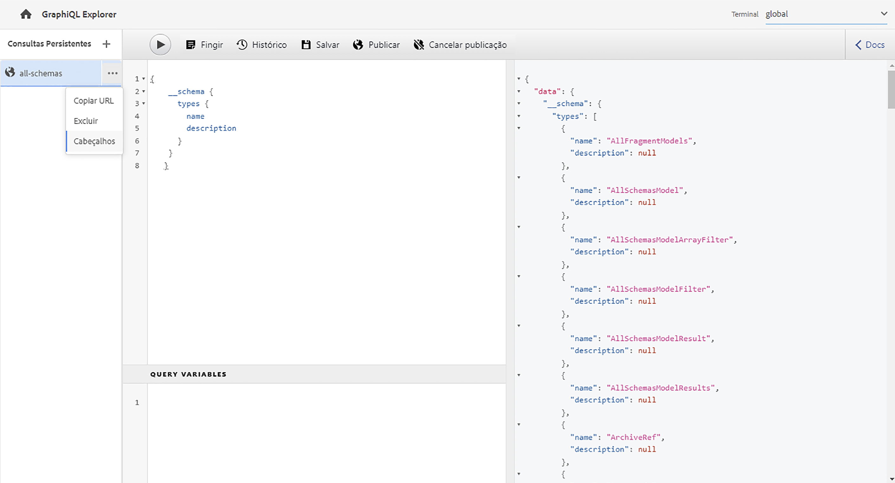
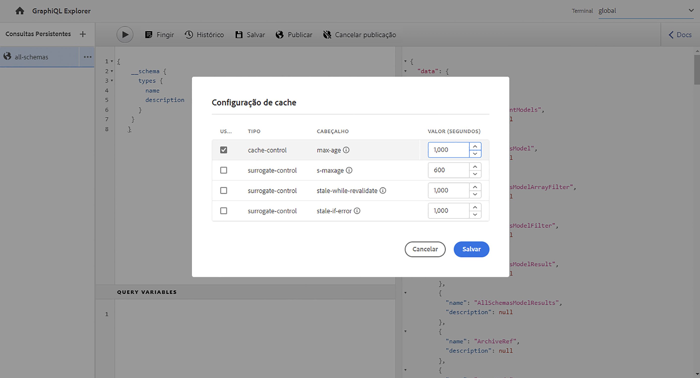
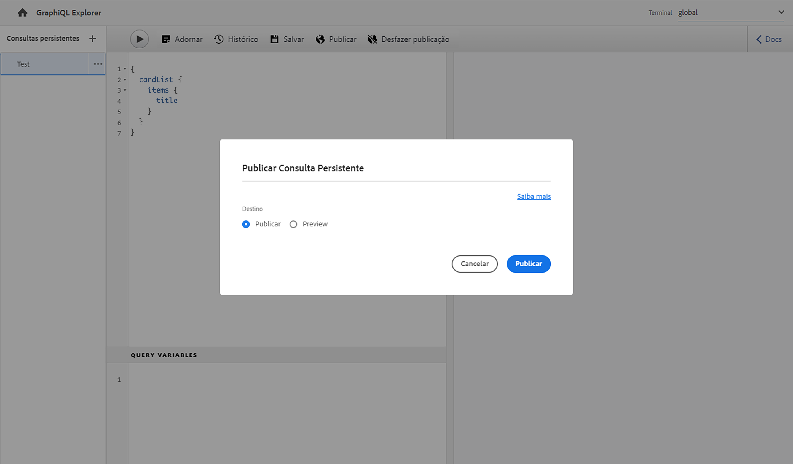
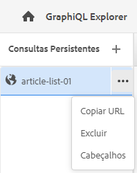

# Uso do GraphiQL IDE {#graphiql-ide}

Uma implementação do [GraphiQL](https://graphql.org/learn/serving-over-http/#graphiql) IDE padrão está disponível para uso com a API GraphQL do Adobe Experience Manager (AEM) as a Cloud Service.

>[!NOTE]
>
>O GraphiQL é incluído em todos os ambientes do AEM (mas só se torna acessível/visível quando você configura os pontos de acesso).
>
>Em versões anteriores, era necessário um pacote para instalar o GraphiQL IDE. Se você o instalou, agora é possível removê-lo.

>[!NOTE]
>Você deve [configurar os endpoints](/help/headless/graphql-api/graphql-endpoint.md) no [navegador de configuração](/help/sites-cloud/administering/content-fragments/setup.md#enable-content-fragment-functionality-configuration-browser) antes de usar o GraphiQL IDE.

A ferramenta **GraphiQL** permite testar e depurar as consultas do GraphQL, permitindo:

* selecionar o **endpoint** apropriado à configuração de Sites que deseja usar para as consultas
* inserir diretamente novas consultas
* criar e acessar **[consultas persistentes](/help/headless/graphql-api/persisted-queries.md)**
* executar as consultas para ver os resultados imediatamente
* gerenciar **variáveis de consulta**
* salvar e gerenciar **consultas persistentes**
* publicar ou desfazer a publicação de **consultas persistentes** no serviço de **Publicação** ou **Visualização**; por exemplo, para/de `dev-publish`
* consultar o **histórico** de consultas anteriores
* usar o **Explorador de documentação** para acessar a documentação; ajudando você a conhecer e entender quais métodos estão disponíveis.

É possível acessar o editor de consultas por meio de:

* **Ferramentas** > **Geral** > **Editor de Consultas do GraphQL**
* diretamente; por exemplo, `http://localhost:4502/aem/graphiql.html`

Você pode usar o GraphiQL no sistema para que as consultas possam ser solicitadas pelo aplicativo cliente usando solicitações GET e para publicar consultas. Para o uso em produção, é possível [mover as consultas para o ambiente de produção](/help/headless/graphql-api/persisted-queries.md#transfer-persisted-query-production). Inicialmente ao autor de produção para validação do conteúdo recém-criado com as consultas e, finalmente, à produção de publicação para consumo em tempo real.

## Seleção do endpoint {#selecting-endpoint}

Como primeira etapa, é preciso selecionar o **[endpoint](/help/headless/graphql-api/graphql-endpoint.md)** que deseja usar para as consultas. O endpoint é apropriado para a configuração dos Sites que você deseja usar para as consultas.

Isso está disponível na lista suspensa na parte superior direita.

## Criação e persistência de uma nova consulta {#creating-new-query}

Você pode inserir a nova consulta no editor, que está no painel central esquerdo, diretamente sob o logotipo do GraphiQL.

>[!NOTE]
>
>Se você tiver uma consulta persistente já selecionada que está sendo exibida no painel do editor, selecione `+` (ao lado de **Consultas persistentes**) para esvaziar o editor para sua nova consulta.

Basta começar a digitar. O editor também:

* mostra informações adicionais sobre os elementos ao passar o mouse sobre eles
* fornece recursos como realce de sintaxe, preenchimento automático, sugestão automática

>[!NOTE]
>
>As consultas de GraphQL normalmente começam com um caractere `{`.
>
>Linhas que começam com `#` são ignoradas.

Use a opção **Salvar como** para criar uma consulta persistente.

## Atualização da consulta persistente {#updating-persisted-query}

Selecione a consulta que deseja atualizar na lista do painel **Consultas persistentes** (lado esquerdo).

A consulta será exibida no painel do editor. Faça as alterações necessárias e use a opção **Salvar** para confirmar as atualizações da consulta persistente.

## Execução de consultas {#running-queries}

Você pode executar uma nova consulta imediatamente ou pode carregar e executar uma consulta persistente. Para carregar uma consulta persistente, selecione-a na lista; a consulta será exibida no painel do editor.

Em ambos os casos, a consulta exibida no painel do editor é a que será executada quando você:

* selecione no ícone **Executar Consulta**
* usar a combinação de teclado `Control-Enter`

## Variáveis de consulta {#query-variables}

O GraphiQL IDE também permite gerenciar suas [Variáveis de consulta](/help/headless/graphql-api/content-fragments.md#graphql-variables).

Por exemplo:

## Gerenciamento do cache para suas consultas persistentes {#managing-cache}

[Consultas persistentes](/help/headless/graphql-api/persisted-queries.md) são recomendadas, pois elas podem ser armazenadas em cache nas camadas do Dispatcher e CDN, melhorando o desempenho do aplicativo cliente solicitante. Por padrão, o AEM invalidará o cache da rede de entrega de conteúdo (CDN) com base em um TTL (Time To Live) padrão.

>[!NOTE]
>
>Consulte [Armazenamento em cache de consultas persistentes](/help/headless/graphql-api/persisted-queries.md#caching-persisted-queries).

>[!NOTE]
>
>As regras de regravação personalizadas no Dispatcher podem substituir as configurações de publicação padrão do AEM.
>
>Caso esteja enviando cabeçalhos de controle de cache com base em TTL do dispatcher, com base em um padrão de correspondência de local, se necessário, você pode excluir `/graphql/execute.json/*` das correspondências.

Ao usar o GraphQL, é possível configurar os cabeçalhos de cache HTTP para controlar esses parâmetros para sua consulta persistente individual.

1. A opção **Cabeçalhos** também é acessível por meio dos três pontos verticais à direita do nome da consulta persistente (painel à esquerda):

   

1. Selecionar essa opção abre a caixa de diálogo **Configuração de Cache**:

   

1. Selecione o parâmetro apropriado e ajuste o valor conforme necessário:

   * **cache-control** - **max-age**
Os caches podem armazenar esse conteúdo por um número especificado de segundos. Normalmente, esse é o TTL (Time To Live) do navegador.
   * **surrogate-control** - **s-maxage** 
Igual a max-age, mas aplica-se especificamente a caches de proxy.
   * **surrogate-control** - **stale-while-revalidate**
Os caches podem continuar a servir uma resposta em cache depois que ela se tornar obsoleta, por um número especificado de segundos.
   * **surrogate-control** - **stale-if-error**
Os caches podem continuar a servir uma resposta em cache em caso de erro de origem, por um número especificado de segundos.

1. Selecione **Salvar** para confirmar as alterações.

## Publicação e visualização de consultas persistentes {#publishing-previewing-persisted-queries}

Depois de selecionar a consulta persistente na lista (painel esquerdo), você pode usar a ação **Publicar**.

Essa ação ativa a consulta no ambiente selecionado. Você pode escolher o ambiente de **Publicação** (por exemplo, `dev-publish`) ou o ambiente de **Visualização** para facilitar o acesso através de seus aplicativos durante os testes.

>[!NOTE]
>
>A definição do cache da consulta persistente `Time To Live` {&quot;cache-control&quot;:&quot;parameter&quot;:value} tem um valor padrão de 2 horas (7200 segundos).

## Desfazer a publicação de consultas persistentes {#unpublishing-persisted-queries}

Assim como ocorre na publicação, depois de selecionar a consulta persistente na lista (painel esquerdo), você pode usar a ação **Desfazer publicação**.

Essa ação desativa a consulta no ambiente selecionado, seja o ambiente de **Publicação** ou de **Visualização**.

>[!NOTE]
>
>Você também deve verificar se fez as alterações necessárias no aplicativo cliente para evitar possíveis problemas.

## Copiar o URL para acessar a consulta diretamente {#copy-url}

A opção **Copiar URL** permite simular uma consulta copiando a URL usada para acessar diretamente a consulta persistente e ver os resultados. Essa opção pode ser usada para testes; por exemplo, acessando em um navegador:

<!--
  >[!NOTE]
  >
  >The URL needs [encoding before using programmatically](/help/headless/graphql-api/persisted-queries.md#encoding-query-url).
  >
  >The target environment might need adjusting, depending on your requirements.
-->

Por exemplo:

`http://localhost:4502/graphql/execute.json/global/article-list-01`

Ao usar esse URL em um navegador, é possível confirmar os resultados:

A opção **Copiar URL** é acessível por meio dos três pontos verticais à direita do nome da consulta persistente (painel à esquerda):

## Exclusão de consultas persistentes {#deleting-persisted-queries}

A opção **Excluir** também é acessível por meio dos três pontos verticais à direita do nome da consulta persistente (painel à esquerda).

<!-- what happens if you try to delete something that is still published? -->

## Instalação da consulta persistente na produção {#installing-persisted-query-production}

Depois de desenvolver e testar a consulta persistente com o GraphiQL, o objetivo final é [transferi-la para o ambiente de produção](/help/headless/graphql-api/persisted-queries.md#transfer-persisted-query-production) para que os aplicativos possam usá-la.

## Atalhos de teclado {#keyboard-shortcuts}

Há uma série de atalhos de teclado que fornecem acesso direto aos ícones de ação no IDE:

* Adornar a consulta: `Shift-Control-P`
* Mesclar consulta: `Shift-Control-M`
* Executar consulta: `Control-Enter`
* Preenchimento automático: `Control-Space`

>[!NOTE]
>
>Em alguns teclados, a tecla `Control` é rotulada como `Ctrl`.
