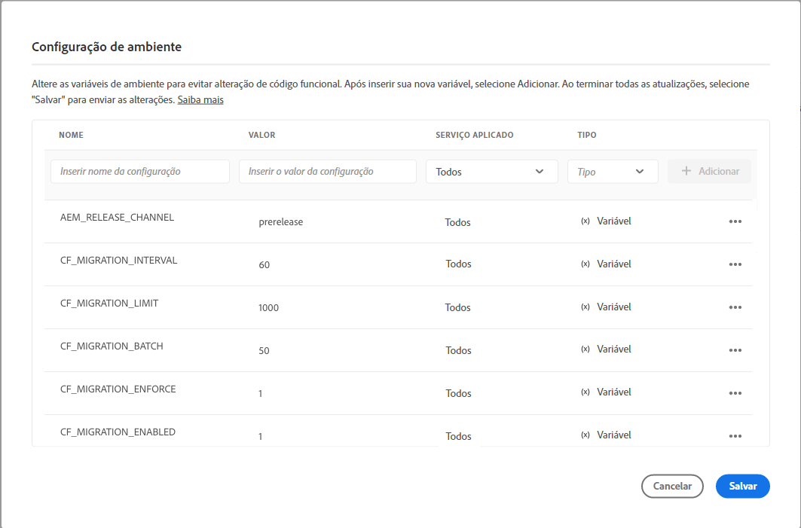

# Atualizar fragmentos de conteúdo para a filtragem otimizada de GraphQL {#updating-content-fragments-for-optimized-graphql-filtering}

Para otimizar o desempenho dos filtros do GraphQL, execute um procedimento para atualizar os Fragmentos de conteúdo.

>[!NOTE]
>
>Depois de atualizar os fragmentos de conteúdo, você pode seguir as recomendações para [Otimização de consultas do GraphQL](/help/headless/graphql-api/graphql-optimization.md).


## Pré-requisitos {#prerequisites}

Existem pré-requisitos para esta tarefa:

1. Certifique-se de ter no mínimo a versão 2023.1.0 do AEM as a Cloud Service.

1. Certifique-se de que o usuário que executa a tarefa tenha as permissões necessárias:

   * no mínimo, a variável `Deployment Manager` no Cloud Manager é necessária.

## Atualização dos fragmentos de conteúdo {#updating-content-fragments}

1. Ative a atualização definindo as seguintes variáveis na sua instância usando a interface do Cloud Manager:

   

   As variáveis disponíveis são:

   | | Nome | Valor | Valor padrão | Serviço | Aplicado | Tipo | Notas |
   |---|---|---|---|---|---|---|---|
   | 1 | `CF_MIGRATION_ENABLED` | `1` | `0` | Todos | | Variável | Habilita(!=0) ou desabilita(0) o acionamento do processo de migração do fragmento de conteúdo. |
   | 2 | `CF_MIGRATION_ENFORCE` | `1` | `0` | Todos | | Variável | Força (!=0) remigração de fragmentos de conteúdo. Definir esse sinalizador como 0 faz uma migração incremental de CFs. Isso significa que, se o trabalho for encerrado por qualquer motivo, a próxima execução do trabalho iniciará a migração a partir do ponto em que foi encerrado. A primeira migração é recomendada para imposição (valor=1). |
   | 3 | `CF_MIGRATION_BATCH` | `50` | `50` | Todos | | Variável | Tamanho do lote para salvar o número de Fragmentos de conteúdo após a migração. Isso é relevante para quantos CFs são salvos no repositório em um lote e pode ser usado para otimizar o número de gravações no repositório. |
   | 4 | `CF_MIGRATION_LIMIT` | `1000` | `1000` | Todos | | Variável | Número máximo de fragmentos de conteúdo a serem processados de cada vez. Consulte também as notas para `CF_MIGRATION_INTERVAL`. |
   | 5 | `CF_MIGRATION_INTERVAL` | `60` | `600` | Todos | | Variável | Intervalo (segundos) para processar os fragmentos de conteúdo restantes até o próximo limite. Esse intervalo também é considerado como um tempo de espera antes de iniciar o processo e um atraso entre o processamento de cada número de CFs CF_MIGRATION_LIMIT subsequente. (*) |

   <!--
   <table style="table-layout:auto">
    <tbody>
     <tr>
      <th>&nbsp;</th>
      <th>Name</th>
      <th>Value</th>
      <th>Default Value</th>
      <th>Service</th>
      <th>Applied</th>
      <th>Type</th>
      <th>Notes</th>
     </tr>

     <tr>
      <td>1</td>
      <td>`CF_MIGRATION_ENABLED` </td>
      <td>`1` </td>
      <td>`0` </td>
      <td>All </td>
      <td> </td>
      <td>Variable </td>
      <td>Enables(!=0) or disables(0) triggering of Content Fragment migration job. </td>
     </tr>
     <tr>
      <td>2</td>
      <td>`CF_MIGRATION_ENFORCE` </td>
      <td>`1` </td>
      <td>`0` </td>
      <td>All </td>
      <td> </td>
      <td>Variable </td>
      <td>Enforce (!=0) remigration of Content Fragments.<br>Setting this flag to 0 does an incremental migration of CFs. This means, if the job is terminated for any reason, then the next run of the job starts migration from the point where it got terminated. The first migration is recommended for enforcement (value=1). </td>
     </tr>
     <tr>
      <td>3</td>
      <td>`CF_MIGRATION_BATCH` </td>
      <td>`50` </td>
      <td>`50` </td>
      <td>All </td>
      <td> </td>
      <td>Variable </td>
      <td>Size of the batch for saving the number of Content Fragments after migration.<br>This is relevant to how many CFs are saved to the repository in one batch, and can be used to optimize the number of writes to the repository. </td>
     </tr>
     <tr>
      <td>4</td>
      <td>`CF_MIGRATION_LIMIT` </td>
      <td>`1000` </td>
      <td>`1000` </td>
      <td>All </td>
      <td> </td>
      <td>Variable </td>
      <td>Max number of Content Fragments to process at a time.<br>See also notes for `CF_MIGRATION_INTERVAL`. </td>
     </tr>
     <tr>
      <td>5</td>
      <td>`CF_MIGRATION_INTERVAL` </td>
      <td>`60` </td>
      <td>`600` </td>
      <td>All </td>
      <td> </td>
      <td>Variable </td>
      <td>Interval (seconds) to process the remaining Content Fragments up until the next Limit<br>This interval is also considered as both a wait-time before starting the job, and a delay between processing of each subsequent CF_MIGRATION_LIMIT number of CFs.<br>(*)</td>
     </tr>
    </tbody>
   </table>
   -->

   >[!NOTE]
   >
   >(*)
   >
   >O valor de `CF_MIGRATION_INTERVAL` também pode ajudar a aproximar o tempo total de execução do processo de migração.
   >
   >Por exemplo:
   >
   >* Número total de fragmentos de conteúdo = 20.000
   >* CF_MIGRATION_LIMIT = 1000
   >* CF_MIGRATION_INTERNAL = 60 (Segundos)
   >* Tempo aproximado necessário para concluir a migração = 60 + (20.000/1.000 * 60) = 1.260 Segundos = 21 Minutos
   >  Os “60” segundos adicionais no início se devem ao atraso inicial ao iniciar o processo.
   >
   >Esta é apenas a *mínimo* tempo necessário para concluir o trabalho, e não inclui o tempo de E/S. O tempo real gasto pode ser maior do que essa estimativa.

1. Monitore o progresso e a conclusão da atualização.

   Para fazer isso, monitore os logs no autor e na publicação ouro de:

   * `com.adobe.cq.dam.cfm.impl.upgrade.UpgradeJob`

      * Logs do autor; por exemplo:

        ```shell
        23.01.2023 13:13:45.926 *INFO* [sling-threadpool-09cbdb47-4d99-4c4c-b6d5-781b635ee21b-(apache-sling-job-thread-pool)-1-Content Fragment Upgrade Job Queue Config(cfm/upgrader)] com.adobe.cq.dam.cfm.impl.upgrade.UpgradeJob This instance<dd9ffdc1-0c28-4d04-9a96-5d4d223e457e> is the leader, will schedule the upgrade schedule job.
        ...
        23.01.2023 13:13:45.941 *INFO* [sling-threadpool-09cbdb47-4d99-4c4c-b6d5-781b635ee21b-(apache-sling-job-thread-pool)-1-Content Fragment Upgrade Job Queue Config(cfm/upgrader)] com.adobe.cq.dam.cfm.impl.upgrade.UpgradeJob Scheduling content fragments upgrade from version 0 to 1, slingJobId: 2023/1/23/13/13/50e1a575-4cd7-497b-adf0-62cb5768eedb_0, enforce: true, limit: 1000, batch: 50, interval: 60s
        
        23.01.2023 13:20:40.960 *INFO* [sling-threadpool-09cbdb47-4d99-4c4c-b6d5-781b635ee21b-(apache-sling-job-thread-pool)-1-Content Fragment Upgrade Job Queue Config(cfm/upgrader)] com.adobe.cq.dam.cfm.impl.upgrade.UpgradeJob Finished content fragments upgrade in 6m, slingJobId: 2023/1/23/13/13/50e1a575-4cd7-497b-adf0-62cb5768eedb_0, status: MaintenanceJobStatus{jobState=SUCCEEDED, statusMessage='Upgrade to version '1' succeeded.', errors=[], successCount=3781, failedCount=0, skippedCount=0}
        ```

      * Logs de publicação ouro; por exemplo:

        ```shell
        23.01.2023 12:35:05.150 *INFO* [sling-threadpool-8abcc1bb-cdcb-46d4-8565-942ad8a73209-(apache-sling-job-thread-pool)-1-Content Fragment Upgrade Job Queue Config(cfm/upgrader)] com.adobe.cq.dam.cfm.impl.upgrade.UpgradeJob This instance<ad1b399e-77be-408e-bc3f-57097498fddb> is the leader, will schedule the upgrade schedule job.
        
        23.01.2023 12:35:05.161 *INFO* [sling-threadpool-8abcc1bb-cdcb-46d4-8565-942ad8a73209-(apache-sling-job-thread-pool)-1-Content Fragment Upgrade Job Queue Config(cfm/upgrader)] com.adobe.cq.dam.cfm.impl.upgrade.UpgradeJob Scheduling content fragments upgrade from version 0 to 1, slingJobId: 2023/1/23/12/34/ad1b399e-77be-408e-bc3f-57097498fddb_0, enforce: true, limit: 1000, batch: 50, interval: 60s
        ...
        23.01.2023 12:40:45.180 *INFO* [sling-threadpool-8abcc1bb-cdcb-46d4-8565-942ad8a73209-(apache-sling-job-thread-pool)-1-Content Fragment Upgrade Job Queue Config(cfm/upgrader)] com.adobe.cq.dam.cfm.impl.upgrade.UpgradeJob Finished content fragments upgrade in 5m, slingJobId: 2023/1/23/12/34/ad1b399e-77be-408e-bc3f-57097498fddb_0, status: MaintenanceJobStatus{jobState=SUCCEEDED, statusMessage='Upgrade to version '1' succeeded.', errors=[], successCount=3781, failedCount=0, skippedCount=0}
        ```

   Os clientes que habilitaram o acesso aos logs do ambiente usando o Splunk podem usar a consulta de exemplo abaixo para monitorar o processo de atualização. Para obter detalhes sobre como ativar o registro do Splunk, consulte [Depuração da produção e do preparo](/help/implementing/developing/introduction/logging.md#debugging-production-and-stage).

   ```splunk
   index=<indexName> sourcetype=aemerror aem_envId=<environmentId> msg="*com.adobe.cq.dam.cfm.impl.upgrade.UpgradeJob Finished*" 
   (aem_tier=golden-publish OR aem_tier=author) | table _time aem_tier pod_name msg | sort -_time desc
   ```

   Em que:

   * `environmentId` - um identificador de ambiente do cliente; por exemplo, `e1234`
   * `indexName` - um nome de índice de cliente, reunindo `aemerror` eventos

   Saída de exemplo:

   <table style="table-layout:auto">
     <thead>
       <tr>
       <th>_hora</th>
       <th>aem_tier</th>
       <th>pod_name</th>
       <th>msg</th>
       </tr>
     </thead> 
     <tbody>
       <tr>
         <td>21-04-2023 06:00:35.723</td>
         <td>autor</td>
         <td>cm-p1234-e1234-aem-author-76d6dc4b79-8lsb5</td>
         <td>[sling-threadpool-bb5da4dd-6b05-4230-93ea-1d5cd242e24f-(apache-sling-job-thread-pool)-1-Cofiguração da fila de processos de atualização de fragmento de conteúdo(cfm/atualizador)] com.adobe.cq.dam.cfm.impl.upgrade.UpgradeJob Atualização de fragmentos de conteúdo concluída em 391m, slingJobId: 2023/4/20/23/16/db7963df-e267-489b-b69a-5930b0dadb37_0, status: MaintenanceJobStatus{jobState=SUCCEEDED, statusMessage='Atualizado para versão '1' com sucesso.', errors=[], successCount=36756, failedCount=0, skippedCount=0}</td>
       </tr>
       <tr>
         <td>21-04-2023 06:05:48.207</td>
         <td>golden-publish</td>
         <td>cm-p1234-e1234-aem-golden-publish-644487c9c5-lvkv2</td>
         <td>[sling-threadpool-284b9a9a-8454-461e-9bdb-44866c6ddfb1-(apache-sling-job-thread-pool)-1-Cofiguração da fila de processos de atualização de fragmento de conteúdo(cfm/atualizador)] com.adobe.cq.dam.cfm.impl.upgrade.UpgradeJob Atualização de fragmentos de conteúdo concluída em 211m, slingJobId: 2023/4/20/23/15/66c1690a-cdb7-4e66-bc52-90f33394ddfc_0, status: MaintenanceJobStatus{jobState=SUCCEEDED, statusMessage='Atualizado para versão '1' com sucesso.', errors=[], successCount=19557, failedCount=0, skippedCount=0}</td>
       </tr>
     </tbody>
   <table>

1. Desative o procedimento de atualização.

   >[!IMPORTANT]
   >
   >Esta etapa é necessária para concluir a atualização.

   Depois que o procedimento de atualização for executado, redefina a variável `CF_MIGRATION_ENABLED` do ambiente de nuvem para “0”, para acionar a reciclagem de todos os pods.

   | | Nome | Valor | Valor padrão | Serviço | Aplicado | Tipo | Notas |
   |---|---|---|---|---|---|---|---|
   | | `CF_MIGRATION_ENABLED` | `0` | `0` | Todos | | Variável | Desativa(0) (ou ativa(!=0)) o acionamento do processo de migração do fragmento de conteúdo. |

   <!--
   <table style="table-layout:auto">
    <tbody>
     <tr>
      <th>&nbsp;</th>
      <th>Name</th>
      <th>Value</th>
      <th>Default Value</th>
      <th>Service</th>
      <th>Applied</th>
      <th>Type</th>
      <th>Notes</th>
     </tr>
     <tr>
      <td></td>
      <td>`CF_MIGRATION_ENABLED` </td>
      <td>`0` </td>
      <td>`0` </td>
      <td>All </td>
      <td> </td>
      <td>Variable </td>
      <td>Disables(0) (or Enables(!=0)) triggering of Content Fragment migration job. </td>
     </tr>
    </tbody>
   </table>
   -->

   >[!NOTE]
   >
   >Isso é importante para o nível de publicação, pois a atualização de conteúdo é feita apenas na publicação golden e, durante a reciclagem de pods, todos os pods de publicação normais se baseiam na publicação golden.

1. Verifique a conclusão do procedimento de atualização.

   Você pode verificar se a atualização foi concluída com sucesso usando o navegador do repositório no console do desenvolvedor do Cloud Manager para verificar os dados do fragmento de conteúdo.

   * Antes da primeira migração completa, a variável `cfGlobalVersion` a propriedade não existe.
Portanto, a presença dessa propriedade no nó `/content/dam` do JCR, com um valor de `1`, confirma a conclusão da migração.

   * Você também pode verificar as seguintes propriedades nos fragmentos de conteúdo individuais:

      * `_strucVersion` deve ter o valor de `1`
      * A estrutura `indexedData` deve existir

     >[!NOTE]
     >
     >O procedimento atualiza os fragmentos de conteúdo nas instâncias do Autor e do Publish.
     >
     >Portanto, a Adobe recomenda que você execute a verificação por meio do navegador de repositório para *pelo menos* um autor *e* uma instância do Publish.

## Limitações {#limitations}

Observe as seguintes limitações:

* A otimização do desempenho dos filtros do GraphQL só é possível após uma atualização completa de todos os fragmentos de conteúdo (indicada pela presença da variável `cfGlobalVersion` propriedade para o nó JCR `/content/dam`)

* Se os fragmentos de conteúdo forem importados de um pacote de conteúdo (usando `crx/de`) depois que o procedimento de atualização for executado, esses fragmentos de conteúdo não serão considerados nos resultados da consulta do GraphQL até que o procedimento de atualização seja executado novamente.
