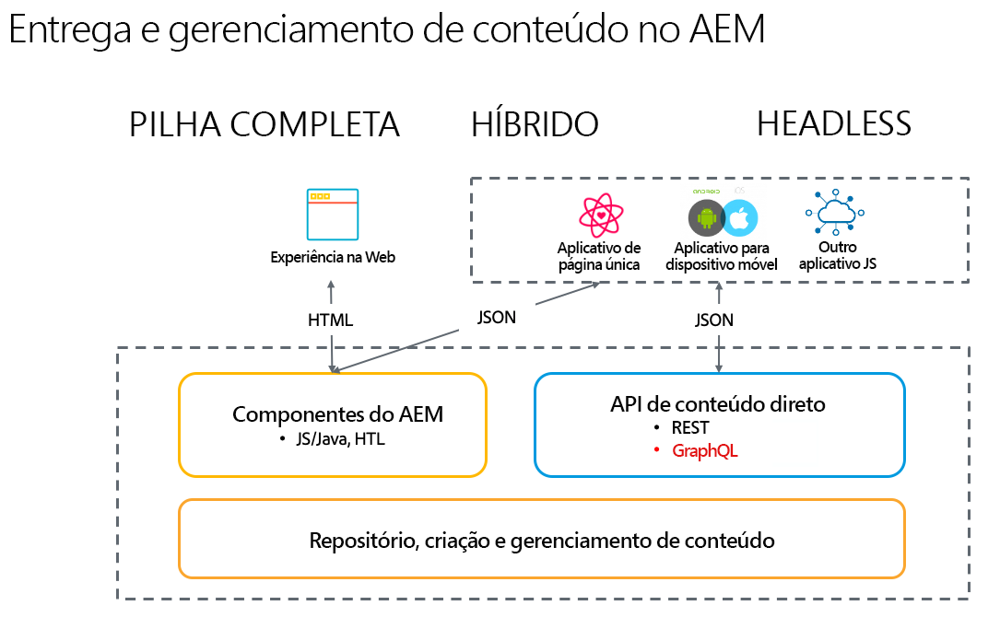

# Introdução ao Adobe Experience Manager as a Headless CMS {#introduction-aem-headless}

Saiba como utilizar o Adobe Experience Manager (AEM) como um sistema de gerenciamento de conteúdo (CMS) headless, por meio de recursos como modelos de fragmentos de conteúdo, fragmentos de conteúdo e a API GraphQL que potencializam as experiências headless em escala.

Você pode ler a documentação detalhada dos vários recursos envolvidos e/ou seguir a seleção de [jornadas headless para obter uma visão geral dos primeiros passos](#first-steps).

>[!NOTE]
>
>Consulte também [O que é Headless?](/help/headless/what-is-headless.md) para obter uma introdução a conceitos e terminologia sobre headless.

## Visão geral {#overview}

O AEM Headless é uma solução CMS do Experience Manager que permite que o conteúdo estruturado (Fragmentos de conteúdo) no AEM seja consumido por qualquer aplicativo via HTTP, usando GraphQL. As implementações headless permitem a entrega de experiências entre plataformas e canais em escala.

A implementação headless abre mão do gerenciamento de páginas e componentes, como é tradicional em soluções de pilha completa e híbridas. Em troca, ele se concentra na criação de fragmentos de conteúdo reutilizáveis e que não favorecem canais específicos, bem como na entrega entre canais. É um padrão de desenvolvimento moderno e dinâmico para implementar experiências na web.

## Recursos {#aem-headless-features}

O AEM as a Cloud Service é uma ferramenta flexível para o modelo de implementação headless, oferecendo três recursos avançados:

1. **Modelos de fragmentos do conteúdo**
   * Os modelos de fragmentos de conteúdo são representações estruturadas do conteúdo.
   * Modelos de fragmentos de conteúdo são definidos pelos arquitetos de informações no Editor de modelos de fragmento de conteúdo do AEM.
   * Os modelos de fragmentos de conteúdo funcionam como uma base para os fragmentos de conteúdo.
1. **Fragmentos de conteúdo**
   * Um fragmento de conteúdo é criado com base em um modelo de fragmento de conteúdo.
   * Os fragmentos de conteúdo são criados por autores de conteúdo, com a ajuda do Editor de fragmentos de conteúdo do AEM.
   * Os fragmentos de conteúdo são armazenados no AEM Assets, mas podem ser gerenciados tanto pelo console do Assets quanto pelo [Console de fragmentos de conteúdo](/help/sites-cloud/administering/content-fragments/overview.md#content-fragments-console).
1. **API de conteúdo para entrega**
   * Consulte [APIs do AEM para Entrega e Gerenciamento de Conteúdo Estruturado](/help/headless/apis-headless-and-content-fragments.md) para obter uma visão geral das várias APIs disponíveis e uma comparação de alguns dos conceitos envolvidos.

   * A entrega direta de conteúdo também é possível com a [exportação em JSON do componente principal do fragmento de conteúdo](https://experienceleague.adobe.com/docs/experience-manager-core-components/using/components/content-fragment-component.html?lang=pt-BR).

## Primeiros passos {#first-steps}

Há vários recursos disponíveis para oferecer uma introdução às funcionalidades headless do AEM. Cada guia é personalizado para diferentes casos de uso e públicos-alvos.

| Recurso | Descrição | Tipo | Público-alvo | Est. Hora |
|---|---|---|---|---|
| [Jornada de desenvolvedores headless](/help/journey-headless/developer/overview.md) | **Para desenvolvedores novatos no AEM e em tecnologias headless**: comecem aqui para obter uma introdução abrangente ao AEM e seus recursos headless, desde a teoria do headless até a inauguração do seu primeiro projeto headless. | Guia | Desenvolvedores **novatos no AEM e no headless** | 1 hora |
| [Configuração do headless](/help/headless/setup/introduction.md) | **Para usuários experientes do AEM** que precisam de um breve resumo dos principais recursos headless do AEM, confira esta visão geral de início rápido. | Configuração de referência | Desenvolvedores e administradores **com experiência no AEM** | 20 minutos |
| [Tutorial prático do headless](https://experienceleague.adobe.com/docs/experience-manager-learn/getting-started-with-aem-headless/graphql/multi-step/overview.html?lang=pt-BR) | **Se estiver familiarizado com o AEM e preferir uma abordagem prática**, este tutorial aborda diretamente a implementação de um aplicativo headless simples. | Tutorial | Desenvolvedores | 2 horas |
| [Jornada do arquiteto headless](/help/journey-headless/architect/overview.md) | **Para arquitetos novatos no AEM e em tecnologias headless**: comecem aqui para obter uma introdução aos recursos avançados, flexíveis e headless do Adobe Experience Manager as a Cloud Service e aprender como modelar conteúdo para seu projeto. | Guia | Arquitetos | 1 hora |
| [Jornada de criação headless](/help/journey-headless/author/overview.md) | **Para usuários empresariais novatos no AEM e em tecnologias headless**: comecem aqui para obter uma introdução aos recursos avançados, flexíveis e headless do Adobe Experience Manager as a Cloud Service e aprender como modelar conteúdo para seu projeto. | Guia | Criadores de conteúdo | 1 hora |
| [Jornada de tradução headless](/help/journey-headless/translation/overview.md) | Para os **interessados na abordagem de tradução ao headless do AEM**. Saiba mais sobre tecnologias headless e como criar e atualizar projetos de tradução no AEM, de A a Z. | Guia | Especialistas em tradução | 1 hora |

## Comparação entre headful e headless {#headful-headless}

Este guia tem como foco o modelo completo de implementação headless do AEM. No entanto, &quot;headful ou headless&quot; não precisa ser uma escolha binária no AEM. Os recursos headless podem ser usados para gerenciar e entregar conteúdo a vários pontos de contato, além de permitir que os autores de conteúdo editem aplicativos de página única. Tudo no AEM.

>[!TIP]
>
>Consulte o documento [Headful e Headless no AEM](/help/implementing/developing/headful-headless.md) para obter mais informações.
