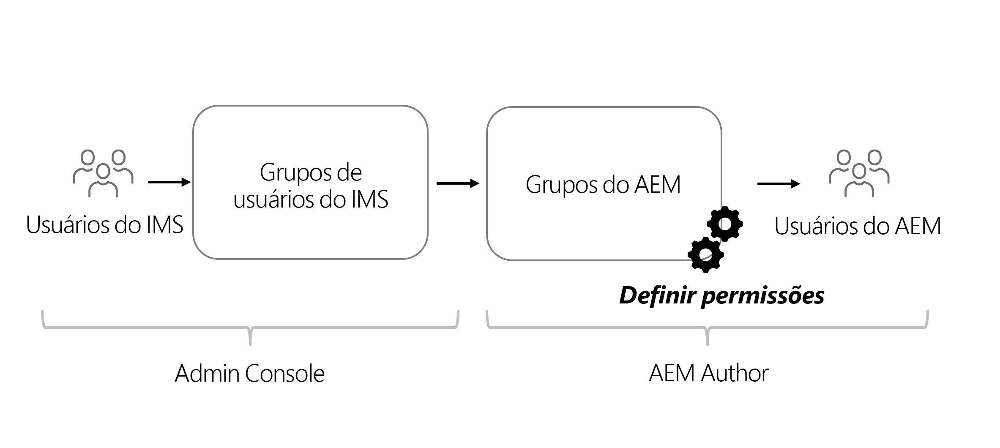

# Considerações de permissão para conteúdo headless

Com uma implementação headless, há várias áreas de segurança e permissões que devem ser abordadas. As permissões e os perfis podem ser amplamente considerados com base no **Autor** ou **Publicação** de ambiente do AEM. Cada ambiente contém perfis diferentes e com necessidades diferentes.

## Considerações sobre o serviço de Autor

O serviço de Autor é onde os usuários internos criam, gerenciam e publicam conteúdo. As permissões giram em torno de diferentes perfis que gerenciam conteúdo.

### Gerenciar permissões no nível do Grupo

Como prática recomendada, as permissões devem ser definidas em Grupos no AEM. Também conhecidos como grupos locais, esses grupos podem ser gerenciados no ambiente de autor do AEM.

A maneira mais fácil de gerenciar a associação de grupo é usar grupos do Identity Management System (IMS) da Adobe e atribuir [grupos IMS para grupos AEM locais](https://experienceleague.adobe.com/docs/experience-manager-cloud-service/content/security/ims-support.html#managing-permissions-in-aem).

Em um alto nível, o processo é:

1. Adicionar usuários do IMS a um grupo de usuários do IMS novo ou existente usando o [Admin Console](https://adminconsole.adobe.com/).
1. Os grupos IMS são sincronizados com o AEM quando os usuários fazem logon.
1. Atribuir grupos IMS a grupos AEM.
1. Definir permissões em grupos AEM.
1. Quando os usuários fazem logon no AEM e são autenticados por meio do IMS, eles herdam as permissões do grupo AEM.

>[!TIP]
>
> Uma apresentação detalhada em vídeo sobre o gerenciamento de usuários e grupos de IMS e AEM pode ser encontrada [here](https://experienceleague.adobe.com/docs/experience-manager-learn/cloud-service/accessing/overview.html?lang=pt-BR).

Para gerenciar **grupos** no AEM, navegue até **Ferramentas** > **Segurança** > **Grupos**.

Para gerenciar permissões de grupos no AEM, navegue até **Ferramentas** > **Segurança** > **Permissões**.

### Usuários do DAM

&quot;DAM&quot;, neste contexto, significa Gerenciamento de ativos digitais. **Usuários DAM** é um grupo pronto para uso no AEM, que pode ser usado para usuários &quot;comuns&quot; que gerenciam ativos digitais e fragmentos de conteúdo. Esse grupo fornece permissões para **exibir**, **adicionar**, **atualizar**, **excluir** e **publicar** fragmentos de conteúdo e todos os outros arquivos no AEM Assets.

Se estiver usando o IMS para associação de grupo, adicione os grupos IMS apropriados como membros do grupo **Usuários DAM**. Os membros do grupo IMS herdam as permissões do grupo Usuários DAM ao fazer logon no ambiente do AEM.

#### Personalizar grupo de Usuários DAM

É melhor não modificar diretamente as permissões de um grupo pronto para uso. Em vez disso, você também pode criar seu(s) próprio(s) grupo(s) modelado(s) a partir das permissões do grupo **Usuários DAM** e restringir ainda mais o acesso a diferentes **pastas** no AEM Assets.

Para obter permissões mais específicas, use o console **Permissões** no AEM e atualize o caminho `/content/dam` para um caminho mais específico, ou seja, `/content/dam/mycontentfragments`.

Pode ser desejável conceder permissões para criar e editar fragmentos de conteúdo, mas não excluir, a esse grupo de usuários. Para revisar e atribuir permissões para edição, mas não para exclusão, consulte [Fragmentos de conteúdo - excluir considerações](/help/sites-cloud/administering/content-fragments/delete-considerations.md).

### Editores de modelo

A capacidade de modificar **modelos do Fragmento do conteúdo** deve ser deixada para administradores ou um **grupo pequeno** de usuários com permissões elevadas. A modificação do modelo do Fragmento do conteúdo tem muitos efeitos de downstream.

>[!CAUTION]
>
>As modificações nos modelos do Fragmento do conteúdo alteram a API GraphQL subjacente da qual os aplicativos headless dependem.

Se quiser criar um grupo que gerencie os modelos do fragmento de conteúdo, mas não tenha acesso completo do administrador, você pode criar um grupo com as seguintes entradas de controle de acesso:

| Caminho | Permissão | Privilégios |
|-----| -------------| ---------|
| `/conf` | **permitir** | `jcr:read` |
| `/conf/<config-name>/settings/dam/cfm` | **permitir** | `rep:write`, `crx:replicate` |

## Publicar permissões de serviço

O serviço de Publicação é considerado o ambiente de “produção” e normalmente é com ele que os consumidores da API GraphQL interagem. O conteúdo, após ser editado e aprovado no serviço do Autor, é publicado no serviço de Publicação. O aplicativo headless consome o conteúdo aprovado do serviço de Publicação por meio das APIs GraphQL.

Por padrão, o conteúdo exposto por meio dos endpoints de GraphQL do serviço de publicação do AEM é acessível a todos, incluindo a usuários não autenticados.

### Permissões de conteúdo

O conteúdo exposto por meio das APIs GraphQL do AEM pode ser restrito usando [Grupos de usuários fechados (CUGs)](https://experienceleague.adobe.com/docs/experience-manager-learn/assets/advanced/closed-user-groups.html?lang=pt-BR) definidos nas pastas de ativos, que especificam quais Grupos de usuários (e seus membros) do AEM podem acessar o conteúdo das pastas de ativos.

Os CUGs de ativos funcionam:

* Primeiro, negando todo o acesso à pasta e às subpastas
* Em seguida, permitindo o acesso de leitura à pasta e às subpastas para todos os Grupos de Usuários do AEM presentes na lista de CUGs

Os CUGs podem ser configurados em pastas de ativos que contêm conteúdo exposto por meio de APIs GraphQL. O acesso às pastas de ativos na publicação do AEM deve ser controlado através de grupos de usuários, em vez de diretamente pelo usuário. Crie (ou reutilize) um grupo de usuários do AEM que conceda acesso à pastas de ativos que contenham conteúdo exposto por APIs GraphQL.

#### Selecione o esquema de autenticação{#publish-permissions-users}

O [SDK do AEM Headless](https://github.com/adobe/aem-headless-client-js#create-aemheadless-client) é compatível com dois tipos de autenticação:

* [Autenticação baseada em token](/help/implementing/developing/introduction/generating-access-tokens-for-server-side-apis.md) usando credenciais de serviço vinculadas a uma única conta técnica.
* Autenticação básica utilizando usuários do AEM.

### Acesse a API GraphQL

Solicitações HTTP que fornecem as [credenciais de autenticação apropriadas](https://github.com/adobe/aem-headless-client-js#create-aemheadless-client) para os endpoints da API GraphQL do serviço de publicação do AEM incluem o conteúdo que as credenciais estão autorizadas a ler e o conteúdo acessível anonimamente. Outros consumidores da API GraphQL não podem ler o conteúdo nas pastas protegidas por CUGs.
