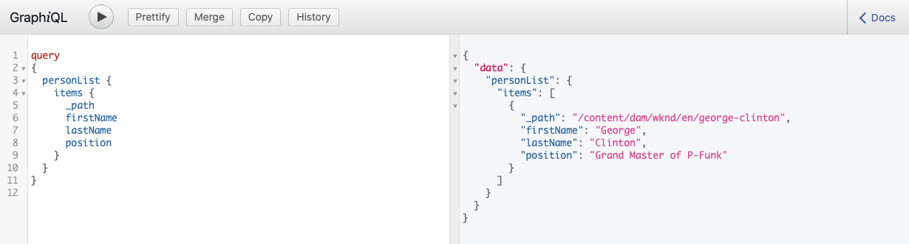

# Criar uma solicitação de API - Configuração Headless {#accessing-delivering-content-fragments}

Saiba como usar a API GraphQL para a entrega headless do conteúdo do Fragmento de conteúdo e a API REST do AEM Assets para gerenciar Fragmentos de conteúdo.

## O que são as APIs REST do GraphQL e do Assets? {#what-are-the-apis}

[Agora que criou alguns fragmentos de conteúdo,](create-content-fragment.md) você pode usar as APIs do AEM para entregá-los de forma headless.

* A [API GraphQL](/help/headless/graphql-api/content-fragments.md) permite criar solicitações para acessar e fornecer Fragmentos de conteúdo. Essa API oferece o conjunto mais robusto de recursos para consultar e consumir conteúdo de Fragmentos de conteúdo.
   * Para usar a API, [defina e habilite os pontos de acesso no AEM](/help/headless/graphql-api/graphql-endpoint.md)e, se necessário, na [Interface GraphiQL instalada](/help/headless/graphql-api/graphiql-ide.md).
* [A API REST do Assets](/help/assets/content-fragments/assets-api-content-fragments.md) permite criar e modificar fragmentos de conteúdo (e outros ativos).

>[!NOTE]
>
>A variável [OpenAPIs de fragmento de conteúdo e modelo de fragmento de conteúdo](/help/headless/content-fragment-openapis.md) também estão disponíveis.

O restante deste guia terá como foco o acesso ao GraphQL e a entrega de Fragmentos de conteúdo.

## Habilitar endpoint GraphQL {#enable-graphql-endpoint}

Para que as APIs GraphQL possam ser usadas, é necessário criar um endpoint GraphQL.

1. Navegue até **Ferramentas**, **Geral** e, em seguida, selecione **GraphQL**.
1. Selecione **Criar**.
1. A caixa de diálogo **Criar novo ponto de acesso de GraphQL** será aberta. Aqui, é possível especificar:
   * **Nome**: nome do endpoint; é possível inserir qualquer texto.
   * **Usar esquema do GraphQL fornecido por**: use a lista suspensa para selecionar a configuração necessária.
1. Confirme com **Criar**.
1. No console, um **Caminho** será exibido com base na configuração criada anteriormente. Esse caminho é usado para executar consultas do GraphQL.

   ```
   /content/cq:graphql/<configuration-name>/endpoint
   ```

Mais detalhes sobre como ativar [endpoints GraphQL podem ser encontrados aqui](/help/headless/graphql-api/graphql-endpoint.md).

## Consultar conteúdo usando GraphQL com o GraphiQL

Os arquitetos da informação projetam consultas para seus pontos de acesso de canal para fornecer conteúdo. Considere essas consultas apenas uma vez por ponto de acesso, por modelo. Para os propósitos deste guia de introdução, só é necessário criar um.

GraphiQL é um IDE, incluído no seu ambiente do AEM; ele se torna acessível/visível após [configurar seus pontos de acesso](#enable-graphql-endpoint).

1. Faça logon no AEM as a Cloud Service e acesse a interface GraphiQL:

   É possível acessar o editor de consultas por meio de:

   * **Ferramentas** > **Geral** > **Editor de consultas GraphQL**
   * diretamente; por exemplo, `http://localhost:4502/aem/graphiql.html`

1. O GraphiQL IDE é um editor de consultas no navegador para GraphQL. Você pode usá-lo para criar consultas para recuperar fragmentos de conteúdo e entregá-los como JSON sem periféricos.
   * O menu suspenso no canto superior direito permite selecionar o endpoint.
   * Um painel à esquerda lista as consultas persistentes (quando disponíveis)
   * O painel central esquerdo permite criar a consulta.
   * O painel central direito exibe os resultados.
   * O Editor de consultas tem recursos de autocompletar código e teclas de atalho para executar a consulta com facilidade.

   

1. Supondo que o modelo criado era chamado `person` com os campos `firstName`, `lastName` e `position`, podemos criar uma consulta simples para recuperar o conteúdo do Fragmento de conteúdo.

   ```text
   query 
   {
     personList {
       items {
         _path
         firstName
         lastName
         position
       }
     }
   }
   ```

1. Insira a consulta no painel esquerdo.
   

1. Clique no botão **Executar Consulta** ou use a tecla de atalho `Ctrl-Enter` e os resultados serão exibidos como JSON no painel direito.
   

1. No canto superior direito da página, clique no link **Documentos** para mostrar a documentação contextual para que você possa criar suas consultas que se adaptem aos seus próprios modelos.
   

O GraphQL permite consultas estruturadas que podem direcionar não apenas conjuntos de dados específicos ou objetos de dados individuais, mas também fornecer elementos específicos dos objetos, resultados aninhados, oferecer suporte para variáveis de consulta e muito mais.

O GraphQL pode evitar solicitações de API iterativas e entrega em excesso e, em vez disso, permite a entrega em massa exatamente do que é necessário para renderizar em resposta a uma única consulta de API. O JSON resultante pode ser usado para fornecer dados a outros sites ou aplicativos.

## Próximas etapas {#next-steps}

Pronto! Agora você tem uma compreensão básica do gerenciamento de conteúdo headless no AEM. Existem muitos outros recursos onde é possível se aprofundar para obter um entendimento abrangente dos recursos disponíveis.

* **[Fragmentos de conteúdo](/help/sites-cloud/administering/content-fragments/managing.md)** - Para obter detalhes sobre a criação e o gerenciamento dos Fragmentos de conteúdo
* **[Suporte a fragmentos de conteúdo na API HTTP do AEM Assets](/help/assets/content-fragments/assets-api-content-fragments.md)** - Para obter detalhes sobre como acessar conteúdo do AEM diretamente pela API HTTP, por meio de operações CRUD (Criar, Ler, Atualizar, Excluir)
* **[API GraphQL](/help/headless/graphql-api/content-fragments.md)** - Para obter detalhes sobre como fornecer Fragmentos de conteúdo de forma headless

>[!NOTE]
>
>A variável [OpenAPIs de fragmento de conteúdo e modelo de fragmento de conteúdo](/help/headless/content-fragment-openapis.md) também estão disponíveis.
