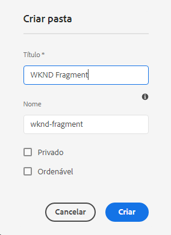
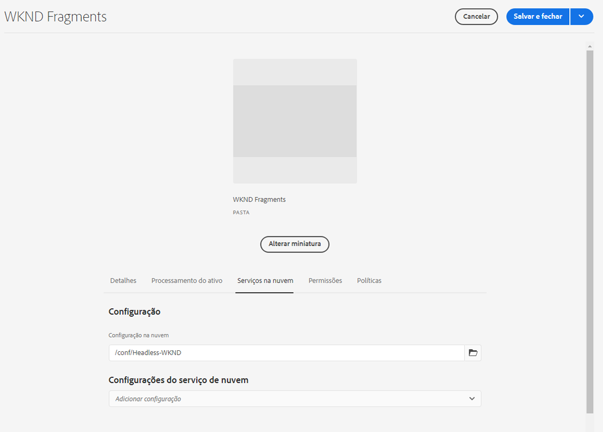
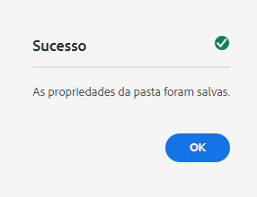

# Criação de uma pasta de ativos - Configuração sem cabeçalho {#creating-an-assets-folder}

Use AEM Modelos de fragmentos do conteúdo para definir a estrutura dos Fragmentos do conteúdo, a base do seu conteúdo sem periféricos. Os Fragmentos de conteúdo são armazenados nas pastas de ativos.

##  O que é uma pasta de ativos? {#what-is-an-assets-folder}

[Agora que você criou Modelos de fragmento do conteúdo](create-content-model.md) que definem a estrutura desejada para os Fragmentos de conteúdo futuros, você provavelmente está animado em criar alguns fragmentos.

No entanto, primeiro será necessário criar uma pasta de ativos na qual você os armazenará.

As pastas de ativos são usadas para [organizar ativos de conteúdo tradicional](/help/assets/manage-digital-assets.md) curtir imagens e vídeos, bem como Fragmentos de conteúdo.

## Como criar uma pasta de ativos {#how-to-create-an-assets-folder}

Um administrador só precisaria criar pastas ocasionalmente para organizar o conteúdo conforme ele fosse criado. Para o objetivo deste guia de introdução, precisamos apenas criar uma pasta.

1. Efetue login AEM as a Cloud Service e, no menu principal, selecione **Navegação -> Ativos -> Arquivos**.
1. Toque ou clique **Criar -> Pasta**.
1. Forneça uma **Título** e **Nome** para sua pasta.
   * O **Título** deve ser descritiva.
   * O **Nome** se tornará o nome do nó no repositório.
      * Ele será gerado automaticamente com base no título e ajustado de acordo com [AEM convenções de nomenclatura.](/help/implementing/developing/introduction/naming-conventions.md)
      * Pode ser ajustado, se necessário.

   
1. Selecione a pasta que acabou de criar ao passar o mouse e tocar na marca de seleção. Em seguida, selecione **Propriedades** na barra de ferramentas (ou use o `p` [atalho do teclado.](/help/sites-cloud/authoring/getting-started/keyboard-shortcuts.md))
1. No **Propriedades** selecione a **Cloud Services** guia .
1. Para o **Configuração na nuvem** Selecione o [configuração criada anteriormente.](create-configuration.md)

   
1. Toque ou clique **Salvar e fechar**.
1. Toque ou clique **OK** na janela de confirmação.

   

Você pode criar subpastas adicionais dentro da pasta que acabou de criar. As subpastas herdarão o **Configuração na nuvem** da pasta principal. Isso pode ser substituído, no entanto, se você quiser usar modelos de outra configuração.

Se estiver usando uma estrutura de site localizada, é possível [criar uma raiz de idioma](/help/assets/translate-assets.md) abaixo da nova pasta.

## Próximas etapas {#next-steps}

Depois de criar uma pasta para os Fragmentos de conteúdo, você pode seguir para a quarta parte do guia de introdução e [criar fragmentos de conteúdo.](create-content-fragment.md)

>[!TIP]
>
>Para obter detalhes completos sobre o gerenciamento dos Fragmentos de conteúdo, consulte o [Documentação dos Fragmentos de conteúdo](/help/assets/content-fragments/content-fragments.md)
