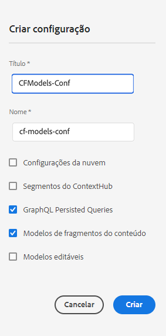

# Criação de uma configuração - Configuração do headless {#creating-configuration}

Como primeiro passo para começar a usar o headless no AEM as a Cloud Service, é necessário criar uma configuração.

## O que é uma configuração? {#what-is-a-configuration}

O Navegador de configuração fornece uma API de configuração genérica, uma estrutura de conteúdo e um mecanismo de resolução para configurações no AEM.

No contexto do gerenciamento de conteúdo headless no AEM, considere uma configuração como um local de trabalho dentro do AEM onde é possível criar modelos de conteúdo, que definem a estrutura do conteúdo futuro e dos fragmentos de conteúdo. É possível ter várias configurações para separar esses modelos.

Se você estiver familiarizado com os [modelos de página em uma implementação de pilha completa do AEM,](/help/sites-cloud/authoring/sites-console/templates.md) o uso de configurações para o gerenciamento de modelos de conteúdo é semelhante.

## Como criar uma configuração {#how-to-create-a-configuration}

Um administrador só precisaria criar uma configuração uma vez ou, muito raramente, quando um novo espaço de trabalho fosse necessário para organizar seus modelos de conteúdo. Para os propósitos deste guia de introdução, precisamos criar apenas uma configuração.

1. Faça logon no AEM as a Cloud Service e, no menu principal, selecione **Ferramentas > Geral > Navegador de configuração**.
1. Forneça um **Título** e um **Nome** para sua configuração.
   * O **Título** deve ser descritivo.
   * O **Nome** se tornará o nome do nó no repositório.
      * Ele será gerado automaticamente com base no título e ajustado conforme as [convenções de nomenclatura do AEM](/help/implementing/developing/introduction/naming-conventions.md).
      * Ele pode ser ajustado, se necessário.
1. Verifique as seguintes opções:
   * **Modelos de fragmentos do conteúdo**
   * **Consultas GraphQL persistidas**

   

1. Selecionar **Criar**

Você pode criar várias configurações, se necessário. As configurações também podem ser aninhadas.

>[!NOTE]
>
>Outras opções de configuração além dos **Modelos de fragmento do conteúdo** e das **Consultas GraphQL persistidas** podem ser necessárias, dependendo de seus requisitos de implementação.

## Próximas etapas {#next-steps}

Usando essa configuração, agora é possível seguir para a segunda parte do guia de introdução e [criar modelos de fragmento de conteúdo.](create-content-model.md)

>[!TIP]
>
>Para obter detalhes completos sobre o Navegador de configuração, [consulte a documentação do Navegador de configuração](/help/implementing/developing/introduction/configurations.md).
