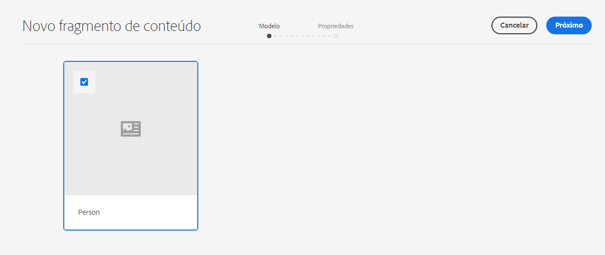
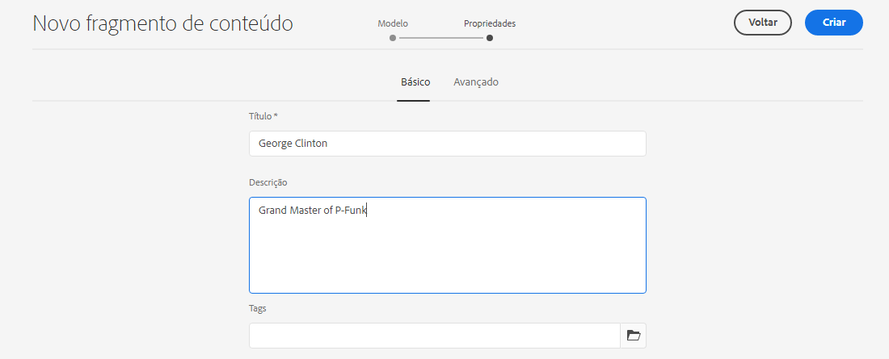
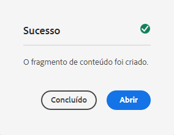
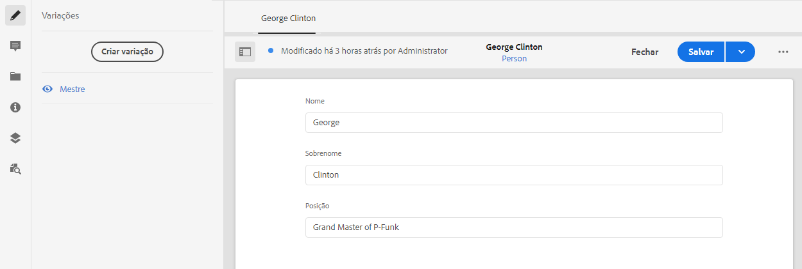

# Criação de fragmentos de conteúdo - Configuração sem cabeçalho {#creating-content-fragments}

Saiba como usar AEM Fragmentos do conteúdo para projetar, criar, preparar e usar conteúdo independente da página para entrega sem periféricos.

## O que são Fragmentos de conteúdo? {#what-are-content-fragments}

[Agora que você criou uma pasta de ativos](create-assets-folder.md) onde você pode armazenar os Fragmentos de conteúdo, agora é possível criar os fragmentos!

Os Fragmentos de conteúdo permitem que você crie, crie, prepare e publique conteúdo independente da página. Eles permitem que você prepare conteúdo pronto para uso em vários locais e em vários canais.

Os fragmentos de conteúdo contêm conteúdo estruturado e podem ser entregues no formato JSON.

## Como criar um fragmento de conteúdo {#how-to-create-a-content-fragment}

Os autores de conteúdo criarão qualquer número de Fragmentos de conteúdo para representar o conteúdo que eles criam. Esta será a principal tarefa em AEM. Para os fins deste guia de introdução, só será necessário criar um.

1. Efetue login AEM as a Cloud Service e, no menu principal, selecione **Navegação -> Ativos**.
1. Toque ou clique no botão [pasta criada anteriormente.](create-assets-folder.md)
1. Toque ou clique **Criar -> Fragmento de conteúdo**.
1. A criação de um Fragmento de conteúdo é apresentada como um assistente em duas etapas. Primeiro, selecione qual modelo deseja usar para criar o fragmento de conteúdo e toque ou clique em **Próximo**.
   * Os modelos disponíveis dependem do [**Configuração na nuvem** você definiu para a pasta de ativos](create-assets-folder.md) no qual você está criando o Fragmento do conteúdo.
   * Se você receber a mensagem `We could not find any models`, verifique a configuração da pasta de ativos.

   
1. Forneça uma **Título**, **Descrição** e **Tags** conforme necessário, toque ou clique em **Criar**.

   
1. Toque ou clique **Abrir** na janela de confirmação.

   
1. Forneça os detalhes do Fragmento de conteúdo no Editor de fragmento de conteúdo.

   
1. Toque ou clique **Salvar** ou  **Salvar e fechar**.

Fragmentos de conteúdo podem fazer referência a outros Fragmentos de conteúdo, permitindo uma estrutura de conteúdo aninhada, se necessário.

Fragmentos de conteúdo também podem fazer referência a outros ativos no AEM. [Esses ativos precisam ser armazenados em AEM](/help/assets/manage-digital-assets.md) antes de criar um Fragmento de conteúdo de referência.

## Próximas etapas {#next-steps}

Agora que você criou um Fragmento do conteúdo, poderá seguir para a parte final do guia de introdução e [crie solicitações de API para acessar e fornecer fragmentos de conteúdo.](create-api-request.md)

>[!TIP]
>
>Para obter detalhes completos sobre o gerenciamento dos Fragmentos de conteúdo, consulte o [Documentação dos Fragmentos de conteúdo](/help/assets/content-fragments/content-fragments.md)
