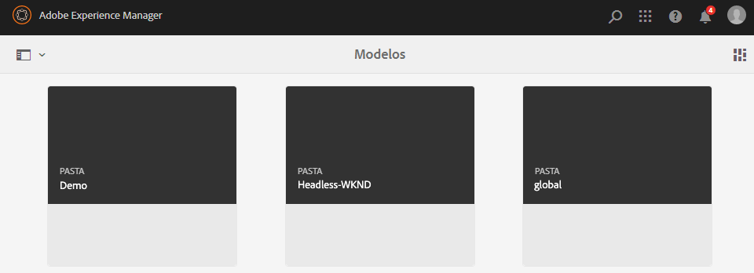
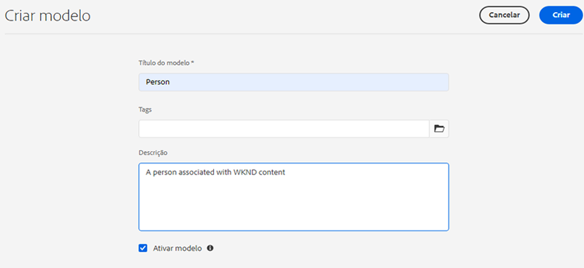
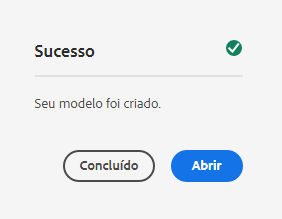
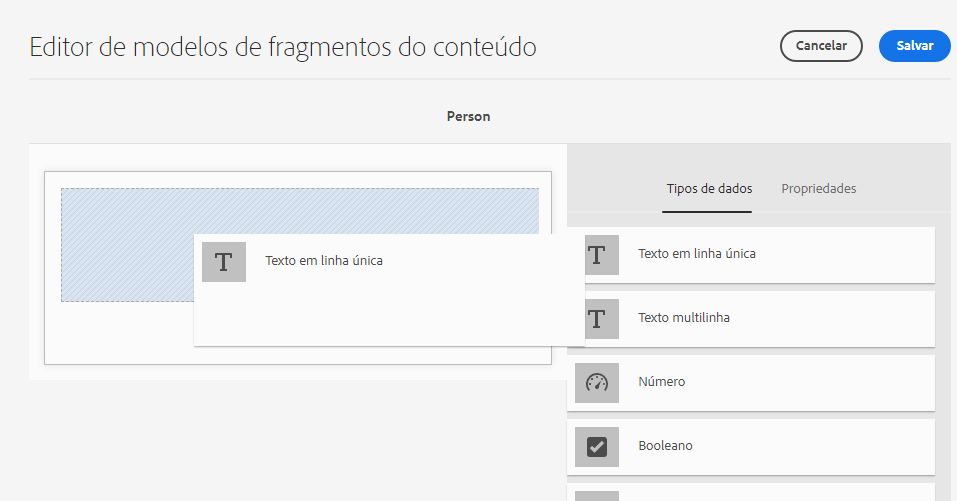
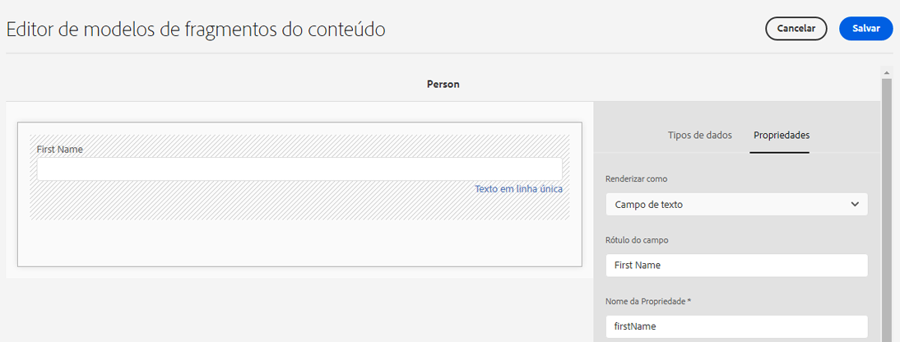
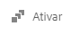
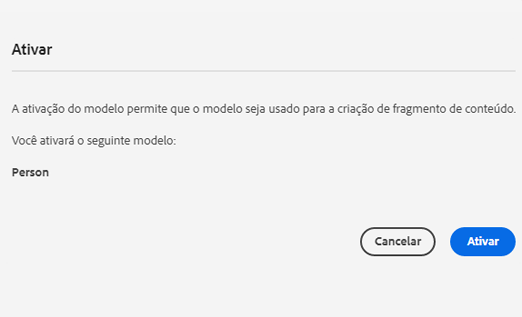
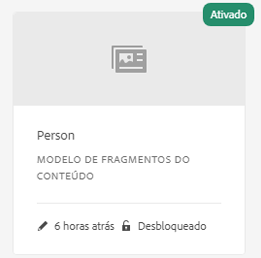

# Criação de modelos de fragmento de conteúdo - Configuração do headless {#creating-content-fragment-models}

Defina a estrutura do conteúdo que será criado e veiculado usando os recursos headless do AEM, através de modelos de fragmento de conteúdo.

## O que são modelos de fragmento de conteúdo? {#what-are-content-fragment-models}

[Agora que você criou uma configuração,](create-configuration.md) é possível usá-la para criar modelos de fragmento de conteúdo.

Os modelos de fragmento de conteúdo definem a estrutura dos dados e do conteúdo que você irá criar e gerenciar no AEM. Eles servem como uma espécie de andaime para o conteúdo. Ao optar por criar o conteúdo, os autores escolherão entre os modelos de fragmento de conteúdo definidos, que os orientarão na criação do conteúdo.

## Como criar um modelo de fragmento de conteúdo {#how-to-create-a-content-fragment-model}

Um arquiteto de informações executaria essas tarefas apenas esporadicamente, à medida que novos modelos se tornassem necessários. Para os propósitos deste guia de introdução, precisamos criar apenas um modelo.

1. Faça logon no AEM as a Cloud Service e, no menu principal, selecione **Ferramentas** -> **Geral** -> **Modelos de fragmento de conteúdo**.
1. Toque ou clique na pasta que foi criada com sua configuração.

   
1. Toque ou clique em **Criar**.
1. Forneça o **Título do modelo**, as **Tags** e a **Descrição**. Também é possível marcar/desmarcar a opção **Ativar modelo** para controlar se o modelo é habilitado imediatamente após a criação.

   
1. Na janela de confirmação, toque ou clique em **Abrir** para configurar o modelo.

   
1. Usando o **Editor de modelos de fragmentos de conteúdo**, crie o modelo de fragmento de conteúdo arrastando e soltando campos da coluna **Tipos de dados**.

   

1. Depois de colocar um campo, você deve configurar suas propriedades. O editor alternará automaticamente para a guia **Propriedades** do campo adicionado, onde é possível fornecer os campos obrigatórios.

   

1. Quando terminar de criar o modelo, toque ou clique em **Salvar**.

1. O modo do modelo recém-criado depende de se a opção **Ativar modelo** foi selecionada ao criar o modelo:
   * selecionada - o novo modelo já estará **Habilitado**
   * não selecionada - o novo modelo é criado em **Rascunho** modo

1. Se ainda não estiver, o modelo deve ser **Ativado** para usá-lo.
   1. Selecione o modelo que acabou de criar e toque ou clique em **Habilitar**.

      
   1. Confirme a habilitação do modelo tocando ou clicando em **Habilitar** na caixa de diálogo de confirmação.

      
1. O modelo agora está habilitado e pronto para uso.

   

O **Editor de Modelos de fragmentos de conteúdo** é compatível com vários tipos de dados diferentes, como campos de texto simples, referências de ativos, referências a outros modelos e dados JSON.

É possível criar vários modelos. Os modelos podem fazer referência a outros fragmentos de conteúdo. Use as [configurações](create-configuration.md) para organizar seus modelos.

## Próximas etapas {#next-steps}

Agora que você definiu as estruturas dos fragmentos de conteúdo criando modelos, poderá seguir para a terceira parte do guia de introdução e [criar pastas onde armazenará os fragmentos.](create-assets-folder.md)

>[!TIP]
>
>Para obter detalhes completos sobre os modelos de fragmento de conteúdo, consulte a [documentação dos Modelos de fragmento de conteúdo](/help/sites-cloud/administering/content-fragments/content-fragments-models.md)
