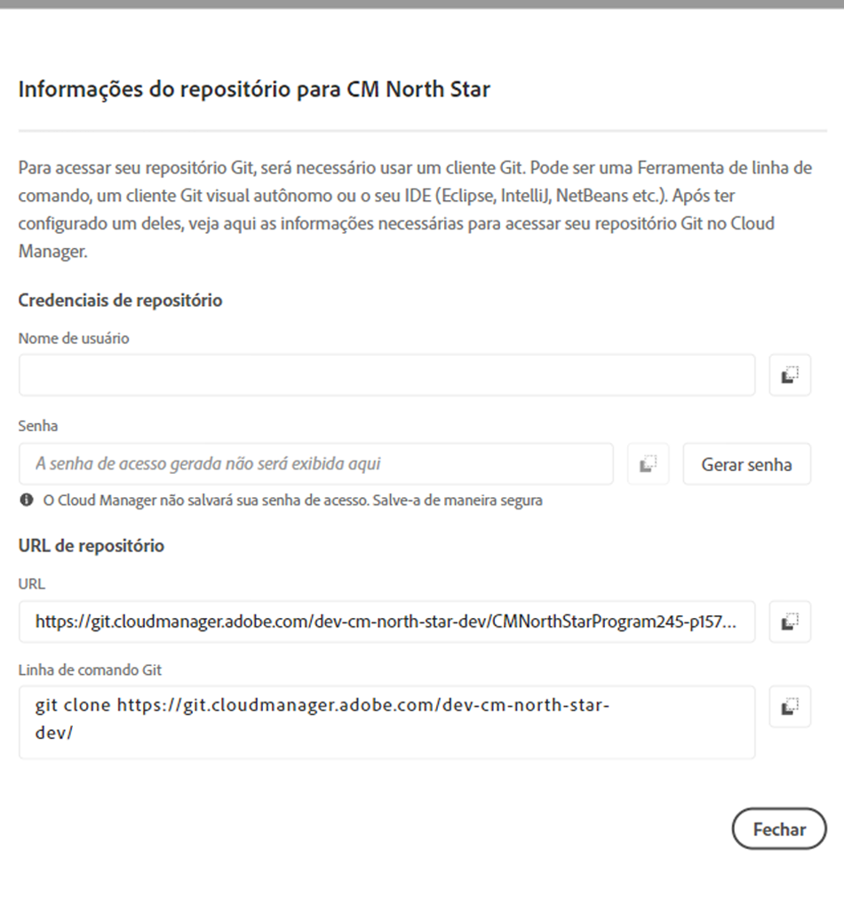

# Acesso ao Git {#accessing-git}

Você pode acessar e gerenciar o Repositório Git usando o Gerenciamento de conta Git de Autoatendimento da interface do usuário do Cloud Manager.

## Usando Gerenciamento De Conta De Git De Autoatendimento {#self-service-git}

Use o botão **Gerenciar Git** disponível na interface do usuário do Cloud Manager, mais importante na placa de pipeline.

1. Navegue até a página Visão geral *do* Programa e até o cartão Pipelines.

1. Você visualização a opção **Gerenciar Git** para acessar e gerenciar seu Repositório Git.

   

   Além disso, se você selecionar a guia de pipeline **Não-produção** , também será visualização a opção **Gerenciar Git** .

   

>[!NOTE]
>A opção **Gerenciar Git** está visível para os usuários na função Desenvolvedor ou Gerenciador de implantação. Clicar nesse botão abre uma caixa de diálogo que permite que o usuário localize o URL de seu Repositório Git do Cloud Manager junto com seu nome de usuário e senha.

As considerações importantes para gerenciar seu Git no Cloud Manager são:

* **URL**: O URL do repositório
* **Nome de usuário**: O nome do usuário
* **Senha**: o valor exibido quando o botão **Gerar senha** é clicado.

>[!NOTE]
>
>Um usuário pode fazer check-out de uma cópia de seu código e fazer alterações no repositório de código local. Quando estiver pronto, o usuário poderá confirmar suas alterações de código de volta para o repositório de código remoto no Cloud Manager.

