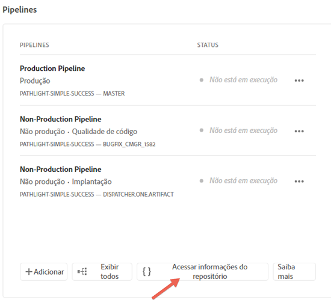
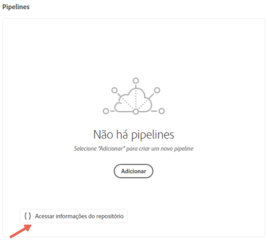
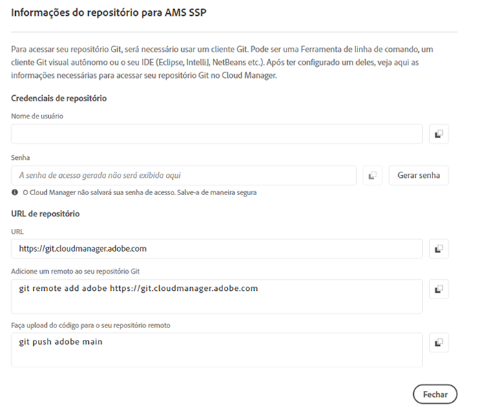

# Acessar repositórios {#accessing-repos}

Você pode acessar e gerenciar seu Repositório Git usando o Gerenciamento de conta Git de Autoatendimento da interface do usuário do Cloud Manager.

## Usando Repositórios de Autoatendimento Gerenciamento de Conta {#self-service-repos}

Use o botão **Acessar informações do repositório** disponível na interface do usuário do Cloud Manager, mais proeminentemente no cartão de pipeline.

1. Navegue até o cartão **Pipelines** da página **Visão geral do programa**.

1. Você visualizará a opção **Acessar Informações do Repo** para acessar e gerenciar seu Repositório Git.

   

   Além disso, se você selecionar a guia pipeline **Non-Production**, também visualizará a opção **Access Repo Info** lá.

   

   >[!NOTE]
   >A opção **Access Repo Info** está visível para os usuários na função Desenvolvedor ou Gerenciador de Implantação. Clicar nesse botão abre uma caixa de diálogo que permite ao usuário localizar o URL de seu Repositório Git do Cloud Manager junto com seu nome de usuário e senha.

   

   As considerações importantes para gerenciar seu Git no Cloud Manager são:

   * **URL**: O URL do repositório
   * **Nome de usuário**: O nome de usuário
   * **Senha**: o valor exibido quando o botão **Gerar senha** é clicado.

      >[!NOTE]
      >Um usuário pode fazer check-out de uma cópia de seu código e fazer alterações no repositório de código local. Quando pronto, o usuário pode confirmar as alterações de código no repositório de código remoto no Cloud Manager.
