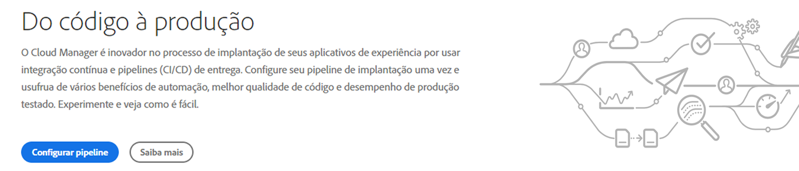
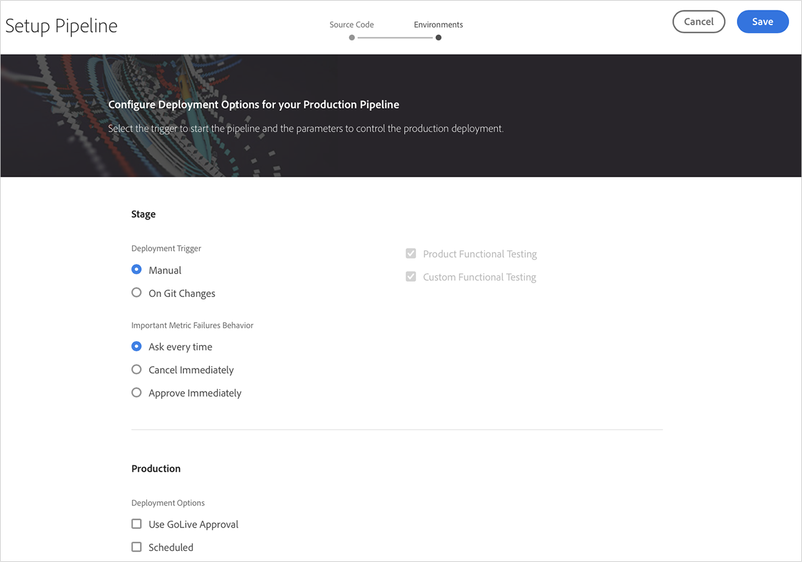
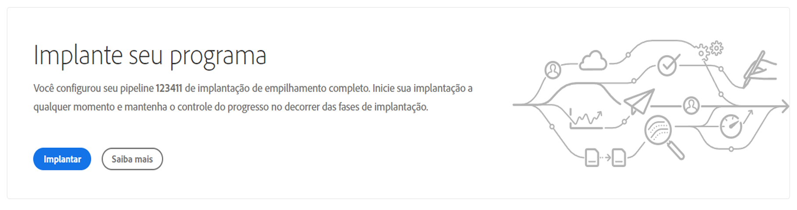

# Configurar seu pipeline de CI-CDConfiguração do seu pipeline CI-CD {#configure-ci-cd-pipeline}

No Cloud Manager, há dois tipos de pipeline:

* **Pipeline** de produção:

   Um pipeline de produção só pode ser adicionado depois que um conjunto de ambientes de produção e de estágio é criado.

   Consulte [Configuração do pipeline de produção](configure-pipeline.md#setting-up-the-pipeline) para obter mais detalhes.

* **Pipeline** de não produção:

   Um pipeline de não-produção pode ser adicionado a partir da página **Visão geral** da interface do usuário do Cloud Manager.

   Consulte [Pipelines de não produção e de qualidade de código somente](configure-pipeline.md#non-production-pipelines) para obter mais detalhes.

   >[!NOTE]
   >Para configurar o pipeline, você deve:
   > * defina o acionador que iniciará o pipeline.
   > * defina os parâmetros que controlam a implantação de produção.
   > * configure os parâmetros de teste de desempenho.

## Configuração do pipeline de produção {#setting-up-production-pipeline}

O Gerenciador de implantação é responsável pela configuração do pipeline de produção.

>[!NOTE]
>Um Pipeline de produção não pode ser configurado até que a criação de um programa seja concluída, o repositório Git tenha pelo menos uma ramificação e um conjunto de ambientes de Produção e Estágio seja criado.

Antes de começar a implantar seu código, você deve definir as configurações de pipeline do [!UICONTROL Cloud Manager].

>[!NOTE]
>
>Você pode alterar as configurações do pipeline após a configuração inicial.

## Configurar as configurações de pipeline de [!UICONTROL Cloud Manager] {#configuring-the-pipeline-settings-from-cloud-manager}

Depois de configurar seu programa e ter pelo menos um ambiente usando a interface do usuário do [!UICONTROL Cloud Manager], você estará pronto para configurar o pipeline de implantação.

Siga estas etapas para configurar o comportamento e as preferências do pipeline:

1. Clique em **Configurar pipeline** para configurar seu pipeline.

   

1. A tela **Configurar pipeline** é exibida. Selecione a ramificação e clique em **Next**.

   

1. Configure suas opções de implantação.

   

   Você pode definir o acionador para iniciar o pipeline:

   * **Manual**  - uso da interface do usuário para iniciar manualmente o pipeline.
   * **Em alterações no Git**  - inicia o pipeline de CI/CD sempre que há confirmações adicionadas à ramificação git configurada. Mesmo que você selecione essa opção, sempre poderá iniciar o pipeline manualmente.

   Durante a configuração ou edição do pipeline, o Gerenciador de implantação tem a opção de definir o comportamento do pipeline quando uma falha importante for encontrada em qualquer uma das portas de qualidade.

   Isso é útil para clientes que desejam processos mais automatizados. As opções disponíveis são:

   * **Perguntar sempre**  - Essa é a configuração padrão e requer intervenção manual em qualquer falha importante.
   * **Cancelar imediatamente**  - se selecionado, o pipeline será cancelado sempre que ocorrer uma falha importante. Isso é basicamente emular um usuário que rejeita manualmente cada falha.
   * **Aprovar imediatamente**  - Se selecionado, o pipeline continuará automaticamente sempre que ocorrer uma falha importante. Isso é basicamente emular um usuário que aprova manualmente cada falha.

1. As configurações de pipeline de produção incluem uma terceira guia rotulada como **Auditoria de experiência**. Essa opção fornece uma tabela para os caminhos de URL que devem ser sempre incluídos na Auditoria de experiência.

   >[!NOTE]
   >Você deve clicar em **Adicionar nova página** para definir seu próprio link personalizado.

   

   Clique em **Adicionar nova página** para fornecer um caminho de URL a ser incluído na Auditoria de experiência.

   Por exemplo, se você deseja incluir `https://wknd.site/us/en/about-us.html` na Auditoria de experiência, insira o caminho `us/en/about-us.html` neste campo e clique em **Salvar**.

   

   O URL que aparece na tabela será:

   `https://publish-p14253-e43686.adobeaemcloud.com/us/en/about-us.html`

   

   É possível incluir no máximo 25 linhas. Se não houver páginas enviadas pelo usuário nesta seção, a página inicial do site será incluída na Auditoria de experiência por padrão.

   Consulte [Compreender os resultados da auditoria de experiência](/help/implementing/cloud-manager/experience-audit-testing.md) para obter mais detalhes.

   >[!NOTE]
   > As páginas configuradas serão enviadas ao serviço e avaliadas de acordo com os testes de desempenho, acessibilidade, SEO (Search Engine Otimization), prática recomendada e PWA (Progressive Web App).

1. Clique em **Salvar** na tela **Editar pipeline**. A página **Visão geral** agora exibe o cartão **Implantar seu programa**. Clique no botão **Implantar** para implantar seu programa.

   

### Edição de um pipeline de produção {#editing-prod-pipeline}

É possível editar as configurações de pipeline na página **Visão geral do programa**.

Siga as etapas abaixo para editar o pipeline configurado:

1. Navegue até o cartão **Pipelines** da página **Visão geral do programa**.

1. Clique em **...** no cartão **Pipelines** e clique em **Editar**, conforme mostrado na figura abaixo.

   

1. A caixa de diálogo **Editar pipeline de produção** é exibida.

   1. A guia **Configuration** permite atualizar o **Pipeline Name**, **Deployment Trigger** e **Important Metrics Failure Behavior**.

      >[!NOTE]
      >Consulte [Adicionar e gerenciar repositórios](/help/implementing/cloud-manager/managing-code/cloud-manager-repositories.md) para saber como adicionar e gerenciar repositórios no Cloud Manager.

      

   1. A guia **Source** fornece uma opção para ignorar a configuração da camada da Web para seu pipeline e verificar ou desmarcar **Pause antes de implantar nas opções Production** e **Scheduled** de **Production Deployment Options**.

      >[!NOTE]
      >Se **Ignore Web Tier Configuration** for deixado desmarcado, o pipeline também implantará a configuração da camada da Web.

      

   1. A opção **Auditoria de experiência** permite atualizar ou adicionar novas páginas.

      

1. Clique em **Atualizar** depois de concluir a edição do pipeline.

## Pipelines somente para não-produção e qualidade de código {#non-production-pipelines}

Além do pipeline principal que é implantado na fase e na produção, os clientes podem configurar pipelines adicionais, conhecidos como **Non-Production Pipelines**. Esses pipelines sempre executam as etapas de criação e qualidade do código. Como opção, também podem implantar em AEM ambiente as a Cloud Service.

Na tela inicial, esses pipelines são listados em um novo cartão:

1. Acesse o bloco **Pipelines de não produção** na tela inicial do Cloud Manager.

   

1. Clique no botão **Add** para especificar o Nome do pipeline, o Tipo de pipeline e a Ramificação Git.

   Além disso, também é possível configurar o Acionador de implantação e o Comportamento de falha importante nas Opções de pipeline.

   

1. Clique em **Save** e o pipeline é mostrado no cartão na tela inicial com cinco ações, conforme mostrado abaixo:

   

   * **Editar**  - permite editar as configurações de pipeline
   * **Detalhes**  - fornece detalhes da execução do pipeline
   * **Build**  - navega até a página de execução, da qual o pipeline pode ser executado
   * **Acessar informações do acordo de recompra**  - permite que o usuário obtenha as informações necessárias para acessar o repositório Git do Cloud Manager
   * **Saiba mais**  - navegue para entender o recurso de documentação do pipeline de CI/CD.

### Edição de um pipeline de não produção {#editing-nonprod-pipeline}

É possível editar as configurações de pipeline na página **Visão geral do programa**.

Siga as etapas abaixo para editar o pipeline de não produção configurado:

1. Navegue até o cartão **Pipelines** da página **Visão geral do programa**.

1. Selecione a guia **Non-Production** e clique em **Edit** depois de selecionar os pipelines desejados.

   

1. Selecione o repositório desejado e outras atualizações necessárias e clique em **Salvar**.

   

## Próximas etapas {#the-next-steps}

Depois de configurar o pipeline, é necessário implantar seu código.

Consulte [Implantar o código](deploy-code.md) para obter mais detalhes.
