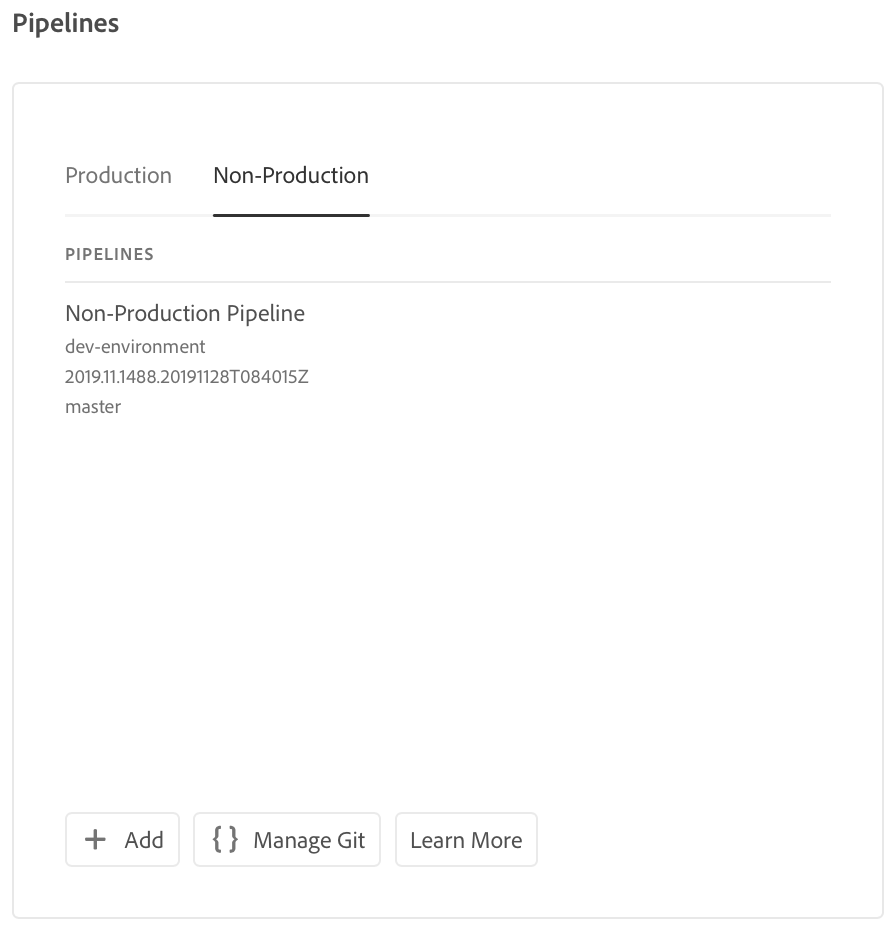

# Configuração do seu pipeline CI-CD {#configure-ci-cd-pipeline}

## Como entender o fluxo {#understanding-the-flow}

Você pode configurar seu pipeline a partir do bloco Configurações **de** pipeline na interface do usuário do [!UICONTROL Cloud Manager] .

O Gerenciador de implantação é responsável pela configuração do pipeline. Ao fazer isso, selecione primeiro uma ramificação do Repositório **Git**.

Para configurar seu pipeline, o usuário deve:

* defina o acionador que iniciará o pipeline.
* defina os parâmetros que controlam a implantação de produção.
* configure os parâmetros de teste de desempenho.

## Configuração do pipeline {#setting-up-the-pipeline}

>[!CAUTION]
>
>O pipeline não pode ser configurado até que uma criação de programa seja concluída e o repositório Git tenha pelo menos uma ramificação.

Antes de começar a implantar seu código, você deve definir as configurações de pipeline do Gerenciador [!UICONTROL da]nuvem.

>[!NOTE]
>
>É possível alterar as configurações do pipeline após a configuração inicial.

## Configuração das configurações de pipeline do [!UICONTROL Cloud Manager]{#configuring-the-pipeline-settings-from-cloud-manager}

Depois de configurar seu programa e ter pelo menos um ambiente usando a interface do usuário do [!UICONTROL Cloud Manager] , você estará pronto para configurar seu pipeline de implantação.

Siga estas etapas para configurar o comportamento e as preferências do seu pipeline:

1. Clique em **Configurar pipeline** para configurar e configurar seu pipeline.

   

1. A tela **Setup Pipeline (Instalar pipeline** ) é exibida. Select the branch and click **Next**.

   

1. Configure suas opções de implantação.

   

   Você pode definir o acionador para iniciar o pipeline:

   * **Manual** - usar a interface de usuário para iniciar manualmente o pipeline.
   * **On Git Changes** (Alterações no Git) - inicia o pipeline de CI/CD sempre que houver confirmações adicionadas à ramificação git configurada. Mesmo se você selecionar essa opção, sempre poderá iniciar o pipeline manualmente.
   Durante a configuração ou edição do pipeline, o Gerenciador de implantação tem a opção de definir o comportamento do pipeline quando uma falha importante for encontrada em qualquer uma das portas de qualidade.

   Isso é útil para clientes que desejam processos mais automatizados. As opções disponíveis são:

   * **Perguntar sempre** - Essa é a configuração padrão e requer intervenção manual em qualquer falha importante.
   * **Falha imediatamente** - se selecionado, o pipeline será cancelado sempre que ocorrer uma falha importante. Isso é essencialmente emular um usuário rejeitando manualmente cada falha.
   * **Continuar imediatamente** - Se selecionado, o pipeline continuará automaticamente sempre que ocorrer uma falha importante. Isso é essencialmente emular um usuário que aprova manualmente cada falha.

1. Clique em **Avançar** para acessar a guia **Teste** para definir seus critérios de teste para o programa.

   

1. Clique em **Salvar**. A página *Visão geral* agora exibe a **Implantar seu cartão do Programa** . Clique no botão **Implantar** para implantar seu programa.

   

## Pipelines que não são de produção e qualidade de código

Para além do principal gasoduto que vai para a fase de construção e de produção, os clientes estão em condições de instalar gasodutos adicionais, denominados &quot;gasodutos **não produtivos&quot;**. Esses pipelines sempre executam as etapas de qualidade de compilação e código. Como opção, eles também podem implantar no ambiente do Adobe Managed Services.

Na tela inicial, esses pipelines são listados em um novo cartão:

1. Acesse o bloco Pipelines **de** não produção na tela inicial do Cloud Manager.

   

1. Clique no botão **Adicionar** para especificar o Nome do Pipeline, o Tipo de Pipeline e a Ramificação Git.

   Além disso, também é possível configurar o Acionador de implantação e o Comportamento de falha importante nas Opções de pipeline.

   

1. Clique em **Salvar** e o pipeline é mostrado no cartão na tela inicial com três ações, como mostrado abaixo:

   

   * **Editar** - permite a edição das configurações de pipeline
   * **Build** - navega até a página de execução, a partir da qual o pipeline pode ser executado
   * **Gerenciar Git** - permite que o usuário obtenha as informações necessárias para acessar o repositório Git do Cloud Manager

## Próximas etapas {#the-next-steps}

Depois de configurar o pipeline, é necessário implantar seu código.

Consulte [Implantar seu código](deploy-code.md) para obter mais detalhes.
