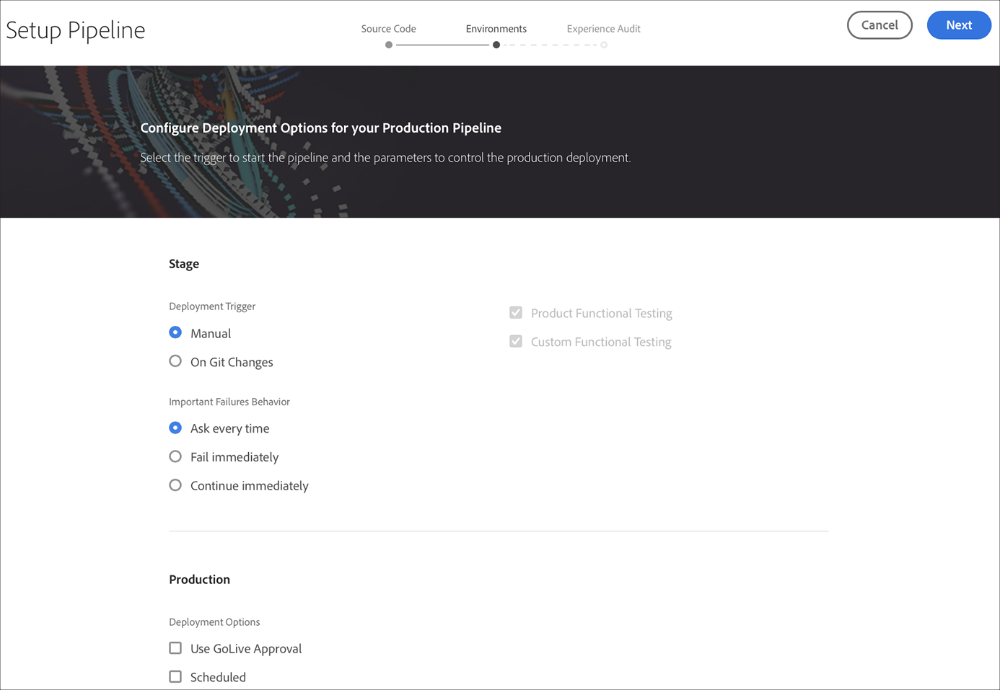
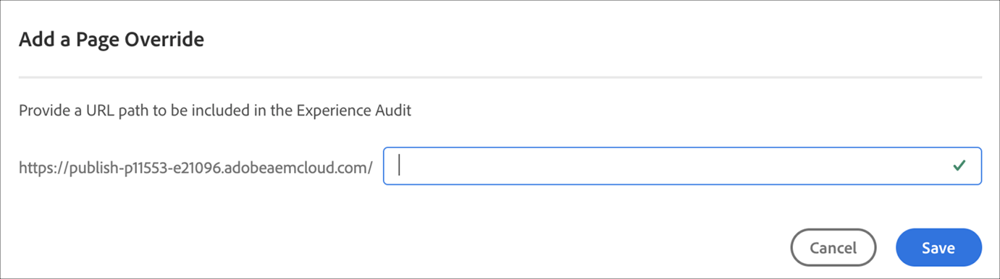
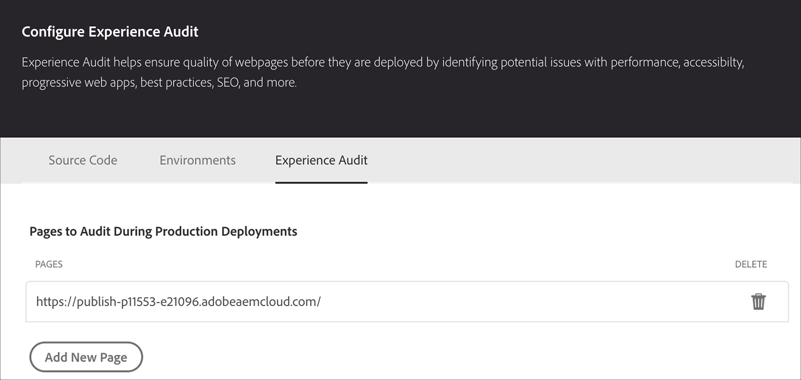
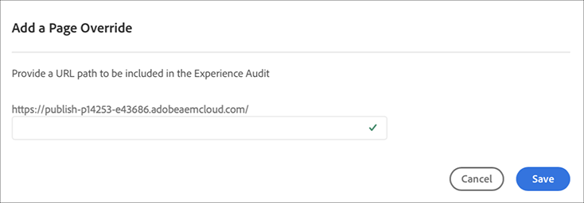

# Configurar seu pipeline de CI-CDConfiguração do seu pipeline CI-CD {#configure-ci-cd-pipeline}

No Cloud Manager, há dois tipos de Pipeline:

* **Pipeline** de produção:

   Um pipeline de produção só pode ser adicionado depois que um conjunto de ambientes de produção e estágio é criado.

   Consulte [Configurando o pipeline](configure-pipeline.md#setting-up-the-pipeline) de produção para obter mais detalhes.

* **Pipeline** de não produção:

   Um Pipeline de não produção pode ser adicionado na página **Visão geral** da interface do usuário do Gerenciador de nuvem.

   Para obter mais detalhes, consulte [Não-produção e somente qualidade de código](configure-pipeline.md#non-production-pipelines) .

>[!NOTE]
>Para configurar seu pipeline, você deve:
> * defina o acionador que start o pipeline.
> * defina os parâmetros que controlam a implantação de produção.
> * configure os parâmetros de teste de desempenho.

## Configuração do pipeline de produção {#setting-up-production-pipeline}

O Gerenciador de implantação é responsável pela configuração do pipeline de produção.

>[!NOTE]
>Um pipeline de produção não pode ser configurado até que uma criação de programa seja concluída, o repositório Git tenha pelo menos uma ramificação e um conjunto de ambientes de Produção e Estágio seja criado.

Antes de start para implantar seu código, você deve definir as configurações de pipeline do Gerenciador [!UICONTROL da]nuvem.

>[!NOTE]
>
>É possível alterar as configurações do pipeline após a configuração inicial.

## Configuração das configurações de pipeline do Gerenciador de [!UICONTROL nuvem] {#configuring-the-pipeline-settings-from-cloud-manager}

Depois de configurar seu programa e ter pelo menos um ambiente usando a interface do usuário do [!UICONTROL Cloud Manager] , você estará pronto para configurar seu pipeline de implantação.

Siga estas etapas para configurar o comportamento e as preferências do seu pipeline:

1. Clique em **Configurar pipeline** para configurar e configurar seu pipeline.

   

1. A tela **Setup Pipeline (Instalar pipeline** ) é exibida. Select the branch and click **Next**.

   

1. Configure suas opções de implantação.

   

   Você pode definir o acionador para start do pipeline:

   * **Manual** - usar a interface de usuário para start manualmente o pipeline.
   * **On Git Changes** (Alterações no Git) - start o pipeline do CI/CD sempre que houver confirmações adicionadas ao ramo do git configurado. Mesmo se você selecionar essa opção, sempre poderá start o pipeline manualmente.

   Durante a configuração ou edição do pipeline, o Gerenciador de implantação tem a opção de definir o comportamento do pipeline quando uma falha importante for encontrada em qualquer uma das portas de qualidade.

   Isso é útil para clientes que desejam processos mais automatizados. As opções disponíveis são:

   * **Perguntar sempre** - Essa é a configuração padrão e requer intervenção manual em qualquer falha importante.
   * **Falha imediatamente** - se selecionado, o pipeline será cancelado sempre que ocorrer uma falha importante. Isso é essencialmente emular um usuário rejeitando manualmente cada falha.
   * **Continuar imediatamente** - Se selecionado, o pipeline continuará automaticamente sempre que ocorrer uma falha importante. Isso é essencialmente emular um usuário que aprova manualmente cada falha.

1. As configurações de pipeline de produção incluem uma terceira guia rotulada como **Experience Audit**.

   

   Essa opção fornece uma tabela para os caminhos de URL que devem ser sempre incluídos na Auditoria de experiência. O usuário deve concluir o campo de entrada para definir seu próprio link personalizado.

   Por exemplo, se você deseja incluir `https://wknd.site/us/en/about-us.html` na Auditoria de experiência, informe o caminho `us/en/about-us.html` neste campo.

   

   O URL que aparece na tabela será `https://publish-p7719-e13204.adobeaemcloud.com/us/en/about-us.html`.

   

   É possível incluir no máximo 25 linhas. Se não houver páginas enviadas pelo usuário nesta seção, a página inicial do site será incluída na Auditoria de experiência por padrão.

   Consulte [Entendendo os resultados](/help/implementing/cloud-manager/experience-audit-testing.md) da auditoria de experiência para obter mais detalhes.

   Clique em **Adicionar nova substituição** de página para fornecer um caminho de URL a ser incluído na Auditoria de experiência. Depois de adicionar o caminho, clique em **Salvar**.

   

   >[!NOTE]
   > As páginas configuradas serão enviadas ao serviço e avaliadas de acordo com os testes de desempenho, acessibilidade, SEO (Search Engine Otimization), práticas recomendadas e PWA (Progressive Web App).

1. Clique em **Salvar** na tela **Editar Pipeline** . A página **Visão geral** agora exibe a opção **Implantar seu cartão de Programa** . Clique no botão **Implantar** para implantar seu programa.

   

## Pipelines que não são de produção e qualidade de código {#non-production-pipelines}

Para além do principal gasoduto que vai para a fase de construção e de produção, os clientes estão em condições de instalar gasodutos adicionais, denominados &quot;gasodutos **não produtivos&quot;**. Esses pipelines sempre executam as etapas de qualidade de compilação e código. Como opção, eles também podem implantar no ambiente Adobe Managed Services.

Na tela inicial, esses pipelines são listados em um novo cartão:

1. Acesse o bloco Pipelines **de** não produção na tela inicial do Cloud Manager.

   

1. Clique no botão **Adicionar** para especificar o Nome do Pipeline, o Tipo de Pipeline e a Ramificação Git.

   Além disso, também é possível configurar o Acionador de implantação e o Comportamento de falha importante nas Opções de pipeline.

   

1. Clique em **Salvar** e o pipeline é mostrado no cartão na tela inicial com três ações, como mostrado abaixo:

   

   * **Editar** - permite a edição das configurações de pipeline
   * **Build** - navega até a página de execução, a partir da qual o pipeline pode ser executado
   * **Gerenciar Git** - permite que o usuário obtenha as informações necessárias para acessar o repositório Git do Cloud Manager

## Próximas etapas {#the-next-steps}

Depois de configurar o pipeline, é necessário implantar seu código.

Consulte [Implantar seu código](deploy-code.md) para obter mais detalhes.
