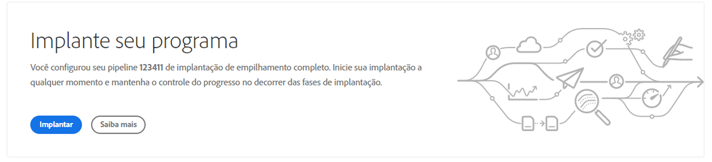
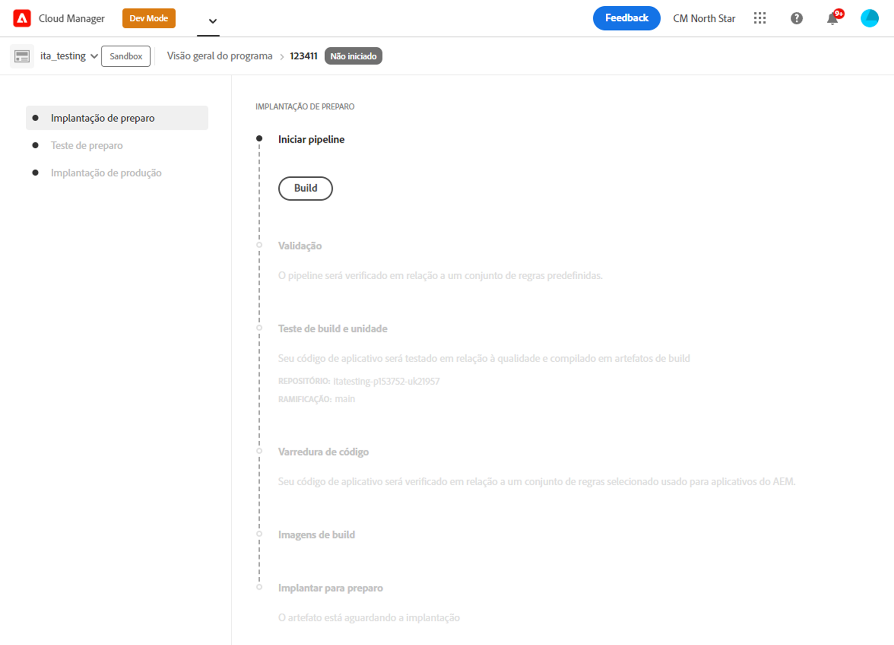
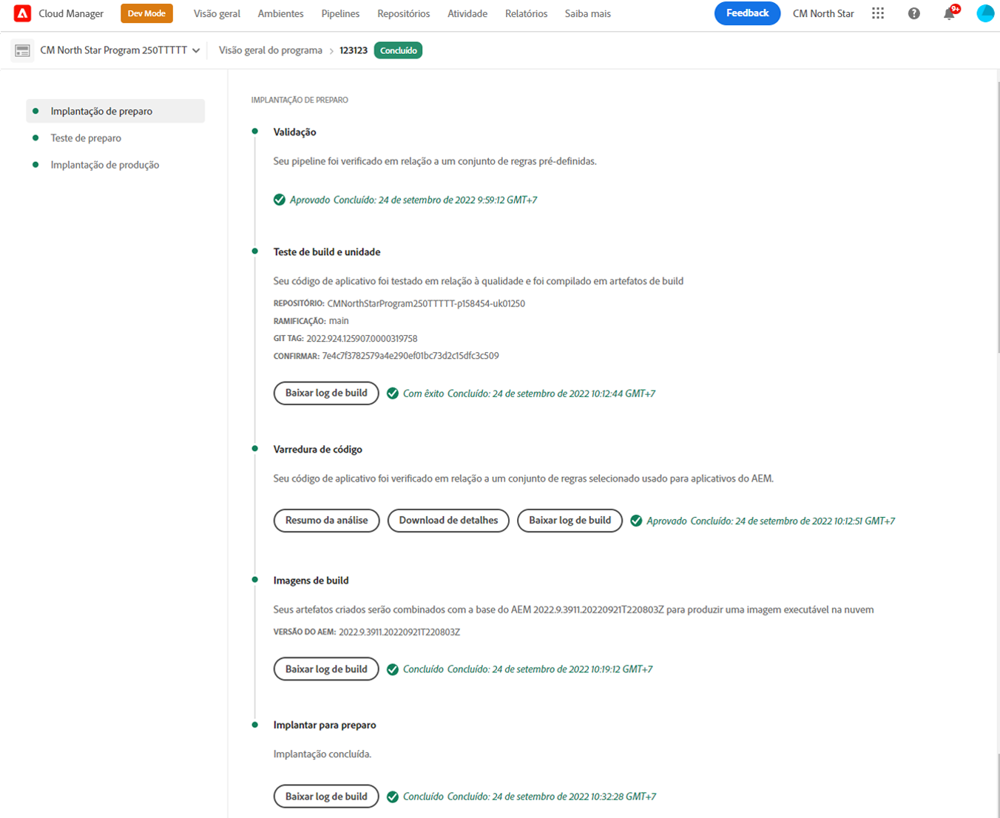
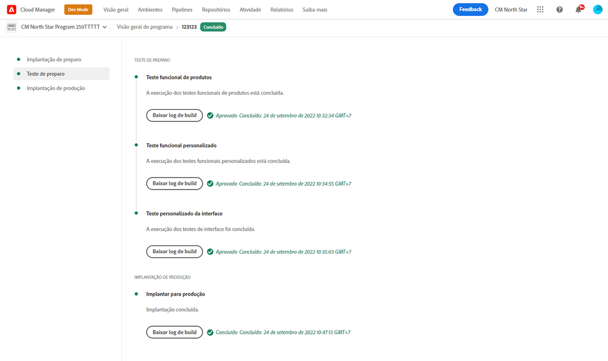
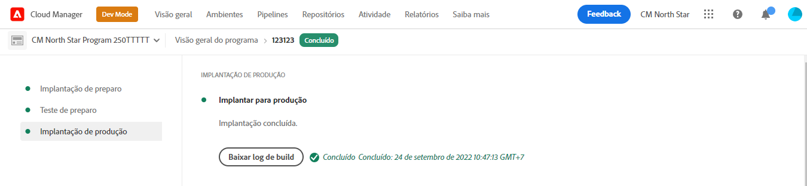

# Implante seu código {#deploy-your-code}

Saiba como implantar seu código em produção usando os pipelines do Cloud Manager no AEM as a Cloud Service.


A implantação perfeita de código em preparo e, em seguida, em produção é feita por meio de um pipeline de produção. A execução do pipeline de produção é dividida nas duas fases lógicas a seguir:

1. **Implantação para ambiente de Preparo** - O código é compilado e implantado no ambiente de Preparo para testes funcionais automatizados, testes de interface do usuário, auditoria de experiência e UAT (Teste de Aceitação de Usuário).
1. **Implantação no ambiente de Produção** - Depois que a compilação for validada no ambiente de Preparo e aprovada para promoção em Produção, o mesmo artefato de compilação será implantado no ambiente de Produção.

_Somente o tipo de pipeline de Código de pilha completa oferece suporte à verificação do código, testes de função, testes de interface do usuário e auditoria de experiência._

## Processo de implantação {#deployment-process}

Todas as implantações do Cloud Service seguem um processo gradual para garantir tempo de inatividade zero. Consulte [Como funcionam as implantações contínuas](/help/implementing/deploying/overview.md#how-rolling-deployments-work) para saber mais.

>[!NOTE]
>
>O cache do Dispatcher é limpo em cada implantação. Em seguida, ele é &quot;aquecido&quot; antes que os novos nós de publicação aceitem o tráfego.

## Implante seu código com o Cloud Manager no AEM as a Cloud Service {#deploying-code-with-cloud-manager}

Depois de [configurar o Pipeline de produção](/help/implementing/cloud-manager/configuring-pipelines/configuring-production-pipelines.md), incluindo repositório, ambiente e ambiente de teste, você estará pronto para implantar seu código.

1. Faça logon no Cloud Manager, em [my.cloudmanager.adobe.com](https://my.cloudmanager.adobe.com/), e selecione a organização apropriada.

1. No console **[Meus Programas](/help/implementing/cloud-manager/navigation.md#my-programs)**, clique no programa para o qual deseja implantar código.

1. Na página **Visão geral**, na área do call-to-action, clique em **Implantar**.

   

1. Na página **Implantar na produção**, clique em **Compilação**.

   

O processo de compilação implanta o código pelas três fases ordenadas a seguir:

1. [Fase de implantação em preparo](#stage-deployment)
1. [Fase de teste de preparo](#stage-testing)
1. [Fase de implantação em produção](#production-deployment)

>[!TIP]
>
>Você pode revisar as etapas de vários processos de implantação, visualizando os logs ou revisando os resultados dos critérios de teste.

### Fase de implantação em preparo {#stage-deployment}

A fase **Implantação de Preparo** envolve as seguintes etapas:

| Etapa de implantação de preparo | Descrição |
| --- | --- |
| Validação | Garante que o pipeline esteja configurado para usar os recursos disponíveis no momento. por exemplo, testar se a ramificação configurada existe e se os ambientes estão disponíveis. |
| Teste de build e unidade | Executa um processo de criação em containers.<br>Consulte [Detalhes do ambiente de compilação](/help/implementing/cloud-manager/getting-access-to-aem-in-cloud/build-environment-details.md) para obter detalhes sobre o ambiente de compilação. |
| Varredura de código | Avalia a qualidade do código do seu aplicativo.<br>Consulte [Teste de Qualidade do Código](/help/implementing/cloud-manager/code-quality-testing.md) para obter detalhes sobre o processo de teste. |
| Imagens de build | Esse processo converte pacotes de conteúdo e Dispatcher da etapa de compilação em imagens do Docker. Ele também gera configurações Kubernetes com base nesses pacotes. |
| Implantar para preparo | A imagem é implantada no ambiente de preparo, como preparação para a [Fase de teste de preparo](#stage-testing). |



### Fase de teste de preparo {#stage-testing}

A fase **Teste de preparo** envolve as seguintes etapas:

| Etapa de teste de preparo | Descrição |
| --- | --- |
| Teste funcional do produto | O pipeline do Cloud Manager executa testes que são executados no ambiente de preparo.<br>Consulte também [Teste funcional do produto](/help/implementing/cloud-manager/functional-testing.md#product-functional-testing). |
| Teste funcional personalizado | Essa etapa no pipeline é sempre executada e não pode ser ignorada. Se a compilação não produzir um JAR de teste, o teste será aprovado automaticamente.<br>Consulte também [Teste funcional personalizado](/help/implementing/cloud-manager/functional-testing.md#custom-functional-testing). |
| Testes de interface do usuário personalizados | Um recurso opcional que executa automaticamente testes de interface do usuário criados para aplicativos personalizados.<br>Os testes de interface do usuário são baseados em Selenium e compactados em uma imagem do Docker para oferecer flexibilidade de linguagem e estruturas. Essa abordagem permite usar Java e Maven, Node e WebDriver.io, ou qualquer estrutura ou tecnologia baseada no Selenium.<br>Consulte também [Teste personalizado da interface do usuário](/help/implementing/cloud-manager/functional-testing.md#custom-ui-testing). |
| Auditoria de experiência | Essa etapa no pipeline é sempre executada e não pode ser ignorada. Conforme um pipeline de produção é executado, uma etapa de auditoria de experiência é incluída após o teste funcional personalizado que executa as verificações.<ul><li>As páginas configuradas são enviadas ao serviço e avaliadas.</li><li>Os resultados são informativos e mostram as pontuações e as alterações entre as pontuações atual e anterior.</li><li>Essa informação é valiosa para determinar se há uma regressão introduzida com a implantação atual.</li></ul>Consulte [Noções básicas sobre os resultados da Auditoria de Experiência](/help/implementing/cloud-manager/reports/report-experience-audit.md).</li></ul> |



### Fase de implantação em produção {#production-deployment}

O processo de implantação nas topologias de produção é um pouco diferente para minimizar o impacto nos visitantes de um site do AEM.

As implantações em produção geralmente seguem as mesmas etapas descritas anteriormente, mas de maneira contínua. Essas etapas incluem o seguinte:

1. Implante pacotes de AEM para o autor.
1. Desanexar `dispatcher1` do balanceador de carga.
1. Implante os pacotes do AEM em `publish1` e o pacote do Dispatcher em `dispatcher1`; limpe o cache do Dispatcher.
1. Coloque `dispatcher1` de volta no balanceador de carga.
1. Quando `dispatcher1` estiver novamente em serviço, desconecte `dispatcher2` do balanceador de carga.
1. Implante os pacotes do AEM em `publish2` e o pacote do Dispatcher em `dispatcher2`; limpe o cache do Dispatcher.
1. Coloque `dispatcher2` de volta no balanceador de carga.

Esse processo continua até que a implantação tenha atingido todos os editores e Dispatchers na topologia.



## Tempos limite durante uma implantação {#timeouts}

As seguintes etapas atingem o tempo limite se forem deixadas aguardando o feedback do usuário durante uma implantação:

| Etapa | Tempo limite |
|--- |--- |
| Teste de qualidade do código | 14 dias |
| Teste de segurança | 14 dias |
| Teste de desempenho | 14 dias |
| Pedido de aprovação | 14 dias |
| Agendar implantação em produção | 14 dias |
| Suporte CSE | 14 dias |

## Reexecutar uma implantação de produção {#reexecute-deployment}

Em casos raros, as etapas de implantação de produção podem falhar por motivos transitórios. Nesses casos, a reexecução da etapa de implantação de produção é suportada desde que a etapa de implantação de produção tenha sido concluída, independentemente do tipo de conclusão (por exemplo, cancelada ou malsucedida). A reexecução cria uma nova execução usando o mesmo pipeline que consiste nas três etapas a seguir:

1. **Validação** - A mesma validação que ocorre durante uma execução normal do pipeline.
1. **Compilação** - No contexto de uma reexecução, a etapa de compilação copia artefatos e não executa realmente um novo processo de compilação.
1. **Implantação de produção** - Usa as mesmas configurações e opções que a etapa de implantação de produção em uma execução normal de pipeline.

Nessas circunstâncias, quando uma reexecução for possível, a página de status do pipeline de produção fornecerá a opção **Reexecutar** ao lado da opção tradicional **Baixar log de compilação**.


>[!NOTE]
>
>Em uma reexecução, a etapa de compilação apresenta informações na interface que indicam que está copiando artefatos, não os recompilando.

### Notas de uso {#usage-notes}

* A reexecução da etapa de implantação de produção só está disponível para a última execução.
* A reexecução não está disponível para execuções de atualização por push. Se a última execução for uma execução de atualização por push, não será possível iniciar uma reexecução.
* Se a última execução falhar em qualquer ponto antes da etapa de implantação em produção, não será possível iniciar uma reexecução.

### Reexecutar API {#reexecute-API}

Além de estar disponível na interface, [a API do Cloud Manager](https://developer.adobe.com/experience-cloud/cloud-manager/reference/api/#tag/Pipeline-Execution) pode ser usada para acionar reexecuções e identificar execuções que foram acionadas como reexecuções.

#### Acionar uma reexecução {#reexecute-deployment-api}

Para acionar uma reexecução, faça uma solicitação PUT para o Link HAL `https://ns.adobe.com/adobecloud/rel/pipeline/reExecute` no estado da etapa de implantação de produção.

* Se esse link estiver presente, a execução poderá ser reiniciada dessa etapa.
* Se estiver ausente, a execução não poderá ser reiniciada a partir dessa etapa. 

Esse link só está disponível para a etapa de implantação em produção.

```JavaScript
 {
  "_links": {
    "https://ns.adobe.com/adobecloud/rel/pipeline/logs": {
      "href": "/api/program/4/pipeline/1/execution/953671/phase/1575676/step/2983530/logs",
      "templated": false
    },
    "https://ns.adobe.com/adobecloud/rel/pipeline/reExecute": {
      "href": "/api/program/4/pipeline/1/execution?stepId=2983530",
      "templated": false
    },
    "https://ns.adobe.com/adobecloud/rel/pipeline/metrics": {
      "href": "/api/program/4/pipeline/1/execution/953671/phase/1575676/step/2983530/metrics",
      "templated": false
    },
    "self": {
      "href": "/api/program/4/pipeline/1/execution/953671/phase/1575676/step/2983530",
      "templated": false
    }
  },
  "id": "6187842",
  "stepId": "2983530",
  "phaseId": "1575676",
  "action": "deploy",
  "environment": "weretail-global-b75-prod",
  "environmentType": "prod",
  "environmentId": "59254",
  "startedAt": "2022-01-20T14:47:41.247+0000",
  "finishedAt": "2022-01-20T15:06:19.885+0000",
  "updatedAt": "2022-01-20T15:06:20.803+0000",
  "details": {
  },
  "status": "FINISHED"
```

A sintaxe do valor href do link HAL é apenas um exemplo. O valor real sempre deve ser lido do link HAL, e não gerado.

O envio de uma solicitação PUT para esse endpoint resulta em uma resposta 201, se bem-sucedido, e o corpo da resposta é a representação da nova execução. Esse workflow é semelhante a iniciar uma execução regular por meio da API.

#### Identificar uma reexecução {#identify-reexecution}

O sistema identifica reexecuções definindo o campo `trigger` para o valor `RE_EXECUTE`.
