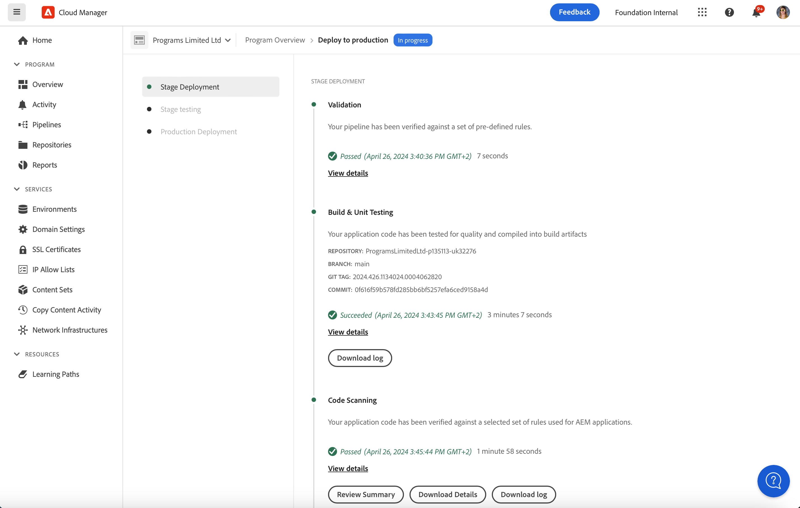

# Implantação de código {#deploy-your-code}

Saiba como implantar seu código na produção usando pipelines do Cloud Manager AEM as a Cloud Service.


A implantação perfeita do código no Stage e, em seguida, no Production é feita por meio de um pipeline de Produção. A execução do pipeline de Produção é dividida em duas fases lógicas.

1. Implantação no ambiente de preparo
   * O código é criado e implantado no ambiente Stage para testes funcionais automatizados, testes de interface do usuário, auditoria de experiência e teste de aceitação de usuários (UAT).
1. Implantação no ambiente de produção
   * Depois que a build for validada no Stage e aprovada para promoção na Production, o mesmo artefato de build será implantado no ambiente Production (Produção).

_Somente o tipo de pipeline de Código de pilha completo oferece suporte para verificação de código, teste de função, teste de interface do usuário e auditoria de experiência._

## Implantação do código com o Cloud Manager AEM as a Cloud Service {#deploying-code-with-cloud-manager}

Depois de [configuração do pipeline de produção](/help/implementing/cloud-manager/configuring-pipelines/configuring-production-pipelines.md) incluindo repositório, ambiente e ambiente de teste, você está pronto para implantar seu código.

1. Faça logon no Cloud Manager em [my.cloudmanager.adobe.com](https://my.cloudmanager.adobe.com/) e selecione a organização apropriada.

1. Clique no programa para o qual deseja implantar o código.

1. Clique em **Implantar** do convite à ação no **Visão geral** para iniciar o processo de implantação.

   

1. O **Execução de pipeline** será exibida. Clique em **Criar** para iniciar o processo.

   

O processo de build implanta seu código em três fases.

1. [Implantação do Estágio](#stage-deployment)
1. [Teste de preparo](#stage-testing)
1. [Implantação de produção](#production-deployment)

>[!TIP]
>
>Você pode revisar as etapas de vários processos de implantação exibindo registros ou revisando resultados para os critérios de teste.

## Fase de implantação do estágio {#stage-deployment}

O **Implantação do Estágio** fase. envolve essas etapas.

* **Validação**  - Essa etapa garante que o pipeline esteja configurado para usar os recursos disponíveis no momento. Por exemplo, teste se a ramificação configurada existe e se os ambientes estão disponíveis.
* **Teste de compilação e unidade** - Essa etapa executa um processo de criação em contêiner.
   * Consulte o documento [Detalhes do ambiente de criação](/help/implementing/cloud-manager/getting-access-to-aem-in-cloud/build-environment-details.md) para obter detalhes sobre o ambiente de criação.
* **Verificação de código** - Esta etapa avalia a qualidade do código do seu aplicativo.
   * Consulte o documento [Teste de qualidade do código](/help/implementing/cloud-manager/code-quality-testing.md) para obter detalhes sobre o processo de teste.
* **Criar imagens** - Esse processo é responsável por transformar os pacotes de conteúdo e dispatcher produzidos pela etapa de compilação em imagens Docker e configurações de Kubernetes.
* **Implantar no Estágio** - A imagem é implantada no ambiente de preparo temporário, em preparação para o [Fase de teste.](#stage-testing)



## Fase de teste de estágio {#stage-testing}

O **Teste de preparo** envolve essas etapas.

* **Teste funcional do produto** - O pipeline do Cloud Manager executa testes que são executados no ambiente de preparo.
   * Consulte o documento [Teste funcional do produto](/help/implementing/cloud-manager/functional-testing.md#product-functional-testing) para obter mais detalhes.

* **Teste funcional personalizado** - Essa etapa no pipeline é sempre executada e não pode ser ignorada. Se nenhum JAR de teste for produzido pela criação, o teste será aprovado por padrão.
   * Consulte o documento [Teste funcional personalizado](/help/implementing/cloud-manager/functional-testing.md#custom-functional-testing) para obter mais detalhes.

* **Teste de interface personalizada** - Esta etapa é um recurso opcional que executa automaticamente testes de interface criados para aplicativos personalizados.
   * Os testes da interface do usuário são testes baseados em Selenium compactados em uma imagem Docker para permitir uma grande escolha na linguagem e estruturas (como Java e Maven, Node e WebDriver.io, ou qualquer outra estrutura e tecnologia desenvolvida na Selenium).
   * Consulte o documento [Teste de interface personalizada](/help/implementing/cloud-manager/functional-testing.md#custom-ui-testing) para obter mais detalhes.

* **Auditoria de experiência** - Essa etapa no pipeline é sempre executada e não pode ser ignorada. Conforme um pipeline de produção é executado, uma etapa de auditoria de experiência é incluída após um teste funcional personalizado que executará as verificações.
   * As páginas configuradas são enviadas ao serviço e avaliadas.
   * Os resultados são informativos e mostram as pontuações e a alteração entre as pontuações atual e anterior.
   * Esse insight é importante para determinar se há uma regressão que será introduzida com a implantação atual.
   * Consulte o documento [Compreender os resultados da auditoria de experiência](/help/implementing/cloud-manager/experience-audit-testing.md) para obter mais detalhes.


## Fase de implantação da produção {#deployment-production}

O processo de implantação das topologias de produção é um pouco diferente para minimizar o impacto dos visitantes em um site de AEM.

As implantações de produção geralmente seguem as mesmas etapas descritas anteriormente, mas de maneira contínua.

1. Implantar pacotes de AEM para o autor.
1. Desanexar dispatcher1 do balanceador de carga.
1. Implante AEM pacotes para publish1 e o pacote do dispatcher para dispatcher1, libere o cache do dispatcher.
1. Coloque o dispatcher1 de volta no balanceador de carga.
1. Depois que o dispatcher1 estiver novamente em serviço, desconecte o dispatcher2 do balanceador de carga.
1. Implante AEM pacotes para publish2 e o pacote do dispatcher para dispatcher2, libere o cache do dispatcher.
1. Coloque o dispatcher2 de volta no balanceador de carga.

Esse processo continua até que a implantação tenha atingido todos os editores e dispatchers na topologia.


## Tempos limite {#timeouts}

As etapas a seguir atingirão o tempo limite se forem deixadas aguardando o feedback do usuário:

| Etapa | Tempo limite |
|--- |--- |
| Teste de qualidade do código | 14 dias |
| Teste de segurança | 14 dias |
| Teste de desempenho | 14 dias |
| Pedido de aprovação | 14 dias |
| Agendar implantação de produção | 14 dias |
| Suporte CSE | 14 dias |

## Processo de implantação {#deployment-process}

Todas as implantações de Cloud Service seguem um processo contínuo para garantir tempo de inatividade zero. Consulte o documento [Como funcionam as implantações em andamento](/help/implementing/deploying/overview.md#how-rolling-deployments-work) para saber mais.

## Reexecutar uma implantação de produção {#Reexecute-Deployment}

A reexecução da etapa de implantação de produção é compatível com execuções em que a etapa de implantação de produção foi concluída. O tipo de conclusão não é importante - a implantação pode ser cancelada ou malsucedida. Dito isso, espera-se que o principal caso de uso seja os casos em que a etapa de implantação de produção falhou por motivos transitórios. A reexecução cria uma nova execução usando o mesmo pipeline. Essa nova execução consiste em três etapas:

1. A etapa de validação - é essencialmente a mesma validação que ocorre durante uma execução normal do pipeline.
1. A etapa de build - no contexto de uma reexecução, a etapa de build é a cópia de artefatos, não executando um novo processo de build.
1. A etapa de implantação de produção - usa a mesma configuração e as mesmas opções da etapa de implantação de produção em uma execução normal de pipeline.

A etapa de build pode ser rotulada de forma um pouco diferente na interface do usuário para refletir que está copiando artefatos, não reconstruindo.


Limitações:

* A reexecução da etapa de implantação de produção só estará disponível na última execução.
* A reexecução não está disponível para execuções de atualização por push. Se a última execução for uma execução de atualização por push, a reexecução não será possível.
* Se a última execução for uma execução de atualização por push, a reexecução não será possível.
* Se a última execução falhar em qualquer ponto antes da etapa de implantação de produção, a reexecução não será possível.

### Reexecutar a API {#Reexecute-API}

### Identificação de uma execução de nova execução

Para identificar se uma execução é uma execução reexecutada, o campo trigger pode ser examinado. Seu valor será *RE_EXECUTE*.

### Acionamento de uma nova execução

Para acionar uma reexecução, uma solicitação de PUT precisa ser feita ao HAL Link &lt;(<http://ns.adobe.com/adobecloud/rel/pipeline/reExecute>)> no estado da etapa de implantação de produção. Se esse link estiver presente, a execução poderá ser reiniciada a partir dessa etapa. Se estiver ausente, a execução não poderá ser reiniciada dessa etapa. Na versão inicial, esse link só estará presente na etapa de implantação de produção, mas versões futuras poderão oferecer suporte para iniciar o pipeline a partir de outras etapas. Exemplo:

```Javascript
 {
  "_links": {
    "http://ns.adobe.com/adobecloud/rel/pipeline/logs": {
      "href": "/api/program/4/pipeline/1/execution/953671/phase/1575676/step/2983530/logs",
      "templated": false
    },
    "http://ns.adobe.com/adobecloud/rel/pipeline/reExecute": {
      "href": "/api/program/4/pipeline/1/execution?stepId=2983530",
      "templated": false
    },
    "http://ns.adobe.com/adobecloud/rel/pipeline/metrics": {
      "href": "/api/program/4/pipeline/1/execution/953671/phase/1575676/step/2983530/metrics",
      "templated": false
    },
    "self": {
      "href": "/api/program/4/pipeline/1/execution/953671/phase/1575676/step/2983530",
      "templated": false
    }
  },
  "id": "6187842",
  "stepId": "2983530",
  "phaseId": "1575676",
  "action": "deploy",
  "environment": "weretail-global-b75-prod",
  "environmentType": "prod",
  "environmentId": "59254",
  "startedAt": "2022-01-20T14:47:41.247+0000",
  "finishedAt": "2022-01-20T15:06:19.885+0000",
  "updatedAt": "2022-01-20T15:06:20.803+0000",
  "details": {
  },
  "status": "FINISHED"
```


A sintaxe do link HAL _href_  O valor acima não se destina a ser usado como ponto de referência. O valor real deve sempre ser lido do link HAL e não gerado.

Envio de um *PUT* a solicitação para esse endpoint resultará em uma *201º* se bem-sucedido e o corpo da resposta será a representação da nova execução. É semelhante a iniciar uma execução regular por meio da API.
