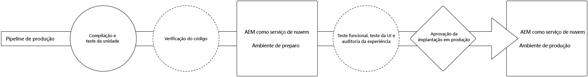

# Implantação de código {#deploy-your-code}

Saiba como implantar seu código em produção usando os pipelines do Cloud Manager no AEM as a Cloud Service.



A implantação perfeita de código em preparo e, em seguida, em produção é feita por meio de um pipeline de produção. A execução do pipeline de produção é dividida em duas fases lógicas.

1. Implantação no ambiente de preparo
   * O código é compilado e implantado no ambiente de preparo para testes funcionais automatizados, testes de interface do usuário, auditoria de experiência e testes de aceitação de usuários (UAT).
1. Implantação no ambiente de produção
   * Depois que a compilação for validada em preparo e aprovada para promoção em produção, o mesmo artefato de compilação será implantado no ambiente de produção.

_Somente o tipo de pipeline de Código de pilha completa oferece suporte à verificação do código, testes de função, testes de interface do usuário e auditoria de experiência._

## Implantação de código com o Cloud Manager no AEM as a Cloud Service {#deploying-code-with-cloud-manager}

Depois de [configurar o Pipeline de produção](/help/implementing/cloud-manager/configuring-pipelines/configuring-production-pipelines.md), incluindo repositório, ambiente e ambiente de teste, você estará pronto para implantar seu código.

1. Faça logon no Cloud Manager, em [my.cloudmanager.adobe.com](https://my.cloudmanager.adobe.com/), e selecione a organização apropriada.

1. No **[Meus programas](/help/implementing/cloud-manager/getting-access-to-aem-in-cloud/editing-programs.md#my-programs)** toque ou clique no programa para o qual deseja implantar código.

1. Clique em **Implantar** na chamada à ação na tela **Visão geral** para iniciar o processo de implantação.

   

1. A tela **Execução de pipeline** será exibida. Clique em **Compilar** para iniciar o processo.

   

O processo de compilação implanta o código pelas três fases.

1. [Implantação em preparo](#stage-deployment)
1. [Teste de preparo](#stage-testing)
1. [Implantação em produção](#production-deployment)

>[!TIP]
>
>Você pode revisar as etapas dos vários processos de implantação exibindo os registros ou revisando os resultados dos critérios de teste.

## Fase de implantação em preparo {#stage-deployment}

A fase de **Implantação em preparo** envolve estas etapas.

* **Validação** - Essa etapa garante que o pipeline esteja configurado para usar os recursos disponíveis no momento. por exemplo, testar se a ramificação configurada existe e se os ambientes estão disponíveis.
* **Teste de compilação e unidade**: essa etapa executa um processo de compilação contido.
   * Consulte o documento [Detalhes do ambiente de compilação](/help/implementing/cloud-manager/getting-access-to-aem-in-cloud/build-environment-details.md) para obter mais detalhes.
* **Verificação do código**: essa etapa avalia a qualidade do código do seu aplicativo.
   * Consulte [Teste de qualidade do código](/help/implementing/cloud-manager/code-quality-testing.md) para obter detalhes sobre o processo de teste.
* **Compilar imagens** - Esse processo é responsável por transformar os pacotes de conteúdo e dispatcher produzidos pela etapa de compilação em imagens do Docker e configurações Kubernetes.
* **Implantar em preparo** - A imagem é implantada no ambiente de preparo, como forme de preparação para a [Fase de teste de preparo.](#stage-testing)


## Fase de teste de preparo {#stage-testing}

O **Teste de preparo** envolve essas etapas.

* **Teste funcional do produto** - O pipeline do Cloud Manager realiza testes que são executados no ambiente de preparo.
   * Consulte [Teste funcional do produto](/help/implementing/cloud-manager/functional-testing.md#product-functional-testing) para obter mais detalhes.

* **Teste funcional personalizado** - Essa etapa no pipeline é sempre executada e não pode ser ignorada. Se nenhum JAR de teste for produzido pela compilação, o teste será aprovado por padrão.
   * Consulte [Teste funcional personalizado](/help/implementing/cloud-manager/functional-testing.md#custom-functional-testing) para obter mais detalhes.

* **Teste de interface do usuário personalizada** - Essa etapa é um recurso opcional que executa automaticamente testes de interface do usuário criados para aplicativos personalizados.
   * Os testes de interface do usuário são testes baseados em Selenium, compactados em uma imagem do Docker, para permitir uma variedade de opções de linguagens e estruturas (como Java e Maven, Node e WebDriver.io, ou qualquer outra estrutura e tecnologia criada no Selenium).
   * Consulte [Testes de interface personalizados](/help/implementing/cloud-manager/functional-testing.md#custom-ui-testing) para obter mais detalhes.

* **Auditoria de experiência** - Essa etapa no pipeline é sempre executada e não pode ser ignorada. Conforme um pipeline de produção é executado, uma etapa de auditoria de experiência é incluída após o teste funcional personalizado que realizará as verificações.
   * As páginas configuradas são enviadas ao serviço e avaliadas.
   * Os resultados são informativos e mostram as pontuações e as alterações entre as pontuações atual e anterior.
   * Essa informação é valiosa para determinar se há uma regressão introduzida com a implantação atual.
   * Consulte [Entender os resultados da auditoria de experiência](/help/implementing/cloud-manager/experience-audit-testing.md) para obter mais detalhes.


## Fase de implantação em produção {#deployment-production}

O processo de implantação em topologias de produção é ligeiramente diferente para minimizar o impacto sobre os visitantes de um site do AEM.

As implantações em produção geralmente seguem as mesmas etapas descritas anteriormente, mas de maneira gradual.

1. Implante pacotes de AEM para o autor.
1. Desconecte dispatcher1 do balanceador de carga.
1. Implante os pacotes do AEM em publish1 e o pacote do dispatcher em dispatcher1; limpe o cache do dispatcher.
1. Coloque dispatcher1 de volta no balanceador de carga.
1. Quando dispatcher1 estiver novamente em serviço, desconecte dispatcher2 do balanceador de carga.
1. Implante os pacotes do AEM em publish2 e o pacote do dispatcher em dispatcher2; limpe o cache do dispatcher.
1. Coloque dispatcher2 de volta no balanceador de carga.

Esse processo continua até que a implantação tenha atingido todos os editores e dispatchers na topologia.


## Tempos limite {#timeouts}

As seguintes etapas atingirão o tempo limite se forem deixadas aguardando o feedback do usuário:

| Etapa | Tempo limite |
|--- |--- |
| Teste de qualidade do código | 14 dias |
| Teste de segurança | 14 dias |
| Teste de desempenho | 14 dias |
| Pedido de aprovação | 14 dias |
| Agendar implantação em produção | 14 dias |
| Suporte CSE | 14 dias |

## Processo de implantação {#deployment-process}

Todas as implantações do Cloud Service seguem um processo gradual para garantir tempo de inatividade zero. Consulte [Como funcionam as implantações contínuas](/help/implementing/deploying/overview.md#how-rolling-deployments-work) para saber mais.

>[!NOTE]
>
>O cache do Dispatcher é limpo em cada implantação. Em seguida, ele é aquecido antes que os novos nós de publicação aceitem o tráfego.

## Reexecutar uma implantação de produção {#reexecute-deployment}

Em casos raros, as etapas de implantação de produção podem falhar por motivos transitórios. Nesses casos, a reexecução da etapa de implantação de produção é suportada desde que a etapa de implantação de produção tenha sido concluída, independentemente do tipo de conclusão (por exemplo, cancelada ou malsucedida). A reexecução cria uma nova execução usando o mesmo pipeline e consiste em três etapas.

1. A etapa de validação - É basicamente a mesma validação que ocorre durante uma execução normal do pipeline.
1. A etapa de criação - No contexto de uma reexecução, a etapa de criação copia artefatos e não executa realmente um novo processo de criação.
1. A etapa de implantação de produção - Usa as mesmas configurações e opções que a etapa de implantação de produção em uma execução normal de pipeline.

Nessas circunstâncias, quando uma reexecução for possível, a página de status do pipeline de produção fornecerá a opção **Reexecutar** ao lado da opção tradicional **Baixar log de compilação**.


>[!NOTE]
>
>Em uma reexecução, a etapa de compilação apresenta informações na interface que indicam que está copiando artefatos, não os recompilando.

### Limitações {#limitations}

* A reexecução da etapa de implantação de produção só estará disponível para a última execução.
* A reexecução não está disponível para execuções de atualização por push.
   * Se a última execução for uma execução de atualização por push, não será possível iniciar uma reexecução.
* Se a última execução falhar em qualquer ponto antes da etapa de implantação em produção, não será possível iniciar uma reexecução.

### API de reexecução {#reexecute-API}

Além de estar disponível na interface do usuário do, você pode usar [a API do Cloud Manager](https://developer.adobe.com/experience-cloud/cloud-manager/reference/api/#tag/Pipeline-Execution) para acionar reexecuções e identificar execuções que foram acionadas como reexecuções.

#### Acionar uma reexecução {#reexecute-deployment-api}

Para acionar uma reexecução, faça uma solicitação PUT para o link HAL `https://ns.adobe.com/adobecloud/rel/pipeline/reExecute` no estado da etapa de implantação em produção.

* Se esse link estiver presente, a execução poderá ser reiniciada dessa etapa.
* Se estiver ausente, a execução não poderá ser reiniciada dessa etapa.

Esse link só está disponível para a etapa de implantação em produção.

```JavaScript
 {
  "_links": {
    "https://ns.adobe.com/adobecloud/rel/pipeline/logs": {
      "href": "/api/program/4/pipeline/1/execution/953671/phase/1575676/step/2983530/logs",
      "templated": false
    },
    "https://ns.adobe.com/adobecloud/rel/pipeline/reExecute": {
      "href": "/api/program/4/pipeline/1/execution?stepId=2983530",
      "templated": false
    },
    "https://ns.adobe.com/adobecloud/rel/pipeline/metrics": {
      "href": "/api/program/4/pipeline/1/execution/953671/phase/1575676/step/2983530/metrics",
      "templated": false
    },
    "self": {
      "href": "/api/program/4/pipeline/1/execution/953671/phase/1575676/step/2983530",
      "templated": false
    }
  },
  "id": "6187842",
  "stepId": "2983530",
  "phaseId": "1575676",
  "action": "deploy",
  "environment": "weretail-global-b75-prod",
  "environmentType": "prod",
  "environmentId": "59254",
  "startedAt": "2022-01-20T14:47:41.247+0000",
  "finishedAt": "2022-01-20T15:06:19.885+0000",
  "updatedAt": "2022-01-20T15:06:20.803+0000",
  "details": {
  },
  "status": "FINISHED"
```

A sintaxe do valor href do link HAL é apenas um exemplo. O valor real sempre deve ser lido do link HAL, e não gerado.

O envio de uma solicitação PUT para esse endpoint resulta em uma resposta 201, se bem-sucedido, e o corpo da resposta é a representação da nova execução. É semelhante a iniciar uma execução regular por meio da API.

#### Identificação de uma execução reexecutada {#identify-reexecution}

As reexecuções podem ser identificadas pelo valor `RE_EXECUTE` no campo `trigger`.
