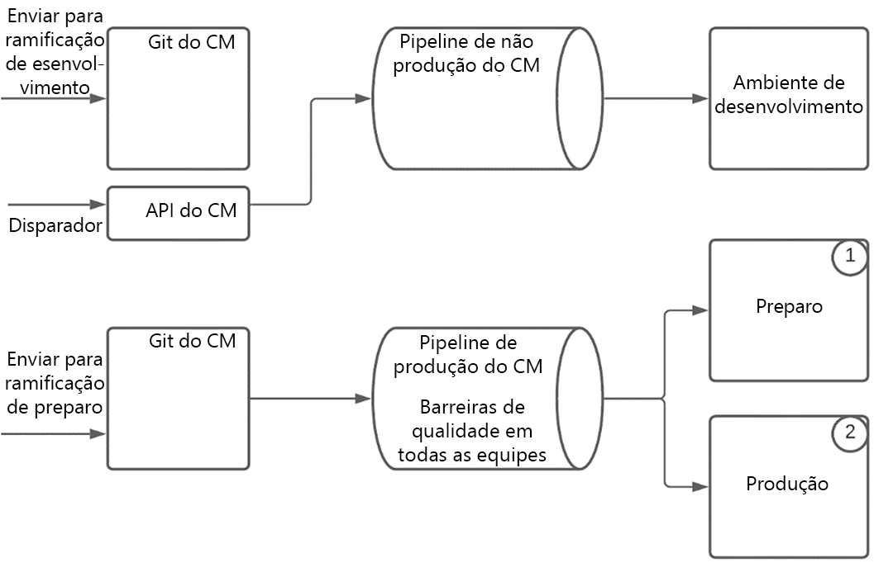
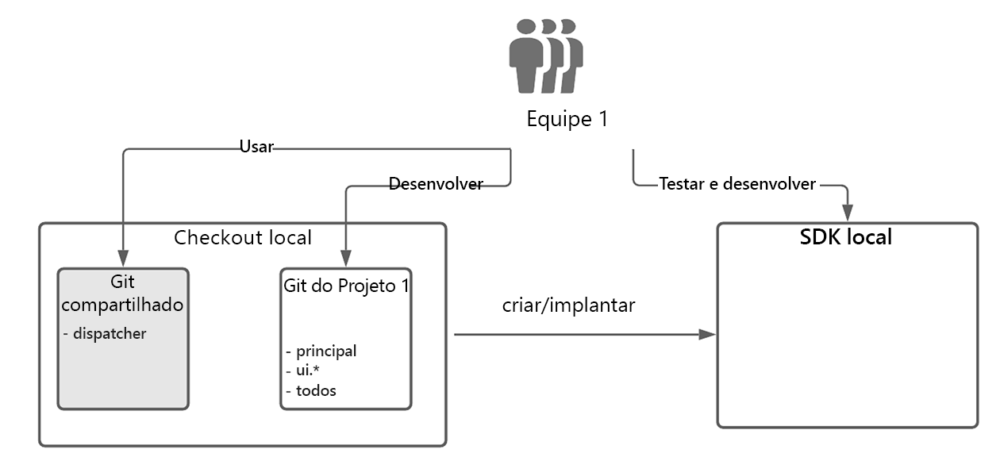

# Configuração de desenvolvimento de equipe empresarial para AEM como Cloud Service {#enterprise-setup}

## Introdução {#introduction}

AEM como Cloud Service, uma oferta nativa em nuvem que oferece AEM como serviço foi projetada para se beneficiar de mais de 10 anos de fornecimento de software corporativo a equipes corporativas com suas necessidades específicas. Embora catapulte AEM no mundo nativo da nuvem, com novos valores como sempre ativos, sempre atuais, sempre seguros e sempre em escala, ele retém a principal proposta de valor que AEM oferece como uma plataforma personalizável para nossos clientes e permite que equipes de nível empresarial se integrem em seus procedimentos de desenvolvimento e delivery.

Para dar suporte a nossos clientes com configurações de desenvolvimento corporativo, o AEM as a Cloud Service integra-se totalmente ao Cloud Manager e seus pipelines de CI/CD orientados e específicos, que são equipados com práticas recomendadas e aprendizados de vários anos de experiência com desenvolvimento e implantações de nível corporativo - garantindo testes completos e a mais alta qualidade do código para fornecer experiências excepcionais.

## Suporte do Cloud Manager na configuração de desenvolvimento de equipes empresariais {#cloud-manager}

Para garantir a integração rápida dos clientes, o Cloud Manager fornece tudo o que é necessário para começar a desenvolver experiências imediatamente, incluindo um repositório Git para armazenar personalizações que são criadas, verificadas e implantadas pelo Cloud Manager.
Usando o Cloud Manager, as equipes de desenvolvimento podem trabalhar para confirmar as alterações com frequência, sem depender da equipe do Adobe.

Três tipos de ambiente estão disponíveis no Cloud Manager:

* Desenvolvimento
* Estágio
* Produção

O código pode ser implantado em ambientes de desenvolvimento usando um pipeline de não produção. Para Preparo e Produção, que sempre se unem e, portanto, garantem a validação antes da implantação de produção como prática recomendada, um pipeline de produção usa portas de qualidade para validar o código do aplicativo e as alterações de configuração.

O pipeline de Produção implanta o código e a configuração no ambiente de preparo primeiro, testa o aplicativo e finalmente implanta na produção.
Um SDK do Cloud Service que é sempre atualizado com as melhorias mais recentes do Cloud Service permite o desenvolvimento local diretamente utilizando o hardware local do desenvolvedor. Isto permite um desenvolvimento rápido com tempos de resposta muito baixos. Assim, os desenvolvedores podem permanecer em seu ambiente local familiar e escolher entre uma grande variedade de ferramentas de desenvolvimento, além de impulsionar a ambientes de desenvolvimento ou produção, quando bem entenderem.

O Cloud Manager é compatível com configurações flexíveis de várias equipes, que podem ser ajustadas para atender às necessidades de uma empresa. Isso se aplica ao Cloud Service e ao AMS. Para garantir implantações estáveis com várias equipes e evitar que uma equipe afete a produção de todas as equipes, o pipeline opinativo dos Gerentes de nuvem sempre valida e testa o código de todas as equipes.

## Exemplo do mundo real {#real-world-example}

Cada empresa tem requisitos diferentes, incluindo configuração de equipe, processos e fluxos de trabalho de desenvolvimento diferentes. A configuração descrita abaixo é usada pelo Adobe para vários projetos que proporcionam experiências além do AEM como Cloud Service.

Por exemplo, os aplicativos do Adobe Creative Cloud, como Adobe Photoshop ou Adobe Illustrator, incluem recursos de conteúdo, como tutoriais, amostras e guias disponíveis para os usuários finais. Esse conteúdo é consumido pelos aplicativos clientes usando AEM como Cloud Service de uma maneira *headless*, fazendo chamadas de API para o AEM Cloud publish tier para recuperar o conteúdo estruturado como fluxos JSON e aproveitando o AEM Cloud Service CDN para fornecer conteúdo estruturado e não estruturado com desempenho ideal.

As equipes que contribuem para este projeto seguem o processo descrito a seguir.

>[!NOTE]
>Consulte [Trabalhar com Repositórios Git de Várias Fontes](https://experienceleague.adobe.com/docs/experience-manager-cloud-manager/using/managing-code/working-with-multiple-source-git-repos.html#managing-code) para saber mais sobre a configuração.

Cada equipe está usando seu próprio fluxo de trabalho de desenvolvimento e tem um repositório Git separado. Um repositório Git compartilhado adicional é usado para integração de projetos. Esse repositório Git contém a estrutura raiz do repositório Git do Cloud Manager, incluindo a configuração compartilhada do dispatcher. A integração de um novo projeto requer a listagem no arquivo do projeto Maven do reator na raiz do repositório Git compartilhado. Para a configuração do dispatcher, um novo arquivo de configuração é criado dentro do projeto do dispatcher. Esse arquivo é então incluído pela configuração principal do dispatcher. Cada equipe é responsável por seu próprio arquivo de configuração de dispatcher. As alterações no repositório Git compartilhado são raras e geralmente só são necessárias quando um novo projeto é integrado. O trabalho principal é feito por cada equipe de projeto em seu próprio repositório Git.

O repositório Git para cada equipe foi configurado usando o arquétipo Maven AEM e, portanto, segue as práticas recomendadas para a configuração de projetos AEM. A única exceção é a manipulação da configuração do dispatcher que é feita no repositório Git compartilhado conforme descrito acima.
Cada equipe usa um fluxo de trabalho git simplificado com duas ramificações + N, seguindo o modelo de fluxo Git:

* Uma ramificação de liberação estável contém o código de produção

* Uma ramificação de desenvolvimento contém o desenvolvimento mais recente

* Para cada recurso, uma nova ramificação é criada

O desenvolvimento é feito em uma ramificação de recursos, quando o recurso amadurece, ele é mesclado à ramificação de desenvolvimento. Os recursos concluídos e validados são extraídos da ramificação de desenvolvimento e mesclados na ramificação estável. Todas as alterações são feitas por meio de Solicitações de pull (PR). Cada PR é automaticamente validada por portas de qualidade. O Sonar é usado para verificar a qualidade do código, e um conjunto de conjuntos de teste é executado para garantir que o novo código não esteja introduzindo qualquer regressão.

A configuração no repositório Git do Cloud Manager tem duas ramificações:

* Uma *ramificação de liberação estável*, contendo o código de produção de todas as equipes
* Uma *ramificação de desenvolvimento*, contendo o código de desenvolvimento de todas as equipes

Cada push para o repositório Git de uma equipe no desenvolvimento ou na ramificação estável está acionando uma [ação do github](https://experienceleague.adobe.com/docs/experience-manager-cloud-manager/using/managing-code/working-with-multiple-source-git-repos.html?lang=en#managing-code). Todos os projetos seguem a mesma configuração para a ramificação estável: Um push da ramificação estável de um projeto é enviado automaticamente para a ramificação estável no repositório Git do Cloud Managers. O pipeline de produção no Cloud Manager é configurado para ser acionado por um push para a ramificação estável. O pipeline de produção é, portanto, executado por cada push de qualquer equipe em uma ramificação estável e a implantação de produção é atualizada se todas as portas de qualidade passarem.

Os esforços para o ramo de desenvolvimento são tratados de forma diferente. Embora um push para uma ramificação de desenvolvedor no repositório Git de uma equipe também esteja acionando uma ação github e o código seja enviado automaticamente para a ramificação de desenvolvimento no repositório Git do Cloud Manager, o pipeline de não produção não é acionado automaticamente pelo push de código. É acionado por uma chamada para a api do Cloud Manager.
A execução do pipeline de produção inclui a verificação do código de todas as equipes por meio das portas de qualidade fornecidas. Depois que o código é implantado no estágio, os testes e as auditorias são executados para garantir que tudo funcione conforme o esperado. Depois que todas as portas forem passadas, as alterações serão implementadas para produção sem interrupção ou tempo de inatividade.
Para desenvolvimento local, o SDK para Cloud Service é usado. O SDK permite que um autor, publicação e dispatcher locais sejam configurados. Isso permite o desenvolvimento offline e tempos de resposta rápidos. Às vezes, somente o autor é usado para desenvolvimento, mas a configuração rápida do dispatcher e da publicação permite testar tudo localmente antes de enviar para o repositório Git. Os membros de cada equipe geralmente fazem check-out do código no git compartilhado para , bem como em seu próprio código de projeto. Não há necessidade de realizar check-out de outros projetos, pois eles são independentes.

Essa configuração do mundo real pode ser usada como um blueprint e depois personalizada para as necessidades de uma empresa. O conceito flexível de ramificação e mesclagem do git permite variações dos fluxos de trabalho acima, personalizados para as necessidades de cada equipe. O AEM as a Cloud Service suporta todas essas variações sem sacrificar o valor principal do pipeline do Cloud Manager opinado.

### Considerações para uma configuração de vários grupos {#considerations}

O projeto descrito acima para uma configuração de várias equipes permite dimensionar em um número maior de equipes. Com o repositório Git do Cloud Manager e o pipeline de produção, sempre o código de produção completo é executado por todas as portas de qualidade, tratando-o como uma unidade de implantação. Dessa forma, o sistema de produção é mantido *sempre em* sem interrupção ou tempo de inatividade.
Por outro lado, sem esse sistema em vigor, porque cada equipe pode implantar separadamente, existe o risco de que uma atualização de uma única equipe possa levar a problemas de estabilidade de produção. Além disso, requer coordenação e tempo de inatividade planejado para lançar atualizações. Com um número crescente de equipes, o esforço de coordenação tornar-se-á muito mais complexo e rapidamente incontrolável.
Se for detectado um problema nas portas de qualidade, a produção não é afetada e o problema pode ser detectado e corrigido sem o pessoal de Adobe necessário para entrar. Sem o Cloud Service e sem sempre testar toda a implantação, implantações parciais podem causar paralisações que exigem uma solicitação de reversão ou até mesmo uma restauração completa de um backup. Os ensaios parciais podem também conduzir a outros problemas que terão de ser resolvidos depois de o fato exigir de novo a coordenação e o apoio do pessoal Adobe.

Para qualquer configuração de várias equipes, é fundamental definir um modelo de governança e um conjunto de padrões que todas as equipes devem seguir. Você pode usar o blueprint como ponto de partida.