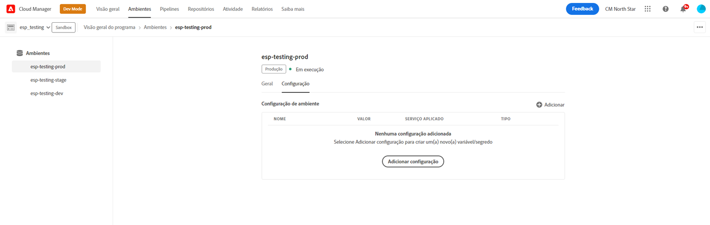
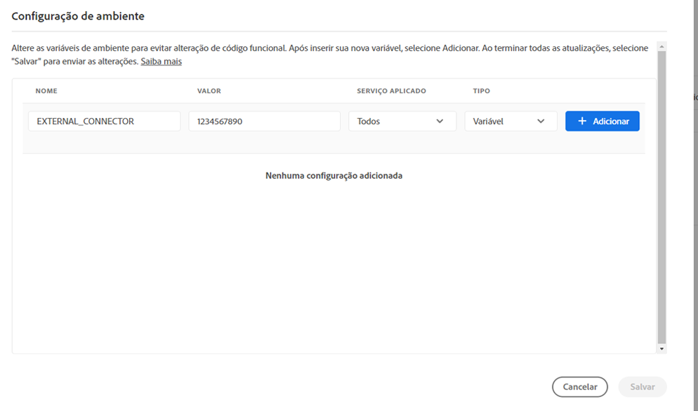
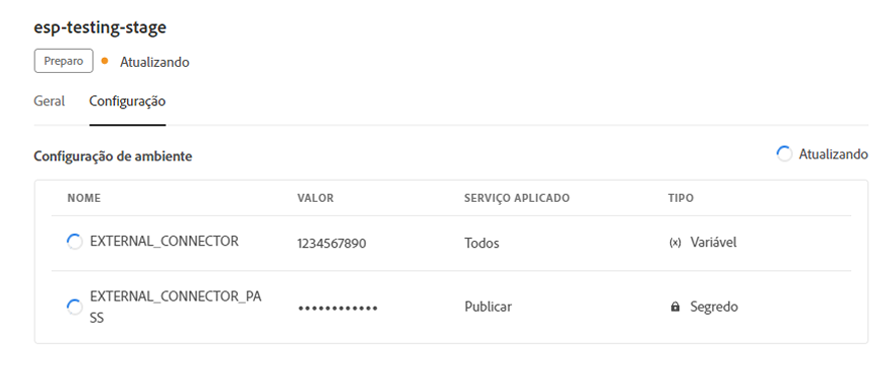
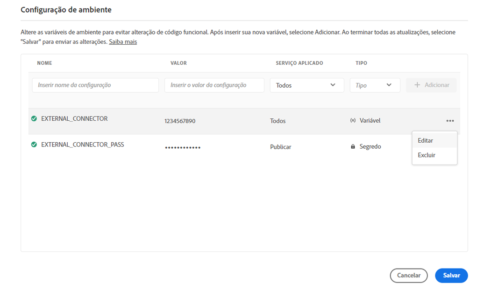
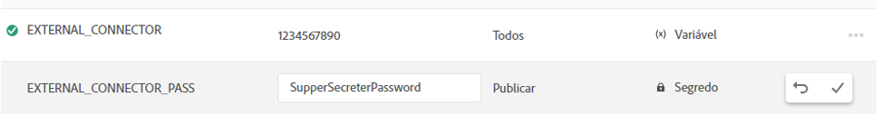

# Variáveis de ambiente no Cloud Manager {#environment-variables}

As variáveis de ambiente padrão podem ser configuradas e gerenciadas pelo Cloud Manager. Eles são fornecidos para o ambiente de tempo de execução e podem ser usados nas configurações do OSGi.

As variáveis de ambiente podem ser valores específicos ou segredos do ambiente, com base no que está sendo alterado.

## Sobre variáveis de ambiente {#overview}

As variáveis de ambiente oferecem vários benefícios aos usuários do AEM as a Cloud Service, como os seguintes:

* Elas permitem que o comportamento do código e do aplicativo varie com base no contexto e no ambiente. Por exemplo, elas podem ser usadas para permitir configurações diferentes no ambiente de desenvolvimento em comparação aos ambientes de produção ou de preparo para evitar erros dispendiosos.
* Elas somente precisam ser configuradas uma vez, e podem ser atualizadas e excluídas quando necessário.
* Seus valores podem ser atualizados a qualquer momento e têm efeito imediatamente, sem a necessidade de alterações ou implantações de código.
* Elas podem separar o código da configuração e eliminar a necessidade de incluir informações confidenciais no controle de versão.
* Elas melhoram a segurança do aplicativo do AEM as a Cloud Service, pois residem fora do código.

Casos de uso típicos para as variáveis de ambiente incluem:

* Conectar o aplicativo do AEM a diferentes endpoints externos
* Usar uma referência ao armazenar senhas em vez de armazená-la diretamente na base do código
* Quando existem vários ambientes de desenvolvimento em um programa e algumas configurações diferem de um ambiente para outro

## Adicionar uma variável de ambiente {#add-variables}

Se você quiser adicionar várias variáveis, a Adobe recomenda adicionar a primeira variável e usar o  **Adicionar** na caixa de diálogo **Configuração do ambiente** para adicionar as variáveis adicionais. Esse método significa que é possível adicioná-los com uma atualização ao ambiente.

Para adicionar, atualizar ou excluir variáveis de ambiente, você deve ser membro da [**função de Gerente de Implantação**](/help/onboarding/cloud-manager-introduction.md#role-based-premissions).

**Para adicionar uma variável de ambiente:**

1. Faça logon no Cloud Manager, em [my.cloudmanager.adobe.com](https://my.cloudmanager.adobe.com/), e selecione a organização apropriada.
1. No console **[Meus Programas](/help/implementing/cloud-manager/navigation.md#my-programs)**, selecione aquele que deseja gerenciar.
1. No menu lateral, clique em **Ambientes**.
1. Na página **Ambientes**, selecione uma linha na tabela que tenha o ambiente para o qual você deseja adicionar uma variável de ambiente.
1. Na página de detalhes do ambiente, clique na guia **Configuração**.
1. Clique em  **Adicionar/Atualizar**.
Se você estiver adicionando uma variável de ambiente pela primeira vez, clique em **Adicionar configuração** no centro da página.

   

1. Na caixa de diálogo **Configuração do Ambiente**, insira os detalhes na primeira linha da tabela.

   | Texto | Descrição |
   | --- | --- |
   | Nome | Um nome exclusivo da variável de configuração. Ela identifica a variável específica usada no ambiente. Ele deve seguir as seguintes convenções de nomenclatura:<ul><li>As variáveis só podem conter caracteres alfanuméricos e sublinhado (`_`).</li><li>Há um limite de 200 variáveis por ambiente.</li><li>Cada nome deve ter 100 caracteres ou menos.</li></ul> |
   | Valor | O valor que a variável contém. |
   | Etapa aplicada | Selecione a qual serviço a variável se aplica. Selecione **Todos** para aplicar a variável a todos os serviços.<ul><li>**Tudo**</li><li>**Autor**</li><li>**Publicar**</li><li>**Visualização**</li></ul> |
   | Tipo | Selecione se a variável for normal ou um segredo. |

   

1. Clique no ícone **Adicionar**.

   Adicione mais variáveis, conforme necessário.

1. Clique em **Salvar**.

   Um ponteiro com o status **Atualizando** é mostrado no canto superior direito da tabela. Um ponteiro também é exibido à esquerda de qualquer variável adicionada recentemente. Esses status indicam que o ambiente está sendo atualizado com a configuração. Após a conclusão, a nova variável de ambiente estará visível na tabela.

## Atualizar uma variável de ambiente {#update-variables}

Depois de criar as variáveis de ambiente, você pode atualizá-las usando  **Adicionar/Atualizar** para abrir a caixa de diálogo **Configuração de Ambiente**.

Se você deseja atualizar várias variáveis, a Adobe recomenda usar a caixa de diálogo **Configuração do Ambiente** para atualizar todas as variáveis necessárias de uma só vez antes de clicar em **Salvar**. Dessa forma, você pode adicioná-las com uma atualização ao ambiente.

**Para atualizar uma variável de ambiente:**

1. Faça logon no Cloud Manager, em [my.cloudmanager.adobe.com](https://my.cloudmanager.adobe.com/), e selecione a organização apropriada.
1. No console **[Meus Programas](/help/implementing/cloud-manager/navigation.md#my-programs)**, selecione aquele que deseja gerenciar.
1. No menu lateral, clique em **Ambientes**.
1. Na página **Ambientes**, selecione uma linha na tabela que tenha o ambiente para o qual você deseja atualizar uma variável.
1. Na página de detalhes do ambiente, clique na guia **Configuração**.
1. Clique em  **Adicionar/Atualizar**.
1. Na caixa de diálogo **Configuração do Ambiente**, clique em  na última coluna da linha da variável que você deseja alterar.
1. No menu suspenso, clique em **Editar**.

   

1. Atualize o valor da variável de ambiente conforme necessário.
Ao editar um segredo, o valor só pode ser atualizado, não visualizado.

   

1. Siga uma das seguintes opções:

   * Clique em  para aplicar a alteração.
   * Clique no  para desfazer a alteração.

1. Clique em **Salvar**.

   Um ponteiro com o status **Atualizando** é mostrado no canto superior direito da tabela. Um ponteiro também é exibido à esquerda de qualquer variável atualizada. Esses status indicam que o ambiente está sendo atualizado com a configuração. Após a conclusão, a variável de ambiente atualizada fica visível na tabela.

## Excluir uma variável de ambiente {#delete-env-variable}

1. Faça logon no Cloud Manager, em [my.cloudmanager.adobe.com](https://my.cloudmanager.adobe.com/), e selecione a organização apropriada.
1. No console **[Meus Programas](/help/implementing/cloud-manager/navigation.md#my-programs)**, selecione aquele que deseja gerenciar.
1. No menu lateral, clique em **Ambientes**.
1. Na página **Ambientes**, selecione uma linha na tabela que tenha o ambiente para o qual você deseja atualizar uma variável.
1. Na página de detalhes do ambiente, clique na guia **Configuração**.
1. Clique em  **Adicionar/Atualizar**.
1. Na caixa de diálogo **Configuração do Ambiente**, clique em  na última coluna da linha da variável que você deseja alterar.
1. No menu suspenso, clique em **Excluir** para remover a variável imediatamente.
1. Clique em **Salvar**.

## Uso de variáveis de ambiente {#using}

As variáveis de ambiente podem tornar suas configurações `pom.xml` mais seguras e flexíveis. Por exemplo, senhas não precisam ser codificadas e sua configuração pode ser ajustada com base nos valores das variáveis de ambiente.

Você pode acessar segredos e variáveis de ambiente por meio do XML, como segue:

`${env.VARIABLE_NAME}`

Consulte [Configurando o Projeto](/help/implementing/cloud-manager/getting-access-to-aem-in-cloud/setting-up-project.md#password-protected-maven-repository-support-password-protected-maven-repositories) para obter um exemplo de como usar os dois tipos de variáveis em um arquivo `pom.xml`.

Consulte também a [documentação oficial do Maven](https://maven.apache.org/settings.html#quick-overview) para obter mais detalhes.

## Disponibilidade de variáveis de ambiente {#availability}

As variáveis de ambiente podem ser usadas em vários lugares da seguinte maneira:

| Onde as variáveis de ambiente podem ser usadas | Descrição |
| --- | --- |
| Autor, visualização e publicação | As variáveis e os segredos comuns do ambiente podem ser usados nos ambientes de criação, visualização e publicação. |
| Dispatcher | Somente variáveis de ambiente regulares podem ser usadas com [a Dispatcher](https://experienceleague.adobe.com/pt-br/docs/experience-manager-dispatcher/using/dispatcher).<ul><li>Não é possível usar segredos.</li><li>As variáveis de ambiente não podem ser usadas em diretivas `IfDefine`.</li><li>Valide o uso das variáveis de ambiente com o [Dispatcher localmente](https://experienceleague.adobe.com/pt-br/docs/experience-manager-learn/cloud-service/local-development-environment-set-up/dispatcher-tools) antes da implantação.</li></ul> |
| Configurações do OSGi | As variáveis de ambiente comuns e os segredos podem ser usados em [Configurações OSGi](/help/implementing/deploying/configuring-osgi.md). |
| Variáveis de pipeline | Além das variáveis de ambiente, também há variáveis de pipeline, que são expostas durante a fase de criação. Saiba mais sobre variáveis de pipeline em [Ambiente de compilação](/help/implementing/cloud-manager/getting-access-to-aem-in-cloud/build-environment-details.md#pipeline-variables). |

