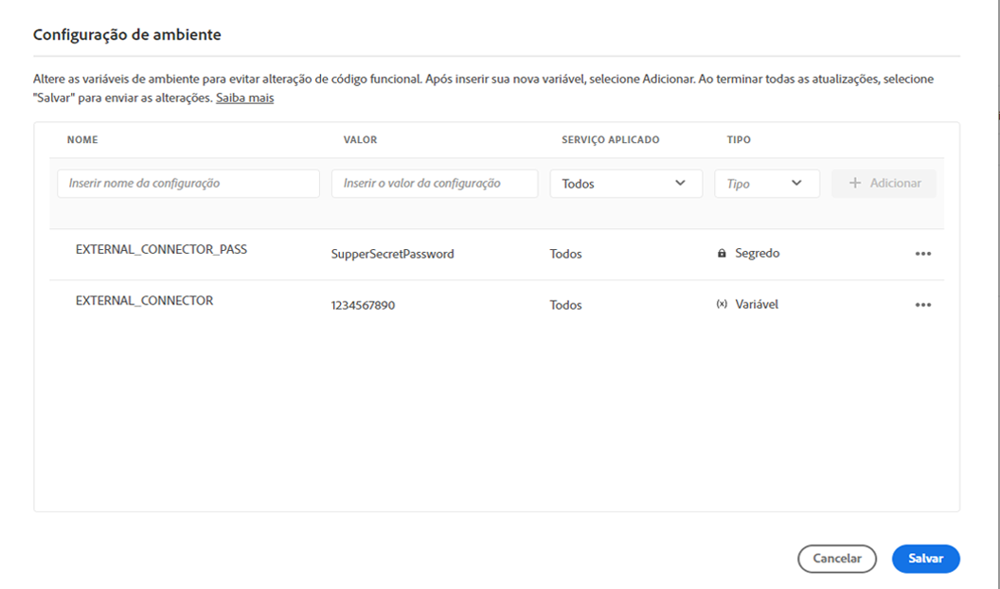
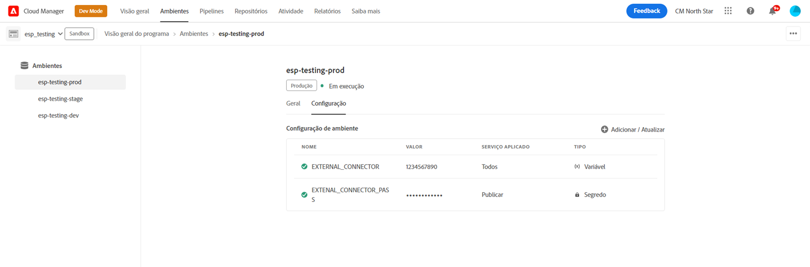

# Variáveis de ambiente do Cloud Manager {#environment-variables}

As variáveis de ambiente padrão podem ser configuradas e gerenciadas pelo Cloud Manager. Elas são fornecidas para o ambiente de tempo de execução e podem ser usados nas configurações do OSGi. As variáveis de ambiente podem ser valores específicos ou segredos do ambiente, com base no que está sendo alterado.

## Visão geral {#overview}

As variáveis de ambiente oferecem vários benefícios aos usuários do AEM as a Cloud Service:

* Elas permitem que o comportamento do código e do aplicativo varie com base no contexto e no ambiente. Por exemplo, elas podem ser usadas para permitir configurações diferentes no ambiente de desenvolvimento em relação aos ambientes de produção ou de preparo para evitar erros dispendiosos.
* Elas somente precisam ser configuradas uma vez, e podem ser atualizadas e excluídas quando necessário.
* Seus valores podem ser atualizados a qualquer momento e têm efeito imediatamente, sem a necessidade de alterações ou implantações de código.
* Elas podem separar o código da configuração e eliminar a necessidade de incluir informações confidenciais no controle de versão.
* Elas melhoram a segurança do aplicativo do AEM as a Cloud Service, pois residem fora do código.

Casos de uso típicos para as variáveis de ambiente incluem:

* Conectar o aplicativo do AEM a diferentes endpoints externos
* Usar uma referência ao armazenar senhas em vez de armazená-la diretamente na base do código
* Quando existem vários ambientes de desenvolvimento em um programa e algumas configurações diferem de um ambiente para outro

## Adição de variáveis de ambiente {#add-variables}

>[!NOTE]
>
>Você deve ser um membro do [**Gerente de implantação** função](/help/onboarding/cloud-manager-introduction.md#role-based-premissions) para adicionar ou modificar variáveis de ambiente.

1. Faça logon no Adobe Cloud Manager em [my.cloudmanager.adobe.com](https://my.cloudmanager.adobe.com/).
1. O Cloud Manager lista os vários programas disponíveis. Selecione aquele que deseja gerenciar.
1. Selecione a guia **Ambientes** do programa escolhido e o ambiente para o qual deseja criar uma variável de ambiente no painel de navegação esquerdo.
1. Nos detalhes do ambiente, selecione a guia **Configuração** e clique em **Adicionar** para abrir a caixa de diálogo **Configuração do ambiente**.
   * Se estiver adicionando uma variável de ambiente pela primeira vez, você verá uma **Adicionar configuração** no centro da página. Você pode usar esse botão ou **Adicionar** para abrir a caixa de diálogo **Configuração do ambiente**.

   

1. Insira os detalhes da variável.
   * **Nome**
   * **Valor**
   * **Serviço aplicado** - Define o serviço (Autor/Publicação/Visualização) ao qual a variável se aplica ou se aplica a todos os serviços
   * **Tipo** - Define se a variável é normal ou um segredo

   

1. Depois de inserir a nova variável, é necessário selecionar **Adicionar** na última coluna da linha que contém a nova variável.
   * É possível inserir várias variáveis de uma só vez, inserindo uma nova linha e selecionando **Adicionar**.

   

1. Selecione **Salvar** para manter suas variáveis.

Um indicador com o status **Atualizando** é mostrado na parte superior da tabela e ao lado da variável recém-adicionada para indicar que o ambiente está sendo atualizado com a configuração. Após a conclusão, a nova variável de ambiente fica visível na tabela.

>[!TIP]
>
>Se quiser adicionar várias variáveis, é recomendado adicionar a primeira variável e usar o botão **Adicionar** na caixa de diálogo **Configuração do ambiente** para adicionar as variáveis adicionais. Dessa forma, você pode adicioná-las com uma atualização ao ambiente.

## Atualização de variáveis de ambiente {#update-variables}

Depois de criar as variáveis de ambiente, você pode atualizá-las usando o botão **Adicionar/atualizar** para abrir a caixa de diálogo **Configuração do ambiente**.

1. Faça logon no Adobe Cloud Manager em [my.cloudmanager.adobe.com](https://my.cloudmanager.adobe.com/).
1. O Cloud Manager lista os vários programas disponíveis. Selecione aquele que deseja gerenciar.
1. Selecione a guia **Ambientes** do programa escolhido e o ambiente para o qual deseja criar uma variável de ambiente no painel de navegação esquerdo.
1. Nos detalhes do ambiente, selecione a guia **Configuração** e clique em **Adicionar/atualizar** no canto superior direito para abrir a caixa de diálogo **Configuração do ambiente**.

   

1. Usando o botão de reticências na última coluna da linha da variável que você deseja modificar, selecione **Editar** ou **Excluir**.

   

1. Edite a variável de ambiente conforme necessário.
   * Ao editar, o botão de reticências será alterado para opções para reverter ao valor original ou confirmar a alteração.
   * Ao editar segredos, os valores somente podem ser atualizados, não visualizados.

   

1. Depois de fazer todas as alterações necessárias na configuração, selecione **Salvar**.

[Como ocorre ao adicionar variáveis,](#add-variables) um indicador com o status **Atualização** é mostrado na parte superior da tabela e ao lado da variável recém-atualizada para indicar que o ambiente está sendo atualizado com a configuração. Após a conclusão, as variáveis de ambiente atualizadas ficam visíveis na tabela.

>[!TIP]
>
>Se quiser atualizar várias variáveis, é recomendado usar a caixa de diálogo **Configuração do ambiente** para atualizar todas as variáveis necessárias de uma vez antes de tocar ou clicar em **Salvar**. Dessa forma, você pode adicioná-las com uma atualização ao ambiente.

## Uso de variáveis de ambiente {#using}

As variáveis de ambiente podem tornar suas configurações `pom.xml` mais seguras e flexíveis. Por exemplo, senhas não precisam ser codificadas e sua configuração pode ser ajustada com base nos valores das variáveis de ambiente.

Você pode acessar segredos e variáveis de ambiente por meio do XML, como segue.

* `${env.VARIABLE_NAME}`

Consulte o documento [Configuração do projeto](/help/implementing/cloud-manager/getting-access-to-aem-in-cloud/setting-up-project.md#password-protected-maven-repository-support-password-protected-maven-repositories) para obter um exemplo de como usar os dois tipos de variáveis em um arquivo `pom.xml`.

Consulte a [documentação oficial do Maven](https://maven.apache.org/settings.html#quick-overview) para obter mais detalhes.

## Disponibilidade da variável de ambiente {#availability}

As variáveis de ambiente podem ser usadas em vários lugares.

### Autor, visualização e publicação {#author-preview-publish}

As variáveis e os segredos comuns do ambiente podem ser usados nos ambientes de criação, visualização e publicação.

### Dispatcher {#dispatcher}

Somente variáveis de ambiente comuns podem ser usadas com o [Dispatcher.](https://experienceleague.adobe.com/docs/experience-manager-dispatcher/using/dispatcher.html?lang=pt-BR) Secretsnão podem ser usados.

No entanto, as variáveis de ambiente não podem ser usadas no `IfDefine` diretivas.

>[!TIP]
>
>Você deve validar o uso das variáveis de ambiente com o [Dispatcher localmente](https://experienceleague.adobe.com/docs/experience-manager-learn/cloud-service/local-development-environment-set-up/dispatcher-tools.html?lang=pt-BR) antes da implantação.

### Configurações do OSGi {#osgi}

As variáveis e os segredos comuns do ambiente podem ser usados nas [configurações do OSGi](/help/implementing/deploying/configuring-osgi.md).

### Variáveis de pipeline {#pipeline}

Além das variáveis de ambiente, também há variáveis de pipeline, que são expostas durante a fase de criação. [Saiba mais sobre variáveis de pipeline aqui](/help/implementing/cloud-manager/getting-access-to-aem-in-cloud/build-environment-details.md#pipeline-variables).
