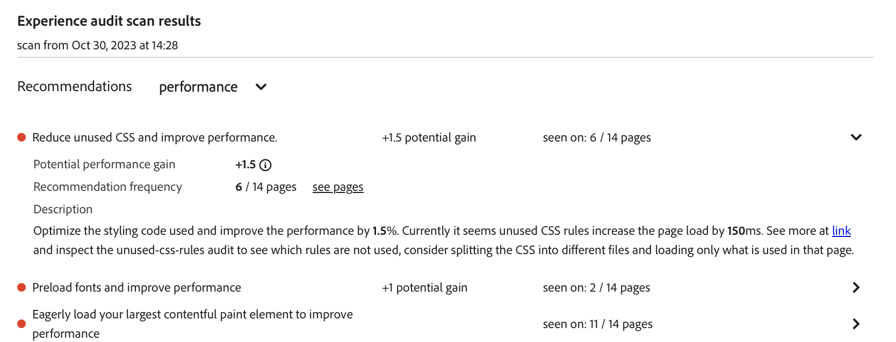

# Painel de auditoria de experiência {#experience-audit-dashboard}

Saiba como a Auditoria de experiência valida seu processo de implantação e ajuda a garantir que as alterações implantadas atendam aos padrões básicos de desempenho, acessibilidade, práticas recomendadas e SEO, por meio de uma interface de painel clara e informativa.

>[!NOTE]
>
>Este recurso só está disponível por meio do [programa de adoção antecipada.](/help/implementing/cloud-manager/release-notes/current.md#early-adoption)
>
>Para obter detalhes sobre o recurso existente de Auditoria de experiência do AEM as a Cloud Service, consulte o documento [Teste de auditoria de experiência](/help/implementing/cloud-manager/experience-audit-testing.md)

## Visão geral {#overview}

A Auditoria de experiência valida o processo de implantação e ajuda a garantir que as alterações sejam implantadas:

1. Atenda aos padrões básicos de desempenho, acessibilidade, práticas recomendadas, SEO (otimização do mecanismo de pesquisa) e PWA (Aplicativo Web Progressivo).

1. Não introduza regressões.

A Auditoria de experiência no Cloud Manager garante que a experiência do usuário no site seja do mais alto padrão.

Os resultados da auditoria são informativos e permitem que o gerente de implantação veja as pontuações e as alterações entre as pontuações atual e anterior. Essa informação é valiosa para determinar se foi introduzida uma regressão com a implantação atual.

A Auditoria de experiência é disponibilizada pelo [Google Lighthouse](https://developer.chrome.com/docs/lighthouse/overview/), uma ferramenta de código aberto da Google, e está habilitada em todos os pipelines de produção do Cloud Manager.

## Disponibilidade {#availability}

A Auditoria de experiência está disponível para o Cloud Manager:

* Pipelines de produção de sites, por padrão
* Desenvolvimento de pipelines de pilha completa, opcionalmente
* Pipelines de front-end de desenvolvimento, opcionalmente

Consulte a [seção Configuração](#configuration) para obter mais informações sobre como configurar a auditoria para os ambientes opcionais.

As auditorias são executadas como parte do pipeline. As auditorias também podem ser [executadas sob demanda](#on-demand) fora dos pipelines.

## Configuração {#configuration}

A Auditoria de experiência está disponível por padrão para pipelines de produção. Ele pode ser ativado opcionalmente para pipelines de pilha completa e front-end de desenvolvimento. Em todos os casos, é necessário definir quais caminhos de conteúdo são avaliados durante a execução do pipeline.

1. Dependendo do tipo de pipeline que você deseja configurar, siga as instruções para:

   * Adicione um novo [pipeline de produção](/help/implementing/cloud-manager/configuring-pipelines/configuring-production-pipelines.md) se desejar definir os caminhos a serem avaliados pela auditoria.
   * Adicione um novo [pipeline de não produção](/help/implementing/cloud-manager/configuring-pipelines/configuring-non-production-pipelines.md) se desejar habilitar a auditoria em um pipeline de front-end ou de pilha completa de desenvolvimento.
   * Ou você pode [editar um pipeline existente](/help/implementing/cloud-manager/configuring-pipelines/managing-pipelines.md) e atualizar as opções existentes.

1. Se você estiver adicionando ou editando um pipeline de não produção para o qual deseja usar a Auditoria de Experiência, marque a caixa de seleção **Auditoria de Experiência** na guia **Código Source**.

   

   * Isso só é necessário para pipelines de não produção.
   * A guia **Auditoria de experiência** aparece quando a caixa de seleção é marcada.

1. Para pipelines de produção e não produção, você define os caminhos que devem ser incluídos na Auditoria de experiência na guia **Auditoria de experiência**.

   * Os caminhos de página devem começar com `/` e são relativos ao seu site.
   * Por exemplo, se o site for `wknd.site` e quiser incluir `https://wknd.site/us/en/about-us.html` na Auditoria de Experiência, insira o caminho `/us/en/about-us.html`.

   

1. Toque ou clique em **Adicionar página** e o caminho é preenchido automaticamente com o endereço do ambiente e adicionado à tabela de caminhos.

   

1. Continue a adicionar caminhos, conforme necessário, repetindo as duas etapas anteriores.

   * É possível adicionar no máximo 25 caminhos.
   * Se você não definir nenhum caminho, a página inicial do site será incluída na Auditoria de experiência por padrão.

1. Clique em **Salvar** para salvar o pipeline.

## Resultados da auditoria de experiência {#results}

Os resultados da Auditoria de Experiência são apresentados na fase **Teste de preparo** do pipeline de produção através da [página de execução do pipeline de produção.](/help/implementing/cloud-manager/deploy-code.md)

A Auditoria de Experiência fornece as pontuações medianas do Google Lighthouse para as [páginas configuradas](#configuration) e a diferença na pontuação para a verificação anterior.

Nesta exibição resumida, na fase **Teste de Preparo** do pipeline, você tem duas opções:

* **[Exibir páginas mais lentas](#view-slowest-pages)**
* **[Exibir relatório completo](#view-full-report)**

Além do resumo apresentado nos detalhes de uma execução de pipeline, você também pode acessar diretamente os resultados completos da auditoria usando a guia **Relatórios** do painel do Cloud Manager para acessar [o relatório completo](#view-full-report) diretamente.

>[!TIP]
>
>As seções a seguir descrevem como exibir os resultados da Auditoria de experiência.
>
>* Se desejar detalhes sobre como a auditoria funciona, consulte a seção [Detalhes da avaliação da auditoria de experiência.](#details)
>* Se você quiser saber como executar uma auditoria de experiência sob demanda, consulte a seção [Relatórios de auditoria sob demanda.](#on-demand)
>* Se você tiver problemas com a auditoria, consulte a seção [Problemas de Encontros de Auditoria de Experiência.](#issues)
>* Para obter dicas gerais de desempenho, consulte a seção [Dicas Gerais de Desempenho.](#performance-tips)

### Exibir páginas mais lentas {#view-slowest-pages}

Tocar ou clicar em **Exibir páginas mais lentas** abre a caixa de diálogo **5 páginas mais lentas**, mostrando as cinco páginas de menor desempenho que você [configurou para auditoria.](#configuration)

As pontuações são detalhadas por **Desempenho**, **Acessibilidade**, **Práticas recomendadas** e **SEO**, juntamente com o desvio de cada métrica em relação à última auditoria.

Por padrão, a caixa de diálogo é aberta com as pontuações dos dispositivos móveis. Você pode alterar isso para pontuações da área de trabalho usando a opção **Dispositivos** na parte superior da caixa de diálogo.

A caixa de diálogo tem como objetivo fornecer uma visão geral rápida. Para obter detalhes completos, toque ou clique em **Exibir relatório completo**.

### Exibir Relatório Completo {#view-full-report}

É possível exibir o relatório completo de Auditoria de experiência por:

* Tocando ou clicando em **Exibir relatório completo** na caixa de diálogo **[5 páginas mais lentas](#view-slowest-pages)**.
* Tocando ou clicando em **Exibir relatório completo** ao exibir a [execução de um pipeline.](#results)
* Tocando ou clicando na guia **Relatórios** no Cloud Manager.

A guia **Relatórios** do Cloud Manager está aberta, mostrando a **Auditoria de experiência**.

O relatório divide-se em duas áreas:

* **[Pontuações de páginas - tendência](#trend)**
* **[Resultados da verificação de auditoria de experiência](#results)**

#### Pontuações de páginas: tendência {#trend}

Por padrão, a exibição selecionada para **Pontuações de página - tendência** é **pontuações medianas** para os **Últimos 6 meses**.

Use os menus suspensos **Selecionar** e **Exibir** na parte superior e inferior do botão do gráfico para selecionar detalhes específicos da página e diferentes intervalos de tempo, respectivamente. Toque ou clique no e no botão **atualizar tendência** na parte superior do gráfico para aplicar as seleções e atualizar o gráfico.

Ao mover o mouse sobre o gráfico, uma dica de ferramenta exibe os valores das categorias do Google Lighthouse em pontos específicos do tempo.

Se você tocar ou clicar no gráfico em um ponto no tempo, um popover será aberto com detalhes dessa verificação. Toque ou clique em **abrir verificação de auditoria de experiência** para carregar os resultados dessa verificação na seção **[Resultados da verificação de auditoria de experiência](#scan-results)**.

#### Resultados da verificação de auditoria de experiência {#scan-results}

A seção **Resultados da verificação de auditoria da experiência** fornece recomendações sobre como melhorar sua pontuação e os detalhes de todas as páginas digitalizadas. Ele está dividido em duas seções:

* **[Recommendations](#recommendations)**
* **[Páginas digitalizadas](#scanned-pages)**

##### Recomendações {#recommendations}

A seção **Recommendations** mostra um conjunto agregado de insights. Por padrão, as recomendações para **desempenho** são exibidas. Use o menu suspenso ao lado do cabeçalho **Recommendations** para alterar para outra categoria.

Toque ou clique na divisa de qualquer recomendação para revelar detalhes sobre ela.

Quando disponíveis, os detalhes expandidos da recomendação também contêm a porcentagem do impacto das recomendações para ajudar a se concentrar nas alterações mais impactantes.

Toque ou clique no link **exibir páginas** na exibição de detalhes para ver as páginas às quais a recomendação se aplica.

##### Páginas digitalizadas {#scanned-pages}

A seção **Páginas digitalizadas** fornece pontuações detalhadas em todas as páginas digitalizadas. Você pode usar os botões **Anterior** e **Avançar** para percorrer os resultados e escolher em quantos a exibição deve paginar.

Tocar ou clicar no link de uma página específica atualiza o filtro **Selecionar** da seção [**Pontuações da página - tendência**](#trend) e mostra a guia **Pontuações e recomendações** da página selecionada.

A guia **Relatórios brutos** fornece pontuações para cada auditoria da página. Toque ou clique no ícone **Baixar** para recuperar um arquivo JSON dos dados brutos.

Uma nova guia será aberta no navegador, apontando para `https://googlechrome.github.io/lighthouse/viewer/` com uma URL assinada do relatório Lighthouse raw JavaScript Object Notation (JSON) da página selecionada, que será aberta automaticamente para sua inspeção detalhada

## Relatórios de auditoria por solicitação {#on-demand}

Além de serem executados durante a execução do pipeline, os relatórios da Auditoria de experiência também podem ser gerados sob demanda. Essa é uma boa solução para digitalizar rapidamente suas páginas, sem precisar executar um pipeline.

Para executar uma varredura por solicitação, navegue até a guia **Relatórios** para ver o relatório de auditoria completo e toque ou clique no botão **Executar verificação**.

As varreduras por solicitação acionam uma Auditoria de experiência para as 25 [páginas configuradas](#configuration) mais recentes e normalmente são concluídas em alguns minutos.

Após a conclusão, o gráfico de pontuações será atualizado automaticamente e você poderá inspecionar os resultados exatamente como em uma verificação de execução de pipeline.

Você pode filtrar o gráfico de pontuações com base no tipo de acionador usando o seletor **Acionador**.

>[!NOTE]
>
>Uma varredura por solicitação só poderá ser iniciada se o ambiente não for excluído e não houver outras varreduras pendentes no mesmo ambiente.

## A Auditoria de experiência encontra problemas {#issues}

Se [as páginas que você configurou](#configuration) para serem auditadas não estiverem disponíveis, a Auditoria de experiência refletirá isso.

O pipeline mostra uma seção de erro expansível para exibir os caminhos de URL relativos que não podia acessar.

Se estiver exibindo o relatório completo, os detalhes serão mostrados na seção **[Resultados da verificação de auditoria da experiência](#results)**.

Alguns motivos pelos quais as páginas podem não estar disponíveis são:

* A configuração bloqueia o acesso.
* A página não existe.
* A página redireciona exigindo autenticação diferente da básica.
* Problema interno.
* Etc.

>[!TIP]
>
>[Acessar os relatórios brutos](#scanned-pages) de uma página pode fornecer detalhes sobre por que a página não pôde ser auditada.

## Dicas gerais de desempenho {#performance-tips}

Dois dos problemas de impacto mais comuns que são fáceis de corrigir estão relacionados com as mudanças cumulativas de layout (CLS) e a maior tinta de conteúdo (LCP).

Estes podem ser melhorados através de:

* O carregamento das imagens acima da dobra não é lento (o conteúdo é visível no navegador sem a necessidade de rolagem para baixo).
* Priorizar corretamente como os recursos são carregados (por exemplo, carregando de forma assíncrona as imagens abaixo da dobra após o carregamento do documento).
* Busca prévia de arquivos JavaScript e CSS usados para renderizar conteúdo acima da dobra (se necessário).
* Reserva de espaço vertical ao atribuir uma proporção aos contêineres que carregam lentamente ou são renderizados posteriormente.
* Conversão de imagens para o formato WebP para reduzir seu tamanho.
* Usando `<picture>` e imagem `srcset` com tamanhos de imagem variados para diferentes tamanhos de visor (e garantindo que o redimensionamento funcione).

## Detalhes de avaliação da auditoria de experiência {#details}

Os detalhes a seguir fornecem informações adicionais sobre como a Auditoria de experiência avalia o site. Eles não são necessários para o uso geral do recurso e são fornecidos aqui para fins de integridade.

* Embora os [caminhos de página da Auditoria de Experiência configurados](#configuration) mostrem o domínio `.com` do editor, a auditoria verifica o domínio de origem (`.net`) para garantir que os problemas introduzidos durante o desenvolvimento sejam detectados.
   * O domínio `.com` usa um CDN e pode gerar pontuações melhores ou conter resultados em cache.
* Em pipelines de pilha completa de produção, o ambiente de preparo é verificado.
   * Para garantir que a auditoria forneça detalhes relevantes durante a auditoria, o conteúdo do ambiente de preparo deve estar o mais próximo possível do ambiente de produção.
* As páginas exibidas na lista suspensa **Selecionar** na seção [**Pontuações de páginas - tendência**](#trend) são todas páginas conhecidas que foram digitalizadas no passado pela Auditoria de Experiência.
* [Uma recomendação](#recommendations) pode ter um ganho potencial e uma diferença em relação à verificação anterior.
   * A Auditoria de experiência estima o ganho potencial processando o relatório bruto de cada página e correlacionando os bytes ou milissegundos desperdiçados com um insight que tem um impacto ponderado na pontuação de desempenho.
   * A auditoria fornece essas informações (bem como as páginas afetadas) para ajudar a decidir qual recomendação seguir.
   * Para obter mais detalhes, consulte a [seção Dicas Gerais de Desempenho](#performance-tips)
* Considerando que um pipeline de front-end pode ser implantado em um ambiente existente (ou que pode haver vários pipelines de front-end direcionados ao mesmo ambiente) e que os resultados da verificação são agregados em um nível de ambiente, as pontuações, as tendências e as recomendações são exibidas no mesmo ambiente selecionado, independentemente da execução do pipeline que acionou a verificação.
