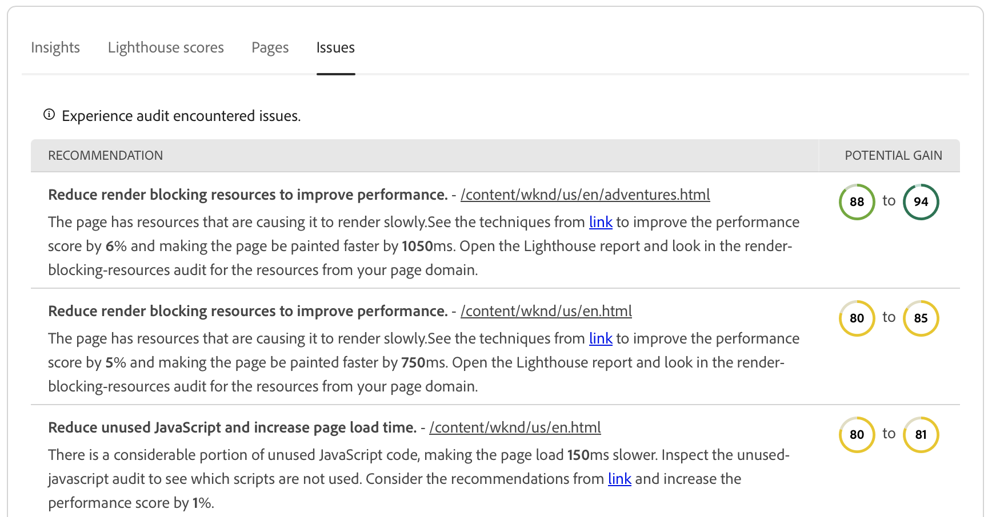

# Painel de auditoria de experiência {#experience-audit-dashboard}

Saiba como a Auditoria de experiência valida seu processo de implantação e ajuda a garantir que as alterações implantadas atendam aos padrões básicos de desempenho, acessibilidade, práticas recomendadas e SEO, por meio de uma interface de painel clara e informativa.

>[!NOTE]
>
>Este recurso só está disponível para [programa de adoção antecipada.](/help/implementing/cloud-manager/release-notes/current.md#early-adoption)
>
>Para obter detalhes sobre o recurso Auditoria de experiência existente para o AEM as a Cloud Service, consulte o documento [Teste de auditoria de experiência.](/help/implementing/cloud-manager/experience-audit-testing.md)

## Visão geral {#overview}

A Auditoria de experiência é um recurso disponível nos pipelines de produção de Sites do Cloud Manager que valida o processo de implantação e ajuda a garantir que as alterações sejam implantadas:

1. Atenda aos padrões básicos de desempenho, acessibilidade, práticas recomendadas, SEO (otimização do mecanismo de pesquisa) e PWA (Aplicativo Web Progressivo).

1. Não introduza regressões.

A Auditoria de experiência no Cloud Manager garante que a experiência do usuário final no site seja do mais alto padrão.

Os resultados da auditoria são informativos e permitem que o gerente de implantação veja as pontuações e as alterações entre as pontuações atual e anterior. Esse insight é importante para determinar se há uma regressão introduzida com a implantação atual.

A Auditoria de experiência é viabilizada pelo [Google Lighthouse,](https://developer.chrome.com/docs/lighthouse/overview/) uma ferramenta de código aberto do Google e está ativada em todos os pipelines de produção do Cloud Manager.

>[!TIP]
>
>Você configura quais páginas são incluídas na auditoria de experiência ao [configurar seu pipeline.](/help/implementing/cloud-manager/configuring-pipelines/configuring-production-pipelines.md#full-stack-code)

## O painel de auditoria de experiência {#dashboard}

Os resultados da Auditoria de experiência são apresentados na **Teste de preparo** fase do pipeline de produção através da [página de execução do pipeline de produção.](/help/implementing/cloud-manager/deploy-code.md)

A Auditoria de experiência fornece resultados de teste agregados e detalhados em nível de página, resumidos em quatro guias:

* **[Insights](#insights)** forneça uma breve descrição das recomendações acionáveis para melhorar o desempenho do site.
* **[Pontuações do farol](#lighthouse)** são um resumo das pontuações do Lighthouse para o código implantado nesta execução de pipeline.
* **[Páginas](#pages)** é um resumo do desempenho das páginas configuradas especificamente para serem analisadas.
* **[Problemas](#issues)** resume quaisquer problemas de desempenho detectados no código de execução deste pipeline.

### Insights {#insights}

A variável **Insights** A guia fornece uma breve descrição de recomendações acionáveis para melhorar o desempenho do site.

Toque ou clique no **Mostrar mais** para abrir o painel completo.

No **Insights e recomendações** Você encontrará uma lista detalhada de recomendações acionáveis com um indicador de valor claro vinculado aos ganhos que podem ser esperados no desempenho, juntamente com a porcentagem de páginas afetadas. Isso permite priorizar facilmente essas recomendações para suas equipes.

Para voltar para a página de execução do pipeline de produção, basta selecionar a seta para trás no navegador.

### Pontuações do farol {#lighthouse}

A variável **Pontuações do farol** A guia é um resumo das pontuações do Lighthouse para o código implantado nesta execução do pipeline.

Toque ou clique no **Mostrar mais** para abrir o painel completo.

No **Pontuações do farol** você encontrará uma exibição de tendências das várias pontuações. Selecionar **Desempenho**, **Acessibilidade**, **PWA** ou **SEO** para ver a exibição de tendência mensal desses valores.

Observe que cada ponto no gráfico é a média em todas as implantações no mês de interesse.

Para voltar para a página de execução do pipeline de produção, basta selecionar a seta para trás no navegador.

### Páginas {#pages}

A variável **Páginas** é um resumo do desempenho das páginas configuradas especificamente para serem analisadas.

Toque ou clique no **Mostrar mais** para abrir o painel completo.

A variável **Páginas** A seção fornece uma lista de páginas que foram testadas e suas pontuações de desempenho mais recentes do Lighthouse e o detalhamento.

Você configura quais páginas são incluídas na auditoria de experiência ao [configurar seu pipeline.](/help/implementing/cloud-manager/configuring-pipelines/configuring-production-pipelines.md#full-stack-code)

Para voltar para a página de execução do pipeline de produção, basta selecionar a seta para trás no navegador.

### Problemas {#issues}

A variável **Problemas** A guia resume todos os problemas de desempenho detectados no código desta execução de pipeline.

Toque ou clique no **Mostrar mais** para abrir o painel completo.

No **Insights e recomendações** você encontrará uma lista mais detalhada de recomendações acionáveis com um indicador de valor claro vinculado aos ganhos que podem ser esperados no desempenho, juntamente com a porcentagem de páginas afetadas. Isso permite priorizar facilmente essas recomendações para suas equipes.

Para voltar para a página de execução do pipeline de produção, basta selecionar a seta para trás no navegador.

### Detalhes da página {#page-detail}

Se tocar ou clicar no link de uma página em uma guia do **Auditoria de experiência** seção da guia da página de execução do pipeline ou na guia **Páginas** do painel Auditoria de experiência completa, é possível exibir os detalhes de uma página específica.

Você pode ver as pontuações de páginas individuais para um teste específico, juntamente com a alteração em relação à execução anterior do teste.

Clicar nos detalhes de qualquer página individual fornece informações sobre os elementos da página que foram avaliados e orientação para corrigir problemas se forem detectadas oportunidades de melhoria.

Para voltar para a página de execução do pipeline de produção, basta selecionar a seta para trás no navegador.
