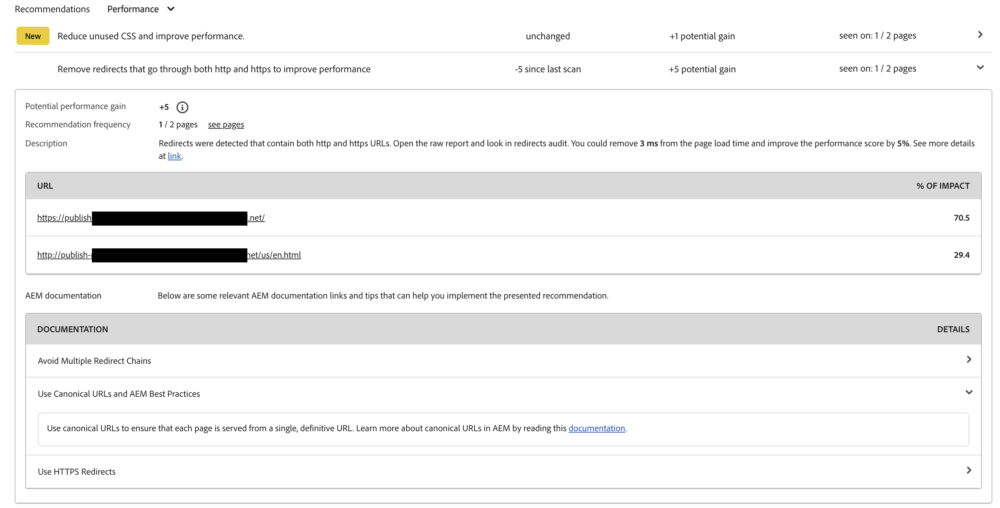

# Painel de auditoria de experiência {#experience-audit-dashboard}

Descubra como a Auditoria de experiência valida seu processo de implantação, garantindo que as alterações atendam aos padrões básicos de desempenho, acessibilidade, práticas recomendadas e SEO. Ele fornece uma interface de painel clara e informativa para rastrear essas métricas.

## Visão geral {#overview}

A Auditoria de experiência valida o processo de implantação e ajuda a garantir que as alterações sejam implantadas:

1. Atenda aos padrões básicos de desempenho, acessibilidade, práticas recomendadas e SEO (Otimização do mecanismo de pesquisa).

1. Não introduza regressões.

A Auditoria de experiência no Cloud Manager garante que a experiência do usuário no site seja do mais alto padrão.

Os resultados da auditoria são informativos e permitem que o gerente de implantação veja as pontuações e as alterações entre as pontuações atual e anterior. Essa informação é valiosa para determinar se foi introduzida uma regressão com a implantação atual.

A Auditoria de experiência é disponibilizada pelo [Google Lighthouse](https://developer.chrome.com/docs/lighthouse/overview/), uma ferramenta de código aberto da Google, e está habilitada em todos os pipelines de produção do Cloud Manager.

## Disponibilidade {#availability}

A Auditoria de experiência está disponível para o Cloud Manager:

* (Padrão) Pipelines de produção de sites
* (Opcional) Desenvolvimento de pipelines de pilha completa
* (Opcional) Desenvolvimento de pipelines de front-end

Consulte a [seção Configuração](#configuration) para obter mais informações sobre como configurar a auditoria para os ambientes opcionais.

As auditorias são executadas como parte do pipeline. As auditorias também podem ser [executadas sob demanda](#on-demand) fora dos pipelines.

## Configuração {#configuration}

A Auditoria de experiência está disponível por padrão para pipelines de produção. Ele pode ser ativado opcionalmente para o desenvolvimento de pipelines de pilha completa e front-end. Em todos os casos, é necessário definir quais caminhos de conteúdo são avaliados durante a execução do pipeline.

1. Dependendo do tipo de pipeline que você deseja configurar, siga um destes procedimentos:

   * Adicione um novo [pipeline de produção](/help/implementing/cloud-manager/configuring-pipelines/configuring-production-pipelines.md) para definir os caminhos que você deseja que a auditoria avalie.
   * Adicione um novo [pipeline de não produção](/help/implementing/cloud-manager/configuring-pipelines/configuring-non-production-pipelines.md), se desejar habilitar a auditoria em um pipeline de front-end ou de pilha completa de desenvolvimento.
   * Ou você pode [editar um pipeline existente](/help/implementing/cloud-manager/configuring-pipelines/managing-pipelines.md) e atualizar as opções existentes.

1. Para usar o Experience Audit ao adicionar ou editar um pipeline de não produção, marque a caixa de seleção **Auditoria de experiência**. Você pode encontrar essa opção na guia **Código Source**.

   

   * Necessário apenas para pipelines de não produção.
   * A guia **Auditoria de experiência** aparece quando a caixa de seleção é marcada.

1. Para pipelines de produção e não produção, você define os caminhos que devem ser incluídos na Auditoria de experiência na guia **Auditoria de experiência**.

   * Os caminhos de página devem começar com `/` e são relativos ao seu site.
   * Por exemplo, se o site for `wknd.site` e quiser incluir `https://wknd.site/us/en/about-us.html` na Auditoria de Experiência, insira o caminho `/us/en/about-us.html`.

   

1. Clique em **Adicionar página** e o caminho será preenchido automaticamente com o endereço do ambiente e adicionado à tabela de caminhos.

   

1. Continue a adicionar caminhos, conforme necessário, repetindo as duas etapas anteriores.

   * É possível adicionar no máximo 25 caminhos.
   * Se você não definir nenhum caminho, a página inicial do site será incluída na Auditoria de experiência por padrão.

1. Clique em **Salvar**.

## Resultados da auditoria de experiência {#results}

Os resultados da Auditoria de Experiência são apresentados na fase **Teste de preparo** do pipeline de produção através da [página de execução do pipeline de produção](/help/implementing/cloud-manager/deploy-code.md).

A Auditoria de Experiência fornece as pontuações medianas do Google Lighthouse para as [páginas configuradas](#configuration) e a diferença na pontuação para a verificação anterior.

Nesta exibição resumida, na fase **Teste de Preparo** do pipeline, você tem duas opções:

* **[Exibir as páginas mais lentas](#view-slowest-pages)**
* **[Exibir o relatório completo](#view-full-report)**

Você pode acessar os resultados completos da auditoria clicando na guia **Relatórios** no painel do Cloud Manager. Além do resumo mostrado nos detalhes de execução do pipeline, você pode visualizar [o relatório completo](#view-full-report) diretamente.

>[!TIP]
>
>As seções a seguir descrevem como exibir os resultados da Auditoria de experiência.
>
>* Para saber mais detalhes sobre como a auditoria funciona, consulte [Detalhes da avaliação da auditoria de experiência](#details).
>* Para saber como executar uma Auditoria de experiência sob demanda, consulte [Relatórios de auditoria sob demanda](#on-demand).
>* Se você tiver problemas com a auditoria, consulte [Problemas de Encontros de Auditoria de Experiência](#issues).
>* Para obter dicas gerais de desempenho, consulte [Dicas Gerais de Desempenho](#performance-tips).

### Exibir as páginas mais lentas {#view-slowest-pages}

Clique em **Exibir páginas mais lentas** para abrir a caixa de diálogo **5 páginas mais lentas**. As cinco páginas de menor desempenho que você [configurou para auditar](#configuration) são mostradas.

A Cloud Manager detalha as pontuações por **Desempenho**, **Acessibilidade**, **Práticas recomendadas** e **SEO**, mostrando o desvio de cada métrica em relação à auditoria anterior.

Por padrão, a caixa de diálogo é aberta com as pontuações para dispositivos móveis. Você pode ver as pontuações da área de trabalho usando a opção **Dispositivos** próxima à parte superior da caixa de diálogo.

A caixa de diálogo tem como objetivo fornecer uma visão geral rápida. Para obter detalhes completos, clique em **Exibir relatório completo**.

### Exibir o relatório completo {#view-full-report}

Você pode exibir o relatório completo de Auditoria de experiência fazendo o seguinte:

* Clique em **`View full report`** na caixa de diálogo **[5 páginas mais lentas](#view-slowest-pages)**.
* Clique em **`View full report`** ao visualizar a [execução de um pipeline](#results).
* Clique na guia **Relatórios** no Cloud Manager.

A guia **Relatórios** do Cloud Manager está aberta, mostrando a **Auditoria de Experiência**.

O relatório divide-se em duas áreas:

* **[Pontuações de páginas — tendência](#trend)**
* **[Resultados da verificação da Auditoria de Experiência](#results)**

#### Pontuações de página — tendência {#trend}

Por padrão, a exibição selecionada para **pontuações de página — tendência** é **pontuações medianas** para o **Ano passado**.

Você pode optar por visualizar as tendências para categorias específicas do Lighthouse clicando no nome da categoria na legenda.

Use o menu suspenso **Selecionar** na parte superior do gráfico para selecionar detalhes específicos da página e os menus suspensos **Exibir** e **Acionar** na parte inferior para escolher diferentes intervalos de tempo e o tipo de acionador, respectivamente.

O menu suspenso **Exibir** oferece a possibilidade de selecionar um intervalo de tempo predefinido ou um intervalo personalizado para um modo de exibição mais específico.

Ao mover o mouse sobre o gráfico, uma dica de ferramenta exibe os valores das categorias do Google Lighthouse em pontos específicos do tempo.

Se você clicar no gráfico em um ponto no tempo, um popover será aberto com detalhes dessa verificação. Clique em **abrir verificação de auditoria de experiência** para carregar os resultados da verificação na seção **[Resultados da verificação de Auditoria de Experiência](#scan-results)**.

#### Resultados da busca da auditoria de experiência {#scan-results}

A seção **Resultados da verificação da Auditoria de Experiência** fornece recomendações sobre como melhorar sua pontuação e detalhes de todas as páginas digitalizadas. Ele está dividido em duas seções:

* **[Recommendations](#recommendations)**
* **[Páginas digitalizadas](#scanned-pages)**

##### Recomendações {#recommendations}

A seção **Recommendations** mostra um conjunto agregado de insights. Por padrão, as recomendações para **desempenho** são exibidas. Use o menu suspenso ao lado do cabeçalho **Recommendations** para alterar para outra categoria.

Clique em qualquer recomendação para revelar detalhes sobre ela.

Quando disponíveis, os detalhes expandidos da recomendação também contêm a porcentagem do impacto das recomendações para ajudar a se concentrar nas alterações mais impactantes. Além disso, as recomendações ampliadas podem incluir links relevantes da documentação do AEM e dicas que podem orientá-lo na implementação das correções sugeridas.

Clique no link **ver páginas** na exibição de detalhes para ver as páginas às quais a recomendação se aplica.

##### Páginas verificadas {#scanned-pages}

A seção **Páginas digitalizadas** fornece detalhes das pontuações em todas as páginas digitalizadas. Use os botões **Anterior** e **Avançar** para percorrer os resultados e escolher quantos a exibição deve paginar.

Clique no link de uma página específica para atualizar o filtro **Selecionar** das [**Pontuações da página — tendência** seção](#trend) e mostrar a guia **Pontuações e recomendações** da página selecionada.

A guia **Relatórios brutos** fornece pontuações para cada auditoria da página. Clique na data do relatório na coluna **Relatório de Farol** para recuperar um arquivo JSON dos dados brutos.

Uma nova guia é aberta no navegador, direcionando você para `https://googlechrome.github.io/lighthouse/viewer/`. Ele carrega automaticamente um URL assinado contendo o relatório JSON bruto do Lighthouse para a página selecionada, permitindo a inspeção detalhada.

## Relatórios de auditoria da varredura por solicitação {#on-demand}

Além de serem executados durante a execução do pipeline, os relatórios da Auditoria de experiência também podem ser gerados sob demanda. Essa opção é uma boa solução para digitalizar suas páginas rapidamente, sem precisar executar um pipeline.

Para executar uma varredura por solicitação, navegue até a guia **Relatórios** para ver o relatório de auditoria completo e clique no botão **Executar varredura**.

O botão **Executar verificação** fica indisponível e está marcado com um ícone de relógio quando uma verificação por solicitação já está em execução.

As varreduras por solicitação acionam uma Auditoria de experiência para as 25 [páginas configuradas](#configuration) mais recentes e normalmente são concluídas em alguns minutos.

Após a conclusão, o gráfico de pontuações é atualizado automaticamente e você pode inspecionar os resultados exatamente como para uma verificação de execução de pipeline.

Você pode filtrar o gráfico de pontuações com base no tipo de acionador usando o seletor **Acionador**.

>[!NOTE]
>
>Uma varredura por solicitação só poderá ser iniciada se o ambiente não for excluído e não houver outras varreduras pendentes no mesmo ambiente.

## A Auditoria de experiência encontra problemas {#issues}

Se [as páginas que você configurou](#configuration) para serem auditadas não estavam disponíveis ou havia outros erros na auditoria, a Auditoria de experiência reflete esse fato.

O pipeline mostra uma seção de erro expansível para exibir os caminhos de URL relativos que não podia acessar.

Se estiver exibindo o relatório completo, os detalhes serão mostrados na seção **[Resultados da verificação da Auditoria de experiência](#results)**, que também pode ser expandida.

Alguns motivos pelos quais as páginas podem não estar disponíveis são:

* A configuração bloqueia o acesso.
* A página não existe.
* A página redireciona exigindo autenticação diferente da básica.
* Problema interno.

>[!TIP]
>
>[Acessar os relatórios brutos](#scanned-pages) de uma página pode fornecer detalhes sobre por que a página não pôde ser auditada.

## Dicas gerais de desempenho {#performance-tips}

Dois dos problemas de impacto mais comuns que são fáceis de corrigir estão relacionados com as mudanças cumulativas de layout (CLS) e a maior tinta de conteúdo (LCP).

Você pode melhorar essas áreas fazendo o seguinte:

* Não é um carregamento lento das imagens acima da dobra — o conteúdo que é visível no navegador sem precisar rolar para baixo.
* Priorizar corretamente como os recursos são carregados (por exemplo, carregando de forma assíncrona as imagens abaixo da dobra após o carregamento do documento).
* Busca prévia de arquivos JavaScript e CSS usados para renderizar conteúdo acima da dobra (se necessário).
* Reserva de espaço vertical ao atribuir uma proporção aos contêineres que carregam lentamente ou são renderizados posteriormente.
* Conversão de imagens para o formato WebP para reduzir seu tamanho.
* Usando `<picture>` e imagem `srcset` com tamanhos de imagem variados para diferentes tamanhos de visor (e garantindo que o redimensionamento funcione).

## Detalhes de avaliação da Auditoria de experiência {#details}

Os detalhes a seguir fornecem informações adicionais sobre como a Auditoria de experiência avalia o site. Eles não são necessários para o uso geral do recurso e são fornecidos aqui para fins de integridade.

* A auditoria verifica o domínio de origem (`.com`) a partir dos [caminhos configurados da página Auditoria de Experiência](#configuration) do publicador para simular experiências reais do usuário, ajudando você a tomar melhores decisões sobre como gerenciar e otimizar seus sites.
* Em pipelines de pilha completa de produção, o ambiente de preparo é verificado. Para garantir que a auditoria forneça detalhes relevantes durante a auditoria, o conteúdo do ambiente de preparo deve estar o mais próximo possível do ambiente de produção.
* As páginas exibidas na lista suspensa **Selecionar** em [**Pontuações de página — tendência** seção](#trend) são todas páginas conhecidas que a Auditoria de Experiência verificou no passado.
* [Uma recomendação](#recommendations) pode ter um ganho potencial e uma diferença em relação à verificação anterior.
* A Auditoria de experiência estima as melhorias potenciais ao processar o relatório bruto para cada página. Ele correlaciona bytes ou milissegundos desperdiçados com insights, atribuindo um impacto ponderado na pontuação de desempenho. A auditoria fornece essas informações e as páginas afetadas para ajudar a decidir qual recomendação seguir.
Consulte a [seção Dicas Gerais de Desempenho](#performance-tips) para obter mais detalhes.
* Um pipeline de front-end pode ser implantado em um ambiente existente, e vários pipelines de front-end podem ter o mesmo ambiente como alvo. Como os resultados da verificação são agregados no nível do ambiente, as pontuações, as tendências e as recomendações são consistentes. Esses resultados são exibidos no ambiente selecionado, independentemente de qual pipeline acionou a verificação.
