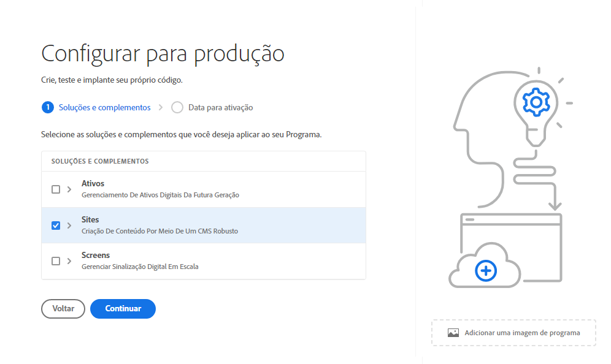
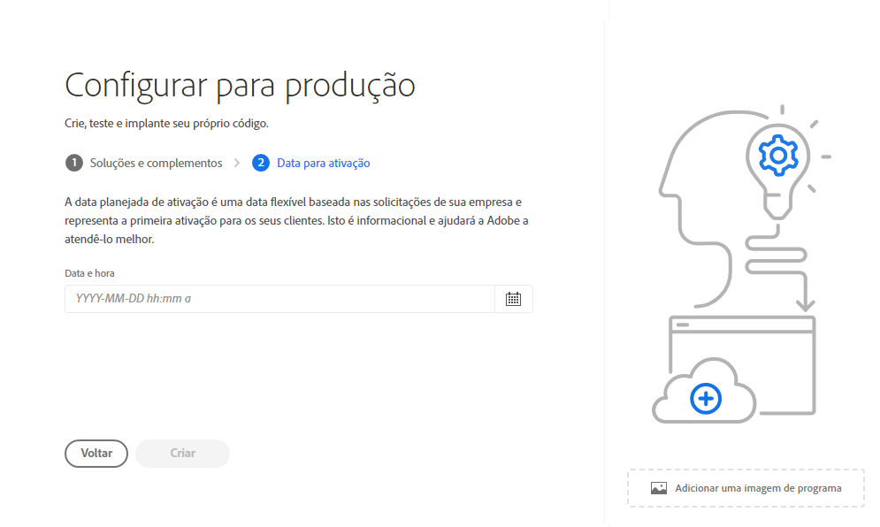
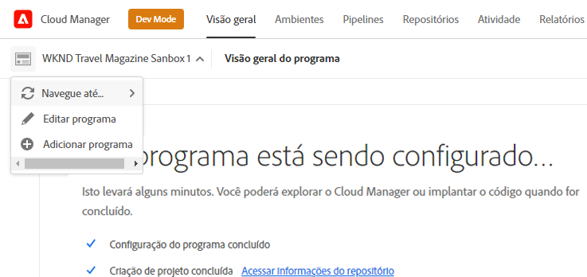

# Criação de programas de produção {#create-production-program}

Um programa de produção deve ser usado por um usuário familiarizado com o AEM e o Cloud Manager e que está pronto para começar a gravar, compilar e testar o código com o objetivo de implantá-lo para hospedar o tráfego direto.

Saiba mais sobre os tipos de programas no documento [Noções sobre programas e tipos de programas.](program-types.md)

## Criação de um programa de produção {#create}

Siga estas etapas para criar um programa de produção.

1. Faça logon no Cloud Manager, em [my.cloudmanager.adobe.com](https://my.cloudmanager.adobe.com/), e selecione a organização apropriada.

1. Clique em **Adicionar programa** no canto superior direito da tela.

   

1. Selecionar **Configurar para produção** no assistente Criar programa para criar um programa de produção e fornecer um nome de programa.

   

1. Opcionalmente, é possível adicionar uma imagem ao programa arrastando e soltando um arquivo de imagem na **Adicionar uma imagem de programa** direcione ou clique nela para selecionar uma imagem de um navegador de arquivos. Toque ou clique em **Continuar**.

1. Se você tiver direitos de segurança aprimorados, a guia **Segurança aprimorada** fornecerá a opção de **Ativar segurança aprimorada** para o seu programa de produção. Caso necessário, marque a opção para ativar a segurança aprimorada e toque ou clique em **Continuar**.

   * A segurança aprimorada não pode ser ativada ou desativada após a criação do programa.
   * [Saiba mais](https://www.adobe.com/go/hipaa-ready) sobre a solução de implementação pronta para HIPAA da Adobe.

   

1. Na guia **Soluções e complementos**, selecione as soluções a serem incluídas no programa.

   * Se não tiver certeza se precisa de um ou mais programas para as várias soluções disponíveis, selecione aquele que mais lhe interessa. Você pode ativar soluções adicionais ao [edição do programa](/help/implementing/cloud-manager/getting-access-to-aem-in-cloud/editing-programs.md) mais tarde. Consulte a [Introdução ao documento de Programas de produção](/help/implementing/cloud-manager/getting-access-to-aem-in-cloud/introduction-production-programs.md) para obter mais recomendações de configuração de programa.
   * Se você selecionou **Ativar segurança aprimorada** anteriormente, o número de soluções que você poderá selecionar será limitado à quantidade de direitos de HIPAA disponíveis.

   

1. Clique na divisa antes dos nomes de solução para exibir os complementos opcionais, por exemplo, como selecionar a opção de complemento **Comércio** no **Sites**.

   

1. Com as soluções e os complementos selecionados, clique em **Continuar**.

1. Na guia **Data de publicação**, insira a data em que planeja publicar o programa de produção.

   

   * Essa data poderá ser editada a qualquer momento.
   * Essa data é somente para fins informativos e aciona o widget de publicação na página de visão geral do programa para fornecer links no produto para a documentação de práticas recomendadas do AEM as a Cloud Service em tempo hábil, a fim de se alinhar com a sua jornada, resultando em uma experiência de publicação bem-sucedida e tranquila.

1. Clique em **Criar**.

Seu programa é criado pelo Cloud Manager e é exibido e pode ser selecionado na página de aterrissagem.

## Acessar o programa {#acessing}

1. Depois de ver o cartão do programa na página de aterrissagem, selecione o botão de reticências para ver as opções de menu disponíveis.

   

1. Selecione **Visão geral do programa** para navegar até a página **Visão geral**.

1. O principal cartão de chamada à ação na página de visão geral orientará você pela criação de um ambiente, um pipeline de não produção e, finalmente, um pipeline de produção.

   

Se, a qualquer momento, você precisar alternar para outro programa ou retornar à página de visão geral para criar outro programa, clique no nome do programa no canto superior esquerdo da tela para exibir a opção **Navegar para**.

>[!NOTE]
>
>Diferentemente de um [programa de sandbox,](introduction-sandbox-programs.md#auto-creation) um programa de produção exigirá que um usuário com a função apropriada do Cloud Manager crie o projeto e adicione um ambiente por meio da interface de usuário de autoatendimento.
