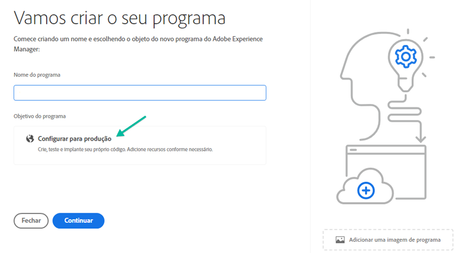

# Criação de programas de produção {#create-production-program}

Um programa de produção destina-se a um usuário familiarizado com o AEM e o Cloud Manager e está pronto para começar a escrever, criar e testar o código com o objetivo de implantá-lo para hospedar o tráfego ao vivo.

Saiba mais sobre os tipos de programas no documento [Entendendo os tipos de programas e programas.](program-types.md)

## Tutorials de vídeo {#video-tutorials}

Você pode assistir a estes dois vídeos de tutoriais para saber como criar um programa no Cloud Manager ou [siga as instruções documentadas.](#create)

>[!VIDEO](https://video.tv.adobe.com/v/334953)

>[!VIDEO](https://video.tv.adobe.com/v/334954)

## Criar um programa de produção {#create}

Siga estas etapas para criar um programa de produção.

1. Faça logon no Cloud Manager em [my.cloudmanager.adobe.com](https://my.cloudmanager.adobe.com/) e selecione a organização apropriada.

1. Clique em **Adicionar programa** no canto superior direito da tela.

   

1. Selecionar **Configurar para produção** no assistente Criar programa para criar um programa de produção. Você pode aceitar o nome padrão do programa ou editá-lo antes de selecionar **Criar**.

   

1. Na próxima guia, selecione as soluções a serem incluídas no programa.

   

1. Clique na divisa antes dos nomes da solução para exibir os complementos opcionais, como selecionar a **Comércio** opção complementar em **Sites**.

   

1. Com as soluções e os complementos selecionados, clique em **Criar**.

Seu programa é criado pelo Cloud Manager e é exibido e selecionável na página de aterrissagem.

## Acesse seu programa {#acessing}

1. Depois de ver o cartão do programa na landing page, selecione o botão de reticências para exibir as opções de menu disponíveis.

   

1. Selecionar **Visão geral do programa** para navegar até o **Visão geral** página.

1. O principal cartão de chamada para ação na página de visão geral guiará você pela criação de um ambiente, um pipeline de não produção e, finalmente, um pipeline de produção.

   

Se, a qualquer momento, precisar alternar para outro programa ou retornar à página de visão geral para criar outro programa, clique no nome do programa no canto superior esquerdo da tela para exibir o **Navegar para** opção.

>[!NOTE]
>
>Diferente de um [programa sandbox,](introduction-sandbox-programs.md#auto-creation) um programa de produção exigirá que o usuário na função apropriada do Cloud Manager crie o projeto e adicione um ambiente por meio da interface de usuário de autoatendimento.
