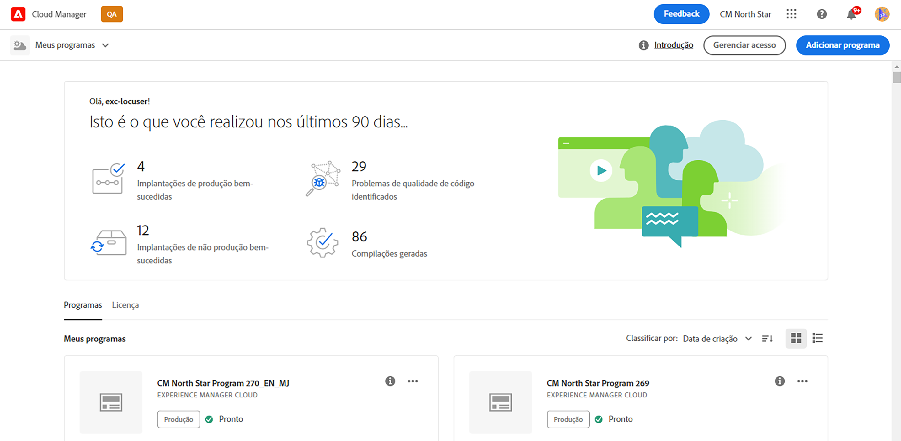
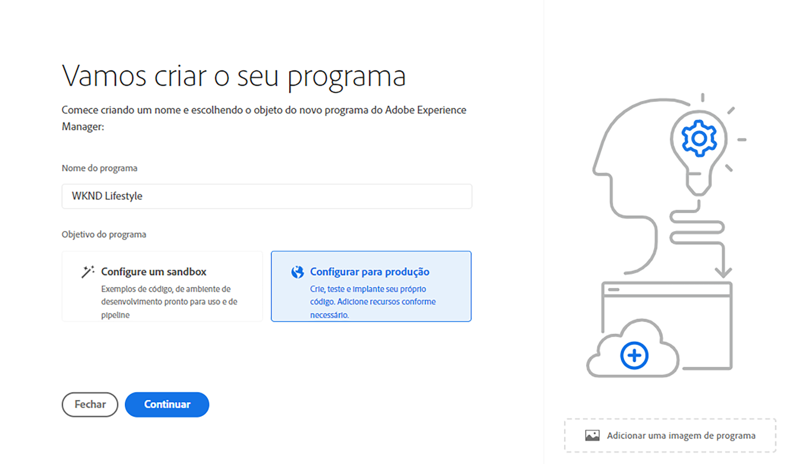
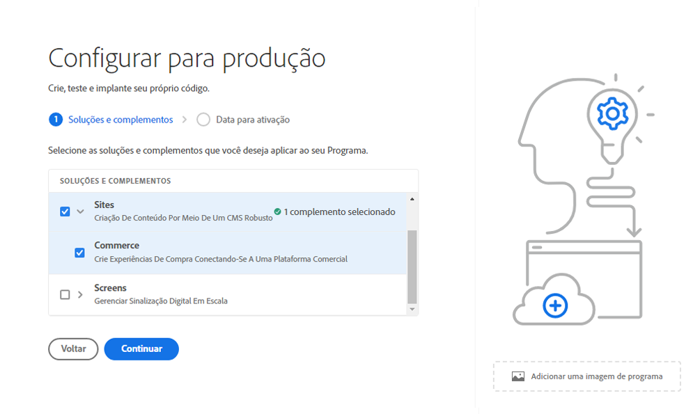
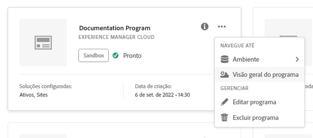
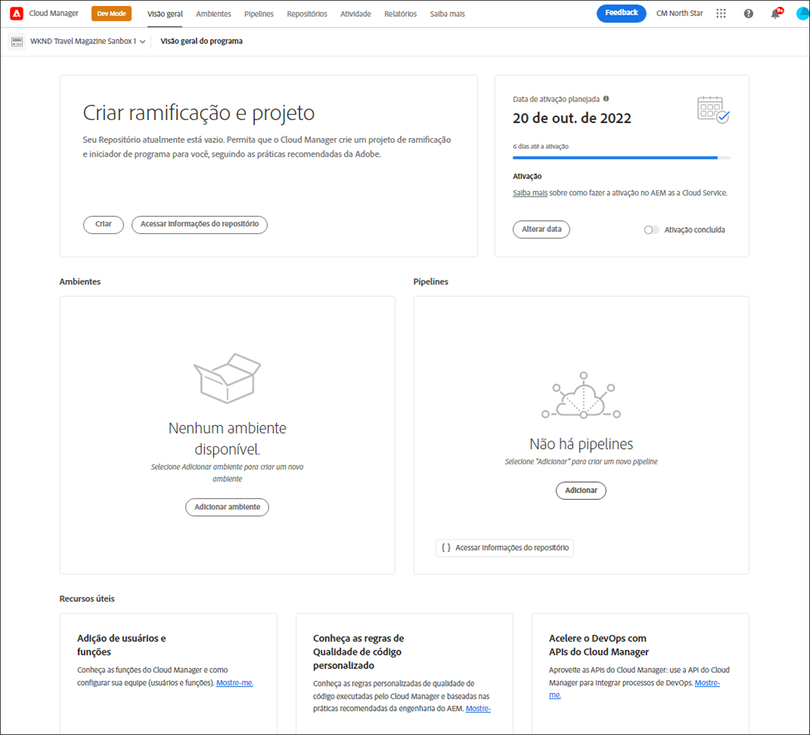

# Criar programas de produção {#create-production-program}

Um programa de produção é para usuários familiarizados com o Adobe Experience Manager (AEM) e o Cloud Manager, prontos para gravar, criar e testar o código, com o objetivo de implantá-lo para lidar com o tráfego direto.

Saiba mais sobre os tipos de programas no documento [Noções sobre Programas e Tipos de Programas](program-types.md).

## Criar um programa de produção {#create}

Dependendo dos direitos da sua organização, você pode ver opções adicionais do programa de produção ao adicionar seu programa.
Consulte [Opções adicionais do programa de produção](#options).

**Para criar um programa de produção:**

1. Faça logon no Cloud Manager, em [my.cloudmanager.adobe.com](https://my.cloudmanager.adobe.com/), e selecione a organização apropriada.

1. No console **[Meus Programas](/help/implementing/cloud-manager/navigation.md#my-programs)**, próximo ao canto superior direito, clique em **Adicionar Programa**.

   

1. No assistente do *Vamos criar seu Programa*, no campo de texto **Nome do programa**, digite o nome desejado para o programa.

1. Em **Objetivo do Programa**, selecione **Configurar para produção**.

   

1. (Opcional) No canto inferior direito da caixa de diálogo do assistente, siga um destes procedimentos:

   * Arraste e solte um arquivo de imagem no destino  **Adicionar uma imagem de programa**.
   * Clique em  **Adicionar uma imagem de programa** e selecione uma imagem de um navegador de arquivos.
   * Clique em  para remover uma imagem adicionada.

1. Clique em **Continuar**.

1. Na guia **Segurança**, selecione as opções de segurança que deseja usar. Consulte [Segurança](#security).

   

1. Clique em **Continuar**.

1. Na caixa de listagem **Soluções e complementos**, selecione uma ou mais soluções para incluir no programa.

   * Se você não tiver certeza se precisa de um ou mais programas para as várias soluções disponíveis, selecione o mais interessante. Você pode ativar soluções adicionais ao [editar o programa](/help/implementing/cloud-manager/getting-access-to-aem-in-cloud/editing-programs.md) depois. Consulte a [Introdução ao documento Programas de produção](/help/implementing/cloud-manager/getting-access-to-aem-in-cloud/introduction-production-programs.md) para obter mais recomendações de configuração do programa.
   * É necessário selecionar pelo menos uma solução para criação de programa. Por exemplo, você pode optar por selecionar o **Edge Delivery Services** para uma solução de CDN totalmente gerenciada que otimize experiências digitais. Consulte [Sobre como usar o Edge Delivery Services para entregar seu projeto do Cloud Manager](/help/implementing/cloud-manager/edge-delivery/introduction-to-edge-delivery-services.md).

   * Clique no ícone  à esquerda do nome de uma solução para exibir os complementos opcionais. <!-- such as the **Commerce** add-on option under **Sites**. -->

<!--    -->

    >[!NOTE]
    >
    >Se o seu programa usar o Edge Delivery Services para entrega, talvez não seja necessário um nível de publicação. Com o recurso de nível de publicação flexível (Beta), você pode configurar se um nível de publicação deve ser provisionado na guia Soluções e complementos. Consulte [Camada de publicação flexível (Beta)](/help/implementing/cloud-manager/getting-access-to-aem-in-cloud/creating-production-programs.md#lex-publish-tier).
    
    

1. Clique em **Continuar**.

1. Na guia **Tipo de entrega**, observe que ela é pré-preenchida com base nas soluções e complementos escolhidos na etapa anterior. Se você selecionar **Publicação do AEM**, poderá provisioná-lo posteriormente sob demanda.

   

   <!-- * If you selected the **[Enable Enhanced Security](#security)** option, you can select only as many solutions for which HIPAA entitlements are available. -->

1. Clique em **Continuar**.

1. Se você tiver os direitos necessários, a guia **SLA** será exibida como a segunda ou terceira guia na caixa de diálogo **`Set up for production`**. Consulte [SLA](#sla).

   

   O Sites e o Forms oferecem um service level agreement padrão de 99,9% (SLA).

1. Clique em **Continuar**.

1. Na guia **Data de ativação**, insira a data em que planeja ativar seu programa de produção.

   

   * É possível editar essa data a qualquer momento.
   * A data serve a fins informativos e aciona o widget de publicação na [**página Visão geral do programa**](/help/implementing/cloud-manager/getting-access-to-aem-in-cloud/editing-programs.md#program-overview). Essa funcionalidade fornece links oportunos no produto para as práticas recomendadas da AEM as a Cloud Service, para oferecer suporte a uma experiência de ativação tranquila.

1. Clique em **Criar**. O Cloud Manager cria seu programa e o exibe na página de aterrissagem para seleção.

   

## Opções adicionais do programa de produção {#options}

Dependendo dos direitos disponíveis para sua organização, você pode ter as seguintes opções adicionais disponíveis ao criar um programa de produção.

### Segurança {#security}

Se você tiver os direitos necessários, a guia **Segurança** será exibida como a primeira guia na caixa de diálogo **`Set up for production`**.

A guia **Segurança** fornece as opções para ativar a **HIPAA**, a **Proteção WAF-DDOS** ou ambas para o seu programa de produção.

O Adobe compatível com HIPAA e o WAF-DDOS (Web Application Firewall - Distributed Denial of Service) facilitam a segurança baseada em nuvem como parte de uma abordagem de várias camadas para proteção contra vulnerabilidades.

* **HIPAA** - Essa opção habilita a implementação da solução pronta para HIPAA da Adobe.
   * Saiba mais sobre a [preparação para HIPAA da Adobe Experience Manager as a Cloud Service](/help/compliance/hipaa/hipaa-readiness.md) e a [implementação da solução pronta para HIPAA da Adobe](https://www.adobe.com/trust/compliance/hipaa-ready.html).
   * O HIPAA não pode ser habilitado ou desabilitado após a criação do programa.
* **Proteção do WAF-DOS** - Esta opção habilita o Firewall do Aplicativo Web por meio de regras para proteger seu aplicativo.
   * Depois de ativada, a proteção WAF-DDOS pode ser configurada configurando um [pipeline de não produção](/help/implementing/cloud-manager/configuring-pipelines/configuring-non-production-pipelines.md).
   * Consulte [Regras de filtro de tráfego incluindo Regras do WAF](/help/security/traffic-filter-rules-including-waf.md) para saber como gerenciar regras de filtro de tráfego no repositório para que elas sejam implantadas corretamente.

### Nível de publicação flexível (Beta) {#flexible-publish-tier}

>[!NOTE]
>
>O nível de publicação flexível descrito aqui está no Beta. Para ingressar na Beta, envie um email para [grp-beta_xwalk-publish_config@adobe.com](mailto:grp-beta_xwalk-publish_config@adobe.com) com sua ID da organização da Adobe e a ID do programa.

Se sua organização tiver o recurso de nível de publicação flexível habilitado, será possível configurar se um nível de publicação é necessário para os ambientes do programa. Esta opção aparece na guia **Tipo de entrega** da caixa de diálogo **Configurar para produção** (durante a [criação do programa](/help/implementing/cloud-manager/getting-access-to-aem-in-cloud/creating-production-programs.md)).

Ele também aparece na caixa de diálogo **Editar Programa** (ao [editar um programa](/help/implementing/cloud-manager/getting-access-to-aem-in-cloud/editing-programs.md)).

Nem todas as arquiteturas exigem um nível de publicação. A tabela a seguir mostra quais arquiteturas exigem um nível de publicação e quais não:

| Arquitetura | Publicar camada |
| --- | --- |
| AEM Sites tradicional | Obrigatório |
| Headless/API-first | Obrigatório |
| Edge Delivery Services | Não obrigatório |

Ao ativar o nível de publicação somente quando necessário, as equipes podem fazer o seguinte:

* Provisionar ambientes mais rapidamente.
* Simplifique a infraestrutura.
* Reduza componentes desnecessários.

**Como funciona**
Quando o recurso de nível de publicação flexível estiver habilitado para sua organização:

* Todos os novos ambientes no programa são provisionados com a **camada do Autor somente** por padrão. Uma mensagem informativa exibida na interface do usuário confirma esse comportamento.
* Se o usuário selecionar **Publicação do AEM** durante a criação de um programa, o nível de publicação será ativado e provisionado com *novos ambientes*.
* O nível de publicação também pode ser ativado posteriormente editando o programa. Consulte [Editar programas](/help/implementing/cloud-manager/getting-access-to-aem-in-cloud/editing-programs.md).

>[!NOTE]
>
>Se o seu programa usar o Edge Delivery Services para entrega de conteúdo e o AEM Author para criação de conteúdo, um nível de publicação não será necessário. O conteúdo é entregue por meio do Edge Delivery e não passa pelo nível de publicação do AEM. Consulte Sobre o Edge Delivery Services com criação no AEM (Beta).

### SLA {#sla}

Se você tiver os direitos necessários, a guia **SLA** será exibida como a segunda ou terceira guia na caixa de diálogo **`Set up for production`**.

O Sites e o Forms oferecem um service level agreement padrão de 99,9% (SLA). A opção **99.99% do Service level agreement** garante um tempo de atividade mínimo de 99,99% para seus ambientes de produção, seja para Sites, Forms, Edge Delivery Services ou todos os três.

99,99% A SLA oferece benefícios que incluem maior disponibilidade e menor latência.

Para programas do Sites e do Forms, a SLA de 99,99% exige que uma [região de publicação adicional](/help/implementing/cloud-manager/manage-environments.md#multiple-regions) seja aplicada ao ambiente de produção no programa. Quando os [requisitos](#sla-requirements) para habilitar 99,99% do SLA forem atendidos, você deverá executar um [pipeline de pilha completa](/help/implementing/cloud-manager/configuring-pipelines/configuring-production-pipelines.md) para ativá-lo.

Para o Edge Delivery Services, há um requisito de *no* diferente da configuração da licença de SLA de 99,99% no programa.

#### Requisitos para 99,99% de SLA {#sla-requirements}

Além dos direitos necessários, o uso dos programas do SLA para Sites ou Forms de 99,99% vem com os seguintes requisitos adicionais:

* A organização deve ter 99,99% do SLA e direitos adicionais de região de publicação disponíveis ao aplicar 99,99% do SLA ao programa.
* O Cloud Manager verifica se um direito de [região de publicação adicional](/help/implementing/cloud-manager/manage-environments.md#multiple-regions) não utilizado está disponível antes de aplicar 99,99% do SLA ao programa.
* Ao editar um programa, se ele já contiver um ambiente de produção com pelo menos uma região de publicação adicional, a Cloud Manager verificará apenas a disponibilidade de um direito de 99,99% do SLA.
* Para a ativação de 99,99% do SLA e relatórios, o [ambiente de produção/preparo](/help/implementing/cloud-manager/manage-environments.md#adding-environments) deve ter sido criado e pelo menos uma região de publicação adicional deve ter sido aplicada ao ambiente de produção/preparo.
   * Se estiver usando a [rede avançada](/help/security/configuring-advanced-networking.md), verifique o documento [Adicionando várias regiões de publicação a um novo ambiente](/help/implementing/cloud-manager/manage-environments.md#adding-regions) para obter recomendações para que a conectividade seja mantida se houver falha regional.
* Seu programa de 99,99% do SLA deve sempre incluir pelo menos uma região de publicação adicional. Os usuários não têm permissão para excluir a última região de publicação adicional restante do programa.
* O SLA de 99,99% é compatível com programas de produção que têm a solução Sites ou Forms habilitada.
* Execute um [pipeline de pilha completa](/help/implementing/cloud-manager/configuring-pipelines/configuring-production-pipelines.md) para ativar ou — ao editar um programa — desativar o SLA 99,99%.

## Acessar seu programa {#accessing}

1. Ao visualizar o cartão do programa na página de aterrissagem, clique no  para exibir as opções de menu disponíveis.

   

1. Selecione **Visão geral do programa** para navegar até a página **Visão geral**.

1. O cartão principal do call-to-action na página de visão geral orienta você pela criação de um ambiente, um pipeline de não produção e, finalmente, um pipeline de produção.

   

>[!TIP]
>
>Consulte [Navegar na interface do usuário do Cloud Manager](/help/implementing/cloud-manager/navigation.md) para obter detalhes sobre como navegar no Cloud Manager e entender o console **Meus Programas**.

>[!NOTE]
>
>Ao contrário de um [programa de sandbox](introduction-sandbox-programs.md#auto-creation), um programa de produção requer que o usuário com a função apropriada do Cloud Manager crie o projeto e adicione um ambiente por meio da interface de usuário de autoatendimento.

