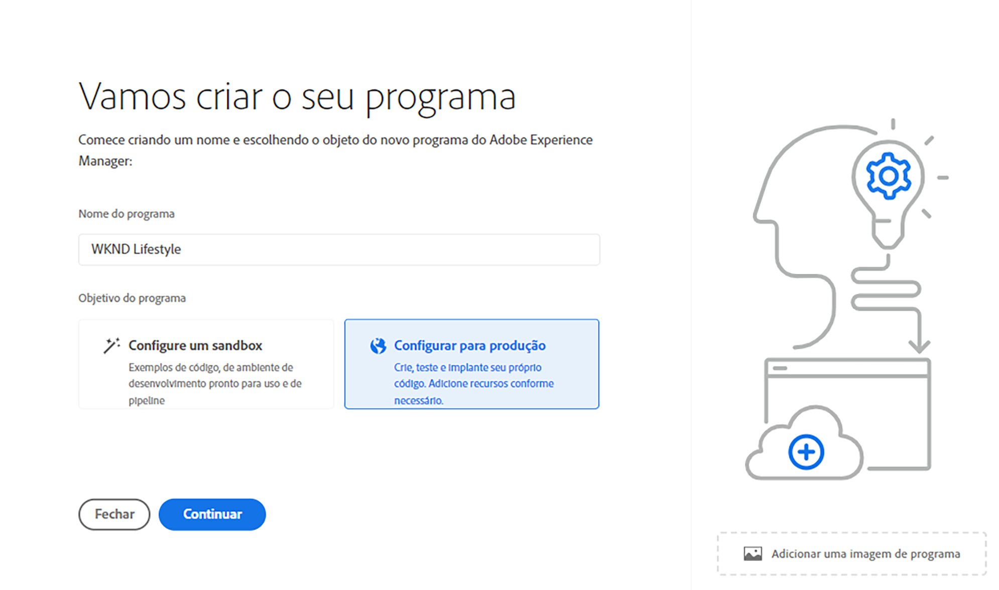
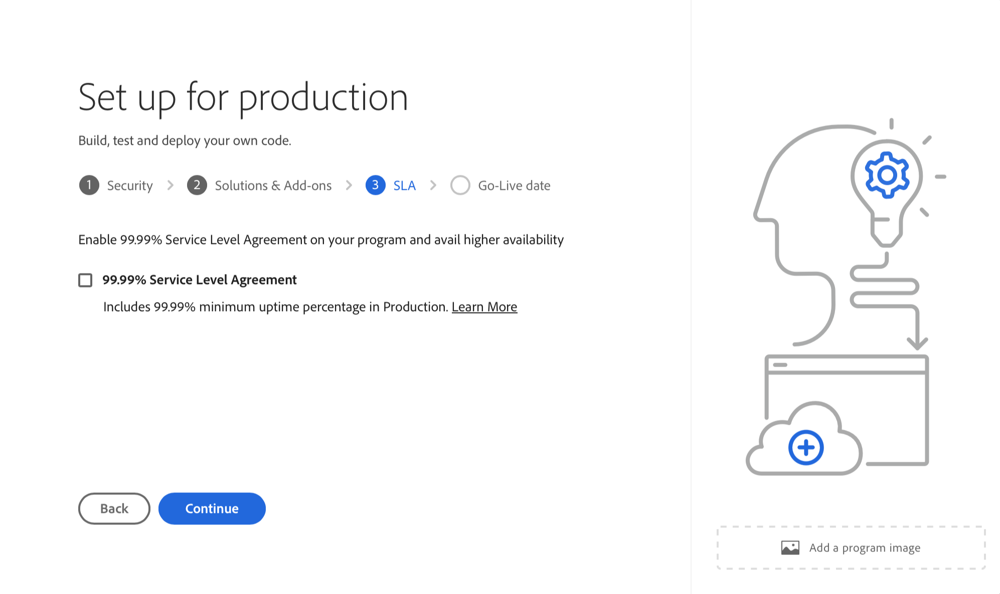

# Criar programas de produção {#create-production-program}

Um programa de produção é para usuários familiarizados com AEM e Cloud Manager, prontos para gravar, criar e testar o código, com o objetivo de implantá-lo para lidar com o tráfego direto.

Saiba mais sobre os tipos de programas no documento [Noções sobre Programas e Tipos de Programas](program-types.md).

## Criar um programa de produção {#create}

Dependendo dos direitos da sua organização, você pode ver [opções adicionais](#options) ao adicionar seu programa.

**Para criar um programa de produção:**

1. Faça logon no Cloud Manager, em [my.cloudmanager.adobe.com](https://my.cloudmanager.adobe.com/), e selecione a organização apropriada.

1. No console **[Meus Programas](/help/implementing/cloud-manager/navigation.md#my-programs)**, próximo ao canto superior direito, clique em **Adicionar Programa**.

   

1. No assistente *Vamos criar seu programa*, no campo de texto **Nome do programa**, digite o nome que você deseja para o programa.

1. Em **Objetivo do programa**, selecione **`Set up for production`**.

   

1. (Opcional) No canto inferior direito da caixa de diálogo do assistente, siga um destes procedimentos:

   * Arraste e solte um arquivo de imagem no destino **Adicionar uma imagem de programa**.
   * Clique em **Adicionar uma imagem de programa** e selecione uma imagem de um navegador de arquivos.
   * Clique no ícone da lixeira para excluir uma imagem adicionada.

1. Clique em **Continuar**.

1. Na caixa de listagem **Soluções e complementos**, selecione uma ou mais soluções para incluir no programa.

   * Se você não tiver certeza se precisa de um ou mais programas para as várias soluções disponíveis, selecione o mais interessante. Você pode ativar soluções adicionais ao [editar o programa](/help/implementing/cloud-manager/getting-access-to-aem-in-cloud/editing-programs.md) depois. Consulte a [Introdução ao documento Programas de produção](/help/implementing/cloud-manager/getting-access-to-aem-in-cloud/introduction-production-programs.md) para obter mais recomendações de configuração do programa.
   * Pelo menos uma solução é necessária para a criação do programa.
   * Selecione **Edge Deliver Services** para obter uma solução de CDN totalmente gerenciada que otimize experiências digitais. Consulte [Sobre como usar o Edge Delivery Services para entregar seu projeto do Cloud Manager](#edge-overview)
   * Se você selecionou a opção **[Habilitar Segurança Aprimorada](#security)**, será possível selecionar somente as soluções para as quais houver direitos HIPAA disponíveis.

   

1. Clique na divisa à esquerda do nome da solução para exibir os complementos opcionais, como a opção de complemento **Commerce** em **Sites**.

   

1. Com as soluções e os complementos selecionados, clique em **Continuar**.

1. Na guia **Data de ativação**, insira a data em que planeja ativar seu programa de produção.

   

   * É possível editar essa data a qualquer momento.
   * A data serve a fins informativos e aciona o widget de publicação na [**página Visão geral do programa**](/help/implementing/cloud-manager/getting-access-to-aem-in-cloud/editing-programs.md#program-overview). Essa funcionalidade fornece links oportunos no produto para as práticas recomendadas da AEM as a Cloud Service, para oferecer suporte a uma experiência de ativação tranquila.

1. Clique em **Criar**. O Cloud Manager cria seu programa e o exibe na página de aterrissagem para seleção.

## Opções adicionais do programa de produção {#options}

Dependendo dos direitos disponíveis para sua organização, talvez você tenha opções adicionais disponíveis ao criar um programa de produção.

### Segurança {#security}

Se você tiver os direitos necessários, a guia **Segurança** será exibida como a primeira guia na caixa de diálogo **`Set up for production`**.

A guia **Segurança** fornece as opções para ativar a **HIPAA**, a **Proteção WAF-DDOS** ou ambas para o seu programa de produção.

O Adobe compatível com HIPAA e o WAF-DDOS (Web Application Firewall - Distributed Denial of Service) facilitam a segurança baseada em nuvem como parte de uma abordagem de várias camadas para proteção contra vulnerabilidades.

* **HIPAA** - Essa opção habilita a implementação da solução pronta para HIPAA do Adobe.
   * [Saiba mais](https://www.adobe.com/trust/compliance/hipaa-ready.html) sobre a solução de implementação pronta para HIPAA da Adobe.
   * O HIPAA não pode ser habilitado ou desabilitado após a criação do programa.
* **Proteção do WAF-DOS** - Esta opção habilita o Firewall do Aplicativo Web por meio de regras para proteger seu aplicativo.
   * Depois de ativada, a proteção WAF-DDOS pode ser configurada configurando um [pipeline de não produção](/help/implementing/cloud-manager/configuring-pipelines/configuring-non-production-pipelines.md).
   * Consulte [Regras de filtro de tráfego incluindo Regras do WAF](/help/security/traffic-filter-rules-including-waf.md) para saber como gerenciar regras de filtro de tráfego no repositório para que elas sejam implantadas corretamente.

### SLA {#sla}

Se você tiver os direitos necessários, a guia **SLA** será exibida como a segunda ou terceira guia na caixa de diálogo **`Set up for production`**.

A AEM Sites e a Forms oferecem um contrato de nível de serviço (SLA) padrão de 99,9%. A opção **Contrato de Nível de Serviço de 99,99%** habilita uma porcentagem mínima de 99,99% de tempo de atividade para seus ambientes de produção para Sites e/ou Forms.

99,99% O SLA oferece benefícios, incluindo maior disponibilidade e menor latência, e requer que uma [região de publicação adicional](/help/implementing/cloud-manager/manage-environments.md#multiple-regions) seja aplicada ao ambiente de produção no programa.

Quando os [requisitos](#sla-requirements) para habilitar 99,99% do SLA forem atendidos, você deverá executar um [pipeline de pilha completa](/help/implementing/cloud-manager/configuring-pipelines/configuring-production-pipelines.md) para ativá-lo.

#### Requisitos para 99,99% de SLA {#sla-requirements}

Além dos direitos necessários, 99,99% da SLA tem requisitos adicionais para uso.

* A organização deve ter 99,99% do SLA e direitos adicionais de região de publicação disponíveis ao aplicar 99,99% do SLA ao programa.
* O Cloud Manager verifica se um direito de [região de publicação adicional](/help/implementing/cloud-manager/manage-environments.md#multiple-regions) não utilizado está disponível antes de aplicar 99,99% do SLA ao programa.
* Ao editar um programa, se ele já contiver um ambiente de produção com pelo menos uma região de publicação adicional, a Cloud Manager verificará apenas a disponibilidade de um direito de 99,99% do SLA.
* Para a ativação de 99,99% do SLA e relatórios, o [ambiente de produção/preparo](/help/implementing/cloud-manager/manage-environments.md#adding-environments) deve ter sido criado e pelo menos uma região de publicação adicional deve ter sido aplicada ao ambiente de produção/preparo.
   * Se estiver usando a [rede avançada](/help/security/configuring-advanced-networking.md), verifique o documento [Adicionando várias regiões do Publish a um novo ambiente](/help/implementing/cloud-manager/manage-environments.md#adding-regions) para obter recomendações para que a conectividade seja mantida se houver falha regional.
* Pelo menos uma região de publicação adicional deve permanecer no programa SLA de 99,99%. Os usuários não têm permissão para excluir a última região de publicação adicional do seu programa SLA de 99,99%.
* 99,99% do SLA é compatível com programas de produção que têm a solução Sites ou Forms ativada.
* Execute um [pipeline de pilha completa](/help/implementing/cloud-manager/configuring-pipelines/configuring-production-pipelines.md) para ativar ou — ao editar um programa — desativar o SLA 99,99%.

## Acessar seu programa {#accessing}

1. Ao visualizar o cartão do programa na página de aterrissagem, clique em https://spectrum.adobe.com/static/icons/workflow_18/Smock_More_18_N.svg para exibir as opções de menu disponíveis.

   

1. Selecione **Visão geral do programa** para navegar até a página **Visão geral**.

1. O principal cartão de chamada à ação na página de visão geral orienta você pela criação de um ambiente, um pipeline de não produção e, finalmente, um pipeline de produção.

   

>[!TIP]
>
>Consulte [Navegar na interface do usuário do Cloud Manager](/help/implementing/cloud-manager/navigation.md) para obter detalhes sobre como navegar no Cloud Manager e entender o console **Meus Programas**.

>[!NOTE]
>
>Ao contrário de um [programa de sandbox](introduction-sandbox-programs.md#auto-creation), um programa de produção requer que o usuário com a função apropriada do Cloud Manager crie o projeto e adicione um ambiente por meio da interface de usuário de autoatendimento.

