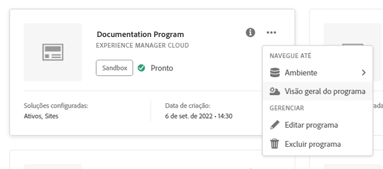

# Criação de programas de produção {#create-production-program}

Um programa de produção deve ser usado por um usuário familiarizado com o AEM e o Cloud Manager e que está pronto para começar a gravar, compilar e testar o código com o objetivo de implantá-lo para hospedar o tráfego direto.

Saiba mais sobre os tipos de programas no documento [Noções sobre programas e tipos de programas.](program-types.md)

## Criação de um programa de produção {#create}

Siga estas etapas para criar um programa de produção. Observe que, dependendo dos direitos da sua organização, você poderá ver [opções adicionais](#options) ao adicionar seu programa.

1. Faça logon no Cloud Manager, em [my.cloudmanager.adobe.com](https://my.cloudmanager.adobe.com/), e selecione a organização apropriada.

1. No console **[Meus Programas](/help/implementing/cloud-manager/navigation.md#my-programs)**, toque ou clique em **Adicionar Programa** no canto superior direito da tela.

   

1. Selecione **Configurar para produção** no assistente Criar programa para criar um programa de produção e fornecer um nome de programa.

   

1. Ou é possível adicionar uma imagem ao programa arrastando e soltando um arquivo de imagem no público alvo **Adicionar uma imagem de programa** ou clicando nela para selecionar uma imagem de um navegador de arquivos. Selecione **Continuar**.

1. Na guia **Soluções e complementos**, selecione as soluções a serem incluídas no programa.

   * Se você não tiver certeza se precisa de um ou mais programas para as várias soluções disponíveis, selecione o mais interessante. Você pode ativar soluções adicionais ao [editar o programa](/help/implementing/cloud-manager/getting-access-to-aem-in-cloud/editing-programs.md) depois. Consulte a [Introdução ao documento Programas de produção](/help/implementing/cloud-manager/getting-access-to-aem-in-cloud/introduction-production-programs.md) para obter mais recomendações de configuração do programa.
   * Pelo menos uma solução é necessária para a criação do programa.
   * Se você selecionou a opção **[Habilitar Segurança Aprimorada](#security)**, poderá selecionar somente as soluções para as quais houver direitos HIPAA disponíveis.

   

1. Clique na divisa antes dos nomes de solução para exibir os complementos opcionais, como selecionar a opção de complemento **Commerce** em **Sites**.

   

1. Com as soluções e os complementos selecionados, clique em **Continuar**.

1. Na guia **Data de publicação**, insira a data em que planeja publicar o programa de produção.

   

   * Essa data poderá ser editada a qualquer momento.
   * Esta data é somente para fins informativos e aciona o widget de publicação na [**página Visão geral do programa**](/help/implementing/cloud-manager/getting-access-to-aem-in-cloud/editing-programs.md#program-overview) para fornecer links no produto para a documentação de práticas recomendadas da AEM as a Cloud Service em tempo hábil, a fim de se alinhar com a sua jornada, resultando em uma experiência de publicação bem-sucedida e tranquila.

1. Clique em **Criar**.

Seu programa é criado pelo Cloud Manager e é exibido e pode ser selecionado na página de aterrissagem.

## Opções adicionais do programa de produção {#options}

Dependendo dos direitos disponíveis para sua organização, talvez você tenha opções adicionais disponíveis ao criar um programa de produção.

### Segurança {#security}

Se você tiver os direitos necessários, a guia **Segurança** será exibida como a primeira guia na caixa de diálogo **Configurar para Produção**.

A guia **Segurança** fornece as opções para ativar a **HIPAA** e/ou a **Proteção WAF-DDOS** para o seu programa de produção.

O Adobe HIPAA Compliant e o Web Application Firewall (WAF) facilitam a segurança baseada em nuvem como parte de uma abordagem de várias camadas para proteção contra vulnerabilidades.

* **HIPAA** - Essa opção habilita a implementação da solução pronta para HIPAA do Adobe.
   * [Saiba mais](https://www.adobe.com/go/hipaa-ready) sobre a solução de implementação pronta para HIPAA da Adobe.
   * O HIPAA não pode ser habilitado ou desabilitado após a criação do programa.
* **Proteção WAF-DDOS** - Esta opção habilita o firewall do aplicativo Web por meio de regras para proteger seu aplicativo.
   * Uma vez ativada, a proteção WAF-DDOS pode ser configurada configurando um [pipeline de não produção.](/help/implementing/cloud-manager/configuring-pipelines/configuring-non-production-pipelines.md)
   * Consulte o documento [Regras de filtro de tráfego incluindo Regras do WAF](/help/security/traffic-filter-rules-including-waf.md) para saber como gerenciar regras de filtro de tráfego no repositório para que elas sejam implantadas corretamente.

### SLA {#sla}

Se você tiver os direitos necessários, a guia **SLA** será exibida como a segunda ou terceira guia na caixa de diálogo **Configurar para Produção**.

A AEM Sites e a Forms oferecem um contrato de nível de serviço (SLA) padrão de 99,9%. A opção **Contrato de Nível de Serviço de 99,99%** habilita uma porcentagem mínima de 99,99% de tempo de atividade para seus ambientes de produção para Sites e/ou Forms.

O SLA de 99,99% oferece benefícios, incluindo maior disponibilidade e menor latência, e requer que uma [região de publicação adicional](/help/implementing/cloud-manager/manage-environments.md#multiple-regions) seja aplicada ao ambiente de produção no programa.

Quando os [requisitos](#sla-requirements) para habilitar o SLA de 99,99% forem atendidos, você deverá executar um [pipeline de pilha completa](/help/implementing/cloud-manager/configuring-pipelines/configuring-production-pipelines.md) para ativá-lo.

#### Requisitos para 99,99% do SLA {#sla-requirements}

Além dos direitos exigidos, 99,99% do SLA tem requisitos adicionais para uso.

* Tanto o SLA de 99,99% quanto os direitos de região de publicação adicionais devem estar disponíveis para a organização no momento de aplicar o SLA de 99,99% ao programa.
* Para aplicar o SLA de 99,99% ao programa, a Cloud Manager verificará se um direito de [região de publicação adicional](/help/implementing/cloud-manager/manage-environments.md#multiple-regions) não consumido também está disponível e pode ser aplicado ao programa.
* Ao editar um programa, se ele já contiver um ambiente de produção com pelo menos uma região de publicação adicional, a Cloud Manager verificará apenas a disponibilidade de um direito de SLA de 99,99%.
* Para que o SLA de 99,99% e os relatórios sejam ativados, o [ambiente de produção/preparo](/help/implementing/cloud-manager/manage-environments.md#adding-environments) deve ter sido criado e pelo menos uma região de publicação adicional deve ter sido aplicada no ambiente de produção/preparo.
   * Se estiver usando a [rede avançada](/help/security/configuring-advanced-networking.md), verifique o documento [Adicionando várias regiões do Publish a um novo ambiente](/help/implementing/cloud-manager/manage-environments.md#adding-regions) para obter recomendações para que a conectividade seja mantida no caso de falha regional.
* Pelo menos uma região de publicação adicional deve permanecer em seu programa de SLA de 99,99%. Os usuários não têm permissão para excluir a última região de publicação adicional do seu programa de SLA de 99,99%.
* O SLA de 99,99% é compatível com programas de produção que têm a solução Sites ou Forms ativada.
* Você deve executar um [pipeline de pilha completa](/help/implementing/cloud-manager/configuring-pipelines/configuring-production-pipelines.md) para ativar (ou, ao editar um programa, desativar) o SLA de 99,99%.

## Acessar o programa {#accessing}

1. Ao ver o cartão do programa na página de aterrissagem, selecione o botão de reticências para exibir as opções de menu disponíveis.

   

1. Selecione **Visão geral do programa** para navegar até a página **Visão geral**.

1. O principal cartão de chamada à ação na página de visão geral orientará você pela criação de um ambiente, um pipeline de não produção e, finalmente, um pipeline de produção.

   

>[!TIP]
>
>Consulte o documento [Navegando na Interface do Usuário do Cloud Manager](/help/implementing/cloud-manager/navigation.md) para obter detalhes sobre como navegar no Cloud Manager e entender o console **Meus Programas**.

>[!NOTE]
>
>Diferentemente de um [programa de sandbox,](introduction-sandbox-programs.md#auto-creation) um programa de produção exigirá que um usuário com a função apropriada do Cloud Manager crie o projeto e adicione um ambiente por meio da interface de usuário de autoatendimento.
