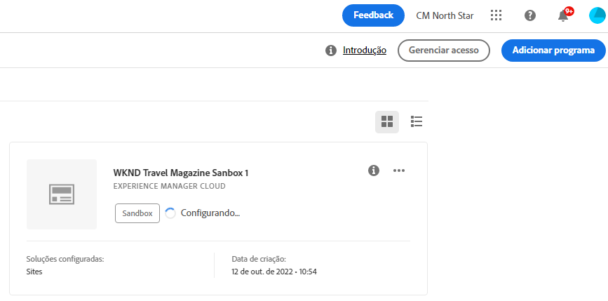

# Criação de um programa de sandbox {#create-sandbox-program}

Siga as etapas abaixo para criar um programa sandbox:

1. Inicie a página de aterrissagem do Cloud Manager e clique em **Adicionar programa** no canto superior direito da tela.

   

1. No assistente criar programa, selecione **Configurar uma sandbox**. O usuário envia o nome do programa antes de selecionar **Criar**.

   

1. O usuário verá o novo cartão de programa sandbox na página de aterrissagem e poderá passar o mouse sobre ele para selecionar o ícone do Cloud Manager e navegar até a página de visão geral do Cloud Manager. O cartão informará o usuário sobre o status da configuração automática do programa sandbox recém-criado. O usuário verá a progressão.

   

1. Depois que o programa for configurado e a etapa de criação do projeto for concluída, o usuário poderá acessar o link **Gerenciar Git**, conforme mostrado na figura abaixo:

   

   >[!NOTE]
   >
   >Para saber mais sobre como acessar e gerenciar o Repositório Git usando o Gerenciamento de Conta Git de Autoatendimento da interface do usuário do Cloud Manager, consulte [Acessando o Git](/help/implementing/cloud-manager/accessing-repos.md).

1. Depois que o ambiente de desenvolvimento é criado, o usuário pode **Acessar AEM** link, conforme mostrado na figura abaixo:

   

1. Quando o pipeline de não produção implantado no desenvolvimento estiver concluído, o assistente orientará o usuário a acessar AEM (no desenvolvimento) ou implantar código no ambiente de desenvolvimento:

   

   >[!NOTE]
   >Você também pode editar, alternar ou adicionar um programa na página Visão geral do Cloud Manager , conforme mostrado abaixo:

   
