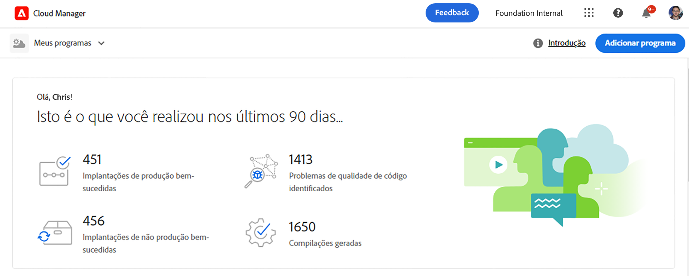

# Criação de programas do sandbox {#create-sandbox-program}

Um programa de sandbox é normalmente criado para fins de treinamento, execução de demonstrações, capacitação, POCs ou documentação e não se destina a transportar tráfego direto.

Saiba mais sobre os tipos de programas no documento [Noções sobre programas e tipos de programas.](program-types.md)

## Criar um programa de sandbox {#create}

Siga estas etapas para criar um programa de sandbox.

1. Faça logon no Cloud Manager, em [my.cloudmanager.adobe.com](https://my.cloudmanager.adobe.com/), e selecione a organização apropriada.

1. Na página de aterrissagem do Cloud Manager, clique em **Adicionar programa** no canto superior direito da tela.

   

1. No assistente criar programa, selecione **Configurar uma sandbox** e forneça um nome de programa.

   

1. Opcionalmente, é possível adicionar uma imagem ao programa arrastando e soltando um arquivo de imagem na **Adicionar uma imagem de programa** direcione ou clique nela para selecionar uma imagem de um navegador de arquivos. Toque ou clique em **Continuar**.

   * A imagem serve somente como o bloco na janela de visão geral do programa e ajuda a identificar o programa.

1. No **Configurar a sandbox** escolha as soluções que deseja ativar no programa sandbox marcando as opções na caixa de diálogo **Soluções e complementos** tabela.

   * Use as divisas ao lado dos nomes das soluções para mostrar complementos adicionais e opcionais para as soluções.

   * O **Sites** e **Ativos** As soluções são sempre incluídas em programas sandbox e não podem ser desselecionadas.

   

1. Depois de selecionar as soluções e os complementos para o programa sandbox, toque em **Criar**.

Você verá um cartão de novo programa de sandbox na página de aterrissagem com um indicador de status, conforme o processo de configuração avança.

## Acesso à sandbox {#access}

Você pode visualizar os detalhes da configuração da sandbox, bem como acessar o ambiente (se disponível), visualizando a página de visão geral do programa.

1. Na página de aterrissagem do Cloud Manager, clique no botão de reticências no programa recém-criado.

   

1. Depois que a etapa de criação do projeto for concluída, você poderá acessar o link **Acessar informações do repositório** para poder usar seu repositório Git.

   

   >[!TIP]
   >
   >Para saber mais sobre como acessar e gerenciar o repositório Git, consulte o documento [Acessar o Git](/help/implementing/cloud-manager/managing-code/accessing-repos.md).

1. Uma vez criado o ambiente de desenvolvimento, você poderá usar o link **Acessar o AEM** para entrar no AEM.

   

1. Uma vez concluída a implantação em desenvolvimento do pipeline de não produção, o assistente o orientará a acessar o ambiente de desenvolvimento do AEM ou implantar o código no ambiente de desenvolvimento.

   

Se, a qualquer momento, você precisar alternar para outro programa ou retornar à página de visão geral para criar outro programa, clique no nome do programa no canto superior esquerdo da tela para exibir a opção **Navegar para**.

