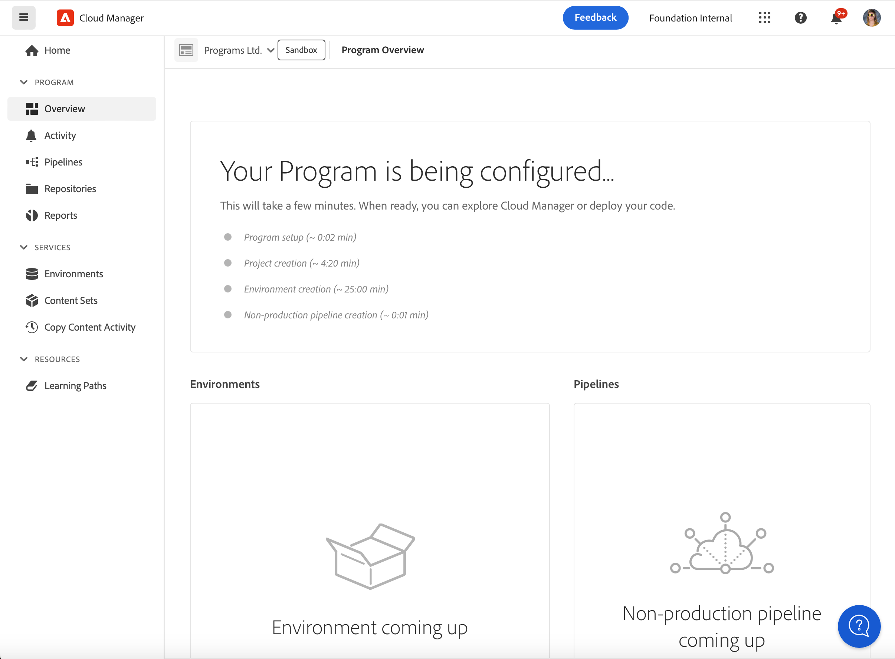

# Criação de programas do sandbox {#create-sandbox-program}

Um programa de sandbox é normalmente criado para fins de treinamento, execução de demonstrações, capacitação, POCs ou documentação e não se destina a transportar tráfego direto.

Saiba mais sobre os tipos de programas no documento [Noções sobre programas e tipos de programas.](program-types.md)

## Criar um programa de sandbox {#create}

1. Faça logon no Cloud Manager em [my.cloudmanager.adobe.com](https://my.cloudmanager.adobe.com/) e selecione a organização apropriada.

1. No **[Meus programas](/help/implementing/cloud-manager/navigation.md#my-programs)** toque ou clique em **Adicionar programa** próximo ao canto superior direito da tela.

   

1. No assistente criar programa, selecione **Configurar uma sandbox** e forneça um nome de programa.

   

1. Opcionalmente, é possível adicionar uma imagem ao programa arrastando e soltando um arquivo de imagem no destino **Adicionar uma imagem de programa** ou clicando para selecionar uma imagem de um navegador de arquivos. Selecionar **Continuar**.

   * A imagem serve apenas como o bloco na janela de visão geral do programa e ajuda a identificar o programa.

1. No **Configurar sua sandbox** escolha quais soluções você deseja ativar no programa de sandbox, marcando as opções na caixa de diálogo **Soluções e complementos** tabela.

   * Use as divisas ao lado dos nomes das soluções para ver complementos adicionais e opcionais para as soluções.

   * As soluções **Sites** e **Assets** estão sempre incluídas em programas de sandbox e não podem ser desmarcadas.

   

1. Depois de selecionar as soluções e complementos para o programa da sua sandbox, clique em **Criar**.

Você verá um cartão de novo programa de sandbox na página de destino com um indicador de status, conforme o processo de configuração avança.

## Acesso à sandbox {#access}

Você pode visualizar os detalhes da configuração da sandbox, bem como acessar o ambiente (quando disponível), visualizando a página de visão geral do programa.

1. Na página de aterrissagem do Cloud Manager, clique no botão de reticências no programa criado.

   

1. Depois que a etapa de criação do projeto for concluída, será possível acessar o link **Acessar Informações do Repositório** para poder usar seu repositório Git.

   

   >[!TIP]
   >
   >Para saber mais sobre como acessar e gerenciar o repositório Git, consulte [Acesso ao Git](/help/implementing/cloud-manager/managing-code/accessing-repos.md).

1. Uma vez criado o ambiente de desenvolvimento, você poderá usar o link **Acessar o AEM** para entrar no AEM.

   

1. Quando a implantação em desenvolvimento do pipeline de não produção for concluída, o assistente na chamada para ação o orientará a acessar o ambiente de desenvolvimento do AEM ou implantar o código no ambiente de desenvolvimento.

   

>[!TIP]
>
>Consulte o documento [Navegação na interface do usuário do Cloud Manager](/help/implementing/cloud-manager/navigation.md) para obter detalhes sobre como navegar no Cloud Manager e entender o **Meus programas** console.
