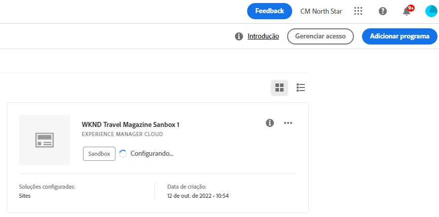

# Criação de programas do sandbox {#create-sandbox-program}

Um programa de sandbox é normalmente criado para servir os propósitos de treinamento, execução de demonstrações, ativação, POCs ou documentação, e não é destinado ao tráfego ao vivo.

Saiba mais sobre os tipos de programas no documento [Entendendo os tipos de programas e programas.](program-types.md)

## Criar um programa de sandbox {#create}

Siga estas etapas para criar um programa sandbox.

1. Faça logon no Cloud Manager, em [my.cloudmanager.adobe.com](https://my.cloudmanager.adobe.com/), e selecione a organização apropriada.

1. Na página de aterrissagem do Cloud Manager, clique em **Adicionar programa** no canto superior direito da tela.

   

1. No assistente criar programa, selecione **Configurar uma sandbox**, forneça um nome de programa e clique em **Criar**.

   

Você verá um novo cartão de programa sandbox na página de aterrissagem com um indicador de status conforme o processo de configuração avança.

## Acessar seu sandbox {#access}

Você pode visualizar os detalhes da configuração da sandbox, bem como acessar o ambiente (uma vez disponível), visualizando a página de visão geral do programa.

1. Na página de aterrissagem do Cloud Manager, clique no botão de reticências do programa recém-criado.

   

1. Depois que a etapa de criação do projeto for concluída, você poderá acessar o **Acessar informações do repositório** para poder usar seu git repo.

   

   >[!TIP]
   >
   >Para saber mais sobre como acessar e gerenciar o repositório Git, consulte o documento [Acesso ao Git.](/help/implementing/cloud-manager/managing-code/accessing-repos.md)

1. Depois que o ambiente de desenvolvimento for criado, você poderá usar a variável **AEM de acesso** link para entrar no AEM.

   

1. Quando o pipeline de não produção que está implantando no desenvolvimento é concluído, o assistente o orientará a acessar o ambiente de desenvolvimento AEM ou implantar o código no ambiente de desenvolvimento.

   

Se, a qualquer momento, precisar alternar para outro programa ou retornar à página de visão geral para criar outro programa, clique no nome do programa no canto superior esquerdo da tela para exibir o **Navegar para** opção.

