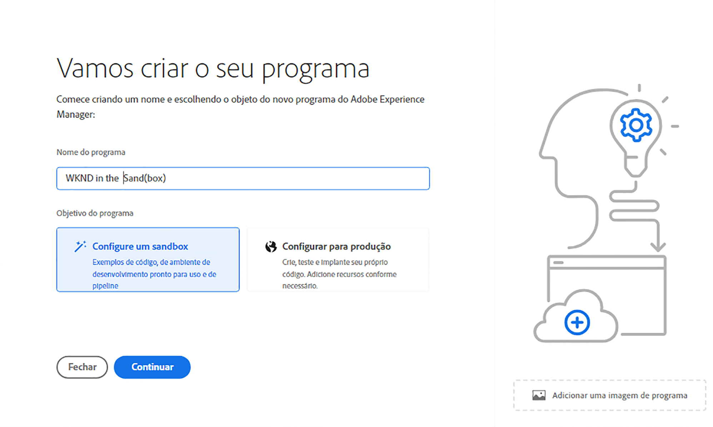

# Criar programas de sandbox {#create-sandbox-program}

Um programa de sandbox é normalmente criado para fins de treinamento, execução de demonstrações, capacitação, POCs ou documentação e não se destina a transportar tráfego direto. Consulte [Introdução a programas de sandbox](/help/implementing/cloud-manager/getting-access-to-aem-in-cloud/introduction-sandbox-programs.md).

Saiba mais sobre os tipos de programas no documento [Noções sobre Programas e Tipos de Programas](program-types.md).

## Criar um programa de sandbox {#create}

1. Faça logon no Cloud Manager em [my.cloudmanager.adobe.com](https://my.cloudmanager.adobe.com/) e selecione a organização apropriada.

1. No console **[Meus Programas](/help/implementing/cloud-manager/navigation.md#my-programs)**, próximo ao canto superior direito, clique em **Adicionar Programa**.

   

1. No assistente *Vamos criar seu programa*, no campo de texto **Nome do programa**, digite o nome que você deseja para o programa.

1. Em **Objetivo do programa**, selecione **`Set up a sandbox`**.

   

1. (Opcional) No canto inferior direito da caixa de diálogo do assistente, siga um destes procedimentos:

   * Arraste e solte um arquivo de imagem no destino **Adicionar uma imagem de programa**.
   * Clique em **Adicionar uma imagem de programa** e selecione uma imagem de um navegador de arquivos.
   * Clique no ícone da lixeira para excluir uma imagem adicionada.

1. Clique em **Continuar**.

1. Na caixa de listagem **Soluções e complementos**, selecione uma ou mais soluções para incluir no programa.

   * Clique na divisa à esquerda do nome da solução para exibir os complementos opcionais disponíveis que você deseja incluir na solução selecionada.
   * As soluções **Sites**, **Assets** e **Serviços de Entrega da Edge** são sempre selecionadas por padrão quando você cria um programa de sandbox. Não é possível desmarcá-los.

   

1. Clique em **Criar**. O Cloud Manager cria seu programa de sandbox e o exibe na página de aterrissagem para seleção.

## Acesso à sandbox {#access}

Depois que um novo programa de sandbox terminar de ser criado, você poderá visualizar os detalhes da configuração da sandbox e acessar o ambiente visualizando a página de visão geral do programa.

1. Na página de aterrissagem do Cloud Manager, clique no botão de reticências no programa de sandbox criado.

   

1. Quando a etapa de criação do projeto for concluída, você poderá clicar no link **Acessar informações do repositório** para poder usar seu repositório Git.

   

   >[!TIP]
   >
   >Para saber mais sobre como acessar e gerenciar o repositório Git, consulte [Acessar o Git](/help/implementing/cloud-manager/managing-code/accessing-repos.md).

1. Depois que o ambiente de desenvolvimento for criado, você poderá clicar em **Acessar AEM** e entrar no AEM.

   

1. Quando a implantação em desenvolvimento do pipeline de não produção for concluída, o assistente na chamada para ação o orientará a acessar o ambiente de desenvolvimento do AEM ou implantar o código no ambiente de desenvolvimento.

   

>[!TIP]
>
>Consulte [Navegando na Interface do Usuário do Cloud Manager](/help/implementing/cloud-manager/navigation.md) para obter detalhes sobre como navegar no Cloud Manager e entender o console **Meus Programas**.
