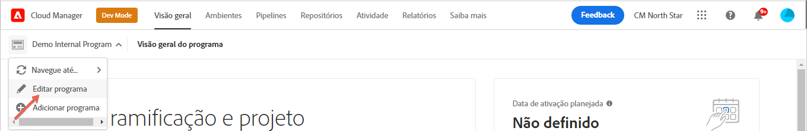
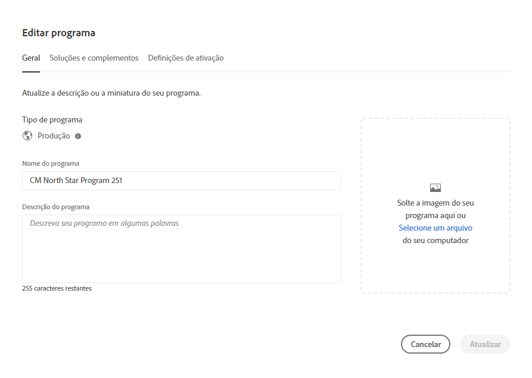
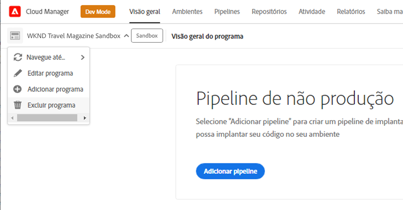
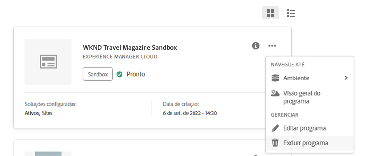

# Editar programas {#editing-programs}

Para gerenciar e editar programas, inicie no console [**Meus Programas**](/help/implementing/cloud-manager/navigation.md). A página **Meus Programas** fornece uma visão geral de todos os programas aos quais você tem acesso. Ao selecionar um programa individual, a página **Visão geral do programa** fornece detalhes sobre o programa rapidamente.

Na **Visão Geral do Programa**, os usuários com as permissões necessárias podem editar [programas de produção criados em sua organização](creating-production-programs.md) e [programas de sandbox criados em sua organização](creating-sandbox-programs.md). Ao editar um programa, você pode:

* Adicionar a solução Sites a um programa existente com o Assets e vice-versa.
* Remover sites ou ativos de um programa existente usando o Sites e o Assets.
* Adicionar um direito de solução não utilizado a um programa existente ou criar um novo programa.
* Excluir programas de sandbox.

## Permissões {#permissions}

Você deve ter a função **Proprietário da empresa** para editar programas, excluir programas de sandbox e acessar o Painel de Licenças.

## Editar um programa {#editing}

Sempre que um programa for editado, incluindo a adição ou remoção de uma solução ou complemento, essas alterações entrarão em vigor após a próxima implantação.

**Para editar um programa:**

1. Faça logon no Cloud Manager, em [my.cloudmanager.adobe.com](https://my.cloudmanager.adobe.com/), e selecione a organização apropriada.

1. Na página **[Meus Programas](#my-programs)**, clique no programa que você deseja editar para exibir seus detalhes.

1. Clique no nome do programa no canto superior esquerdo da página e selecione **Editar programa**.

   

1. A página **Editar Programa** é aberta na guia **Geral**.

   

1. As opções disponíveis para editar o programa são as mesmas para a criação do programa.
   * Consulte [Criar Programas de Produção](/help/implementing/cloud-manager/getting-access-to-aem-in-cloud/creating-production-programs.md) e [Criar Programas de Sandbox](/help/implementing/cloud-manager/getting-access-to-aem-in-cloud/creating-sandbox-programs.md) para obter detalhes sobre as opções individuais.
   * [Opções adicionais](/help/implementing/cloud-manager/getting-access-to-aem-in-cloud/creating-production-programs.md#options) podem estar disponíveis para o programa de produção, dependendo dos direitos da sua organização.

1. Clique em **Atualizar** para salvar as alterações no programa.

## Excluir um programa de sandbox {#delete-sandbox-program}

A exclusão de um programa de sandbox remove todos os ambientes e pipelines associados a ele.

>[!TIP]
>
>Usuários com as funções **Proprietário da empresa** ou **Gerente de implantação** podem, como alternativa, excluir os ambientes de produção e preparo em vez de todo o programa de sandbox.

**Para excluir um programa de sandbox:**

1. Faça logon no Cloud Manager, em [my.cloudmanager.adobe.com](https://my.cloudmanager.adobe.com/), e selecione a organização apropriada.

1. Na página **[Meus Programas](#my-programs)**, clique no programa que você deseja editar para exibir seus detalhes.

1. Clique no nome do programa no canto superior esquerdo da página e selecione **Excluir programa**.

   

Como alternativa, você pode clicar no  no cartão do programa na página de visão geral do Cloud Manager e selecionar **Excluir Programa**.

>[!NOTE]
>
>Somente programas de sandbox podem ser excluídos. Os programas de produção não podem ser excluídos.
