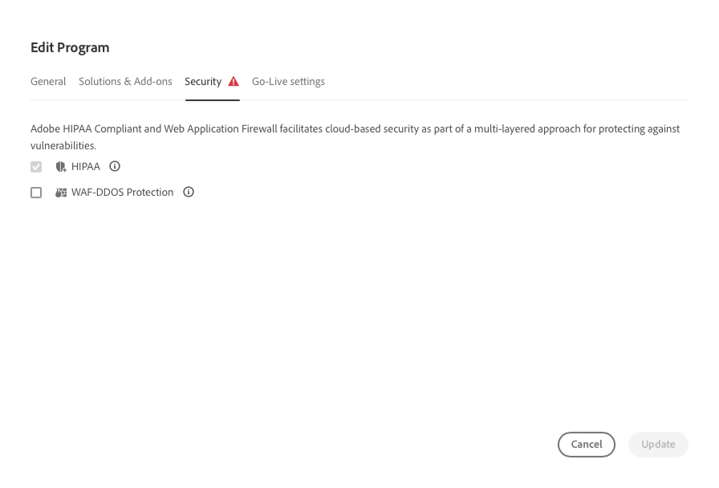

# Gerenciamento e edição de programas {#editing-programs}

A variável **Meus programas** fornece uma visão geral de todos os programas aos quais você tem acesso. Ao selecionar um programa individual, a variável **Visão geral do programa** A página fornece detalhes do programa em uma rápida visualização.

No **Visão geral do programa**, os usuários com as permissões necessárias poderão editar [programas de produção criados em sua organização](creating-production-programs.md) e [programas de sandbox criados em sua organização.](creating-sandbox-programs.md) Ao editar um programa, você pode:

* Adicionar a solução Sites a um programa existente com Assets e vice-versa.
* Remover sites ou ativos de um programa existente usando o Sites e o Assets.
* Adicionar um segundo direito de solução não utilizado a um programa existente ou como um novo programa.
* Excluir programas de sandbox.

## Permissões {#permissions}

Você deve ser um membro do **Proprietário da empresa** para editar ou excluir programas de sandbox, bem como para acessar o Painel de licenças.

## Meus programas {#my-programs}

1. Faça logon no Cloud Manager, em [my.cloudmanager.adobe.com](https://my.cloudmanager.adobe.com/), e selecione a organização apropriada.

1. A variável **Meus programas** A página mostra uma lista de todos os programas aos quais você tem acesso como blocos.

### Frase de chamariz {#cta}

Na parte superior da página há uma chamada para ação relevante para o status da organização. Por exemplo, se você tiver configurado os programas com êxito, as estatísticas das atividades nos últimos 90 dias poderão ser exibidas, incluindo:

* Número de [implantações](/help/implementing/cloud-manager/deploy-code.md)
* Número de [problemas de qualidade do código](/help/implementing/cloud-manager/code-quality-testing.md) identificado
* Número de builds

Ou se você estiver apenas começando a configuração da organização, pode haver dicas sobre as próximas etapas ou recursos de documentação.

### Guia Programas {#programs-tab}

A variável **Programas** A guia lista os cartões que representam cada programa ao qual você tem acesso. Toque ou clique em um cartão para acessar a **Visão geral do programa** página do programa para obter detalhes sobre ele.

Use as opções de classificação para encontrar melhor o programa necessário.

* Classificar por
   * Data de criação (padrão)
   * Nome do programa
   * Status
* Crescente (padrão) / Decrescente
* Exibição em grade (padrão)
* Exibição de lista

### Guia Licença {#license-tab}

A variável **Licença** fornece acesso rápido à [Painel de licenças.](/help/implementing/cloud-manager/license-dashboard.md)

## Visão geral do programa {#program-overview}

Depois de selecionar um programa no **[Meus programas](#my-programs)** , o Cloud Manager abre a **Visão geral do programa** página do programa selecionado.

Toque ou clique no nome do programa no canto superior esquerdo da página para alternar rapidamente para outro programa ou de volta para a **[Meus programas](#my-programs)** página. Também é possível [editar o programa selecionado](#editing) ou [adicionar um programa.](/help/implementing/cloud-manager/getting-access-to-aem-in-cloud/creating-production-programs.md)

O plano de ação na parte superior fornecerá informações úteis, dependendo do status do seu programa. Para um novo programa, você pode ver as próximas etapas oferecidas, bem como um lembrete de uma data de publicação, [definido durante a criação do programa.](/help/implementing/cloud-manager/getting-access-to-aem-in-cloud/editing-programs.md)

Para um programa em tempo real, o status da última implantação com links para obter detalhes e iniciar uma nova implantação.

**Ambientes** e **Pipelines** Os cartões fornecem uma visão geral rápida de ambos no programa selecionado.

A variável **Desempenho** fornece uma visão geral do **[Painel CDN.](/help/implementing/cloud-manager/cdn-performance.md)**

## Edição de um programa {#editing}

1. Faça logon no Cloud Manager, em [my.cloudmanager.adobe.com](https://my.cloudmanager.adobe.com/), e selecione a organização apropriada.

1. No **[Meus programas](#my-programs)** clique no programa que deseja editar para exibir seus detalhes.

1. Clique no nome do programa no canto superior esquerdo da página e selecione **Editar programa**.

   

1. A página **Editar programa** será aberta. Na guia **Geral**, edite o nome e a descrição do programa.

   * Pelo menos uma solução deve ser selecionada para um programa.

   

1. Na guia **Soluções e complementos**, modifique as soluções do programa.

   

1. Clique na divisa antes do nome da solução para exibir os complementos opcionais, como selecionar o **Commerce** opção complementar em **Sites**.

   

1. Na guia **Configurações de publicação**, modifique a data de publicação planejada para o programa.

   

   * Esta data é apenas para fins informativos. Ele aciona o widget de publicação na página de visão geral do programa. Por sua vez, ele fornece links para a documentação de práticas as a Cloud Service do Adobe Experience Manager (AEM) para alinhar-se à sua jornada, resultando em uma experiência de ativação bem-sucedida.
   * Esta guia não está disponível para programas de sandbox.

1. Se os direitos necessários estiverem disponíveis para o programa, a **Segurança** mostrará onde você pode modificar as opções de segurança do programa.

   

   * O HIPAA não pode ser habilitado ou desabilitado após [criação do programa.](/help/implementing/cloud-manager/getting-access-to-aem-in-cloud/creating-production-programs.md)
      * [Saiba mais](https://www.adobe.com/go/hipaa-ready) sobre a solução de implementação pronta para HIPAA da Adobe.
   * Uma vez ativada, a proteção WAF-DDOS pode ser configurada configurando um [pipeline de não produção.](/help/implementing/cloud-manager/configuring-pipelines/configuring-non-production-pipelines.md)

1. Clique em **Atualizar** para salvar as alterações no programa.

Sempre que um programa for editado, incluindo a adição ou remoção de uma solução ou complemento, essas alterações entrarão em vigor após a próxima implantação.

## Exclusão de programas de sandbox {#delete-sandbox-program}

A exclusão de um programa de sandbox remove todos os ambientes e pipelines associados a ele.

>[!TIP]
>
>Usuários com as funções **Proprietário da empresa** ou **Gerente de implantação** podem, como alternativa, excluir os ambientes de produção e preparo em vez de todo o programa de sandbox.

Para excluir um programa de sandbox, faça o seguinte.

1. Faça logon no Cloud Manager, em [my.cloudmanager.adobe.com](https://my.cloudmanager.adobe.com/), e selecione a organização apropriada.

1. No **[Meus programas](#my-programs)** clique no programa que deseja editar para exibir seus detalhes.

1. Clique no nome do programa no canto superior esquerdo da página e selecione **Excluir programa**.

   

Como alternativa, você pode clicar no botão de reticências no cartão do programa na página de visão geral do Cloud Manager e selecionar **Excluir programa**.

>[!NOTE]
>
>Somente programas de sandbox podem ser excluídos. Os programas de produção não podem ser excluídos.
