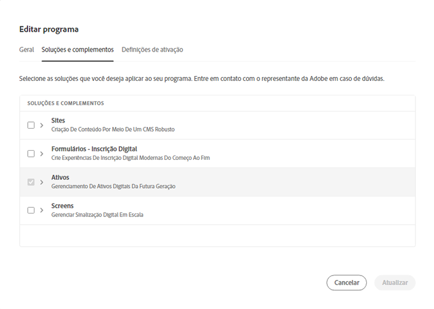
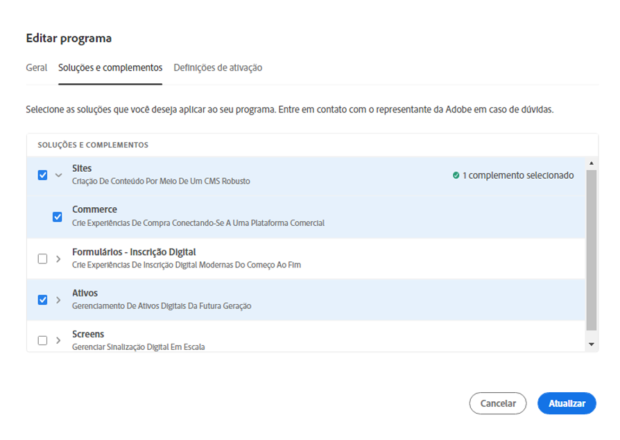
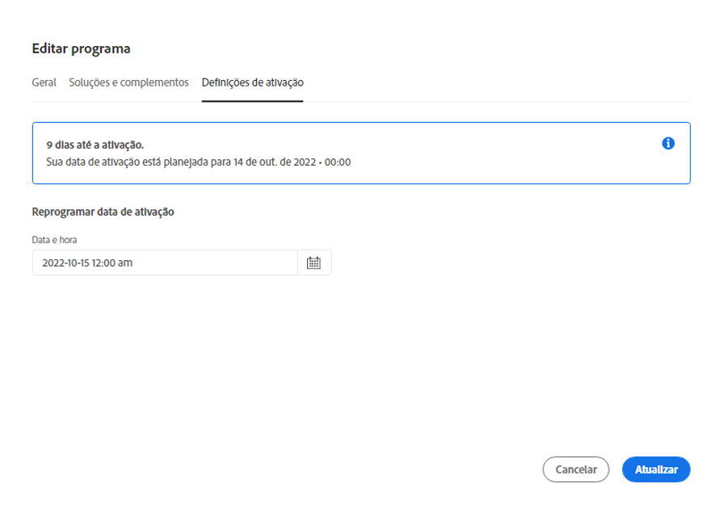
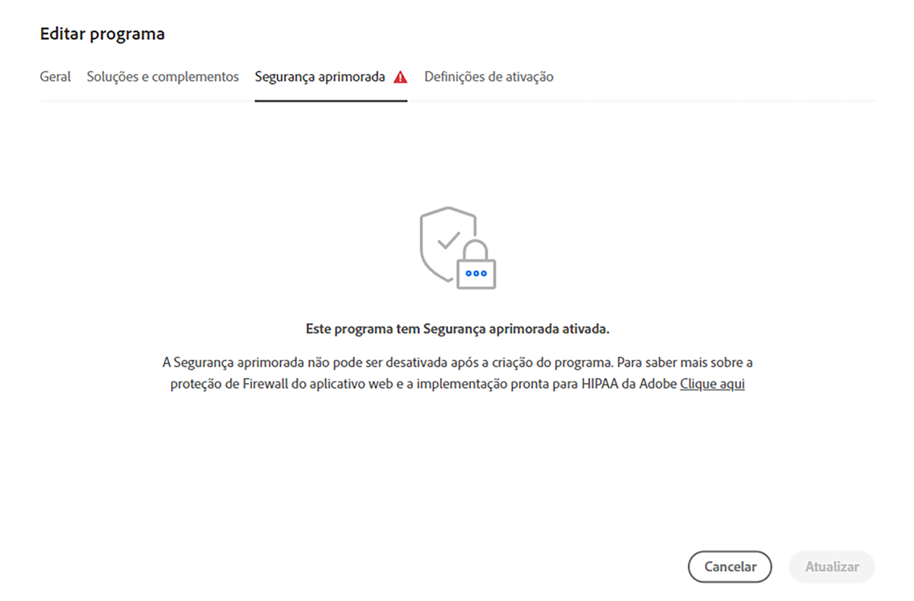

# Programas de edição {#editing-programs}

Os usuários com as permissões necessárias podem editar tanto [programas de produção](creating-production-programs.md) quanto [programas de sandbox criados em sua organização.](creating-sandbox-programs.md) Ao editar um programa, você pode:

* Adicionar a solução Sites a um programa existente com Ativos, e vice-versa.
* Remover sites ou ativos de um programa existente usando o Sites e o Assets.
* Adicionar o segundo direito de solução não utilizado a um programa existente ou como um novo programa.
* Excluir programas de sandbox.

## Permissões {#permissions}

Você deve ser um membro com a função **Proprietário da empresa** para editar ou excluir programas de sandbox.

## Edição de um programa {#editing}

Siga estas etapas para editar um programa.

1. Faça logon no Cloud Manager, em [my.cloudmanager.adobe.com](https://my.cloudmanager.adobe.com/), e selecione a organização apropriada.

1. Clique no programa que deseja editar para exibir seus detalhes.

1. Clique no nome do programa no canto superior esquerdo da página e selecione **Editar programa**.

   

1. A página **Editar programa** será aberta. Na guia **Geral**, edite o nome e a descrição do programa.

   * Pelo menos uma solução deve ser selecionada para um programa.

   

1. Na guia **Soluções e complementos**, modifique as soluções do programa.

   

1. Clique na divisa antes dos nomes de solução para exibir os complementos opcionais, por exemplo, como selecionar a opção de complemento **Commerce** no **Sites**.

   

1. Na guia **Configurações de publicação**, modifique a data de publicação planejada para o programa.

   

   * Essa data é somente para fins informativos e aciona o widget de publicação na página de visão geral do programa para fornecer links no produto para a documentação de práticas recomendadas do AEM as a Cloud Service em tempo hábil, a fim de se alinhar com a sua jornada, resultando em uma experiência de publicação bem-sucedida e tranquila.
   * Esta guia não está disponível para programas de sandbox.

1. Clique em **Atualizar** para salvar as alterações no programa.

Sempre que um programa for editado, incluindo a adição ou remoção de uma solução ou complemento, essas alterações entrarão em vigor após a próxima implantação.

Se seu programa de produção tiver a segurança aprimorada ativada, uma solicitação adicional **Segurança aprimorada** está disponível na guia **Editar programa** para confirmar se o recurso está ativo para o programa.

Esta configuração não pode ser modificada após a criação do programa. Para obter mais informações sobre a opção de segurança aprimorada, consulte o documento [Criação de programas de produção](creating-production-programs.md).

## Exclusão de programas de sandbox {#delete-sandbox-program}

A exclusão de um programa de sandbox removerá todos os ambientes e pipelines associados a ele.

>[!TIP]
>
>Usuários com as funções **Proprietário da empresa** ou **Gerente de implantação** podem, como alternativa, excluir os ambientes de produção e preparo em vez de todo o programa de sandbox.

Siga estas etapas para excluir um programa de sandbox.

1. Faça logon no Cloud Manager, em [my.cloudmanager.adobe.com](https://my.cloudmanager.adobe.com/), e selecione a organização apropriada.

1. Clique no programa que deseja editar para exibir seus detalhes.

1. Clique no nome do programa no canto superior esquerdo da página e selecione **Excluir programa**.

   

Como alternativa, você pode clicar no botão de reticências no cartão do programa na página de visão geral do Cloud Manager e selecionar **Excluir programa**.

>[!NOTE]
>
>Somente programas de sandbox podem ser excluídos. Os programas de produção não podem ser excluídos.
