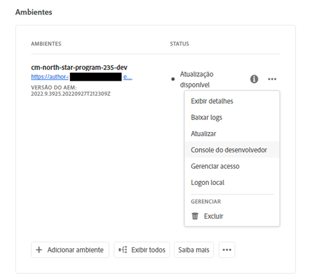

# Hibernar e desibernar ambientes de sandbox {#hibernating-introduction}

Os ambientes de um programa sandbox entram em um modo de hibernação se nenhuma atividade for detectada por oito horas.Hibernação é exclusiva dos ambientes do programa sandbox. Os ambientes do programa de produção não hibernam.

## Hibernação {#hibernation-introduction}

A hibernação pode ocorrer automática ou manualmente.

* **Automático** - Os ambientes do programa de sandbox hibernam automaticamente após oito horas de inatividade. A inatividade não é definida como solicitações de recebimento do serviço de criação, nem de serviços de visualização ou publicação.
* **Manual** - Como usuário, você pode hibernar manualmente um ambiente de programa sandbox. Não há necessidade de fazer isso, pois a hibernação ocorrerá automaticamente conforme descrito anteriormente.

Pode levar até alguns minutos para que os ambientes do programa sandbox entrem no modo de hibernação. Os dados são preservados durante a hibernação.

### Uso da hibernação manual {#using-manual-hibernation}

Você pode hibernar manualmente seu programa de sandbox no Console do desenvolvedor. O acesso ao Console do desenvolvedor para obter um programa sandbox está disponível para qualquer usuário do Cloud Manager.

Siga estas etapas para hibernar manualmente os ambientes do programa sandbox.

1. Faça logon no Cloud Manager, em [my.cloudmanager.adobe.com](https://my.cloudmanager.adobe.com/), e selecione a organização apropriada.

1. Clique no programa que deseja hibernar para exibir seus detalhes.

1. No **Ambientes** , clique no botão de reticências e selecione **Console do desenvolvedor**.

   * Consulte o documento [Acesso ao Console do desenvolvedor](/help/implementing/cloud-manager/manage-environments.md#accessing-developer-console) para obter detalhes adicionais sobre o Console do desenvolvedor.

   

1. No Console do desenvolvedor, clique em **Hibernar**.

   

1. Clique em **Hibernar** para confirmar a etapa.

   

Quando a hibernação for bem-sucedida, você verá a notificação de conclusão do processo de hibernação para seu ambiente no **Console do desenvolvedor** tela.

No Console do desenvolvedor, também é possível clicar no botão **Ambientes** link na navegação estrutural acima do **Pod** lista suspensa de ambientes para hibernar.

## De-Hibernação {#de-hibernation-introduction}

Você pode hibernar manualmente seu Programa de sandbox no Console do desenvolvedor.

>[!IMPORTANT]
>
>Um usuário com um **Desenvolvedor** pode desibernar um ambiente de programa sandbox.

1. Faça logon no Cloud Manager, em [my.cloudmanager.adobe.com](https://my.cloudmanager.adobe.com/), e selecione a organização apropriada.

1. Clique no programa que deseja hibernar para exibir seus detalhes.

1. No **Ambientes** , clique no botão de reticências e selecione **Console do desenvolvedor**.

   * Consulte o documento [Acesso ao Console do desenvolvedor](/help/implementing/cloud-manager/manage-environments.md#accessing-developer-console) para obter detalhes adicionais sobre o Console do desenvolvedor.

1. Clique em **Cancelar hibernação**.

   

1. Clique em **De-Hibernar** para confirmar a etapa.

   

1. Você recebe uma notificação de que o processo de deshibernação foi iniciado e foi atualizado com o progresso.

   

1. Quando o processo for concluído, o ambiente do programa sandbox estará ativo novamente.

   

No Console do desenvolvedor, também é possível clicar no botão **Ambientes** link na navegação estrutural acima do **Pod** lista suspensa de ambientes para desibernar.

### Permissões para desibernar {#permissions-de-hibernate}

Qualquer usuário com um perfil de produto que dê acesso a AEM as a Cloud Service deve poder acessar a variável **Console do desenvolvedor**, permitindo que elas removam a hibernação do ambiente.

## Acesso a um ambiente hibernado {#accessing-hibernated-environment}

Ao fazer qualquer solicitação do navegador em relação ao autor, pré-visualização ou serviço de publicação de um ambiente hibernado, o usuário encontrará uma página de aterrissagem descrevendo o status hibernado do ambiente junto com um link para o Console do desenvolvedor, onde o serviço pode ser removido da hibernação.

## Implantações e atualizações de AEM {#deployments-updates}

Ambientes hibernados ainda permitem implantações e atualizações manuais de AEM.

* Um usuário pode usar um pipeline para implantar código personalizado em ambientes hibernados. O ambiente permanecerá hibernado e o novo código aparecerá no ambiente após a hibernação.

* As atualizações de AEM podem ser aplicadas a ambientes hibernados e podem ser acionadas manualmente pelo Cloud Manager. O ambiente permanecerá hibernado e a nova versão aparecerá no ambiente após a hibernação.

## Hibernação e exclusão {#hibernation-deletion}

* Os ambientes em um programa sandbox hibernam automaticamente após oito horas de inatividade.
   * A inatividade não é definida como solicitações de recebimento do serviço de criação, nem de serviços de visualização ou publicação.
   * Uma vez hibernados, eles podem ser removidos da hibernação manualmente.
* Os programas de sandbox são excluídos depois de seis meses em modo de hibernação contínua, depois disso, podem ser recriados.
