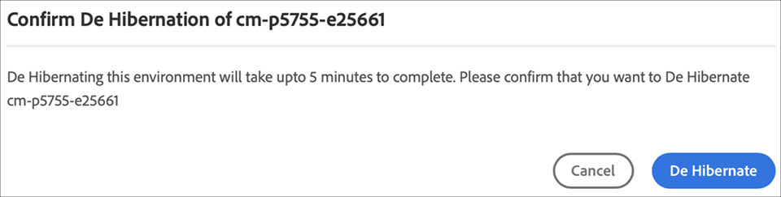

# Hibernar e cancelar hibernação em ambientes de sandbox {#hibernating-introduction}

Os ambientes de um programa de sandbox entram em um modo de hibernação se nenhuma atividade for detectada por oito horas. A hibernação é exclusiva dos ambientes de programas de sandbox. Os ambientes de programas de produção não podem ser hibernados.

## Hibernação {#hibernation-introduction}

A hibernação pode ocorrer automática ou manualmente.

* **Automático** - Os ambientes dos programas de sandbox hibernam automaticamente após oito horas de inatividade. A inatividade é definida como a ausência de solicitações para os serviços de criação, visualização e publicação.
* **Manual** - Como usuário, você pode hibernar manualmente um ambiente de programa de sandbox. Não há necessidade de fazer isso, pois a hibernação ocorre automaticamente, conforme descrito anteriormente.

Pode levar alguns minutos para que os ambientes dos programas de sandbox entrem no modo de hibernação. Os dados são preservados durante a hibernação.

### Hibernar um ambiente de programa de sandbox manualmente {#using-manual-hibernation}

Você pode hibernar manualmente seu programa de sandbox no Console do desenvolvedor. O acesso à Developer Console para um programa de sandbox está disponível para qualquer usuário do Cloud Manager.

**Para hibernar um ambiente de programa de sandbox manualmente:**

1. Faça logon no Cloud Manager, em [my.cloudmanager.adobe.com](https://my.cloudmanager.adobe.com/), e selecione a organização apropriada.

1. No console **[Meus Programas](/help/implementing/cloud-manager/navigation.md#my-programs)**, clique em um *programa de sandbox* que você deseja hibernar para exibir seus detalhes.

1. No cartão **Ambientes**, clique no ícone  e em **Developer Console**.

   * Consulte [Acesso ao Developer Console](/help/implementing/cloud-manager/manage-environments.md#accessing-developer-console) para obter detalhes adicionais sobre o Developer Console.

   

1. Na página **Developer Console**, clique em **Hibernar**.

<!-- UPDATE THESE SCREENSHOTS WHEN NEW AEM DEVELOPER CONSOLE UI IS RELEASED. AS OF OCTOBER 14, 2024, NEW UI IS STILL IN PRIVATE BETA -->

1. Clique em **Hibernar** para confirmar a etapa.

   

Quando a hibernação for bem-sucedida, você verá a notificação de conclusão do processo de hibernação para o seu ambiente na tela **Developer Console**.

Na Developer Console, clique no link **Ambientes** na navegação estrutural acima da lista suspensa **Pod** para exibir os ambientes disponíveis para hibernação.

## Cancelar a hibernação de um programa de sandbox da Developer Console manualmente {#de-hibernation-introduction}

Você pode hibernar manualmente seu programa de sandbox na Developer Console.

>[!IMPORTANT]
>
>Um usuário com função de **Desenvolvedor** pode cancelar a hibernação de um ambiente de programa de sandbox.

**Para cancelar a hibernação de um programa de sandbox da Developer Console manualmente:**

1. Faça logon no Cloud Manager, em [my.cloudmanager.adobe.com](https://my.cloudmanager.adobe.com/), e selecione a organização apropriada.

1. No console **[Meus Programas](/help/implementing/cloud-manager/navigation.md#my-programs)**, clique no programa que deseja cancelar a hibernação para exibir seus detalhes.

1. No cartão **Ambientes**, clique no ícone  e em **Developer Console**.

   * Consulte [Acesso ao Developer Console](/help/implementing/cloud-manager/manage-environments.md#accessing-developer-console) para obter detalhes adicionais sobre o Developer Console.

1. Clique em **Cancelar hibernação**.

   

1. Clique em **Cancelar hibernação** para confirmar a etapa.

   

1. Você recebe uma notificação de que o processo de cancelamento da hibernação foi iniciado, bem como atualizações sobre o progresso.

   

1. Quando o processo for concluído, o ambiente do programa de sandbox ficará ativo novamente.

   

Na Developer Console, clique no link **Ambientes** na navegação estrutural acima da lista suspensa **Pod** para acessar os ambientes disponíveis para desibernação.

### Permissões para cancelar hibernação {#permissions-de-hibernate}

Qualquer usuário com um perfil de produto que dê acesso ao AEM as a Cloud Service deve poder acessar o **Console do desenvolvedor**, permitindo cancelar a hibernação do ambiente.

## Acessar um ambiente hibernado {#accessing-hibernated-environment}

Quando um usuário faz uma solicitação do navegador para o serviço de autoria, visualização ou publicação de um ambiente hibernado, encontra uma página de aterrissagem. Esta página explica o status hibernado do ambiente e fornece um link para o Developer Console para cancelar a hibernação.

## Implantações e atualizações do AEM {#deployments-updates}

Ambientes hibernados ainda permitem a realização de implantações e atualizações manuais do AEM.

* Um usuário pode usar um pipeline para implantar código personalizado em ambientes hibernados. O ambiente permanece hibernado e o novo código aparece no ambiente após o cancelamento da hibernação.

* As atualizações do AEM podem ser aplicadas a ambientes hibernados e podem ser acionadas manualmente pelo Cloud Manager. O ambiente permanece hibernado e a nova versão aparece no ambiente após o cancelamento da hibernação.

## Hibernação e exclusão {#hibernation-deletion}

* Os ambientes em um programa de sandbox são hibernados automaticamente após oito horas de inatividade.
   * A inatividade é definida como a ausência de solicitações para os serviços de criação, visualização e publicação.
   * Uma vez hibernados, eles podem ter [hibernado manualmente](#de-hibernation-introduction).
* Os programas de sandbox são excluídos após seis meses em modo de hibernação contínua, depois disso, podem ser recriados.

>[!NOTE]
>
>Somente ambientes sandbox são excluídos automaticamente após seis meses de hibernação contínua. O programa sandbox com seu repositório e código é mantido.
