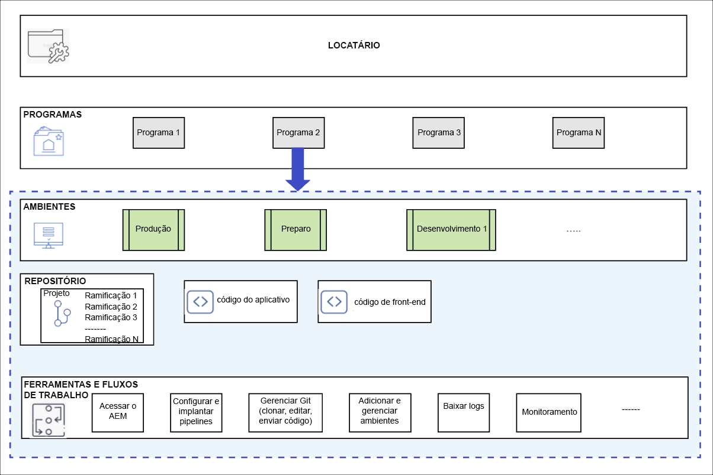

# Programas e tipos de programas {#understanding-programs}

O Cloud Manager é construído com base em uma hierarquia de entidades. Os detalhes não são essenciais para o seu trabalho diário no Cloud Manager, mas ter uma visão geral pode ajudá-lo a entender os programas e configurar os seus próprios programas.



* **LOCATÁRIO** - O topo da hierarquia. Cada cliente recebe um locatário.
* **PROGRAMAS** - Cada locatário tem um ou mais programas, [que geralmente refletem as soluções licenciadas do cliente](introduction-production-programs.md).
* **AMBIENTES** - cada programa tem vários ambientes, um de produção para conteúdo dinâmico, um para preparo e outro para fins de desenvolvimento.
   * Cada programa pode ter apenas um ambiente de produção, mas pode ter vários ambientes de não produção.
* **REPOSITÓRIO** - Os programas têm repositórios Git, nos quais o código do aplicativo e do front-end são mantidos para os ambientes.
* **FERRAMENTAS E FLUXOS DE TRABALHO** - Pipelines gerenciam a implantação de código dos repositórios nos ambientes, enquanto que outras ferramentas permitem o acesso a registros, monitoramento e gerenciamento do ambiente.

Geralmente, um exemplo é útil na contextualização dessa hierarquia.

* A WKND Travel and Adventure Enterprises pode ser um **locatário** que se concentra em mídias relacionadas a viagens.
* O locatário da WKND Travel and Adventure Enterprises pode ter dois **programas**: um programa Sites para a WKND Magazine e um programa Assets para a WKND Media.
* Os programas da WKND Magazine e WKND Media teriam **ambientes** de desenvolvimento, preparação e produção.

## Repositório de código-fonte {#source-code-repository}

Um programa do Cloud Manager é provisionado automaticamente com seu próprio repositório Git.

Os usuários podem acessar o repositório Git do Cloud Manager usando um cliente Git com uma ferramenta de linha de comando ou um cliente Git visual independente. Como alternativa, eles podem usar o IDE (Integrated Development Environment, ambiente de desenvolvimento integrado) de sua preferência, como Eclipse, IntelliJ ou NetBeans.

Depois que um cliente Git é configurado, você pode gerenciar seu repositório Git na interface do usuário do Cloud Manager. Para saber mais sobre como gerenciar o Git usando a interface do usuário do Cloud Manager, consulte [Acessar o Git](/help/implementing/cloud-manager/managing-code/accessing-repos.md).

Para começar a desenvolver o aplicativo da AEM Cloud, verifique o código do aplicativo do repositório da Cloud Manager para o computador local.

```java
$ git clone {URL}
```

O fluxo de trabalho segue um processo Git padrão:

1. Um usuário clona o repositório Git remoto localmente.
1. O usuário faz alterações no repositório local.
1. Quando pronto, o usuário confirma as alterações no repositório Git remoto.

A única diferença é que o repositório Git remoto faz parte do Cloud Manager, que é transparente para o desenvolvedor.

## Tipos de programas {#program-types}

Um usuário pode criar um programa **produção** ou um programa **sandbox**.

* Um **programa de produção** é criado para permitir o tráfego direto em seu site.
   * Consulte [Introdução aos programas de produção](/help/implementing/cloud-manager/getting-access-to-aem-in-cloud/introduction-production-programs.md) para obter mais detalhes.
* Um **programa de sandbox** é normalmente criado para fins de treinamento, execução de demonstrações, capacitação, POCs ou documentação.
   * Um ambiente de sandbox não se destina a transportar tráfego direto e tem restrições que um programa de produção não tem.
   * Ele inclui Sites, Assets e Edge Delivery Services e vem pré-preenchido com uma ramificação Git contendo código de amostra, um ambiente de desenvolvimento e um pipeline de não produção.
   * Consulte [Introdução aos programas de sandbox](/help/implementing/cloud-manager/getting-access-to-aem-in-cloud/introduction-sandbox-programs.md) para obter mais detalhes.
